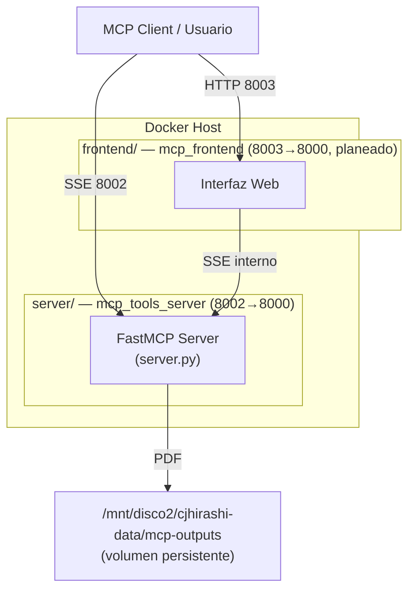

# MCP Tools Server — Proyecto

Plataforma de generación de documentos profesionales (CVs, Cartas de Presentación y futuras herramientas) basada en el [Model Context Protocol (MCP)](https://modelcontextprotocol.io). El proyecto tiene una **arquitectura dual** con dos contenedores independientes orquestados desde este `docker-compose.yml`:

- **`server/`** — Servidor MCP (FastMCP + WeasyPrint + Jinja2), expone herramientas vía SSE. Ver [server/README.md](./server/README.md).
- **`frontend/`** — Interfaz web para usuarios (en desarrollo). Ver [frontend/README.md](./frontend/README.md).

---

## Arquitectura



Cada contenedor tiene su propio `Dockerfile` y se desarrolla en aislamiento; `docker-compose.yml` en la raíz los orquesta en conjunto y los conecta a la red externa `network-cjhirashi-srv`.

---

## Estructura del Proyecto

```
mcp-server/
├── docker-compose.yml          # Orquesta server + frontend
├── README.md                   # Este archivo (overview del proyecto)
├── CLAUDE.md                   # Guía de desarrollo para agentes/Claude Code
├── .gitignore
├── .claude/
│   └── agents/                 # Definiciones de agentes especializados
├── assets/
│   └── banner.svg
├── docs/
│   └── assets/
│
├── server/                     # Servidor MCP (contenedor mcp_tools_server)
│   ├── Dockerfile
│   ├── requirements.txt
│   ├── Pipfile / Pipfile.lock
│   ├── server.py
│   ├── tools/
│   │   ├── __init__.py
│   │   ├── cv_generator.py
│   │   └── cover_generator.py
│   ├── templates/
│   │   ├── cv_template.html
│   │   ├── cover_template.html
│   │   └── css/style_1.css
│   ├── test_cv.py
│   ├── test_cover.py
│   ├── mcp_tools_server.md     # Guía operacional
│   ├── Guia PDF WeasyPrint y CSS paged media.md
│   └── README.md               # Documentación técnica del servidor
│
└── frontend/                   # Interfaz web (contenedor mcp_frontend, en desarrollo)
    ├── Dockerfile               # Template/placeholder
    ├── package.json             # Template/placeholder
    └── README.md
```

---

## Quick Start

### Levantar el servidor MCP

```bash
docker compose build --no-cache mcp-tools
docker compose up -d --force-recreate mcp-tools
```

```bash
docker logs mcp_tools_server --tail 20 -f
```

El servidor queda disponible en `http://<IP_SERVIDOR>:8002/sse`.

### Frontend

El servicio `mcp-frontend` está definido (comentado) en `docker-compose.yml` como placeholder, pendiente de implementación. Ver [frontend/README.md](./frontend/README.md) para el estado y próximos pasos.

---

## Documentación

| Documento | Contenido |
|---|---|
| [CLAUDE.md](./CLAUDE.md) | Guía de desarrollo para agentes/Claude Code: arquitectura, patrones, debugging |
| [server/README.md](./server/README.md) | Documentación técnica completa del servidor MCP: herramientas, schemas JSON, ejemplos |
| [server/mcp_tools_server.md](./server/mcp_tools_server.md) | Procedimientos operacionales: logs, monitoreo, health checks |
| [server/Guia PDF WeasyPrint y CSS paged media.md](./server/Guia%20PDF%20WeasyPrint%20y%20CSS%20paged%20media.md) | Referencia técnica de estilos CSS paged media para PDFs |
| [frontend/README.md](./frontend/README.md) | Estado y plan del frontend web |

---

## Configuración del Entorno

| Parámetro | Valor |
|:---|:---|
| **Servidor MCP — Puerto Interno** | 8000 |
| **Servidor MCP — Puerto Expuesto** | 8002 |
| **Frontend — Puerto Interno (planeado)** | 8000 |
| **Frontend — Puerto Expuesto (planeado)** | 8003 |
| **Transporte MCP** | SSE (Server-Sent Events) |
| **Volumen Persistente** | `/mnt/disco2/cjhirashi-data/mcp-outputs` |
| **Red Docker** | `network-cjhirashi-srv` (externa) |

---

**Última actualización:** 2026-08-15
**Contacto:** Carlos (cjhirashi@gmail.com)
**Licencia:** [Especificar licencia]