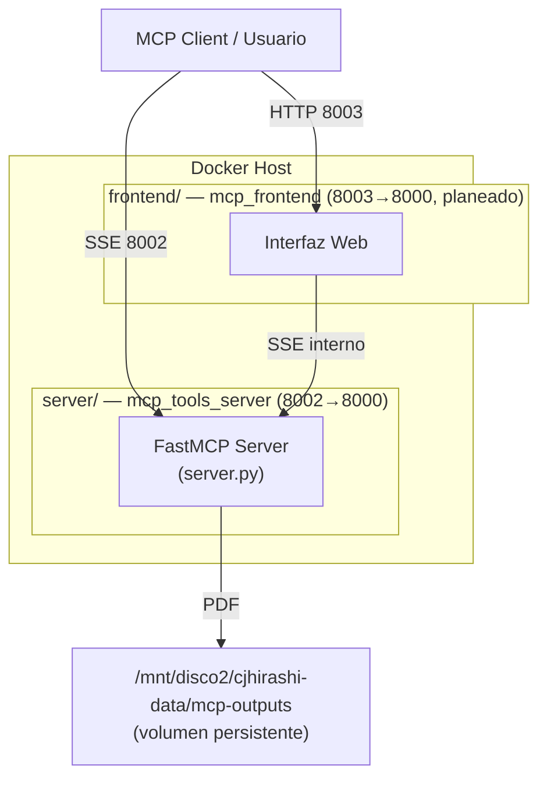

# MCP Tools Server — Proyecto

Plataforma de generación de documentos profesionales (CVs, Cartas de Presentación y futuras herramientas) basada en el [Model Context Protocol (MCP)](https://modelcontextprotocol.io). El proyecto tiene una **arquitectura dual** con dos contenedores independientes orquestados desde este `docker-compose.yml`:

- **`server/`** — Servidor MCP (FastMCP + WeasyPrint + Jinja2), expone herramientas vía SSE. Ver [server/README.md](./server/README.md).
- **`frontend/`** — Interfaz web para usuarios (en desarrollo). Ver [frontend/README.md](./frontend/README.md).

---

## Arquitectura

Para una visión completa de la arquitectura del sistema, consulta **[docs/ARCHITECTURE.md](./docs/ARCHITECTURE.md)**, que incluye diagramas detallados de:
- Componentes del sistema (color-coded por función)
- Flujo de datos con secuencias de operación
- Topología de red Docker
- Decisiones de diseño clave

Diagrama simplificado:



Cada contenedor tiene su propio `Dockerfile` y se desarrolla en aislamiento; `docker-compose.yml` en la raíz los orquesta en conjunto y los conecta a la red externa `network-cjhirashi-srv`.

---

## Estructura del Proyecto

```
mcp-server/
├── docker-compose.yml          # Orquesta server + frontend
├── README.md                   # Este archivo (overview del proyecto)
├── CLAUDE.md                   # Guía de desarrollo para agentes/Claude Code
├── .gitignore
├── .claude/
│   └── agents/                 # Definiciones de agentes especializados
├── assets/
│   └── banner.svg
├── docs/
│   └── assets/
│
├── server/                     # Servidor MCP (contenedor mcp_tools_server)
│   ├── Dockerfile
│   ├── requirements.txt
│   ├── Pipfile / Pipfile.lock
│   ├── server.py
│   ├── tools/
│   │   ├── __init__.py
│   │   ├── cv_generator.py
│   │   └── cover_generator.py
│   ├── templates/
│   │   ├── cv_template.html
│   │   ├── cover_template.html
│   │   └── css/style_1.css
│   ├── test_cv.py
│   ├── test_cover.py
│   ├── mcp_tools_server.md     # Guía operacional
│   ├── Guia PDF WeasyPrint y CSS paged media.md
│   └── README.md               # Documentación técnica del servidor
│
└── frontend/                   # Interfaz web (contenedor mcp_frontend, en desarrollo)
    ├── Dockerfile               # Template/placeholder
    ├── package.json             # Template/placeholder
    └── README.md
```

---

## Quick Start

### Levantar el servidor MCP

```bash
docker compose build --no-cache mcp-tools
docker compose up -d --force-recreate mcp-tools
```

```bash
docker logs mcp_tools_server --tail 20 -f
```

El servidor queda disponible en `http://<IP_SERVIDOR>:8002/sse`.

### Frontend

El servicio `mcp-frontend` está definido (comentado) en `docker-compose.yml` como placeholder, pendiente de implementación. Ver [frontend/README.md](./frontend/README.md) para el estado y próximos pasos.

---

## Documentación

### Acceso Centralizado: docs/README.md

**Navegación principal:** [📚 Documentación Completa](./docs/README.md) — Índice centralizado con guía de lectura por rol (Desarrollador, Arquitecto, DevOps, Product Manager).

### Secciones de Documentación Modular

Cada sección tiene su propio **README.md** con ejemplos prácticos:

| Sección | Descripción | Público |
|---------|-----------|---------|
| **[docs/getting-started/README.md](./docs/getting-started/README.md)** | Instalación rápida, uso básico, testing local | ✓ |
| **[docs/api/README.md](./docs/api/README.md)** | Referencia de herramientas MCP, schemas JSON, ejemplos | ✓ |
| **[docs/architecture/README.md](./docs/architecture/README.md)** | Componentes, flujos completos, decisiones de diseño | ✗ |
| **[docs/network/README.md](./docs/network/README.md)** | Topología Docker, puertos, volúmenes, troubleshooting | ✗ |

### Diagramas Interactivos Detallados

| Documento | Contenido | Diagramas |
|---|---|---|
| **[docs/ARCHITECTURE.md](./docs/ARCHITECTURE.md)** | Arquitectura de componentes (color-coded: Morado cliente, Verde servidor, Cyan almacenamiento) | 4 |
| **[docs/DATA_FLOW.md](./docs/DATA_FLOW.md)** | Flujos de generación de CV y cover letters con secuencias y manejo de errores | 3 |
| **[docs/NETWORK_TOPOLOGY.md](./docs/NETWORK_TOPOLOGY.md)** | Configuración de red Docker, puertos, volúmenes y monitoreo | 3 |

### Referencias Complementarias

| Documento | Contenido |
|---|---|
| **[COLOR_PALETTE.md](./COLOR_PALETTE.md)** | Paleta armónica de colores para diagramas (Cyan, Verde, Morado) |
| **[CLAUDE.md](./CLAUDE.md)** | Guía de desarrollo para agentes/Claude Code: arquitectura, patrones, debugging |
| **[server/README.md](./server/README.md)** | Referencia técnica del servidor MCP y implementación completa |
| **[server/mcp_tools_server.md](./server/mcp_tools_server.md)** | Procedimientos operacionales: logs, monitoreo, health checks |

---

## Configuración del Entorno

| Parámetro | Valor |
|:---|:---|
| **Servidor MCP — Puerto Interno** | 8000 |
| **Servidor MCP — Puerto Expuesto** | 8002 |
| **Frontend — Puerto Interno (planeado)** | 8000 |
| **Frontend — Puerto Expuesto (planeado)** | 8003 |
| **Transporte MCP** | SSE (Server-Sent Events) |
| **Volumen Persistente** | `/mnt/disco2/cjhirashi-data/mcp-outputs` |
| **Red Docker** | `network-cjhirashi-srv` (externa) |

---

## Estado del Proyecto

La documentación está **completa y modular**, organizada en cuatro secciones principales accesibles desde **[docs/README.md](./docs/README.md)**. Cada sección incluye ejemplos prácticos, diagramas interactivos y guías de troubleshooting.

---

## ✅ Checklist de Estado del Proyecto

### Fase de Desarrollo

| Aspecto | Estado | Notas |
|--------|--------|-------|
| **Servidor MCP Core** | ✅ Completo | FastMCP + SSE, dos herramientas funcionales |
| **Generación de CV** | ✅ Completo | Jinja2 + WeasyPrint, templates personalizables |
| **Generación de Cover Letter** | ✅ Completo | Mismo pipeline que CV |
| **Frontend Web** | 🟡 En Desarrollo | Definido en docker-compose.yml, planeado |
| **Documentación Técnica** | ✅ Completo | 7 documentos, 10+ diagramas, guía por rol |
| **Diagramas Interactivos** | ✅ Completo | Paleta armónica, Mermaid, color-coded |

### Completitud de Documentación

| Componente | % | Detalles |
|----------|---|---------|
| **Getting Started** | 100% | Instalación, setup local, testing |
| **API Reference** | 100% | Herramientas, schemas, ejemplos |
| **Architecture Docs** | 100% | Componentes, flujos, decisiones |
| **Network Config** | 100% | Puertos, volúmenes, troubleshooting |
| **Code Comments** | 80% | WHY documented, WHAT code-level |
| **Ejemplos Prácticos** | 90% | 15+ ejemplos, falta casos edge |

### Listo para Producción

| Requisito | Estado | Acción |
|----------|--------|--------|
| **Seguridad de red** | 🟡 Parcial | Falta: autenticación, HTTPS, rate limiting |
| **Monitoreo** | 🟡 Parcial | Falta: health checks, métricas, alertas |
| **Performance** | 🟢 Básico | Funcional, sin optimizaciones aplicadas |
| **Escalabilidad** | 🟡 Planeado | Roadmap: caché, colas (Celery), BD |
| **Backup/DR** | 🟡 Manual | PDFs persisten en volumen, backup manual |

---

**Última actualización:** 2026-08-15  
**Fase Actual:** MVP Completo (v1.0)  
**Siguiente Fase:** Frontend Web + Optimizaciones (v1.1)  
**Contacto:** Carlos (cjhirashi@gmail.com)  
**Licencia:** [Especificar licencia]