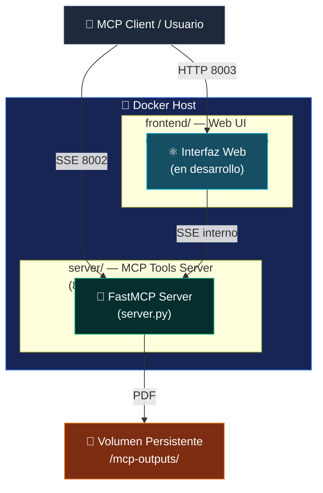

---

Servidor [Model Context Protocol (MCP)](https://modelcontextprotocol.io) que genera documentos profesionales en PDF (CVs y Cartas de Presentación) a partir de estructuras JSON. Arquitectura dual containerizada: servidor MCP (FastMCP + WeasyPrint + Jinja2) y frontend web (en desarrollo).

---

## 📋 Tabla de Contenidos

- [Arquitectura](#arquitectura)
- [Componentes de la Arquitectura](#🏗️-componentes-de-la-arquitectura)
- [Características](#características)
- [Requisitos](#requisitos)
- [Instalación](#instalación)
- [Inicio Rápido](#inicio-rápido)
- [Configuración](#configuración)
- [Uso](#uso)
- [Documentación](#documentación)
- [Contribuir](#contribuir)
- [Issues y Soporte](#issues-y-soporte)
- [Licencia](#licencia)
- [Checklist de Estado](#✅-checklist-de-estado-del-proyecto)

---

## Arquitectura



Cada contenedor tiene su propio `Dockerfile` y se desarrolla en aislamiento; `docker-compose.yml` en la raíz los orquesta en conjunto y los conecta a la red externa `network-cjhirashi-srv`. El contexto de build del servicio `mcp-tools` es `./server` (no la raíz).

Para diagramas ampliados (flujo de datos con secuencias, topología de red completa, decisiones de diseño) consulta **[docs/ARCHITECTURE.md](./docs/ARCHITECTURE.md)**, **[docs/DATA_FLOW.md](./docs/DATA_FLOW.md)** y **[docs/NETWORK_TOPOLOGY.md](./docs/NETWORK_TOPOLOGY.md)**.

---

## 🏗️ Componentes de la Arquitectura

Esta sección describe cada componente mostrado en el diagrama de arquitectura anterior.

### Servidor MCP (server/)

**Ubicación en diagrama**: `server/ — MCP Tools Server`
**Tecnología**: Python 3.11 + FastMCP + WeasyPrint + Jinja2 + Uvicorn
**Puerto**: 8002 (externo) → 8000 (interno)
**Función**: Expone herramientas MCP vía SSE para generar documentos PDF a partir de JSON

**Responsabilidades:**
- Recibir llamadas a herramientas MCP (`@mcp.tool()`)
- Parsear el JSON de entrada y renderizar plantillas Jinja2
- Convertir HTML a PDF con WeasyPrint (CSS paged media)
- Escribir el PDF resultante en el volumen persistente

**Herramientas MCP expuestas:**
- `crear_cv_pdf(datos_cv_json, nombre_archivo)` — Genera CV en PDF
- `crear_cover_letter_pdf(datos_cover_json, nombre_archivo)` — Genera carta de presentación en PDF

Ver [server/README.md](./server/README.md) para detalles técnicos completos.

### Frontend / Web UI (frontend/) — en desarrollo

**Ubicación en diagrama**: `frontend/ — Web UI`
**Tecnología**: por definir (React/Vue/Svelte — pendiente de elección)
**Puerto**: 8003 (externo, planeado) → 8000 (interno)
**Función**: Interfaz web para que usuarios generen documentos sin interactuar directamente con el protocolo MCP

**Estado actual**: placeholder/andamiaje. El servicio `mcp-frontend` está comentado en `docker-compose.yml` hasta que se implemente.

Ver [frontend/README.md](./frontend/README.md) para el estado y los próximos pasos.

### Volumen Persistente

**Ubicación en diagrama**: `Vol — Volumen Persistente`
**Ruta**: `/mnt/disco2/cjhirashi-data/mcp-outputs`
**Función**: Almacena los PDFs generados, separados en `cvs/` y `cover_letters/`. Persiste entre reinicios del contenedor porque está montado como bind mount desde el host.

### Docker Host (Orquestación)

**Ubicación en diagrama**: `Docker Host`
**Función**: Ejecuta ambos contenedores (`mcp_tools_server` y, cuando se implemente, `mcp_frontend`)
**Red**: `network-cjhirashi-srv` (externa, definida fuera de este proyecto)

Ver `docker-compose.yml` (raíz) para la orquestación completa.

---

## ✨ Características

- ✅ **Generación de CVs en PDF** — A partir de JSON estructurado, con plantilla Jinja2 personalizable
- ✅ **Generación de Cartas de Presentación en PDF** — Mismo pipeline que el CV
- ✅ **CSS Paged Media** — Control preciso de márgenes, saltos de página y estilos de impresión vía WeasyPrint
- ✅ **Protocolo MCP nativo** — Herramientas expuestas vía SSE, compatibles con cualquier cliente MCP
- ✅ **Almacenamiento persistente** — Los PDFs sobreviven a reinicios del contenedor (volumen Docker)
- ✅ **Arquitectura dual containerizada** — `server/` y `frontend/` como contenedores independientes orquestados juntos
- ✅ **Documentación técnica completa** — Diagramas de arquitectura, flujo de datos y topología de red

## 📦 Requisitos

- Docker y Docker Compose (despliegue containerizado, forma recomendada)
- Python 3.11 o superior (solo para desarrollo/testing local sin Docker)
- Acceso a la red externa `network-cjhirashi-srv`
- Directorio disponible en el host para el volumen persistente: `/mnt/disco2/cjhirashi-data/mcp-outputs`

## 🚀 Instalación

### Opción 1: Docker (recomendado)

```bash
git clone https://github.com/cjhirashi/mcp-server.git
cd mcp-server

# Build + start (contexto de build: ./server)
docker compose build --no-cache mcp-tools
docker compose up -d --force-recreate
```

### Opción 2: Local, sin Docker (solo para desarrollo/testing)

```bash
cd mcp-server/server

pip install -r requirements.txt
# o, alternativamente
pipenv install --dev

python server.py
# Escucha en http://localhost:8000/sse
```

## ⚡ Inicio Rápido

### 1. Levantar el servidor

```bash
# Desde la raíz del proyecto (docker-compose.yml vive aquí)
docker compose build --no-cache mcp-tools
docker compose up -d --force-recreate
```

### 2. Verificar que arrancó correctamente

```bash
docker logs mcp_tools_server --tail 20 -f
```

Deberías ver:
```
INFO:     Starting MCP server 'MCP-Tools-Server' with transport 'sse' on http://0.0.0.0:8000/sse
INFO:     Application startup complete.
```

### 3. Conectar un cliente MCP

```
http://<IP_SERVIDOR>:8002/sse
```

### 4. Llamar a la herramienta `crear_cv_pdf`

```json
{
  "tool": "crear_cv_pdf",
  "arguments": {
    "datos_cv_json": "{\"nombre\":\"Juan García\",\"email\":\"juan@example.com\",\"titulo_profesional\":\"Senior Software Engineer\"}",
    "nombre_archivo": "CV_JuanGarcia.pdf"
  }
}
```

**Respuesta esperada:**
```json
{
  "result": "Éxito: PDF generado correctamente en '/mnt/disco2/cjhirashi-data/mcp-outputs/cvs/CV_JuanGarcia.pdf'"
}
```

✅ **¡Listo!** El servidor MCP está corriendo y generando PDFs.

## ⚙️ Configuración

### Variables de Entorno (`docker-compose.yml`)

```bash
PYTHONUNBUFFERED=1
FASTMCP_HOST=0.0.0.0
FASTMCP_PORT=8000
```

### Restricción no obvia

Las rutas de salida (`/mnt/disco2/cjhirashi-data/mcp-outputs/cvs/` y `.../cover_letters/`) están **hardcodeadas** en `server/tools/cv_generator.py` y `server/tools/cover_generator.py`, no son configurables vía variable de entorno todavía. Ver [Future Improvements en CLAUDE.md](./CLAUDE.md#future-improvements) para el plan de externalizarlas.

Para el resto de parámetros (puertos, volúmenes, red) consulta [docs/network/README.md](./docs/network/README.md) y `docker-compose.yml` en la raíz.

## 💻 Uso

### Generar un CV

```bash
curl -X POST http://<IP_SERVIDOR>:8002/sse \
  -H "Content-Type: application/json" \
  -d '{
    "tool": "crear_cv_pdf",
    "arguments": {
      "datos_cv_json": "{\"nombre\":\"Juan García\",\"email\":\"juan@example.com\",\"experiencia\":[{\"empresa\":\"Tech Corp\",\"puesto\":\"Senior Developer\",\"fechas\":\"2020-2024\"}]}",
      "nombre_archivo": "CV_JuanGarcia.pdf"
    }
  }'
```

### Generar una Carta de Presentación

```bash
curl -X POST http://<IP_SERVIDOR>:8002/sse \
  -H "Content-Type: application/json" \
  -d '{
    "tool": "crear_cover_letter_pdf",
    "arguments": {
      "datos_cover_json": "{\"nombre\":\"Juan García\",\"empresa_destino\":\"TechCorp Solutions\",\"puesto\":\"Senior Software Architect\"}",
      "nombre_archivo": "CoverLetter_JuanGarcia.pdf"
    }
  }'
```

Ver [docs/api/README.md](./docs/api/README.md) para el esquema JSON completo de cada herramienta, más ejemplos y manejo de errores.

## 📚 Documentación

### Acceso Centralizado

**[docs/README.md](./docs/README.md)** — Índice de documentación con guía de lectura por rol (Desarrollador, Arquitecto/Tech Lead, DevOps/SRE, Product Manager).

### Secciones Modulares

| Sección | Descripción |
|---------|-------------|
| **[docs/getting-started/README.md](./docs/getting-started/README.md)** | Instalación, uso básico, testing local |
| **[docs/api/README.md](./docs/api/README.md)** | Referencia de herramientas MCP, schemas JSON, ejemplos |
| **[docs/architecture/README.md](./docs/architecture/README.md)** | Componentes, flujos completos, decisiones de diseño |
| **[docs/network/README.md](./docs/network/README.md)** | Topología Docker, puertos, volúmenes, troubleshooting |

### Diagramas Detallados y Referencias

| Documento | Contenido |
|---|---|
| **[docs/ARCHITECTURE.md](./docs/ARCHITECTURE.md)** | Diagramas de componentes, flujo de datos y decisiones de diseño |
| **[docs/DATA_FLOW.md](./docs/DATA_FLOW.md)** | Secuencias de generación de CV y cover letter, manejo de errores |
| **[docs/NETWORK_TOPOLOGY.md](./docs/NETWORK_TOPOLOGY.md)** | Configuración de red Docker, puertos, volúmenes |
| **[COLOR_PALETTE.md](./COLOR_PALETTE.md)** | Paleta de colores del proyecto para diagramas Mermaid |
| **[CLAUDE.md](./CLAUDE.md)** | Guía de desarrollo para agentes/Claude Code |
| **[server/README.md](./server/README.md)** | Referencia técnica completa del servidor MCP |
| **[server/mcp_tools_server.md](./server/mcp_tools_server.md)** | Procedimientos operacionales (logs, monitoreo, health checks) |
| **[frontend/README.md](./frontend/README.md)** | Estado del frontend y próximos pasos |

## 🤝 Contribuir

Este proyecto todavía no tiene un `CONTRIBUTING.md` formal. Mientras tanto:

```bash
# 1. Crear rama de feature
git checkout -b feature/mi-cambio

# 2. Hacer cambios y probar localmente
cd server
python test_cv.py
python test_cover.py

# 3. Commit con Conventional Commits
git commit -m "feat: agregar nueva herramienta MCP"

# 4. Push y abrir PR contra main
git push origin feature/mi-cambio
```

Si tu cambio afecta Dockerfile/docker-compose.yml, red, protocolo MCP o documentación, consulta la tabla de agentes especializados en [CLAUDE.md](./CLAUDE.md#flujo-de-trabajo-recomendado) antes de abrir el PR.

## 🐛 Issues y Soporte

- **GitHub Issues**: [Reportar un bug o solicitar una característica](https://github.com/cjhirashi/mcp-server/issues)
- **Email**: cjhirashi@gmail.com

## 📄 Licencia

Licencia no especificada — proyecto privado, mantenido por [Carlos](https://github.com/cjhirashi) (cjhirashi@gmail.com).

---

## ✅ Checklist de Estado del Proyecto

Marca el estado actual para que cualquier colaborador sepa en qué fase está el proyecto de un vistazo.

### Fase de Desarrollo

- [ ] 🎨 Diseño / Planeación
- [x] 🚧 En desarrollo activo
- [ ] 🧪 Testing / QA
- [ ] 🚀 Beta / Pre-lanzamiento
- [ ] ✅ Producción estable
- [ ] 🗄️ Mantenimiento (sin nuevas features)
- [ ] ⚠️ Deprecado / Archivado

### Completitud

- [x] Core features implementadas (servidor MCP: generación de CV y cover letter)
- [ ] Tests con cobertura mínima (80%+) — solo tests manuales (`test_cv.py`, `test_cover.py`)
- [ ] CI/CD configurado
- [x] Documentación completa (README, API, Arquitectura)
- [ ] Revisión de seguridad realizada — sin autenticación, HTTPS ni rate limiting todavía
- [ ] Desplegado en producción
- [ ] Monitoreo y alertas configurados

### Detalle por Componente

| Componente | Estado | Notas |
|--------|--------|-------|
| **Servidor MCP Core** | ✅ Completo | FastMCP + SSE, dos herramientas funcionales |
| **Generación de CV** | ✅ Completo | Jinja2 + WeasyPrint, template personalizable |
| **Generación de Cover Letter** | ✅ Completo | Mismo pipeline que CV |
| **Frontend Web** | 🟡 En desarrollo | Placeholder en `docker-compose.yml`, stack sin definir |
| **Documentación técnica** | ✅ Completo | READMEs modulares + diagramas de arquitectura |
| **Seguridad de red** | 🟡 Parcial | Falta: autenticación, HTTPS, rate limiting |
| **Monitoreo** | 🟡 Parcial | Falta: health checks, métricas, alertas |
| **Backup / DR** | 🟡 Manual | PDFs persisten en volumen; sin backup automatizado |

---

**Última actualización**: 2026-08-15
**Fase actual**: MVP completo (servidor) — Frontend en desarrollo
**Contacto**: Carlos (cjhirashi@gmail.com)
