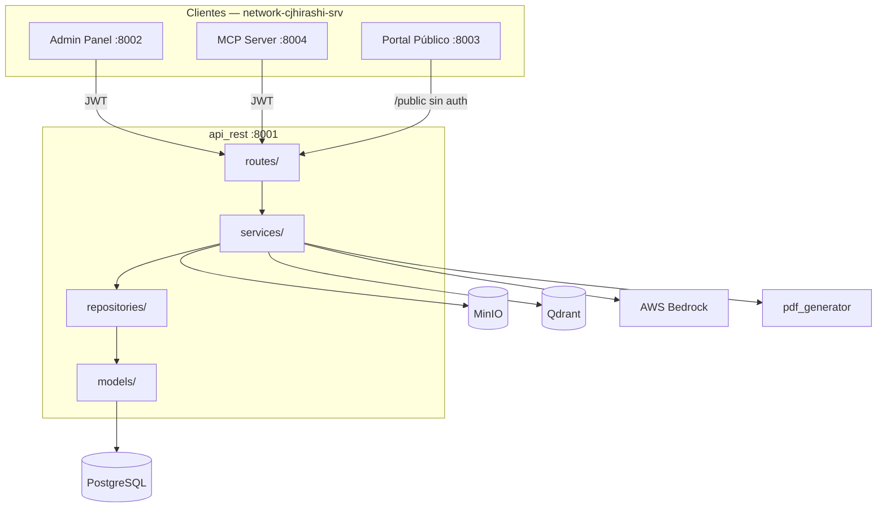

# API REST — Portafolio-cjhirashi

API central del ecosistema Portafolio-cjhirashi. Orquesta autenticación JWT, CRUD de carrera profesional, Agent Bedrock (Harness local), integraciones (LinkedIn, GitHub, MinIO) y endpoints públicos para el Portal.

**URL base (Docker interno):** `http://api_rest:8001`  
**URL base (local):** `http://localhost:8001`  
**OpenAPI interactivo:** `/docs`  
**Health check:** `/health`

## Arquitectura



---

## Consumidores

| Cliente | Acceso | Autenticación |
|---------|--------|---------------|
| Admin Panel | Lectura/escritura | JWT Bearer |
| Portal Público | Solo lectura vía `/public/*` | Ninguna |
| MCP Server | Lectura/escritura | JWT Bearer |

La API **no se expone directamente a Internet**. Solo es accesible desde la red Docker `network-cjhirashi-srv`.

---

## Mapa de secciones

Cada dominio tiene su README detallado en [`docs/sections/`](docs/sections/README.md):

| Sección | Prefijo | README |
|---------|---------|--------|
| Autenticación | `/auth` | [auth](docs/sections/auth/README.md) |
| Carrera — Identidad | `/career/*` | [career-identity](docs/sections/career-identity/README.md) |
| Carrera — Búsqueda | `/career/*` | [career-search](docs/sections/career-search/README.md) |
| Carrera — Presencia digital | `/career/*` | [career-digital](docs/sections/career-digital/README.md) |
| Carrera — Soporte | `/career/tags` | [career-support](docs/sections/career-support/README.md) |
| Carrera — Métricas | `/career/metrics` | [career-metrics](docs/sections/career-metrics/README.md) |
| Carrera — Metodologías | `/career/operational-methodologies` | [career-methodologies](docs/sections/career-methodologies/README.md) |
| Job Discovery | `/career/job-discoveries` | [job-discovery](docs/sections/job-discovery/README.md) |
| Agent Bedrock | `/bedrock` | [bedrock](docs/sections/bedrock/README.md) |
| Tareas del agente | `/agent-tasks` | [bedrock-tasks](docs/sections/bedrock-tasks/README.md) |
| Plantillas PDF | `/pdf-templates` | [pdf-templates](docs/sections/pdf-templates/README.md) |
| Estilos PDF | `/pdf-template-styles` | [pdf-template-styles](docs/sections/pdf-template-styles/README.md) |
| Archivos (MinIO) | `/files` | [files](docs/sections/files/README.md) |
| LinkedIn | `/linkedin` | [linkedin](docs/sections/linkedin/README.md) |
| Portal público | `/public` | [public](docs/sections/public/README.md) |
| Infraestructura compartida | — | [infrastructure](docs/sections/infrastructure/README.md) |

---

## Inicio rápido

```bash
cd api/
python -m venv venv && source venv/bin/activate
pip install -r requirements.txt
cp .env.example .env
cd src/
uvicorn app:app --reload --host 0.0.0.0 --port 8001
```

Ver [docs/SETUP.md](docs/SETUP.md) para Docker, migraciones Alembic y variables de entorno.

---

## Autenticación (resumen)

1. `POST /auth/login` → `access_token` + `refresh_token`
2. Incluir en peticiones protegidas: `Authorization: Bearer <access_token>`
3. Renovar con `POST /auth/refresh` cuando expire el access token

Detalle completo: [docs/sections/auth/README.md](docs/sections/auth/README.md)

---

## Patrón CRUD de carrera (resumen)

La mayoría de recursos de carrera usan el factory `build_crud_router` (`routes/career_common.py`):

```
GET    /career/{resource}           → listar (paginado, búsqueda, orden)
GET    /career/{resource}/count     → contar
GET    /career/{resource}/{id}      → obtener uno
POST   /career/{resource}           → crear
PUT    /career/{resource}/{id}      → actualizar
DELETE /career/{resource}/{id}      → eliminar
```

Los IDs usan prefijos por tabla (`ach-17`, `vac-5`, `usr-1`). Todos los endpoints requieren JWT y filtran por `user_id` del token.

Detalle: [docs/sections/infrastructure/README.md](docs/sections/infrastructure/README.md)

---

## Código fuente (`src/`)

Cada paquete Python describe **qué hace cada módulo** (no el contrato HTTP):

| Paquete | README |
|---------|--------|
| Raíz (`app.py`, `config.py`, `database.py`) | [src/README.md](src/README.md) |
| `routes/` | [src/routes/README.md](src/routes/README.md) |
| `services/` | [src/services/README.md](src/services/README.md) |
| `services/bedrock/` | [src/services/bedrock/README.md](src/services/bedrock/README.md) |
| `services/job_discovery/` | [src/services/job_discovery/README.md](src/services/job_discovery/README.md) |
| `models/` | [src/models/README.md](src/models/README.md) |
| `schemas/` | [src/schemas/README.md](src/schemas/README.md) |
| `repositories/` | [src/repositories/README.md](src/repositories/README.md) |
| `middleware/` | [src/middleware/README.md](src/middleware/README.md) |
| `utils/` | [src/utils/README.md](src/utils/README.md) |
| Tests | [tests/README.md](tests/README.md) |
| Migraciones Alembic | [alembic/README.md](alembic/README.md) |

---

## Documentación adicional

| Documento | Contenido |
|-----------|-----------|
| [docs/README.md](docs/README.md) | Índice completo de documentación |
| [docs/API.md](docs/API.md) | Referencia rápida de todos los endpoints |
| [docs/ARCHITECTURE.md](docs/ARCHITECTURE.md) | Capas Routes → Services → Repositories → Models |
| [docs/DATABASE.md](docs/DATABASE.md) | Esquema PostgreSQL |
| [docs/SECURITY.md](docs/SECURITY.md) | JWT, aislamiento por usuario, CORS |
| [docs/TESTING.md](docs/TESTING.md) | Estrategia y ejecución de tests |
| [docs/TROUBLESHOOTING.md](docs/TROUBLESHOOTING.md) | Problemas frecuentes |

---

**Última actualización:** 2026-08-24  
**Versión:** ver `settings.APP_VERSION` en `src/config.py`
