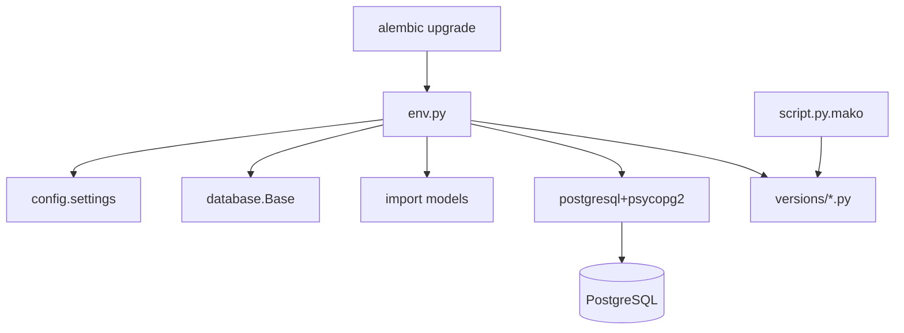

# Alembic — migraciones PostgreSQL

Alembic corre con driver **sync** `psycopg2`. La app usa `postgresql+asyncpg://`; `env.py` sustituye el dialecto para autogenerate y `upgrade`.

## Arquitectura



**Guía de esquema:** [docs/DATABASE.md](../docs/DATABASE.md) · **Setup:** [docs/SETUP.md](../docs/SETUP.md)

```bash
cd api/
alembic upgrade head
alembic revision -m "descripcion"   # nueva revisión
```

Antes de 2026-08-21 el esquema salía de `init.sql` y Alembic no trackeaba nada.

---

### `env.py`

- Inserta `src/` en `sys.path` (imports `config`, `database.Base`, `models`).
- `import models` registra todas las tablas en `Base.metadata`.
- Online: `engine_from_config` + `NullPool`.
- Offline: URL sync para generar SQL.

### `script.py.mako`

Plantilla de nuevas revisiones (`revision`, `down_revision`, `upgrade`/`downgrade`).

### `versions/`

Cadena de revisiones y qué cambia cada archivo: [versions/README.md](versions/README.md).
