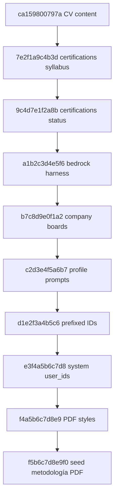

# Revisiones Alembic (`alembic/versions/`)

Cadena lineal (head actual: `f5b6c7d8e9f0`).

## Arquitectura



```
ca159800797a
    → 7e2f1a9c4b3d
    → 9c4d7e1f2a8b
    → a1b2c3d4e5f6
    → b7c8d9e0f1a2
    → c2d3e4f5a6b7
    → d1e2f3a4b5c6
    → e3f4a5b6c7d8
    → f4a5b6c7d8e9
    → f5b6c7d8e9f0
```

---

| Archivo | Revisión | Qué hace |
|---------|----------|----------|
| `ca159800797a_consolidate_cv_version_content.py` | raíz | Une 4 campos rígidos de CV en un Markdown `content` |
| `7e2f1a9c4b3d_add_syllabus_and_document_url_to_certifications.py` | | `syllabus` Markdown + `document_url` en certificaciones |
| `9c4d7e1f2a8b_add_status_to_certifications.py` | | Columna `status` en certificaciones |
| `a1b2c3d4e5f6_bedrock_local_harness.py` | | Harness local: settings extendidos, `session_type`, round logs, tablas PDF |
| `b7c8d9e0f1a2_job_discovery_target_company_boards.py` | | Campos de career board (Greenhouse/Lever) en `target_companies` |
| `c2d3e4f5a6b7_bedrock_agent_profile_prompts.py` | | Tabla `bedrock_agent_profile_prompts` (suffix por perfil) |
| `d1e2f3a4b5c6_prefixed_ids_and_notes.py` | | IDs string prefijados en tablas de negocio + campo `notes` |
| `e3f4a5b6c7d8_fix_system_table_user_ids.py` | | Ajusta `user_id` en tablas de sistema/telemetría tras el cambio de `users.id` |
| `f4a5b6c7d8e9_pdf_template_styles.py` | | `pdf_template_styles` + FK `style_id` en plantillas |
| `f5b6c7d8e9f0_seed_pdf_design_methodology.py` | head | Seed de metodología operativa «Plantillas PDF y estilos CSS» |

Cada archivo define `upgrade()` / `downgrade()`. No editar revisiones ya aplicadas en producción; crear una nueva.
