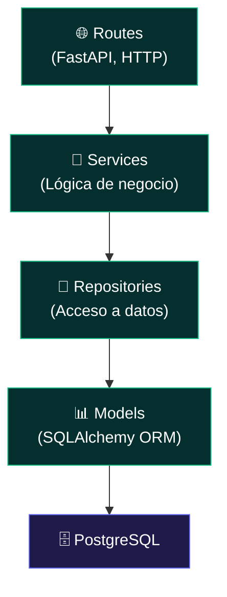
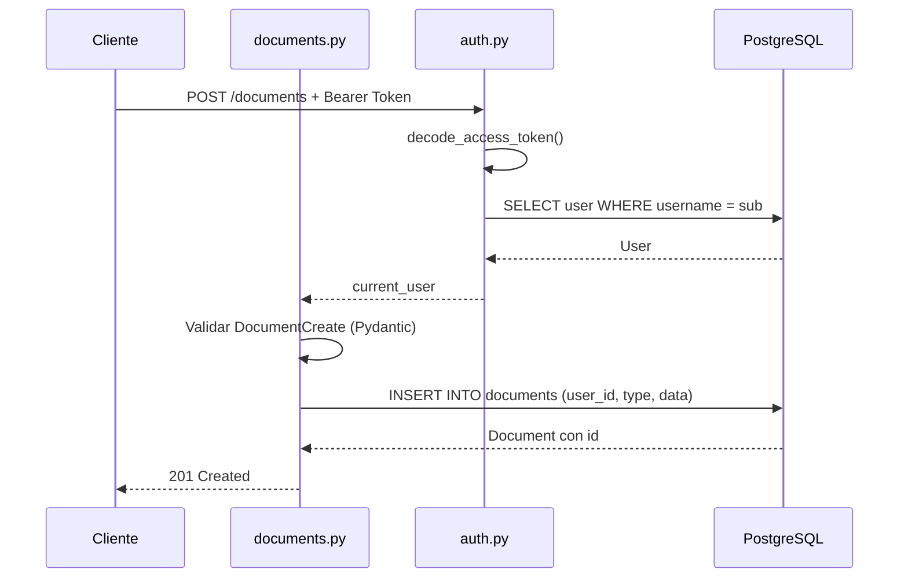
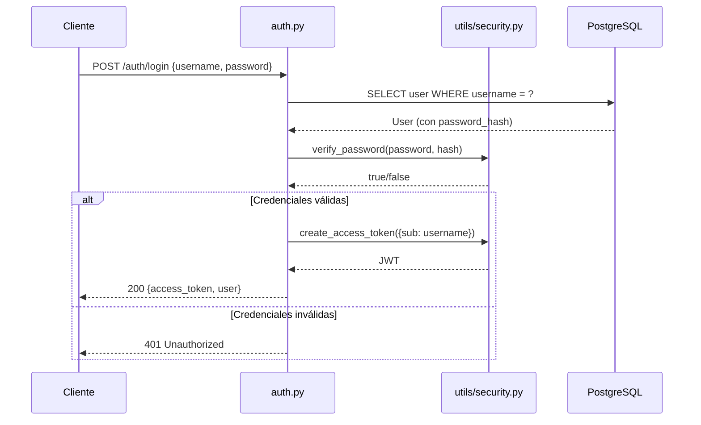

# API REST — Portafolio-cjhirashi — Architecture Guide

**ARCHITECTURE GUIDE**


---

**Última actualización**: 2026-08-16
**Resumen rápido**: arquitectura en 4 capas (Routes → Services → Repositories → Models) · FastAPI + SQLAlchemy async · Principios SOLID

---

## 📋 Tabla de Contenidos

- [Visión General](#-visión-general)
- [Arquitectura en Capas](#-arquitectura-en-capas)
- [Componentes](#-componentes)
- [Flujo de Datos: Crear Documento](#-flujo-de-datos-crear-documento)
- [Flujo de Datos: Login](#-flujo-de-datos-login)
- [Principios SOLID Aplicados](#-principios-solid-aplicados)
- [Manejo de Errores](#-manejo-de-errores)
- [Testing por Capa](#-testing-por-capa)
- [Escalabilidad](#-escalabilidad)
- [Deuda Técnica Conocida](#-deuda-técnica-conocida)

---

## 🎯 Visión General

La API sigue una arquitectura en capas clásica (Routes → Services → Repositories → Models) sobre FastAPI y SQLAlchemy 2.0 async. El objetivo de diseño es que cada capa tenga una única responsabilidad y dependa solo de la capa inmediatamente inferior, permitiendo testear la lógica de negocio sin necesidad de un servidor HTTP ni una base de datos real.

El estado actual de implementación es parcial: el dominio de **autenticación** y **documentos** está completo en las cuatro capas y expuesto vía HTTP; el resto de los dominios (identidad, competencias, evidencia, carrera) tiene **Models y Schemas** definidos pero aún no cuenta con Services, Repositories ni Routes.

## 🧱 Arquitectura en Capas



## 🧩 Componentes

### `src/app.py`

Punto de entrada de FastAPI. Registra middleware CORS, manejadores globales de excepción, lifecycle (`init_db`/`close_db`) y los routers activos (`auth`, `documents`).

### `src/config.py`

Configuración centralizada vía `pydantic_settings.BaseSettings`, carga variables desde `.env`. Expone `settings` como instancia global.

### `src/database.py`

Engine async (`create_async_engine`), `AsyncSessionLocal` (sessionmaker) y `Base` declarativa compartida por todos los modelos. `get_db()` es la dependency de FastAPI para inyectar sesiones.

### `src/models/` (15 archivos)

Un modelo SQLAlchemy por entidad: `User`, `Document`, `Identity`, `Competency`, `Evidence`, `JobStrategy`, `Vacancy`, `Interview`, `NetworkingContact`, `RefreshToken`, `FileUpload`, `Event`, `AuditLog`, `Metrics`, `UserSession`. Ver [DATABASE.md](./DATABASE.md) para el esquema completo.

### `src/schemas/`

Schemas Pydantic de request/response. Implementados para: `user`, `document`, `identity`, `competencies`, `evidence`. Los dominios de carrera (job_strategy, vacancy, interview, networking) todavía no tienen schema propio.

### `src/services/`

Lógica de negocio desacoplada de HTTP y de SQL directo. Actualmente solo existe `auth_service.py` (`AuthService`): hashing de contraseñas, emisión/validación de tokens de acceso y refresh.

### `src/repositories/`

Acceso a datos vía SQLAlchemy. `base_repository.py` define operaciones CRUD genéricas; `user_repository.py` las extiende con queries específicas de `User` (`get_by_username`, `user_exists`, `update_last_login`).

### `src/routes/`

Endpoints HTTP agrupados por dominio:

| Archivo | Registrado en `app.py` | Endpoints |
|---------|:---:|-----------|
| `auth.py` | ✅ | `/auth/login`, `/auth/logout`, `/auth/register` |
| `documents.py` | ✅ | CRUD completo `/documents` |
| `auth_enhanced.py` | ❌ | `/auth/register`, `/login`, `/refresh`, `/logout`, `/change-password` (usa `AuthService`) |

### `src/middleware/auth.py`

Dependency `get_current_user`: decodifica el JWT, extrae `sub` (username) y recupera el `User` de la base de datos. Usado por todas las rutas protegidas de `documents.py`.

### `src/utils/`

`security.py` (hashing y JWT — funciones sueltas, usadas por `routes/auth.py`) y `constants.py`.

## 📊 Flujo de Datos: Crear Documento



## 📊 Flujo de Datos: Login



## 🎯 Principios SOLID Aplicados

**Single Responsibility**: `AuthService` solo gestiona autenticación; cada repositorio gestiona una única entidad.

**Open/Closed**: `BaseRepository` está pensado para extenderse (nuevos repositorios) sin modificar su implementación.

**Liskov Substitution**: los repositorios de entidad heredan de `BaseRepository` y son intercambiables donde se espera esa interfaz.

**Interface Segregation**: los servicios exponen métodos pequeños y enfocados (`hash_password`, `create_access_token`, `decode_refresh_token`) en vez de una interfaz monolítica.

**Dependency Inversion**: las rutas dependen de `Depends(get_db)` y de servicios/repositorios inyectados, no de detalles concretos de SQLAlchemy.

## ❌ Manejo de Errores

```python
# Nivel Route: excepciones HTTP explícitas
raise HTTPException(status_code=401, detail="Credenciales inválidas")

# Nivel App: handlers globales (app.py)
@app.exception_handler(RequestValidationError)  # → 422 con detalle de campos
@app.exception_handler(Exception)                # → 500 genérico, logueado con stacktrace
```

## 🧪 Testing por Capa

| Capa | Tipo de test | Dependencias |
|------|--------------|---------------|
| Services | Unitario | Ninguna (mockeable) |
| Repositories | Integración | Base de datos (real o SQLite en memoria) |
| Routes | Integración / E2E | Cliente HTTP async + base de datos |

Ver [TESTING.md](./TESTING.md) para la guía completa (actualmente sin tests escritos).

## 📈 Escalabilidad

**Diseño actual**:
- Aplicación stateless — escalable horizontalmente sin estado compartido en memoria
- Operaciones async/await de punta a punta (rutas, servicios, ORM)
- Connection pooling configurado (`pool_size=10`, `max_overflow=20`)
- Paginación soportada en endpoints de listado (`skip`/`limit`)

**No implementado todavía**: cache (Redis), cola de mensajes, réplicas de lectura de PostgreSQL, versionado de API (`/v1`).

## ⚠️ Deuda Técnica Conocida

Elementos identificados durante la revisión de este documento que requieren decisión de ingeniería (no son bugs documentales, son estado real del código):

1. **`routes/auth_enhanced.py` no registrado**: implementa refresh token y cambio de contraseña, pero `app.py` solo importa `auth` y `documents`. Sus tokens usan `sub=user.id` en vez de `sub=username`, incompatible con `middleware/auth.py` tal como está hoy.
2. **Desincronización `init.sql` vs. modelos ORM**: ver [DATABASE.md § Estado de las Tablas](./DATABASE.md#-estado-de-las-tablas) — el esquema de `users` en `init.sql` (5 columnas) no incluye las columnas que el modelo `User` actual espera (`full_name`, `is_active`, etc.).
3. **13 de 15 modelos sin rutas HTTP**: identidad, competencias, evidencia, estrategias de empleo, vacantes, entrevistas y networking están modelados pero no expuestos vía API.
4. **`models/__init__.py` no se importa en el arranque de la app**: `Base.metadata.create_all()` solo conocerá las tablas cuyos módulos hayan sido importados por la cadena de imports real de `app.py`; los 13 modelos "huérfanos" no se crearán automáticamente aunque `init_db()` se ejecute.
5. **`Dockerfile` vs. estructura de carpetas**: `CMD ["uvicorn", "app:app", ...]` asume que `app.py` está en la raíz del `WORKDIR`, pero el archivo real vive en `src/app.py`. Ver [TROUBLESHOOTING.md](./TROUBLESHOOTING.md).

---

**Relacionado**: [DATABASE.md](./DATABASE.md) · [SECURITY.md](./SECURITY.md) · [API.md](./API.md) · [TESTING.md](./TESTING.md)
