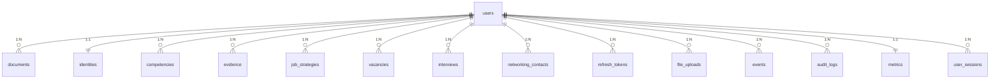

# API REST — Portafolio-cjhirashi — Esquema de Base de Datos

**DATABASE SCHEMA REFERENCE**


---

Esquema relacional de PostgreSQL para Portafolio-cjhirashi: gestión de carrera, identidad profesional, competencias, evidencia, procesos de contratación y métricas de actividad. Todas las tablas se relacionan a `users` mediante `user_id` con `ON DELETE CASCADE`.

---

## 📋 Tabla de Contenidos

- [Estado de las Tablas](#-estado-de-las-tablas)
- [Diagrama de Relaciones](#-diagrama-de-relaciones)
- [Tabla: users](#tabla-users)
- [Tabla: documents](#tabla-documents)
- [Tabla: identities](#tabla-identities)
- [Tabla: competencies](#tabla-competencies)
- [Tabla: evidence](#tabla-evidence)
- [Tabla: job_strategies](#tabla-job_strategies)
- [Tabla: vacancies](#tabla-vacancies)
- [Tabla: interviews](#tabla-interviews)
- [Tabla: networking_contacts](#tabla-networking_contacts)
- [Otras Tablas de Soporte](#-otras-tablas-de-soporte)
- [Consultas Comunes](#-consultas-comunes)
- [Migraciones](#-migraciones)
- [Backups](#-backups)

---

## ⚠️ Estado de las Tablas

Existen **dos mecanismos** de creación de esquema que actualmente están desincronizados:

1. **`init.sql`** — Se monta en `docker-entrypoint-initdb.d/` y se ejecuta una única vez cuando el volumen de PostgreSQL está vacío. Crea solo `users` (5 columnas) y `documents` — el esquema original del prototipo "MCP Tools API".
2. **`Base.metadata.create_all()`** (en `src/database.py`, invocado en el `lifespan` de `app.py`) — Crea tablas para todo modelo SQLAlchemy que haya sido **importado** en el proceso Python en ese momento. Como `src/app.py` solo importa `routes.auth` y `routes.documents` (que a su vez importan `models.user` y `models.document`), en la práctica **solo `users` y `documents` quedan garantizadas**; las 13 tablas restantes no se crean automáticamente porque `models/__init__.py` (que sí importa los 15 modelos) nunca es importado por la aplicación en ejecución.

**Consecuencia práctica**: si `init.sql` ya creó `users` con su esquema de 5 columnas (`id`, `username`, `email`, `password_hash`, `created_at`), y el modelo `User` actual espera columnas adicionales (`full_name`, `phone`, `country`, `professional_title`, `is_active`, `is_verified`, `updated_at`, `last_login`), `create_all()` **no las agregará** — solo crea tablas nuevas, no altera existentes. Cualquier ruta que lea/escriba esas columnas (por ejemplo `routes/auth_enhanced.py`, no registrado actualmente) fallaría contra una base inicializada con `init.sql`.

**Referencia de columnas de esta guía**: se documenta el esquema según los **modelos SQLAlchemy** (`src/models/*.py`), que representan el diseño de datos vigente del proyecto, no necesariamente el estado exacto de una base ya inicializada con el `init.sql` legado.

## 🗺️ Diagrama de Relaciones



## Tabla: users

Autenticación y perfil base del usuario.

| Columna | Tipo | Restricciones | Descripción |
|---------|------|----------------|-------------|
| id | SERIAL | PK | Identificador |
| username | VARCHAR(255) | UNIQUE, NOT NULL | Nombre de usuario |
| email | VARCHAR(255) | UNIQUE, NOT NULL | Email |
| password_hash | VARCHAR(255) | NOT NULL | Hash bcrypt |
| full_name | VARCHAR(255) | NULL | Nombre completo |
| phone | VARCHAR(20) | NULL | Teléfono |
| country | VARCHAR(100) | NULL | País |
| professional_title | VARCHAR(255) | NULL | Título profesional |
| is_active | BOOLEAN | NOT NULL, default true | Habilita/deshabilita login |
| is_verified | BOOLEAN | NOT NULL, default false | Verificación de email |
| created_at | TIMESTAMPTZ | NOT NULL | Fecha de creación |
| updated_at | TIMESTAMPTZ | NOT NULL | Última modificación |
| last_login | TIMESTAMPTZ | NULL | Último login exitoso |

**Índices**: `username`, `email`, `is_active`, `created_at`

## Tabla: documents

Documentos de carrera (CVs, cartas de presentación) en formato JSON flexible. **Único dominio, además de `users`, con endpoints REST implementados.**

| Columna | Tipo | Restricciones | Descripción |
|---------|------|----------------|-------------|
| id | SERIAL | PK | Identificador |
| user_id | INTEGER | FK → users(id), CASCADE | Propietario |
| type | VARCHAR(50) | NOT NULL | `cv`, `cover_letter`, etc. |
| title | VARCHAR(255) | NULL | Título descriptivo |
| data | JSONB | NOT NULL | Contenido del documento |
| created_at | TIMESTAMPTZ | NOT NULL | Fecha de creación |
| updated_at | TIMESTAMPTZ | NOT NULL, auto-update | Última modificación |

**Índices**: `user_id`, `type`
**Trigger**: `update_documents_updated_at` — actualiza `updated_at` en cada `UPDATE`

**Ejemplo de `data` para type="cv":**
```json
{
  "nombre": "Juan Pérez",
  "email": "juan@example.com",
  "experiencia": [{ "empresa": "Tech Corp", "puesto": "Senior Developer", "años": "2020-2024" }],
  "habilidades": ["Python", "FastAPI", "React"]
}
```

## Tabla: identities

Identidad profesional (IKIGAI, propuesta de valor, narrativa). Relación 1:1 con `users`.

| Grupo de columnas | Campos |
|---|---|
| IKIGAI | `passion`, `mission`, `vocation`, `profession` |
| Diferenciadores | `key_strengths`, `unique_value_prop` |
| Narrativa | `professional_narrative`, `career_objective` |
| Propuesta de valor | `value_proposition`, `elevator_pitch` |
| Perfil extendido | `bio`, `about_me` |
| SEO / Branding | `keywords`, `tagline` |

**FK**: `user_id` → `users(id)`, `UNIQUE` (garantiza 1:1)

## Tabla: competencies

Competencias profesionales clasificadas por tipo y nivel.

| Columna clave | Tipo | Descripción |
|---|---|---|
| competency_type | ENUM | `technical`, `transferable`, `business` |
| proficiency_level | ENUM | `beginner`, `intermediate`, `advanced`, `expert` |
| proficiency_score | FLOAT | 0–100 |
| years_of_experience | FLOAT | Años de experiencia |
| is_verified / endorsement_count | BOOLEAN / INTEGER | Validación social |

**FK**: `user_id` → `users(id)`, CASCADE
**Índices**: `user_id`, `competency_type`, `category`, `is_featured`

## Tabla: evidence

Evidencia de logros: proyectos, posiciones, casos STAR, publicaciones.

| Columna clave | Tipo | Descripción |
|---|---|---|
| evidence_type | ENUM | `project`, `position`, `achievement`, `case_study`, `publication`, `certification`, `volunteer`, `other` |
| situation / task / action / result | TEXT | Estructura método STAR |
| metrics | JSON | Resultados cuantificables |
| is_public / is_featured | BOOLEAN | Visibilidad y destacado |

**FK**: `user_id` → `users(id)`, CASCADE

## Tabla: job_strategies

Estrategia de búsqueda de empleo por usuario (industrias, roles objetivo, timeline).

| Columna clave | Tipo | Descripción |
|---|---|---|
| status | ENUM | `active`, `paused`, `completed`, `archived` |
| target_job_title / target_industry / target_role_level | VARCHAR | Posición objetivo |
| target_salary_min / target_salary_max | INTEGER | Rango salarial |
| applications_count / interviews_count / offers_count | INTEGER | Métricas de seguimiento |

## Tabla: vacancies

Seguimiento de oportunidades laborales concretas.

| Columna clave | Tipo | Descripción |
|---|---|---|
| status | ENUM | `interested`, `applied`, `rejected`, `accepted`, `archived` |
| match_score | FLOAT | 0–100, score de compatibilidad con el perfil |
| required_skills / matched_skills / missing_skills | VARCHAR | Análisis de brecha de habilidades |
| salary_min / salary_max / currency | FLOAT/VARCHAR | Compensación |

## Tabla: interviews

Preparación y seguimiento de entrevistas.

| Columna clave | Tipo | Descripción |
|---|---|---|
| interview_type | ENUM | `phone_screening`, `video_call`, `in_person`, `technical_test`, `case_study`, `panel_interview`, `final`, `other` |
| feedback | ENUM | `pending`, `positive`, `neutral`, `negative`, `advance`, `rejected`, `accepted` |
| performance_score | FLOAT | 0–100 |
| salary_offered / salary_discussed | FLOAT/BOOLEAN | Negociación |

## Tabla: networking_contacts

Contactos profesionales y relación de networking.

| Columna clave | Tipo | Descripción |
|---|---|---|
| relationship_type | ENUM | `mentor`, `mentee`, `colleague`, `friend`, `client`, `vendor`, `recruiter`, `industry_contact`, `other` |
| status | ENUM | `active`, `inactive`, `blocked` |
| relationship_strength | INTEGER | Escala 1–5 |

## 📦 Otras Tablas de Soporte

| Tabla | Propósito | Notas |
|-------|-----------|-------|
| `refresh_tokens` | Rotación de tokens JWT | Diseñada para uso con `auth_enhanced.py` (no registrado aún) |
| `file_uploads` | Metadatos de archivos subidos | `file_size`, `mime_type`, `download_count` |
| `events` | Tracking de actividad del usuario | 18 tipos de evento (`EventType`), usado para analítica |
| `audit_logs` | Auditoría de acciones (create/update/delete/login) | Incluye `old_values`/`new_values` en JSON |
| `metrics` | Métricas precomputadas del perfil (1:1 con `users`) | "Read-only, calculado periódicamente desde Events y Evidence" (comentario del modelo) |
| `user_sessions` | Sesiones activas por dispositivo | `device_type`, `ip_address`, `session_duration_seconds` |

## 🔍 Consultas Comunes

```sql
-- Documentos de un usuario, más recientes primero
SELECT * FROM documents WHERE user_id = 1 ORDER BY created_at DESC;

-- Documentos por tipo
SELECT * FROM documents WHERE user_id = 1 AND type = 'cv';

-- Búsqueda dentro del JSON de un documento
SELECT * FROM documents WHERE user_id = 1 AND data->>'nombre' LIKE '%Juan%';

-- Total de documentos por tipo (agregación global)
SELECT type, COUNT(*) AS total FROM documents GROUP BY type ORDER BY total DESC;
```

## 🔄 Migraciones

El proyecto tiene Alembic configurado (`alembic.ini`) pero **sin migraciones generadas todavía**. Flujo previsto:

```bash
cd api/
alembic revision --autogenerate -m "Descripción del cambio"
alembic upgrade head
```

> Antes de la primera migración real, se recomienda decidir si `init.sql` se retira en favor de Alembic como única fuente de verdad del esquema, para evitar la desincronización descrita en [Estado de las Tablas](#-estado-de-las-tablas).

## 💾 Backups

```bash
# Backup completo
docker exec mcp_postgres pg_dump -U mcpuser mcp_db > backup_$(date +%Y%m%d_%H%M%S).sql

# Restaurar
docker exec -i mcp_postgres psql -U mcpuser mcp_db < backup_20260816_100000.sql
```

---

**Relacionado**: [ARCHITECTURE.md](./ARCHITECTURE.md) · [API.md](./API.md) · [SETUP.md](./SETUP.md)
