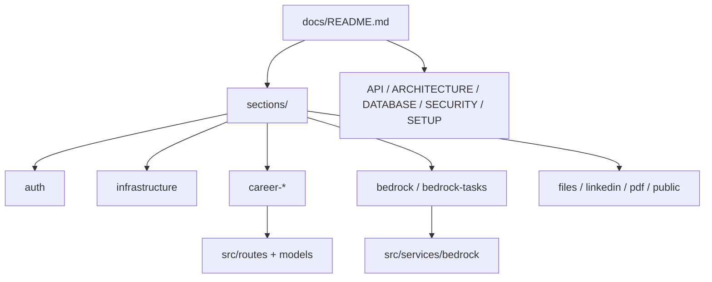

# API REST — Documentación

Índice central de documentación del módulo API (`api/`).

**Entrada principal:** [../README.md](../README.md)

## Arquitectura

---

## Documentación por sección

Cada dominio tiene un README detallado con endpoints, schemas, flujos y ejemplos:

| Sección | README |
|---------|--------|
| **Índice de secciones** | [sections/README.md](sections/README.md) |
| Autenticación | [sections/auth/README.md](sections/auth/README.md) |
| Infraestructura (CRUD, JWT, repos) | [sections/infrastructure/README.md](sections/infrastructure/README.md) |
| Carrera — Identidad | [sections/career-identity/README.md](sections/career-identity/README.md) |
| Carrera — Búsqueda | [sections/career-search/README.md](sections/career-search/README.md) |
| Carrera — Presencia digital | [sections/career-digital/README.md](sections/career-digital/README.md) |
| Carrera — Tags | [sections/career-support/README.md](sections/career-support/README.md) |
| Carrera — Métricas | [sections/career-metrics/README.md](sections/career-metrics/README.md) |
| Carrera — Metodologías | [sections/career-methodologies/README.md](sections/career-methodologies/README.md) |
| Job Discovery | [sections/job-discovery/README.md](sections/job-discovery/README.md) |
| Agent Bedrock | [sections/bedrock/README.md](sections/bedrock/README.md) |
| Tareas del agente | [sections/bedrock-tasks/README.md](sections/bedrock-tasks/README.md) |
| Plantillas PDF | [sections/pdf-templates/README.md](sections/pdf-templates/README.md) |
| Archivos (MinIO) | [sections/files/README.md](sections/files/README.md) |
| LinkedIn | [sections/linkedin/README.md](sections/linkedin/README.md) |
| Portal público | [sections/public/README.md](sections/public/README.md) |

---

## Referencia y guías transversales

| Documento | Contenido |
|-----------|-----------|
| [API.md](API.md) | Referencia rápida de todos los endpoints |
| [ARCHITECTURE.md](ARCHITECTURE.md) | Capas Routes → Services → Repositories → Models |
| [DATABASE.md](DATABASE.md) | Esquema PostgreSQL, tablas, relaciones |
| [SECURITY.md](SECURITY.md) | JWT, aislamiento por usuario, CORS, OWASP |
| [BEDROCK-HARNESS.md](BEDROCK-HARNESS.md) | IAM AWS, Converse API, errores frecuentes |
| [SETUP.md](SETUP.md) | Instalación local, Docker, Alembic |
| [TESTING.md](TESTING.md) | Pytest, cobertura, fixtures |
| [TROUBLESHOOTING.md](TROUBLESHOOTING.md) | Problemas comunes |

---

## Routers registrados (`src/app.py`)

| Router | Prefijo | Auth |
|--------|---------|------|
| `auth_enhanced` | `/auth` | Mixto |
| `career_identity` | `/career/*` | JWT |
| `career_search` | `/career/*` | JWT |
| `career_digital` | `/career/*` | JWT |
| `career_support` | `/career/tags` | JWT |
| `career_metrics` | `/career/metrics` | JWT |
| `career_methodologies` | `/career/operational-methodologies` | JWT |
| `job_discovery` | `/career/job-discoveries` | JWT |
| `bedrock` | `/bedrock` | JWT |
| `bedrock_tasks` | `/agent-tasks` | JWT |
| `pdf_templates` | `/pdf-templates` | JWT |
| `files` | `/files` | JWT |
| `linkedin` | `/linkedin` | JWT (+ callback público) |
| `public` | `/public` | Ninguna |

**OpenAPI interactivo:** `http://localhost:8001/docs`

---

## Código por paquete (`src/`)

READMEs de implementación (función de cada módulo Python), distintos de los de sección HTTP:

| Paquete | README |
|---------|--------|
| `src/` | [../src/README.md](../src/README.md) |
| Routes | [../src/routes/README.md](../src/routes/README.md) |
| Services | [../src/services/README.md](../src/services/README.md) |
| Bedrock harness | [../src/services/bedrock/README.md](../src/services/bedrock/README.md) |
| Job discovery | [../src/services/job_discovery/README.md](../src/services/job_discovery/README.md) |
| Models | [../src/models/README.md](../src/models/README.md) |
| Schemas | [../src/schemas/README.md](../src/schemas/README.md) |
| Repositories | [../src/repositories/README.md](../src/repositories/README.md) |
| Tests | [../tests/README.md](../tests/README.md) |
| Alembic | [../alembic/README.md](../alembic/README.md) |

---

## Consumidores

| Cliente | Puerto host | Endpoints típicos |
|---------|-------------|-------------------|
| Admin Panel | 8002 | `/auth`, `/career/*`, `/bedrock`, `/files`, `/linkedin` |
| Portal Público | 8003 | `/public/*` |
| MCP Server | 8004 | `/auth`, `/career/*`, `/bedrock` (según tools) |

---

**Última actualización:** 2026-08-24
