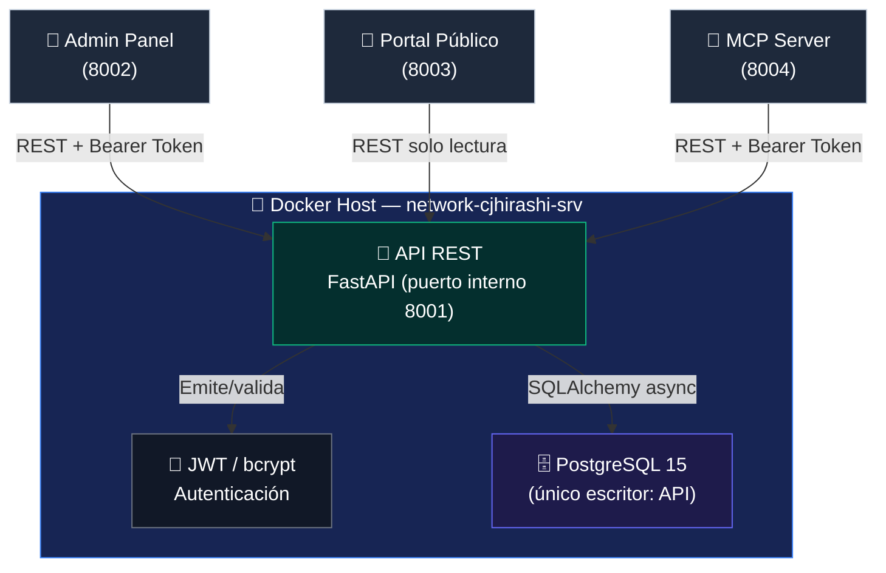

# API REST — Portafolio-cjhirashi

**README**


---

API REST interna del ecosistema Portafolio-cjhirashi. Centraliza la autenticación JWT y es el único componente con permisos de escritura sobre PostgreSQL, sirviendo a Admin Panel, Portal Público y MCP Server.

---

## 📋 Tabla de Contenidos

- [Arquitectura](#-arquitectura)
- [Estado de Implementación](#-estado-de-implementación)
- [Características](#-características)
- [Stack Tecnológico](#-stack-tecnológico)
- [Requisitos](#-requisitos)
- [Instalación Rápida](#-instalación-rápida)
- [Estructura del Proyecto](#-estructura-del-proyecto)
- [Documentación Completa](#-documentación-completa)
- [Contribuir](#-contribuir)
- [Checklist de Estado del Proyecto](#-checklist-de-estado-del-proyecto)

---

## 🏗️ Arquitectura



La API **no está expuesta a Internet**: solo Admin Panel, Portal Público y MCP Server pueden alcanzarla, todos dentro de la red Docker `network-cjhirashi-srv`. Ver [ARCHITECTURE.md](./ARCHITECTURE.md) para el detalle de capas internas (Routes → Services → Repositories → Models).

## 🚦 Estado de Implementación

Este módulo está **en desarrollo activo**. El diseño de datos (15 modelos SQLAlchemy) va por delante de las rutas HTTP expuestas:

| Dominio | Modelo de datos | Endpoints REST |
|---------|:---:|:---:|
| Usuarios / Autenticación | ✅ Completo | ✅ `POST /auth/login`, `/register`, `/logout` |
| Documentos (CV, cartas) | ✅ Completo | ✅ CRUD completo en `/documents` |
| Identidad profesional | ✅ Completo | ⏳ No implementado |
| Competencias | ✅ Completo | ⏳ No implementado |
| Evidencia | ✅ Completo | ⏳ No implementado |
| Estrategias de búsqueda | ✅ Completo | ⏳ No implementado |
| Vacantes | ✅ Completo | ⏳ No implementado |
| Entrevistas | ✅ Completo | ⏳ No implementado |
| Networking | ✅ Completo | ⏳ No implementado |
| Métricas | ✅ Completo | ⏳ No implementado |

> **Nota**: existe un segundo módulo de rutas de autenticación (`routes/auth_enhanced.py`, con refresh token y cambio de contraseña) que **no está registrado** en `app.py` todavía. Ver [ARCHITECTURE.md § Deuda Técnica](./ARCHITECTURE.md#-deuda-técnica-conocida).

Ver el detalle completo de endpoints reales en [API.md](./API.md).

## ✨ Características

- **Autenticación JWT** (HS256) con hashing de contraseñas vía bcrypt
- **PostgreSQL** como base de datos con SQLAlchemy 2.0 async
- **FastAPI** con validación automática vía Pydantic v2
- **CORS** configurado para Admin Panel, Portal Público y MCP Server
- **CRUD de documentos** con aislamiento estricto por usuario
- **Health check** (`/health`) para monitoreo de contenedor
- **Docker-ready** con `Dockerfile` optimizado (usuario no-root)

## 🔧 Stack Tecnológico

| Capa | Tecnología | Versión | Propósito |
|------|-----------|---------|-----------|
| Framework | FastAPI | 0.104.1 | Servidor HTTP y validación |
| ORM | SQLAlchemy (async) | 2.0.23 | Acceso a datos |
| Driver BD | asyncpg | 0.29.0 | Conexión async a PostgreSQL |
| Base de Datos | PostgreSQL | 15 | Persistencia |
| Autenticación | pyjwt + passlib[bcrypt] | 2.8.0 / 1.7.4 | Tokens y hashing |
| Validación | Pydantic | 2.5.0 | Schemas de request/response |
| Servidor ASGI | Uvicorn | 0.24.0 | Runtime de la aplicación |
| Migraciones | Alembic | 1.12.1 | Versionado de esquema (configurado, sin migraciones aún) |
| Testing | pytest + pytest-asyncio | 7.4.3 / 0.21.1 | Framework de pruebas |

## 📦 Requisitos

- Python 3.11 o superior
- PostgreSQL 15 o superior
- Docker y Docker Compose (opcional, recomendado)

## 🚀 Instalación Rápida

```bash
cd api/
python -m venv venv
source venv/bin/activate
pip install -r requirements.txt
cp .env.example .env
cd src/
uvicorn app:app --reload --host 0.0.0.0 --port 8001
```

Ver [SETUP.md](./SETUP.md) para la guía completa de configuración local, Docker y solución de problemas de entorno.

## 📁 Estructura del Proyecto

```
api/
├── Dockerfile               — Imagen Docker (Python 3.11-slim)
├── requirements.txt         — Dependencias Python
├── init.sql                 — Script de inicialización de BD (ver DATABASE.md)
├── alembic.ini               — Configuración de migraciones
├── pytest.ini                — Configuración de tests
├── .env.example              — Plantilla de variables de entorno
├── src/
│   ├── app.py                — Punto de entrada FastAPI
│   ├── config.py             — Configuración vía Pydantic Settings
│   ├── database.py           — Engine y sesiones SQLAlchemy async
│   ├── models/                — 15 modelos ORM (1 archivo por entidad)
│   ├── schemas/                — Schemas Pydantic (parcial: user, document, identity, competencies, evidence)
│   ├── services/                — Lógica de negocio (auth_service.py)
│   ├── repositories/            — Acceso a datos (base_repository.py, user_repository.py)
│   ├── routes/                  — Endpoints HTTP (auth.py, documents.py registrados; auth_enhanced.py sin registrar)
│   ├── middleware/               — Validación JWT (auth.py)
│   └── utils/                    — Seguridad y constantes
└── tests/
    ├── conftest.py            — Fixtures compartidas
    ├── unit/                   — (sin archivos de test aún)
    ├── integration/            — (sin archivos de test aún)
    └── fixtures/               — (sin archivos de test aún)
```

## 📚 Documentación Completa

| Documento | Contenido |
|-----------|-----------|
| **[SETUP.md](./SETUP.md)** | Configuración de entorno local y con Docker |
| **[API.md](./API.md)** | Referencia completa de endpoints reales |
| **[DATABASE.md](./DATABASE.md)** | Esquema de PostgreSQL, 15 tablas, relaciones e índices |
| **[SECURITY.md](./SECURITY.md)** | JWT, aislamiento por usuario, validación de entrada, CORS |
| **[TESTING.md](./TESTING.md)** | Estrategia de testing y cómo ejecutar pruebas |
| **[ARCHITECTURE.md](./ARCHITECTURE.md)** | Arquitectura en capas, patrones y deuda técnica |
| **[TROUBLESHOOTING.md](./TROUBLESHOOTING.md)** | Problemas comunes y soluciones paso a paso |

## 🤝 Contribuir

Este es un proyecto interno del ecosistema cjhirashi. Sigue las convenciones de commits (Conventional Commits) y el flujo de ramas documentado en `CLAUDE.md` (raíz del proyecto).

```bash
git checkout -b feature/nombre-descriptivo
git commit -m "feat(api): agregar endpoint de competencias"
git push origin feature/nombre-descriptivo
```

---

## ✅ Checklist de Estado del Proyecto

### Fase de Desarrollo

- [ ] 🎨 Diseño / Planeación
- [x] 🚧 En desarrollo activo
- [ ] 🧪 Testing / QA
- [ ] 🚀 Beta / Pre-lanzamiento
- [ ] ✅ Producción estable
- [ ] 🗄️ Mantenimiento (sin nuevas features)
- [ ] ⚠️ Deprecado / Archivado

### Completitud

- [ ] Core features implementadas (auth + documentos ✅; identidad/competencias/evidencia/carrera ⏳)
- [ ] Tests con cobertura mínima (80%+) — actualmente sin tests escritos
- [ ] CI/CD configurado
- [x] Documentación completa (README, API, Arquitectura, Seguridad, Testing, Troubleshooting)
- [ ] Revisión de seguridad realizada
- [ ] Desplegado en producción
- [ ] Monitoreo y alertas configurados

---

**Última actualización**: 2026-08-16
**Versión**: 1.0.0
**Mantenedor**: Carlos Jiménez Hirashi (cjhirashi@gmail.com)
