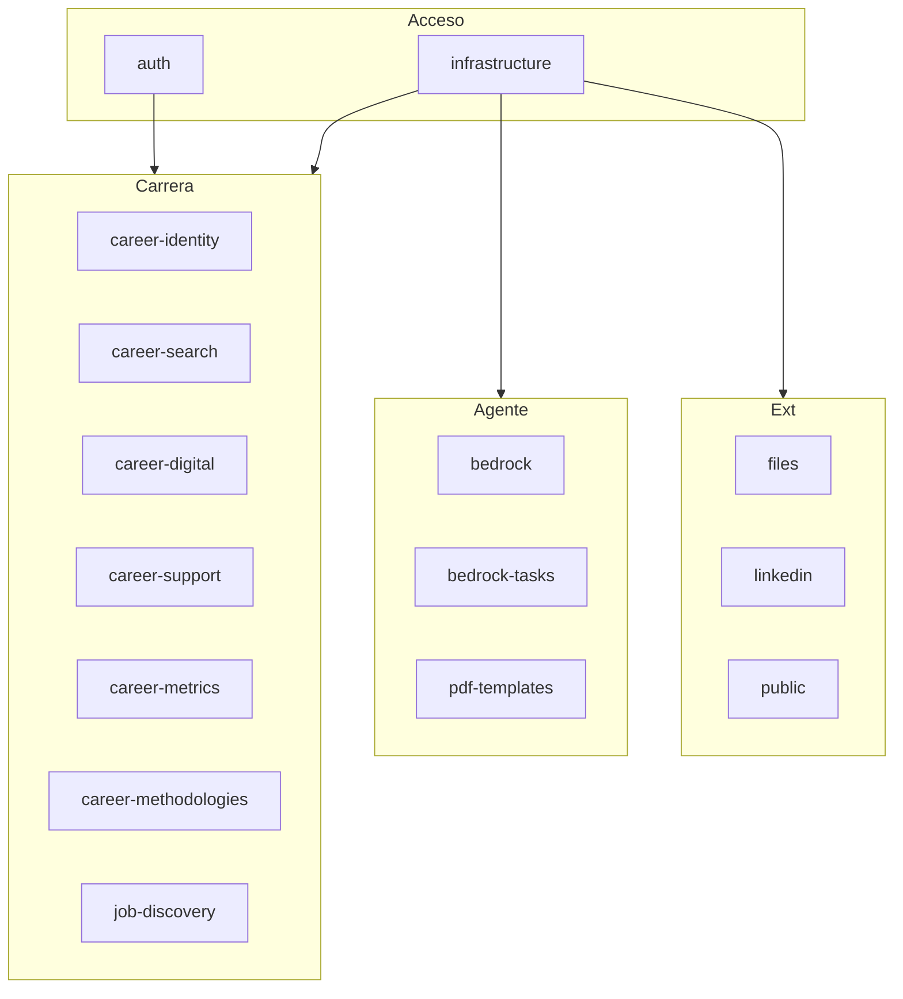

# Documentación por sección — API REST

Índice de READMEs detallados. Cada sección documenta endpoints, schemas, servicios, flujos y ejemplos de uso.

## Arquitectura

---

## Autenticación y acceso

| Sección | Descripción |
|---------|-------------|
| [auth](auth/README.md) | Login, registro, refresh token, perfil, cambio de contraseña |
| [infrastructure](infrastructure/README.md) | JWT middleware, CRUD factory, repositorios, IDs prefijados, Qdrant |

---

## Dominio Carrera (JWT requerido)

| Sección | Recursos | Endpoints |
|---------|----------|-----------|
| [career-identity](career-identity/README.md) | Identidad, competencias, logros, proyectos… | 12 recursos CRUD |
| [career-search](career-search/README.md) | Vacantes, aplicaciones, entrevistas, CVs… | 14 recursos CRUD + PDF |
| [career-digital](career-digital/README.md) | Portal, publicaciones, perfiles sociales | 6 recursos CRUD + GitHub |
| [career-support](career-support/README.md) | Etiquetas transversales | 1 recurso CRUD |
| [career-metrics](career-metrics/README.md) | Métricas semanales y overview de búsqueda | 2 endpoints read-only |
| [career-methodologies](career-methodologies/README.md) | Metodologías operativas | 1 recurso CRUD |
| [job-discovery](job-discovery/README.md) | Búsqueda multi-proveedor de vacantes | Preview → save |

---

## Agente IA y documentos

| Sección | Descripción |
|---------|-------------|
| [bedrock](bedrock/README.md) | Chat SSE, modelos, memoria, tools, auditoría, presupuesto |
| [bedrock-tasks](bedrock-tasks/README.md) | Tareas programables del agente |
| [pdf-templates](pdf-templates/README.md) | Plantillas HTML → PDF |

---

## Integraciones y almacenamiento

| Sección | Descripción |
|---------|-------------|
| [files](files/README.md) | Upload, presigned URLs, MinIO |
| [linkedin](linkedin/README.md) | OAuth, publicación y programación de posts |

---

## Portal público (sin autenticación)

| Sección | Descripción |
|---------|-------------|
| [public](public/README.md) | Home, About, Projects, Blog, Contact |

---

## Cómo leer cada README

Cada documento de sección sigue esta estructura:

1. **Propósito** — qué problema resuelve
2. **Archivos fuente** — routes, schemas, services, models
3. **Endpoints** — método, path, auth, request/response
4. **Flujos** — secuencias típicas de uso
5. **Relaciones** — con otras secciones (Bedrock tools, Portal, etc.)
6. **Ejemplos curl** — peticiones representativas

---

## Implementación (paquetes `src/`)

Los README de sección documentan el **contrato HTTP**. El código interno está en:

- [src/README.md](../../src/README.md) — mapa de capas
- [src/routes/README.md](../../src/routes/README.md) — cada router
- [src/services/README.md](../../src/services/README.md) — servicios e integraciones

Volver al [README principal de la API](../README.md).
