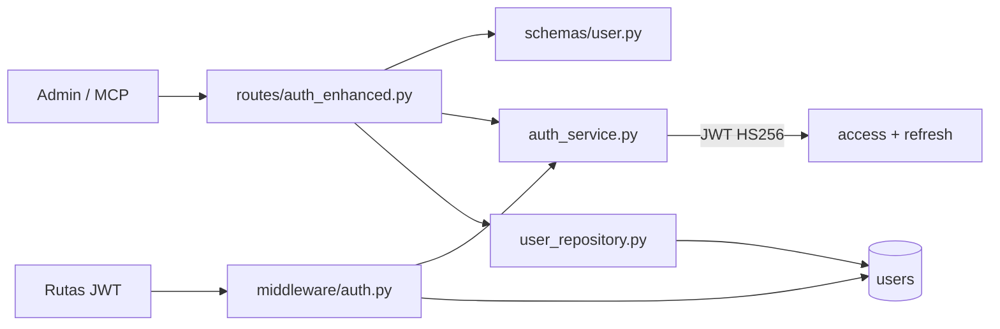
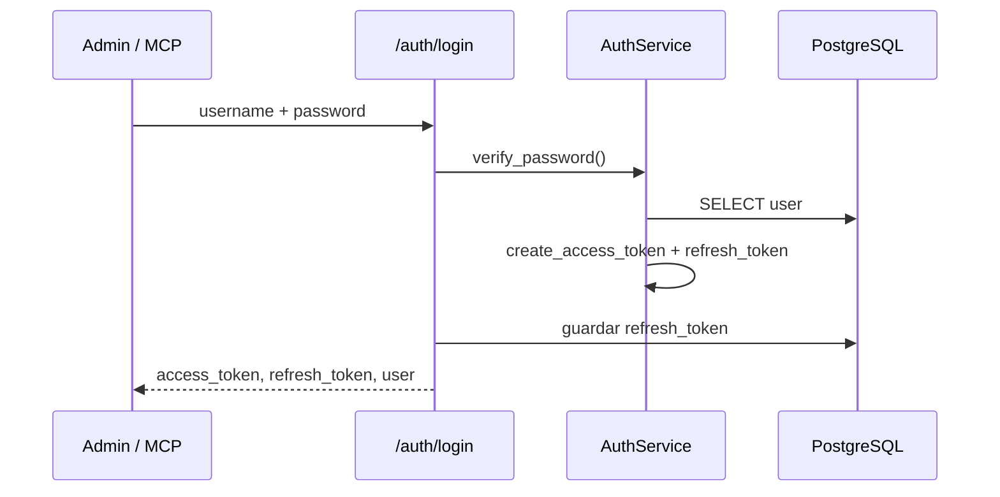

# Autenticación — `/auth`

Gestión de usuarios y tokens JWT para Admin Panel y MCP Server.

## Arquitectura



---

## Archivos fuente

| Capa | Archivo |
|------|---------|
| Rutas | `src/routes/auth_enhanced.py` |
| Schemas | `src/schemas/user.py` |
| Servicio | `src/services/auth_service.py` |
| Repositorio | `src/repositories/user_repository.py` |
| Middleware | `src/middleware/auth.py` |

---

## Endpoints

| Método | Path | Auth | Descripción |
|--------|------|------|-------------|
| `POST` | `/auth/register` | No | Registrar usuario nuevo |
| `POST` | `/auth/login` | No | Login → access + refresh token |
| `POST` | `/auth/refresh` | No | Renovar access token |
| `POST` | `/auth/logout` | No | Logout informativo (cliente borra tokens) |
| `PATCH` | `/auth/me` | Sí | Actualizar perfil del usuario actual |
| `POST` | `/auth/change-password` | Sí | Cambiar contraseña |

**Tag OpenAPI:** `Authentication`

---

## Flujo de login



---

## Request / Response

### POST /auth/register

```json
{
  "username": "carlos",
  "email": "carlos@example.com",
  "password": "minimo8chars",
  "full_name": "Carlos Jiménez",
  "professional_title": "Arquitecto de Soluciones"
}
```

**201** → `UserResponse` (sin password)  
**400** → username o email duplicado

### POST /auth/login

```json
{
  "username": "carlos",
  "password": "minimo8chars"
}
```

**200** →

```json
{
  "access_token": "eyJ...",
  "refresh_token": "eyJ...",
  "token_type": "bearer",
  "expires_in": 3600,
  "user": { "id": "usr-1", "username": "carlos", ... }
}
```

### POST /auth/refresh

```json
{
  "refresh_token": "eyJ..."
}
```

**200** → nuevo `access_token` (+ opcionalmente refresh rotado)

### PATCH /auth/me

Requiere `Authorization: Bearer <access_token>`.

Campos editables vía `UserUpdate`: `full_name`, `email`, `phone`, `country`, `professional_title`, etc.

---

## Tokens JWT

| Token | Duración | Uso |
|-------|----------|-----|
| Access | `ACCESS_TOKEN_EXPIRE_MINUTES` (default 60) | Header `Authorization: Bearer` en todas las rutas protegidas |
| Refresh | `REFRESH_TOKEN_EXPIRE_DAYS` (default 7) | Solo en `/auth/refresh` |

- Algoritmo: **HS256**
- Secreto: `JWT_SECRET_KEY` en `.env`
- El `sub` del payload contiene el ID prefijado del usuario (`usr-N`)

La dependency `get_current_user` (`middleware/auth.py`) decodifica el token, valida expiración y carga el usuario desde PostgreSQL.

---

## Aislamiento de datos

Todas las rutas de carrera, Bedrock, archivos y LinkedIn usan `Depends(get_current_user)`. El `user_id` del token es la **única** fuente de verdad para filtrar filas — nunca se acepta `user_id` en el body del cliente.

---

## Ejemplos curl

```bash
# Login
curl -s -X POST http://localhost:8001/auth/login \
  -H "Content-Type: application/json" \
  -d '{"username":"carlos","password":"secret123"}'

# Perfil (con token)
curl -s http://localhost:8001/auth/me \
  -H "Authorization: Bearer $TOKEN"

# Refresh
curl -s -X POST http://localhost:8001/auth/refresh \
  -H "Content-Type: application/json" \
  -d "{\"refresh_token\":\"$REFRESH\"}"
```

---

## Relaciones

- **Todas las secciones protegidas** dependen de este módulo
- **Portal público** (`/public/*`) no usa JWT; filtra por `PUBLIC_PORTAL_USER_ID`
- **Bedrock** opera con el mismo scope JWT del Admin Panel

Ver también: [SECURITY.md](../../SECURITY.md), [infrastructure](../infrastructure/README.md)
