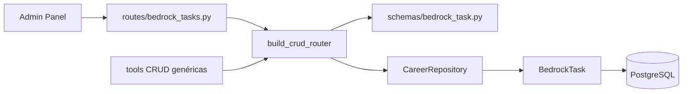

# Tareas del Agente — `/agent-tasks`

CRUD de tareas programables o pendientes para el Agent Bedrock (recordatorios, workflows, seguimientos).

**Prefijo:** `/agent-tasks`  
**Tag OpenAPI:** `Agent - Tasks`  
**Auth:** JWT requerido

## Arquitectura



---

## Archivos fuente

| Capa | Archivo |
|------|---------|
| Rutas | `src/routes/bedrock_tasks.py` |
| Schemas | `src/schemas/bedrock_task.py` |
| Modelo | `src/models/bedrock_task.py` |

---

## Endpoints CRUD

| Método | Path | Descripción |
|--------|------|-------------|
| `GET` | `/agent-tasks` | Listar tareas |
| `GET` | `/agent-tasks/count` | Contar |
| `GET` | `/agent-tasks/{id}` | Obtener una |
| `POST` | `/agent-tasks` | Crear |
| `PUT` | `/agent-tasks/{id}` | Actualizar |
| `DELETE` | `/agent-tasks/{id}` | Eliminar |

Resource key en registry: `agent-tasks` → modelo `BedrockTask`.

Patrón: [infrastructure](../infrastructure/README.md).

---

## Schemas

- `BedrockTaskCreate`
- `BedrockTaskUpdate`
- `BedrockTaskResponse`

---

## Campos típicos

| Campo | Descripción |
|-------|-------------|
| `title` | Título de la tarea |
| `description` | Detalle opcional |
| `status` | pending / in_progress / done / cancelled |
| `priority` | low / medium / high |
| `due_date` | Fecha límite ISO |
| `agent_profile_id` | Perfil sugerido para ejecutar |
| `context` | JSON con metadata adicional |

---

## Uso en Admin Panel

El módulo **Agent Tasks** del sidebar consume estos endpoints vía React Query (`useAgentTasks` en `admin/src/hooks/useBedrockChat.ts`).

El agente puede listar/crear tareas vía tools CRUD si el perfil lo permite.

---

## Ejemplo

```bash
curl -s -X POST http://localhost:8001/agent-tasks \
  -H "Authorization: Bearer $TOKEN" \
  -H "Content-Type: application/json" \
  -d '{
    "title": "Actualizar CV para rol DevOps",
    "status": "pending",
    "priority": "high",
    "agent_profile_id": "agent_search_operations"
  }'
```

Ver también: [bedrock](../bedrock/README.md)
