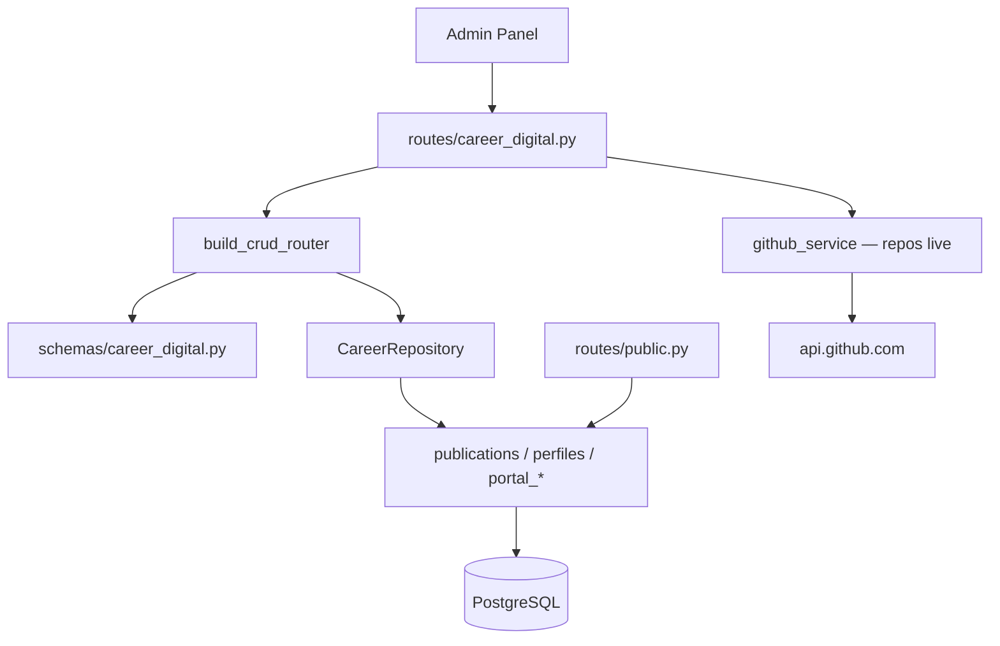

# Carrera — Presencia Digital

Contenido del portafolio web, publicaciones y perfiles en redes profesionales.

**Prefijo:** `/career`  
**Tag OpenAPI:** `Career - Digital Presence`  
**Auth:** JWT requerido

## Arquitectura



---

## Archivos fuente

| Capa | Archivo |
|------|---------|
| Rutas | `src/routes/career_digital.py` |
| Schemas | `src/schemas/career_digital.py` |
| GitHub | `src/services/github_service.py` (si existe) |

---

## Recursos CRUD (6)

| Resource key | Path | Modelo | Descripción |
|--------------|------|--------|-------------|
| `publications` | `/career/publications` | `Publication` | Artículos, posts de blog |
| `linkedin-profile` | `/career/linkedin-profile` | `LinkedInProfile` | Datos del perfil LinkedIn |
| `github-profile` | `/career/github-profile` | `GitHubProfile` | Username y metadata GitHub |
| `portal-home` | `/career/portal-home` | `PortalHome` | Contenido hero del portal |
| `portal-about` | `/career/portal-about` | `PortalAbout` | Texto About del portal |
| `portal-contact` | `/career/portal-contact` | `PortalContact` | Datos de contacto público |

---

## Endpoint custom: repos de GitHub

| Método | Path | Descripción |
|--------|------|-------------|
| `GET` | `/career/github-profile/repos` | Lista repos públicos del username conectado (API GitHub en vivo) |

**Flujo:**
1. Lee `GitHubProfile` del usuario autenticado
2. Llama API pública de GitHub con el username almacenado
3. Retorna payload de repos (no persistido en BD)

---

## Agente Bedrock

Perfil **`digital`** — tools de LinkedIn, publicaciones, imágenes:

- CRUD en `publications`, perfiles sociales, portal
- `generate_image`, `attach_image_to_record`
- `create_linkedin_post`, `list_linkedin_posts` (vía integración `/linkedin`)

El chat contextual en secciones de Presencia Digital enruta a este perfil.

---

## Portal público

| Recurso | Endpoint |
|---------|----------|
| `portal-home`, `projects`, `publications`, `competencies` | `GET /public/home` |
| `portal-about`, `identity`, `work-history` | `GET /public/about` |
| `portal-contact`, `linkedin-profile`, `github-profile` | `GET /public/contact` |
| `publications` (blog) | `GET /public/blog`, `/public/blog/{slug}` |

Solo publicaciones con `platform=portfolio_web` y `status=published` aparecen en el blog.

Ver [public](../public/README.md).

---

## Ejemplo: actualizar hero del portal

```bash
curl -s -X PUT http://localhost:8001/career/portal-home/phm-1 \
  -H "Authorization: Bearer $TOKEN" \
  -H "Content-Type: application/json" \
  -d '{
    "headline": "Arquitecto de Soluciones",
    "subheadline": "IA, Cloud y Automatización"
  }'
```

Ver también: [linkedin](../linkedin/README.md), [public](../public/README.md)
