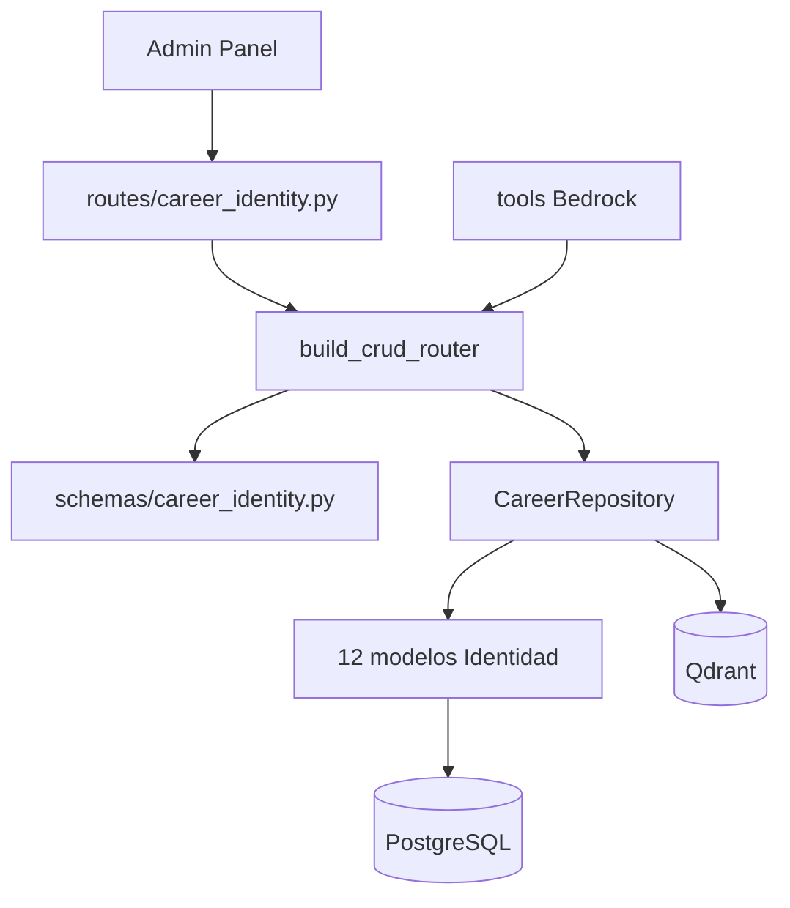

# Carrera — Identidad Profesional

Recursos del dominio **Identidad Profesional**: quién eres, qué sabes, qué has logrado y en qué proyectos has participado.

**Prefijo común:** `/career`  
**Tag OpenAPI:** `Career - Identity`  
**Auth:** JWT requerido en todos los endpoints

## Arquitectura



---

## Archivos fuente

| Capa | Archivo |
|------|---------|
| Rutas | `src/routes/career_identity.py` |
| Schemas | `src/schemas/career_identity.py` |
| Factory CRUD | `src/routes/career_common.py` |
| Repositorio | `src/repositories/career_repository.py` |
| Modelos | `src/models/` (ver tabla abajo) |

---

## Recursos (12)

Cada fila expone el patrón CRUD estándar de 6 endpoints. Ver [infrastructure](../infrastructure/README.md).

| Resource key | Path | Modelo | Descripción |
|--------------|------|--------|-------------|
| `differentiators` | `/career/differentiators` | `Differentiator` | Diferenciadores profesionales |
| `identity` | `/career/identity` | `Identity` | Perfil de identidad (singleton por usuario) |
| `identity-reflections` | `/career/identity-reflections` | `IdentityReflection` | Reflexiones sobre identidad |
| `competencies` | `/career/competencies` | `Competency` | Competencias y niveles |
| `certifications` | `/career/certifications` | `Certification` | Certificaciones |
| `target-roles` | `/career/target-roles` | `TargetRole` | Roles objetivo de carrera |
| `work-history` | `/career/work-history` | `WorkHistory` | Historial laboral |
| `achievements` | `/career/achievements` | `Achievement` | Logros profesionales |
| `star-stories` | `/career/star-stories` | `StarStory` | Historias STAR (Situación-Tarea-Acción-Resultado) |
| `career-reviews` | `/career/career-reviews` | `CareerReview` | Revisiones periódicas de carrera |
| `role-gap-analysis` | `/career/role-gap-analysis` | `RoleGapAnalysis` | Análisis de brechas vs rol objetivo |
| `projects` | `/career/projects` | `Project` | Proyectos del portafolio |

---

## Schemas Pydantic

Por recurso existen tres schemas:

- `{Entity}Create` — campos requeridos al crear
- `{Entity}Update` — campos opcionales al actualizar (`exclude_unset`)
- `{Entity}Response` — respuesta serializada (incluye `id` prefijado, timestamps)

Ejemplo para achievements:

```
AchievementCreate / AchievementUpdate / AchievementResponse
```

---

## Agente Bedrock

El perfil **`identity`** (`agent_profiles.py`) tiene acceso a todos estos resource keys. Tools disponibles:

- `list_career_record`, `get_career_record`, `create_career_record`, `update_career_record`, `delete_career_record`
- `count_career_records`, `search_knowledge_base`, `describe_resource_schema`

El chat contextual en secciones de Identidad del Admin Panel enruta automáticamente a este perfil según `page_context.resource_key`.

---

## Portal público

Estos recursos alimentan endpoints públicos (solo lectura):

| Recurso | Endpoint público |
|---------|------------------|
| `identity`, `work-history`, `competencies`, `certifications` | `GET /public/about` |
| `projects` | `GET /public/projects`, `/public/home` |
| `competencies` | Skills en home y about |

Filtrados por `PUBLIC_PORTAL_USER_ID`. Ver [public](../public/README.md).

---

## Ejemplo: listar logros

```bash
curl -s "http://localhost:8001/career/achievements?limit=10&sort_by=created_at&sort_dir=desc" \
  -H "Authorization: Bearer $TOKEN"
```

## Ejemplo: crear competencia

```bash
curl -s -X POST http://localhost:8001/career/competencies \
  -H "Authorization: Bearer $TOKEN" \
  -H "Content-Type: application/json" \
  -d '{
    "name": "FastAPI",
    "category": "Backend",
    "level": "expert",
    "years_experience": 3
  }'
```

---

## Notas

- **`identity`** suele ser un registro único por usuario (el Admin lo trata como singleton)
- Los writes indexan automáticamente en **Qdrant** para búsqueda semántica del agente
- IDs devueltos siempre en formato prefijado (`ach-17`, `cmp-42`)

Ver también: [career-search](../career-search/README.md), [bedrock](../bedrock/README.md)
