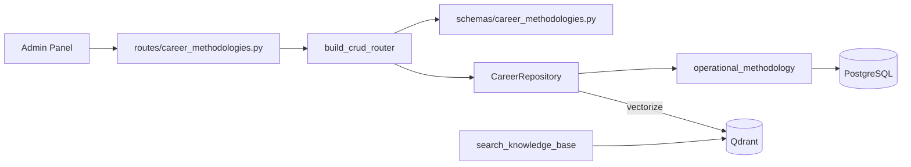

# Carrera — Metodologías Operativas

Metodologías de trabajo documentadas, indexadas en Qdrant para que el agente las consulte semánticamente.

**Prefijo:** `/career/operational-methodologies`  
**Tag OpenAPI:** `Career - Methodologies`  
**Auth:** JWT requerido

## Arquitectura



---

## Archivos fuente

| Capa | Archivo |
|------|---------|
| Rutas | `src/routes/career_methodologies.py` |
| Schemas | `src/schemas/career_methodologies.py` |
| Modelo | `src/models/operational_methodology.py` |

---

## Recurso (1)

| Resource key | Path | Modelo |
|--------------|------|--------|
| `operational-methodologies` | `/career/operational-methodologies` | `OperationalMethodology` |

CRUD estándar de 6 endpoints. **`vectorize=True`** — cada write indexa en Qdrant.

---

## Campos típicos

| Campo | Descripción |
|-------|-------------|
| `title` | Nombre de la metodología |
| `section` | Agrupación (ej. "Identidad Profesional", "Diseño PDF") |
| `subsection` | Subagrupación opcional |
| `description` | Resumen corto |
| `content` | Texto Markdown de la metodología |
| `agent_profile_ids` | Lista de ids `agent_*` destinatarios. Vacío o `null` = todos los agentes |
| `notes` | Notas internas |

---

## Agente Bedrock

Perfil **`methodologies`** — especializado en consultar y editar metodologías.

Tool principal: `search_knowledge_base` con `type=methodology` para búsqueda semántica.

El Admin Panel muestra metodologías por sección. El campo `agent_profile_ids` indica para qué agentes aplica cada registro; `search_knowledge_base` (type=methodology) filtra por el perfil caller (el L2 `agent_methodologies` ve todas).

---

## Ejemplo

```bash
curl -s "http://localhost:8001/career/operational-methodologies?search=STAR&limit=5" \
  -H "Authorization: Bearer $TOKEN"
```

Ver también: [bedrock](../bedrock/README.md) (memoria Qdrant)
