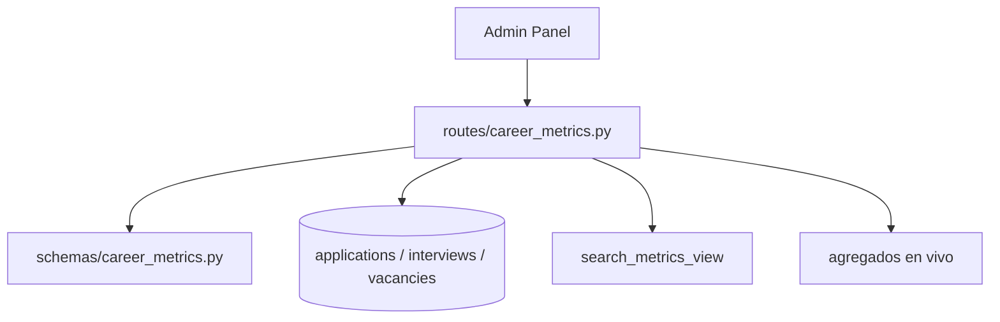

# Carrera — Métricas

Métricas agregadas de búsqueda de empleo. **Solo lectura** — no usa el factory CRUD.

**Prefijo:** `/career/metrics`  
**Tag OpenAPI:** `Career - Metrics`  
**Auth:** JWT requerido

## Arquitectura



---

## Archivos fuente

| Capa | Archivo |
|------|---------|
| Rutas | `src/routes/career_metrics.py` |
| Schemas | `src/schemas/career_metrics.py` |

---

## Endpoints

### GET /career/metrics/weekly

Métricas semanales de búsqueda de empleo.

| Query | Default | Rango |
|-------|---------|-------|
| `limit` | 12 | 1–104 semanas |

**Respuesta:** `List[SearchMetricsWeekResponse]`

Datos desde la vista SQL `search_metrics_view`:
- Aplicaciones enviadas
- Tasa de respuesta
- Entrevistas
- Ofertas
- Rechazos

### GET /career/metrics/search-overview

Snapshot agregado en tiempo real del estado de búsqueda.

**Respuesta:** `SearchOverviewResponse`

Incluye:
- **Funnel** — etapas del pipeline (vacantes → aplicaciones → entrevistas)
- **Breakdowns** — conteos por estado, fuente, etc.
- **Fit rubric** — métricas de `FitScoringFactor`
- **Market segments** — resumen de segmentos activos
- **Active search plan** — plan de búsqueda vigente

**Fuentes ORM directas:** `Vacancy`, `Application`, `Interview`, `MarketSegment`, `NetworkingContact`, `TargetCompany`, `FitScoringFactor`, `SearchPlan`

---

## Flujo típico (Admin Panel)

```mermaid
flowchart LR
    A[Dashboard métricas] --> B[/metrics/search-overview]
    C[Gráfico semanal] --> D[/metrics/weekly?limit=12]
    B --> E[Widgets funnel + fit]
    D --> F[Chart temporal]
```

---

## Ejemplo

```bash
# Overview en vivo
curl -s http://localhost:8001/career/metrics/search-overview \
  -H "Authorization: Bearer $TOKEN"

# Últimas 8 semanas
curl -s "http://localhost:8001/career/metrics/weekly?limit=8" \
  -H "Authorization: Bearer $TOKEN"
```

---

## Relaciones

- Consume datos escritos vía [career-search](../career-search/README.md)
- No expuesto al Portal público
- El agente puede consultar vacantes/aplicaciones vía tools CRUD, no vía estos endpoints agregados

Ver también: [career-search](../career-search/README.md)
