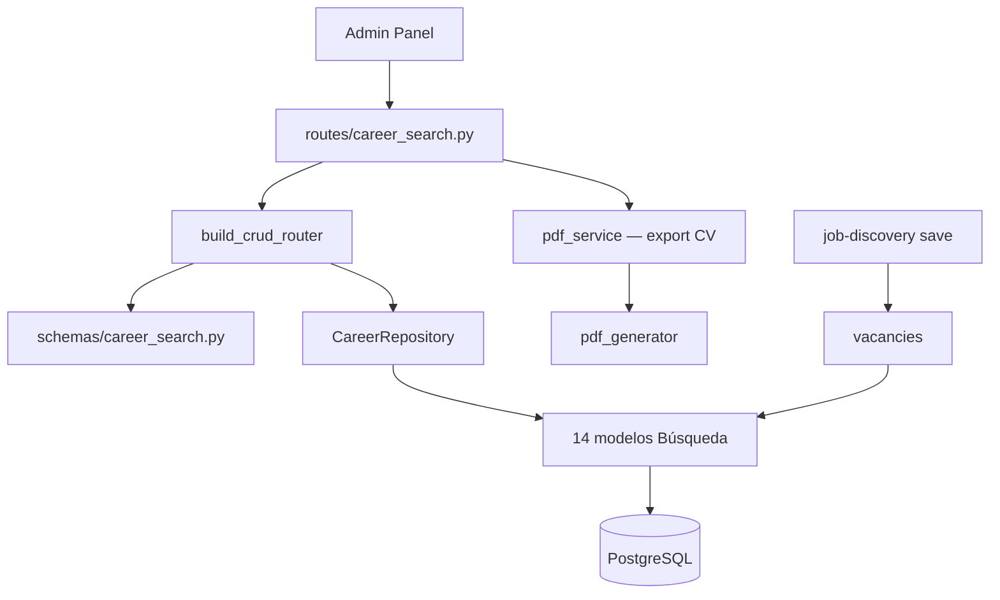

# Carrera — Búsqueda de Empleo

Recursos del dominio **Búsqueda**: estrategia, vacantes, aplicaciones, entrevistas, CVs y cartas de presentación.

**Prefijo:** `/career`  
**Tag OpenAPI:** `Career - Search`  
**Auth:** JWT requerido

## Arquitectura



---

## Archivos fuente

| Capa | Archivo |
|------|---------|
| Rutas | `src/routes/career_search.py` |
| Schemas | `src/schemas/career_search.py` |
| PDF | `src/services/pdf_service.py`, `pdf_template_render.py` |

---

## Recursos CRUD (14)

| Resource key | Path | Modelo | Notas |
|--------------|------|--------|-------|
| `fit-scoring-factors` | `/career/fit-scoring-factors` | `FitScoringFactor` | Rúbrica de encaje |
| `market-segments` | `/career/market-segments` | `MarketSegment` | Segmentos de mercado |
| `role-narratives` | `/career/role-narratives` | `RoleNarrative` | Narrativas por rol |
| `search-plans` | `/career/search-plans` | `SearchPlan` | Planes de búsqueda activos |
| `networking-contacts` | `/career/networking-contacts` | `NetworkingContact` | Contactos de networking |
| `target-companies` | `/career/target-companies` | `TargetCompany` | Empresas objetivo |
| `vacancies` | `/career/vacancies` | `Vacancy` | Vacantes en seguimiento |
| `cv-versions` | `/career/cv-versions` | `CVVersion` | **`vectorize=False`** |
| `cover-letter-versions` | `/career/cover-letter-versions` | `CoverLetterVersion` | Cartas por vacante/rol |
| `applications` | `/career/applications` | `Application` | Postulaciones |
| `application-interactions` | `/career/application-interactions` | `ApplicationInteraction` | Seguimiento por aplicación |
| `interviews` | `/career/interviews` | `Interview` | Entrevistas |
| `contact-interactions` | `/career/contact-interactions` | `ContactInteraction` | Interacciones con contactos |
| `networking-activities` | `/career/networking-activities` | `NetworkingActivity` | Actividades de red |

Patrón CRUD: ver [infrastructure](../infrastructure/README.md).

---

## Endpoint custom: PDF de CV

| Método | Path | Descripción |
|--------|------|-------------|
| `POST` | `/career/cv-versions/{cv_version_id}/pdf` | Renderiza CV Markdown → PDF descargable |

**Query params:**
- `template_id` (opcional) — ID de plantilla `pdt-N` en `/pdf-templates`

**Flujo:**
1. Carga `CVVersion` del usuario
2. Si hay `template_id`, usa HTML template + `render_template_html`
3. Si no, genera PDF desde Markdown con `generate_markdown_document`
4. Retorna `StreamingResponse` (`application/pdf`)

---

## Agente Bedrock

Perfil L2 **`agent_search_operations`** — pipeline de vacantes, aplicaciones y entrevistas. Discovery: L3 **`agent_vacancy_search`**. Redacción: L3 **`agent_cv_writing`** (`cv-versions`) y **`agent_cover_letter_writing`** (`cover-letter-versions`). PDF: L3 **`agent_pdf_render`**.

Tools de job discovery (también expuestas vía `/career/job-discoveries`):

- `list_job_providers`, `run_job_discovery`, `import_job_url`, `save_job_listings`

Reglas del agente:
- `run_job_discovery` solo hace **preview** (refs L1, L2…)
- `save_job_listings` requiere autorización explícita del usuario
- No inventar vacantes ni usar `create_career_record` para ofertas descubiertas

Ver [job-discovery](../job-discovery/README.md).

---

## Métricas

Los datos de vacantes, aplicaciones e entrevistas alimentan:

- `GET /career/metrics/weekly`
- `GET /career/metrics/search-overview`

Ver [career-metrics](../career-metrics/README.md).

---

## Ejemplo: listar vacantes pendientes

```bash
curl -s "http://localhost:8001/career/vacancies?search=pending&limit=50" \
  -H "Authorization: Bearer $TOKEN"
```

## Ejemplo: generar PDF de CV

```bash
curl -s -X POST "http://localhost:8001/career/cv-versions/cvv-3/pdf?template_id=pdt-1" \
  -H "Authorization: Bearer $TOKEN" \
  -o cv.pdf
```

---

Ver también: [job-discovery](../job-discovery/README.md), [pdf-templates](../pdf-templates/README.md)
