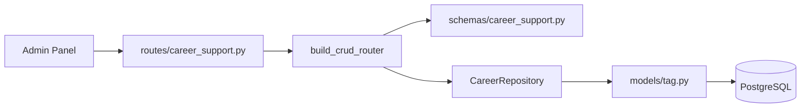

# Carrera — Soporte (Tags)

Etiquetas transversales para clasificar recursos de carrera en el Admin Panel.

**Prefijo:** `/career/tags`  
**Tag OpenAPI:** `Career - Support`  
**Auth:** JWT requerido

## Arquitectura



---

## Archivos fuente

| Capa | Archivo |
|------|---------|
| Rutas | `src/routes/career_support.py` |
| Schemas | `src/schemas/career_support.py` |
| Modelo | `src/models/tag.py` |

---

## Recurso (1)

| Resource key | Path | Modelo |
|--------------|------|--------|
| `tags` | `/career/tags` | `Tag` |

Endpoints CRUD estándar (6). Ver [infrastructure](../infrastructure/README.md).

---

## Campos típicos

| Campo | Descripción |
|-------|-------------|
| `tag_name` | Nombre visible de la etiqueta |
| `slug` | Identificador URL-safe |
| `color` | Color hex para UI |
| `category` | Agrupación opcional |

---

## Uso

Las tags se asocian desde el Admin Panel a otros recursos (proyectos, publicaciones, vacantes) para filtrado y organización visual. No tienen endpoints de relación propios en esta sección — la asociación vive en los campos JSON/array de cada entidad.

---

## Ejemplo

```bash
curl -s -X POST http://localhost:8001/career/tags \
  -H "Authorization: Bearer $TOKEN" \
  -H "Content-Type: application/json" \
  -d '{"tag_name": "IA", "slug": "ia", "color": "#3b82f6"}'
```
