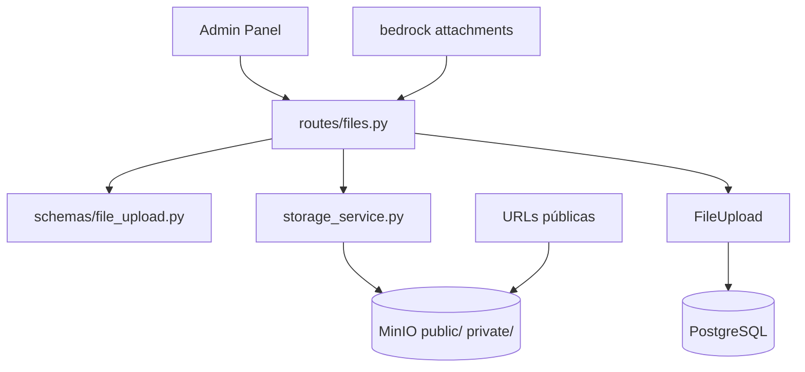

# Archivos — `/files`

Gestión de uploads en MinIO: imágenes, documentos, adjuntos del chat y assets del portafolio.

**Prefijo:** `/files`  
**Tag OpenAPI:** `Files`  
**Auth:** JWT requerido (excepto URLs públicas servidas por MinIO directamente)

## Arquitectura



---

## Archivos fuente

| Capa | Archivo |
|------|---------|
| Rutas | `src/routes/files.py` |
| Schemas | `src/schemas/file_upload.py` |
| Modelo | `src/models/file_upload.py` |
| Storage | `src/services/storage_service.py` |

---

## Endpoints

| Método | Path | Descripción |
|--------|------|-------------|
| `POST` | `/files` | Subir archivo (multipart) |
| `GET` | `/files` | Listar archivos del usuario |
| `GET` | `/files/categories` | Categorías distintas (folder picker) |
| `PATCH` | `/files/{file_id}/visibility` | Cambiar público/privado |
| `GET` | `/files/{file_id}/download` | URL presigned temporal |
| `GET` | `/files/{file_id}/raw` | Stream de bytes vía API |
| `DELETE` | `/files/{file_id}` | Eliminar archivo |

---

## POST /files — Upload

**Content-Type:** `multipart/form-data`

| Campo | Tipo | Descripción |
|-------|------|-------------|
| `file` | File | Archivo a subir |
| `description` | string | Descripción opcional |
| `category` | string | Slug de categoría (ej. `images`, `documents`) |
| `is_public` | bool | Si es accesible sin auth vía MinIO |

**Optimización:** las imágenes se comprimen/redimensionan en upload.

**201** → `FileUploadResponse` con `id`, `url`, `mime_type`, `size_bytes`, etc.

---

## Visibilidad

| Valor | Comportamiento |
|-------|----------------|
| `is_public=true` | Key en bucket público; URL directa |
| `is_public=false` | Key privado; acceso vía presigned URL o `/raw` |

`PATCH /files/{id}/visibility` mueve el objeto entre prefixes en MinIO.

---

## GET /files/{id}/download

Retorna `PresignedUrlResponse`:

```json
{
  "url": "https://minio.../presigned...",
  "expires_in_seconds": 3600
}
```

---

## Variables de entorno

| Variable | Descripción |
|----------|-------------|
| `MINIO_ENDPOINT` | Host interno MinIO |
| `MINIO_ACCESS_KEY` | Credencial |
| `MINIO_SECRET_KEY` | Credencial |
| `MINIO_BUCKET` | Bucket principal |
| `MINIO_PUBLIC_URL` | URL base para assets públicos |

El bucket se crea en startup (`storage_service.ensure_bucket()` en `app.py`).

---

## Integraciones

| Consumidor | Uso |
|------------|-----|
| Admin Panel | Gestor de archivos, adjuntos en chat |
| Bedrock | `attachments` en chat; `generate_image` sube a MinIO |
| LinkedIn | Imagen adjunta en posts |
| Portal | URLs públicas de imágenes de proyectos/publicaciones |

---

## Ejemplo

```bash
# Subir imagen
curl -s -X POST http://localhost:8001/files \
  -H "Authorization: Bearer $TOKEN" \
  -F "file=@photo.jpg" \
  -F "category=images" \
  -F "is_public=true"

# Listar por categoría
curl -s "http://localhost:8001/files?category=images&limit=20" \
  -H "Authorization: Bearer $TOKEN"
```

Ver también: [bedrock](../bedrock/README.md), [linkedin](../linkedin/README.md)
