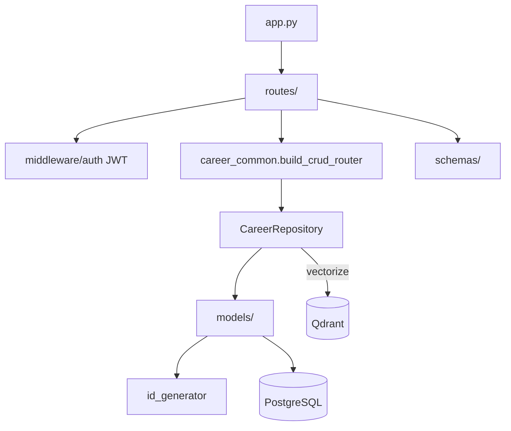
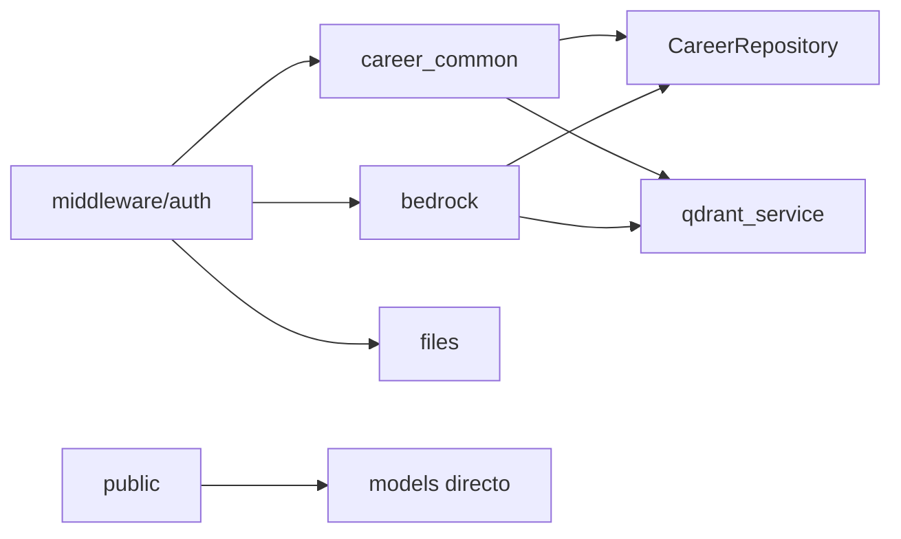

# Infraestructura compartida

Patrones transversales usados por todas las secciones de la API.

## Arquitectura



Registro de routers en `src/app.py`. No hay prefijo global `/api/v1` — los paths son directos (`/auth`, `/career`, `/bedrock`, etc.).

---

## Autenticación JWT

**Archivo:** `src/middleware/auth.py`

```python
async def get_current_user(
    credentials: HTTPAuthorizationCredentials = Depends(security),
    db: AsyncSession = Depends(get_db),
) -> User
```

- Extrae `Bearer` del header `Authorization`
- Decodifica con `AuthService.decode_access_token`
- Busca usuario por `sub` (ID prefijado `usr-N`)
- Lanza **401** si token inválido, expirado o usuario inactivo

---

## Factory CRUD de carrera

**Archivo:** `src/routes/career_common.py`

`build_crud_router()` genera 6 endpoints estándar por recurso:

| Método | Path | Función |
|--------|------|---------|
| GET | `` | Listar con paginación |
| GET | `/count` | Contar registros del usuario |
| GET | `/{item_id}` | Obtener por ID prefijado |
| POST | `` | Crear |
| PUT | `/{item_id}` | Actualizar parcial |
| DELETE | `/{item_id}` | Eliminar |

**Query params de listado:**

| Param | Default | Descripción |
|-------|---------|-------------|
| `skip` | 0 | Offset |
| `limit` | 20 | Tamaño página (max 100) |
| `sort_by` | — | Columna ordenable |
| `sort_dir` | `asc` | `asc` o `desc` |
| `search` | — | Búsqueda case-insensitive en columnas de texto |

### RESOURCE_REGISTRY

Cada `build_crud_router(prefix="/career/foo", ...)` registra automáticamente:

```python
RESOURCE_REGISTRY["career/foo"] = ModelClass  # key = prefix sin slash inicial
```

Este registro alimenta:
- **Agent Bedrock tools** (`list_career_record`, `get_career_record`, etc.)
- **Admin Panel** (`CAREER_RESOURCES` en frontend)

**37 resource keys** registrados en total (ver secciones career-*).

### Vectorización Qdrant

Por defecto `vectorize=True`: cada create/update/delete indexa el registro en Qdrant para `search_knowledge_base`.

Excepción: `cv-versions` usa `vectorize=False` — el contenido PDF/markdown se lee directo de PostgreSQL.

---

## CareerRepository

**Archivo:** `src/repositories/career_repository.py`

Operaciones centrales:

| Método | Descripción |
|--------|-------------|
| `list_for_user` | Lista paginada + búsqueda |
| `count_for_user` | Conteo total |
| `get_for_user` | Get by ID con aislamiento user |
| `create_for_user` | Crea con ID prefijado auto-generado |
| `update_for_user` | Update parcial |
| `delete_for_user` | Soft/hard delete según modelo |

Side effects en writes:
- Indexación Qdrant (si `vectorize=True`)
- Entrada en `audit_logs` cuando Bedrock modifica datos

---

## IDs prefijados

**Archivo:** `src/services/id_generator.py`

Formato: `{prefijo}-{secuencia}` — ej. `ach-17`, `vac-5`, `usr-1`.

| Prefijo | Tabla / resource_key |
|---------|---------------------|
| `usr` | users |
| `ach` | achievements |
| `vac` | vacancies |
| `pdt` | pdf_output_templates |
| … | (uno por tabla de carrera) |

`normalize_prefixed_id()` convierte IDs numéricos legacy a formato prefijado en tools Bedrock.

---

## Configuración

**Archivo:** `src/config.py` — `pydantic_settings.BaseSettings`

Variables clave:

| Variable | Propósito |
|----------|-----------|
| `DATABASE_URL` | PostgreSQL async |
| `JWT_SECRET_KEY` | Firma de tokens |
| `CORS_ORIGINS` | Admin, Portal, MCP |
| `PUBLIC_PORTAL_USER_ID` | Usuario cuyos datos sirve `/public/*` |
| `BEDROCK_*` | Harness local, modelos, presupuesto |
| `MINIO_*` | Almacenamiento de archivos |
| `QDRANT_*` | Base vectorial |

---

## Base de datos

**Archivos:** `src/database.py`, `alembic/`

- SQLAlchemy 2.0 async con `asyncpg`
- Migraciones: `alembic upgrade head`
- Lifecycle: `init_db()` / `close_db()` en `app.py`

Ver [DATABASE.md](../../DATABASE.md).

---

## Manejo de errores global

**Archivo:** `src/app.py`

| Excepción | HTTP | Respuesta |
|-----------|------|-----------|
| `RequestValidationError` | 422 | `{ detail, errors }` |
| Excepción no capturada | 500 | `{ detail: "Error interno del servidor" }` |

Las rutas lanzan `HTTPException` con códigos específicos (404, 400, 502, 503).

---

## Paginación estándar

- Default `skip=0`, `limit=20`
- Máximo `limit=100` en CRUD de carrera
- Respuesta de listado: array directo (no wrapper `{ total, items }` excepto donde se documente)

---

## Relaciones entre módulos



Ver también: [ARCHITECTURE.md](../../ARCHITECTURE.md)
