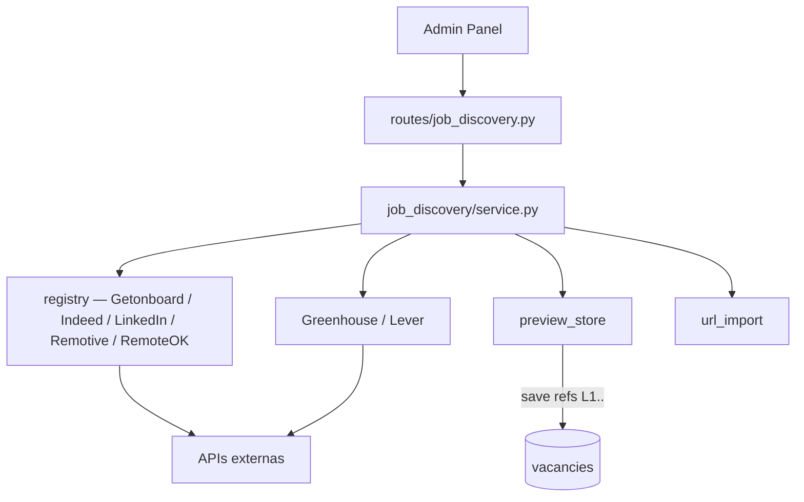
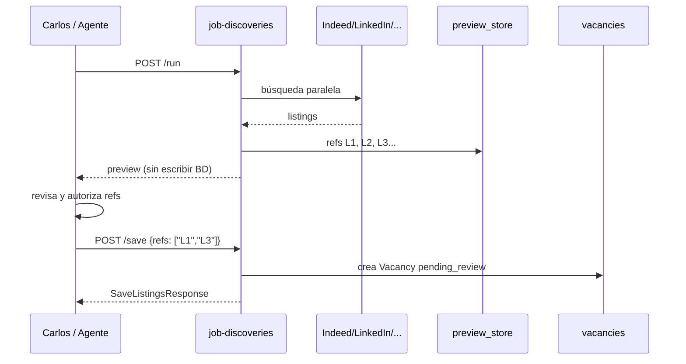

# Job Discovery — Búsqueda multi-proveedor

Búsqueda de vacantes en portales externos con flujo **preview → autorización → persistencia**.

**Prefijo:** `/career/job-discoveries`  
**Tag OpenAPI:** `Career - Job Discovery`  
**Auth:** JWT requerido

## Arquitectura



---

## Archivos fuente

| Capa | Archivo |
|------|---------|
| Rutas | `src/routes/job_discovery.py` |
| Schemas | `src/schemas/job_discovery.py` |
| Servicios | `src/services/job_discovery/` |
| Preview | `src/services/job_discovery/preview_store.py` |

---

## Diseño: preview-then-save



**Regla crítica:** `/run` e `/import-url` **nunca** persisten vacantes. Solo `/save` crea registros en `vacancies`.

---

## Endpoints

| Método | Path | Descripción |
|--------|------|-------------|
| `GET` | `/career/job-discoveries/providers` | Lista proveedores disponibles y su estado |
| `POST` | `/career/job-discoveries/run` | Búsqueda multi-proveedor (solo preview) |
| `POST` | `/career/job-discoveries/import-url` | Importar una vacante por URL (preview) |
| `POST` | `/career/job-discoveries/save` | Persistir refs autorizadas como vacantes |

---

## Proveedores

| ID | Fuente | Notas |
|----|--------|-------|
| `indeed` | Adzuna API | Requiere keys en `.env` |
| `linkedin` | URLs oficiales de búsqueda | No inventa listings |
| `getonboard` | GetOnBoard | |
| `remotive` | Remotive API | |
| `remoteok` | RemoteOK API | |
| `company_boards` | Greenhouse/Lever de target companies | Opcional en `/run` |

---

## POST /run — Request

```json
{
  "query": "python backend remote",
  "location": "México",
  "providers": ["indeed", "remotive"],
  "target_role_id": "trl-2",
  "include_company_boards": true,
  "remote": true
}
```

**Response:** `JobDiscoveryRunResponse`

```json
{
  "query": "python backend remote",
  "location": "México",
  "listings": [
    {
      "ref": "L1",
      "title": "Senior Backend Engineer",
      "company": "Acme",
      "url": "https://...",
      "source": "remotive"
    }
  ],
  "errors": [
    { "provider": "indeed", "message": "API key missing" }
  ]
}
```

---

## POST /import-url — Request

```json
{
  "url": "https://www.linkedin.com/jobs/view/1234567890"
}
```

Importa una vacante individual, asigna ref (ej. `L5`) y la guarda en preview store. Si el usuario pegó la URL, el agente puede guardar esa ref sin autorización adicional.

---

## POST /save — Request

```json
{
  "refs": ["L1", "L3"],
  "target_role_id": "trl-2"
}
```

Crea registros `Vacancy` con `evaluation=pending_review` para seguimiento en el módulo Vacantes del Admin.

**400** si refs no existen en el preview store de la sesión.

---

## Agente Bedrock

Tools equivalentes (perfil L3 `agent_vacancy_search`; el chat contextual sigue en L2 `agent_search_operations`):

- `list_job_providers`
- `run_job_discovery`
- `import_job_url`
- `save_job_listings`

El system prompt incluye reglas estrictas de autorización antes de `save_job_listings`.

---

## Variables de entorno

| Variable | Proveedor |
|----------|-----------|
| `ADZUNA_APP_ID`, `ADZUNA_APP_KEY` | Indeed vía Adzuna |
| (otras según proveedor) | Ver `services/job_discovery/` |

---

## Ejemplo curl

```bash
# Listar proveedores
curl -s http://localhost:8001/career/job-discoveries/providers \
  -H "Authorization: Bearer $TOKEN"

# Ejecutar búsqueda
curl -s -X POST http://localhost:8001/career/job-discoveries/run \
  -H "Authorization: Bearer $TOKEN" \
  -H "Content-Type: application/json" \
  -d '{"query":"devops","providers":["remotive","remoteok"],"remote":true}'
```

Ver también: [career-search](../career-search/README.md), [bedrock](../bedrock/README.md)
