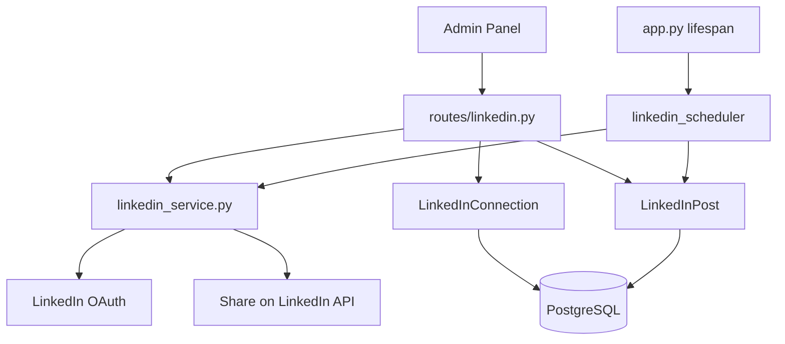
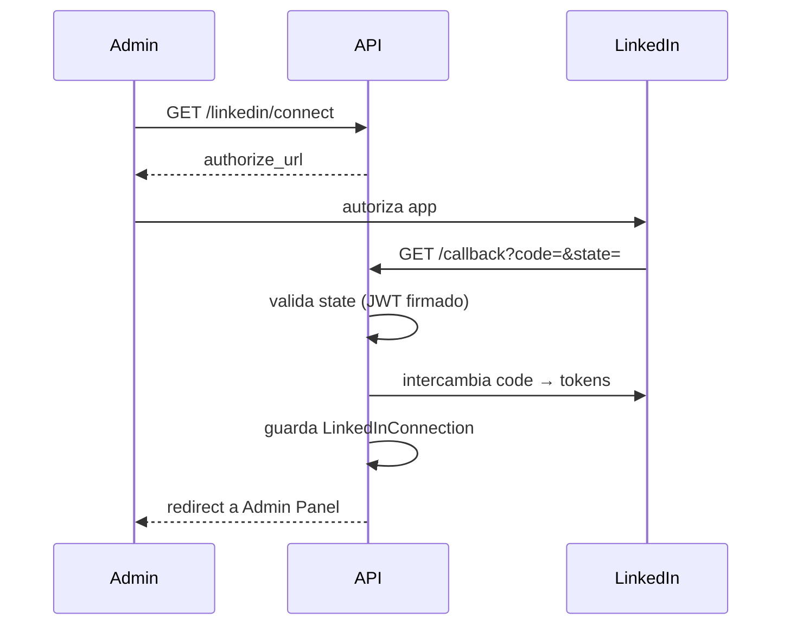

# LinkedIn — `/linkedin`

Integración OAuth con LinkedIn: conexión de cuenta, publicación inmediata y programación de posts.

**Prefijo:** `/linkedin`  
**Tag OpenAPI:** `LinkedIn`  
**Auth:** JWT en casi todos; **callback sin auth**

## Arquitectura



---

## Archivos fuente

| Capa | Archivo |
|------|---------|
| Rutas | `src/routes/linkedin.py` |
| Schemas | `src/schemas/linkedin.py` |
| Servicio | `src/services/linkedin_service.py` |
| Scheduler | `src/services/linkedin_scheduler.py` |
| Modelos | `linkedin_connection.py`, `linkedin_post.py` |

El scheduler corre en background desde `app.py` lifespan (`linkedin_scheduler.scheduler_loop()`).

---

## Endpoints

| Método | Path | Auth | Descripción |
|--------|------|------|-------------|
| `GET` | `/linkedin/status` | Sí | Estado de conexión OAuth |
| `GET` | `/linkedin/connect` | Sí | Iniciar flujo OAuth → `authorize_url` |
| `GET` | `/linkedin/callback` | **No** | Callback OAuth (redirect browser) |
| `DELETE` | `/linkedin/disconnect` | Sí | Revocar conexión |
| `GET` | `/linkedin/posts` | Sí | Listar posts recientes (max 20) |
| `POST` | `/linkedin/posts` | Sí | Publicar ahora o programar |
| `DELETE` | `/linkedin/posts/{post_id}` | Sí | Cancelar post programado |

---

## Flujo OAuth



El `state` del OAuth contiene un token firmado que identifica al usuario sin requerir JWT en el callback.

---

## GET /linkedin/status

```json
{
  "connected": true,
  "expires_at": "2026-09-01T00:00:00Z",
  "scopes": ["w_member_social"],
  "linkedin_user_id": "..."
}
```

---

## POST /linkedin/posts

**Content-Type:** `multipart/form-data`

| Campo | Descripción |
|-------|-------------|
| `text` | Texto del post (requerido) |
| `scheduled_at` | ISO datetime futuro → status `scheduled` |
| `image` | Archivo imagen opcional |

Sin `scheduled_at` → publicación inmediata vía API LinkedIn.

**201** → `LinkedInPostResponse` con `id: "lnp-N"`, `status: published|scheduled`

---

## DELETE /linkedin/posts/{post_id}

Solo cancela posts con `status=scheduled`. Posts ya publicados no se pueden borrar vía API.

---

## Scheduler

`linkedin_scheduler.scheduler_loop()` (async task en startup):
- Poll periódico de posts `scheduled` cuya hora llegó
- Publica vía `linkedin_service`
- Actualiza status a `published` o `failed`

---

## Agente Bedrock

Tools disponibles (perfil L3 `agent_linkedin_publishing`; el chat contextual sigue en L2 `agent_digital_presence`):

- `get_linkedin_status`
- `list_linkedin_posts`
- `create_linkedin_post`
- `delete_scheduled_linkedin_post`

---

## Variables de entorno

| Variable | Descripción |
|----------|-------------|
| `LINKEDIN_CLIENT_ID` | App LinkedIn |
| `LINKEDIN_CLIENT_SECRET` | Secret |
| `LINKEDIN_REDIRECT_URI` | URL del callback |

---

## Ejemplo

```bash
# Estado
curl -s http://localhost:8001/linkedin/status \
  -H "Authorization: Bearer $TOKEN"

# Iniciar conexión
curl -s http://localhost:8001/linkedin/connect \
  -H "Authorization: Bearer $TOKEN"

# Publicar
curl -s -X POST http://localhost:8001/linkedin/posts \
  -H "Authorization: Bearer $TOKEN" \
  -F "text=Hola LinkedIn desde mi portafolio"
```

Ver también: [career-digital](../career-digital/README.md), [bedrock](../bedrock/README.md)
