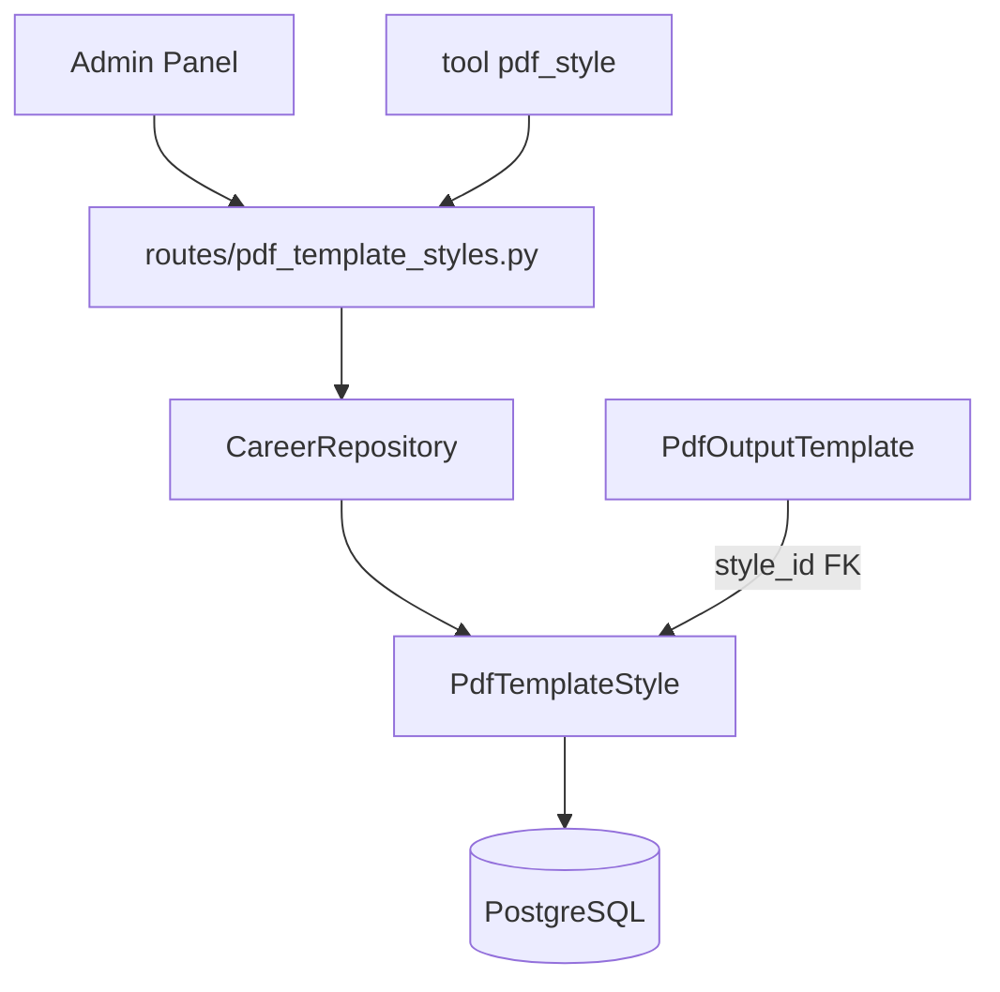

# Estilos PDF — `/pdf-template-styles`

CRUD de la tabla `pdf_template_styles` (CSS reutilizable). Varias plantillas pueden compartir el mismo estilo.

**Prefijo:** `/pdf-template-styles`  
**Tag OpenAPI:** `PDF Template Styles`  
**Auth:** JWT requerido  
**Tool del agente:** `pdf_style` (`action=list|get|create|update`)

Plantillas HTML: [pdf-templates](../pdf-templates/README.md).

## Arquitectura



---

## Archivos fuente

| Capa | Archivo |
|------|---------|
| Rutas | `src/routes/pdf_template_styles.py` |
| Schemas | `src/schemas/pdf_template.py` (`PdfTemplateStyle*`) |
| Modelo | `src/models/pdf_template_style.py` |
| Tool | `src/services/bedrock/tools.py` → `pdf_style` |

Usa `CareerRepository` con `resource_key="pdf-template-styles"` y **`vectorize=False`**. IDs prefijados `pds-N`.

---

## Endpoints

| Método | Path | Descripción |
|--------|------|-------------|
| `GET` | `/pdf-template-styles` | Listar estilos |
| `GET` | `/pdf-template-styles/{style_id}` | Obtener uno (`pds-N`) |
| `POST` | `/pdf-template-styles` | Crear estilo |
| `PUT` | `/pdf-template-styles/{style_id}` | Actualizar CSS o guía |
| `DELETE` | `/pdf-template-styles/{style_id}` | Eliminar |

---

## POST /pdf-template-styles — Crear

```json
{
  "slug": "cv-cyan-profesional",
  "title": "CV cyan profesional",
  "css_content": "body { font-family: sans-serif; color: #0f172a; }",
  "style_guide": "## Clases\n- `.hero` — encabezado\n- `h1` — nombre"
}
```

**201** → `PdfTemplateStyleResponse` con `id: "pds-1"`

---

## Campos

| Campo | Uso |
|-------|-----|
| `css_content` | CSS completo WeasyPrint |
| `style_guide` | Markdown: clases y etiquetas que las plantillas pueden usar |
| `slug` / `title` | Identificación |

---

## Integraciones

| Consumidor | Cómo usa estilos |
|------------|------------------|
| Admin Panel | UI CRUD en `/agent/pdf-template-styles` |
| Plantillas | FK `style_id` en `pdf_output_templates` |
| Agent Bedrock | Tool `pdf_style` (independiente de `pdf_template`) |
| Render PDF | `resolve_template_css()` combina CSS del estilo + HTML de la plantilla |

---

## Ejemplo

```bash
curl -s "http://localhost:8001/pdf-template-styles" \
  -H "Authorization: Bearer $TOKEN"
```

Ver también: [pdf-templates](../pdf-templates/README.md), [bedrock](../bedrock/README.md)
