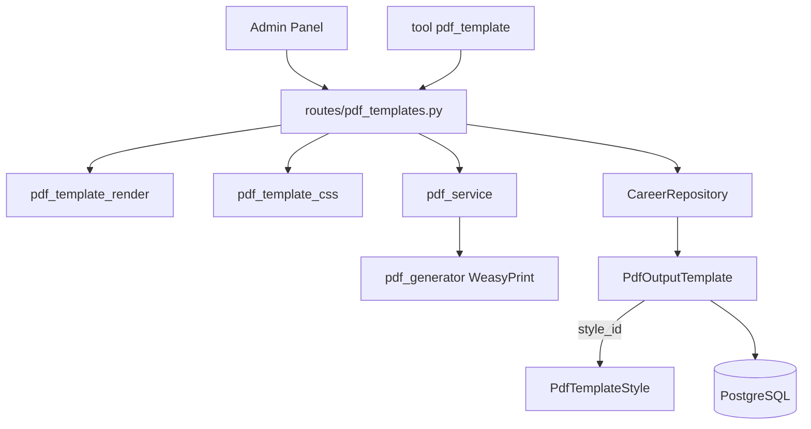

# Plantillas PDF — `/pdf-templates`

CRUD de la tabla `pdf_output_templates` (HTML). El CSS vive en una tabla aparte.

**Prefijo:** `/pdf-templates`  
**Tag OpenAPI:** `PDF Templates`  
**Auth:** JWT requerido  
**Tool del agente:** `pdf_template` (`action=list|get|create|update`)

Estilos CSS: [pdf-template-styles](../pdf-template-styles/README.md).

## Arquitectura



---

## Archivos fuente

| Capa | Archivo |
|------|---------|
| Rutas | `src/routes/pdf_templates.py` |
| Schemas | `src/schemas/pdf_template.py` |
| Modelo | `src/models/pdf_output_template.py` |
| CSS resuelto | `src/services/pdf_template_css.py` |
| Render | `src/services/pdf_template_render.py` |
| PDF | `src/services/pdf_service.py` |
| Tool | `src/services/bedrock/tools.py` → `pdf_template` |

Usa `CareerRepository` con `resource_key="pdf-output-templates"` y **`vectorize=False`**.

---

## Endpoints

| Método | Path | Descripción |
|--------|------|-------------|
| `GET` | `/pdf-templates` | Listar plantillas (`?document_type=cv`) |
| `GET` | `/pdf-templates/defaults/by-type` | Plantilla default por tipo |
| `GET` | `/pdf-templates/{template_id}` | Obtener una (`pdt-N`) |
| `POST` | `/pdf-templates` | Crear plantilla |
| `PUT` | `/pdf-templates/{template_id}` | Actualizar (incrementa `version`) |
| `DELETE` | `/pdf-templates/{template_id}` | Eliminar |
| `POST` | `/pdf-templates/{template_id}/render` | Renderizar PDF desde HTML + estilo |

---

## POST /pdf-templates — Crear

```json
{
  "slug": "cv-moderno",
  "document_type": "cv",
  "title": "CV Moderno",
  "html_template": "<html>...{{name}}...</html>",
  "style_id": "pds-1",
  "variables": "{{name}} — nombre completo\n{{title}} — titular profesional"
}
```

**201** → `PdfOutputTemplateResponse` con `id: "pdt-1"`

El HTML no debe incluir CSS. El estilo se referencia con `style_id`.

---

## POST /pdf-templates/{id}/render

```json
{
  "variables": {
    "name": "Carlos Jiménez",
    "title": "Arquitecto de Soluciones",
    "skills": ["Python", "AWS"]
  },
  "title": "CV - Carlos Jiménez"
}
```

**Respuesta:** stream PDF (`application/pdf`)

**Flujo:**
1. Carga plantilla del usuario
2. `render_template_html()` — sustituye variables
3. `resolve_template_css()` — CSS del `style_id`
4. `generate_html_template_pdf()` — WeasyPrint

---

## Tipos de documento

| `document_type` | Uso |
|-----------------|-----|
| `cv` | Curricula |
| `cover_letter` | Cartas de presentación |
| `other` | Documentos custom |

---

## Integraciones

| Consumidor | Cómo usa plantillas |
|------------|---------------------|
| Admin Panel | UI CRUD en `/agent/pdf-templates` |
| `POST /career/cv-versions/{id}/pdf` | PDF de CV desde markdown + template |
| Agent Bedrock | Tool `pdf_template` + `generate_pdf` |

---

## Ejemplo

```bash
curl -s "http://localhost:8001/pdf-templates?document_type=cv" \
  -H "Authorization: Bearer $TOKEN"
```

Ver también: [pdf-template-styles](../pdf-template-styles/README.md), [bedrock](../bedrock/README.md)
