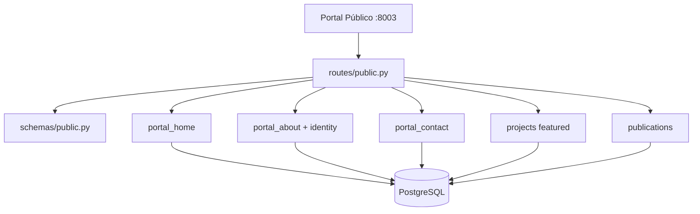

# Portal Público — `/public`

Endpoints de **solo lectura** sin autenticación para el Portal Público (React SPA en puerto 8003).

**Prefijo:** `/public`  
**Tag OpenAPI:** `Public Portal`  
**Auth:** Ninguna

## Arquitectura



---

## Archivos fuente

| Capa | Archivo |
|------|---------|
| Rutas | `src/routes/public.py` |
| Schemas | `src/schemas/public.py` |

Consulta modelos ORM directamente — no usa `CareerRepository` ni JWT.

---

## Scope de datos

Todos los endpoints filtran por **`PUBLIC_PORTAL_USER_ID`** en `.env` — el usuario cuyo portafolio se expone públicamente (típicamente Carlos).

No se expone data de otros usuarios aunque existan en la BD.

---

## Endpoints

| Método | Path | Descripción |
|--------|------|-------------|
| `GET` | `/public/home` | Hero, stats, proyectos destacados, skills |
| `GET` | `/public/about` | Bio, historial laboral, competencias, certificaciones |
| `GET` | `/public/contact` | Contacto + links sociales |
| `GET` | `/public/projects` | Todos los proyectos |
| `GET` | `/public/projects/{project_id}` | Detalle de un proyecto |
| `GET` | `/public/blog` | Posts publicados del blog |
| `GET` | `/public/blog/{slug}` | Post por slug |

---

## GET /public/home

**Respuesta:** `PublicHomeResponse`

Agrega datos de:
- `PortalHome` — headline, CTAs
- `Project` — featured + anchor project
- `Publication` — publicaciones destacadas
- `Competency` — skills para stats

---

## GET /public/about

**Respuesta:** `PublicAboutResponse`

Incluye:
- `Identity` — bio profesional
- `PortalAbout` — texto about custom
- `WorkHistory` — experiencia laboral
- `Competency` — agrupadas por categoría
- `Certification` — certificaciones

---

## GET /public/blog

**Query:** `limit` (1–100, default 20)

**Filtro estricto:**
- `Publication.platform == "portfolio_web"`
- `Publication.status == "published"`

Ordenado por fecha de publicación descendente.

---

## GET /public/projects/{project_id}

`project_id` acepta ID prefijado (`prj-N`).

Retorna `PublicProjectDetail` con descripción, tech stack, URLs, imágenes.

**404** si el proyecto no pertenece al usuario público o no existe.

---

## Seguridad

| Aspecto | Implementación |
|---------|----------------|
| Escritura | Imposible vía `/public/*` |
| Aislamiento | Solo `PUBLIC_PORTAL_USER_ID` |
| Datos sensibles | Vacantes, aplicaciones, Bedrock — **no expuestos** |
| CORS | Portal en `CORS_ORIGINS` |

Ver [SECURITY.md](../../SECURITY.md).

---

## Fuentes de datos (escritura)

El Admin Panel escribe vía endpoints `/career/*`:

| Endpoint público | Recursos fuente |
|------------------|-----------------|
| `/public/home` | [career-digital](../career-digital/README.md), [career-identity](../career-identity/README.md) |
| `/public/about` | [career-identity](../career-identity/README.md) |
| `/public/contact` | [career-digital](../career-digital/README.md) |
| `/public/projects` | [career-identity](../career-identity/README.md) |
| `/public/blog` | [career-digital](../career-digital/README.md) |

---

## Ejemplo

```bash
# Sin token
curl -s http://localhost:8001/public/home
curl -s http://localhost:8001/public/blog?limit=5
curl -s http://localhost:8001/public/projects/prj-1
```

Ver también: [career-digital](../career-digital/README.md), [career-identity](../career-identity/README.md)
