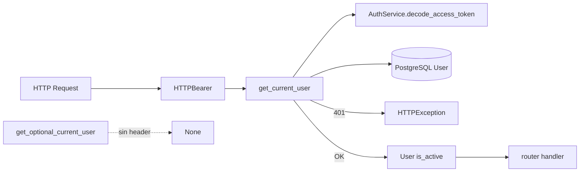

# Paquete `middleware/`

Dependencias FastAPI de autenticación. No hay middleware ASGI extra: el JWT se resuelve con `Depends(get_current_user)` en cada router protegido.

## Arquitectura

---

### `auth.py` — Bearer JWT

Scheme `HTTPBearer()` lee `Authorization: Bearer <token>`.

| Función | Comportamiento |
|---------|----------------|
| `get_current_user` | Decodifica access token (`AuthService`), carga `User` por `sub`, exige `is_active`. 401 si falta token, firma inválida, usuario inexistente o inactivo. |
| `get_optional_current_user` | Igual pero retorna `None` sin header (rutas mixtas). |

El `user_id` del token es el único origen de aislamiento: body y query nunca eligen el dueño de la fila.

### `__init__.py`

Marcador de paquete. Importar desde `middleware.auth`.
