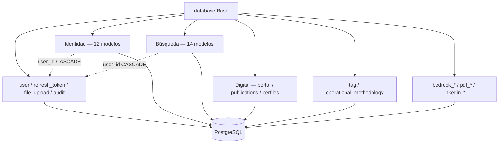

# Paquete `models/`

ORM SQLAlchemy 2.0. Todas las clases heredan de `database.Base`. IDs de negocio son `String(20)` prefijados (`register_id_listener`). Filas de carrera llevan `user_id` con `ON DELETE CASCADE`.

`__init__.py` reexporta todos los modelos para Alembic (`import models`) y tests.

## Arquitectura

---

## Núcleo y seguridad

| Módulo | Tabla / clase | Función |
|--------|---------------|---------|
| `user.py` | `User` | Cuenta: username, email, hash, perfil, `is_active` |
| `refresh_token.py` | `RefreshToken` | Refresh JWT persistido / revocable |
| `user_session.py` | `UserSession` | Sesiones de login (tracking) |
| `file_upload.py` | `FileUpload`, `FileType` | Metadatos MinIO (categoría, visibilidad, MIME) |
| `audit_log.py` | `AuditLog`, `AuditAction` | Bitácora create/update/delete (también restore del agente) |
| `event.py` | `Event`, `EventType` | Eventos de actividad de usuario |
| `metrics.py` | `Metrics` | Snapshot de métricas de perfil |

---

## Carrera — Identidad

| Módulo | Contenido |
|--------|-----------|
| `differentiator.py` | Pilares de diferenciación + evidencia |
| `identity.py` | Singleton: tagline, bio, UVP (1:1 con User) |
| `identity_reflection.py` | Reflexiones IKIGAI (pasión, profesión, vocación, misión) |
| `competencies.py` | Competencias técnicas / transferibles / negocio |
| `certification.py` | Certificaciones (syllabus Markdown, `document_url`, status) |
| `target_role.py` | Roles objetivo de la búsqueda |
| `work_history.py` | Historial laboral |
| `achievement.py` | Logros (reto / solución / impacto) |
| `star_story.py` | Historias STAR 60–90 s |
| `career_review.py` | Revisiones periódicas / transiciones |
| `role_gap_analysis.py` | Gaps vs rol objetivo |
| `project.py` | Proyectos de portafolio (featured, portal) |

---

## Carrera — Búsqueda

| Módulo | Contenido |
|--------|-----------|
| `fit_scoring_factor.py` | Factores ponderados de fit de vacante |
| `market_segment.py` | Canales mercado visible/oculto |
| `role_narrative.py` | Narrativas reutilizables por rol |
| `search_plan.py` | Planes semanales de búsqueda |
| `networking_contact.py` | Red profesional |
| `contact_interaction.py` | Log de comunicación con un contacto |
| `networking_activity.py` | Actividades give/share/talk |
| `target_company.py` | Empresas objetivo + boards Greenhouse/Lever |
| `vacancy.py` | Vacantes trackeadas (incluye las de job discovery) |
| `cv_version.py` | CV versionado (Markdown `content`) |
| `cover_letter_version.py` | Cartas versionadas |
| `application.py` | Postulaciones a una vacante |
| `application_interaction.py` | Log de comunicación de la postulación |
| `interview.py` | Entrevistas por postulación |

---

## Carrera — Digital, soporte, metodologías

| Módulo | Contenido |
|--------|-----------|
| `publication.py` | Posts/blog (alimenta `/public` blog) |
| `linkedin_profile.py` | Staging del perfil LinkedIn (no OAuth) |
| `github_profile.py` | Username + copy; repos se piden en vivo |
| `portal_home.py` | Hero y stats del Home público |
| `portal_about.py` | Copy extra de Sobre mí (bio vive en `identity`) |
| `portal_contact.py` | Contacto + footer (links sociales salen de perfiles) |
| `tag.py` | Etiquetas transversales |
| `operational_methodology.py` | Protocolos Markdown de operación del dominio |

---

## Bedrock y PDF

| Módulo | Contenido |
|--------|-----------|
| `bedrock_settings.py` | Fila única: modelo, presupuesto, prompt override, límites |
| `bedrock_agent_profile_prompt.py` | Suffix editable por perfil de agente |
| `bedrock_custom_tool.py` | Servidores MCP remotos registrados |
| `bedrock_conversation.py` | `BedrockConversation` + `BedrockConversationMessage` (historial por `session_type` + `agent_profile_id`) |
| `bedrock_usage_log.py` | Costo/tokens por turno |
| `bedrock_usage_round_log.py` | Costo granular (Converse, tool, imagen) |
| `bedrock_task.py` | Tareas/plan del agente (`/agent-tasks`) |
| `pdf_output_template.py` | Plantillas HTML → PDF |
| `pdf_template_style.py` | CSS reutilizable (`style_id`) |

---

## LinkedIn integración

| Módulo | Contenido |
|--------|-----------|
| `linkedin_connection.py` | Token OAuth “Share on LinkedIn” |
| `linkedin_post.py` | Cola + historial de posts (`scheduled` / publicado) |

Esquema SQL: [docs/DATABASE.md](../../docs/DATABASE.md).
