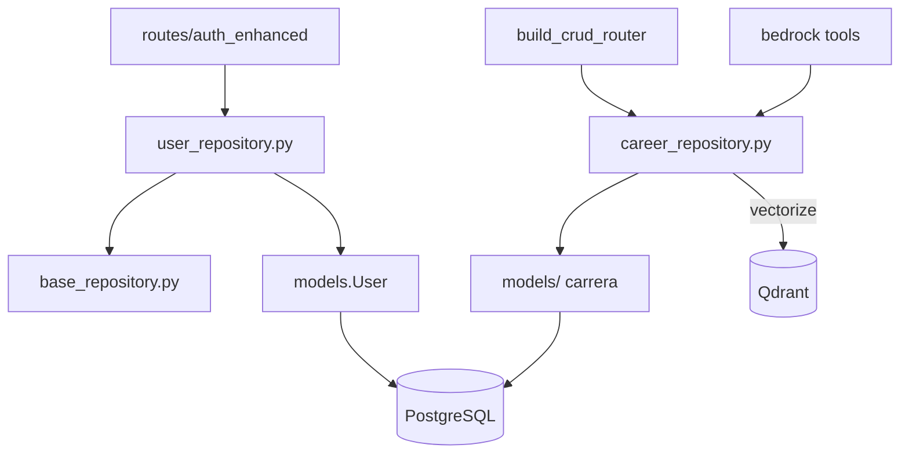

# Paquete `repositories/`

Capa de acceso a datos. Las rutas y services no ejecutan `select` ad hoc sobre tablas de carrera: pasan por repositorios que aíslan filas por `user_id`.

## Arquitectura

---

### `base_repository.py` — CRUD genérico

`BaseRepository[T]`: create, get_by_id, get_all (paginado), count, update, delete. Sin filtro de usuario (pensado para entidades globales o como clase base).

Implementa DIP: el resto del código depende de la abstracción, no de SQLAlchemy directo.

### `user_repository.py` — Usuarios

Extiende `BaseRepository[User]`.

| Método | Uso |
|--------|-----|
| `get_by_username` / `get_by_email` | Login y unicidad |
| `user_exists` | Register (username o email ya tomados) |
| Operaciones de sesión | Activar/desactivar cuenta, last login |

Usado por `routes/auth_enhanced.py`.

### `career_repository.py` — Dominio carrera

Un repositorio parametrizado por modelo. Todas las tablas de carrera tienen la misma forma: cada fila pertenece a un `user_id`.

| Método | Comportamiento |
|--------|----------------|
| `list_for_user` | Paginación, `search` en columnas texto, `sort_by` validado |
| `count_for_user` | Conteo con el mismo filtro |
| `get_for_user` | 404 lógico si el id no es del usuario |
| `create_for_user` | Fuerza `user_id` del token; indexa Qdrant en background |
| `update_for_user` / `delete_for_user` | Aislamiento + reindex / delete vector |

`resource_key` (hyphenated, p. ej. `operational-methodologies`) lo setea `build_crud_router`. `vectorize=False` en CVs y plantillas PDF: el agente lee Postgres, no Qdrant.

Tareas de indexado se guardan en `_background_tasks` para que asyncio no las recoja a mitad de vuelo.

### `__init__.py`

Vacío. Importar `CareerRepository` / `UserRepository` desde el módulo concreto.
