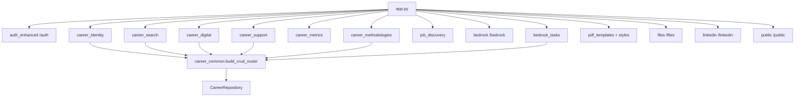

# Paquete `routes/`

Capa HTTP de FastAPI. Cada módulo registra un `APIRouter` que `app.py` monta. La lógica de negocio vive en `services/`; aquí solo se validan payloads, se aplica JWT y se serializan respuestas.

**Contrato HTTP detallado:** [docs/sections/](../../docs/sections/README.md)

## Arquitectura

---

## Factory CRUD

### `career_common.py` — `build_crud_router`

Genera list / count / get / create / update / delete para un `(model, schemas)`:

- JWT obligatorio (`get_current_user`).
- Aislamiento por `user_id` del token vía `CareerRepository` (nunca del body).
- Registra el recurso en `RESOURCE_REGISTRY` para que las tools de Bedrock operen el mismo CRUD.

Prefijos de ID (`ach-17`, `vac-5`) los asigna `id_generator` al insertar.

---

## Autenticación

### `auth_enhanced.py` — `/auth`

| Método | Path | Función |
|--------|------|---------|
| POST | `/register` | Alta de usuario + hash bcrypt |
| POST | `/login` | Access + refresh JWT |
| POST | `/refresh` | Renueva access token |
| POST | `/logout` | Invalida sesión (cliente descarta tokens) |
| PATCH | `/me` | Actualiza perfil |
| POST | `/change-password` | Cambia contraseña |

Usa `AuthService` + `UserRepository`. Tag OpenAPI: `Authentication`.

---

## Carrera (JWT)

### `career_identity.py` — Identidad profesional

Monta 12 CRUD bajo `/career`: differentiators, identity, identity-reflections, competencies, certifications, target-roles, work-history, achievements, star-stories, career-reviews, role-gap-analysis, projects.

### `career_search.py` — Operativa de búsqueda

14 CRUD: fit-scoring-factors, market-segments, role-narratives, search-plans, networking-contacts, target-companies, vacancies, cv-versions, cover-letter-versions, applications, application-interactions, interviews, contact-interactions, networking-activities.

Extra no-CRUD: export PDF de `cv-versions` vía `pdf_service.generate_markdown_document`. `cv-versions` no se vectoriza en Qdrant.

### `career_digital.py` — Presencia digital

CRUD: publications, linkedin-profile, github-profile, portal-home, portal-about, portal-contact.

Extra: `GET /career/github-profile/repos` — repos públicos en vivo (`github_service`).

### `career_support.py` — Tags

CRUD `/career/tags` (etiquetas transversales).

### `career_metrics.py` — `/career/metrics`

Solo lectura: métricas semanales de búsqueda y overview agregado (funnel, counts). No escribe tablas.

### `career_methodologies.py` — Metodologías

CRUD `/career/operational-methodologies` (protocolos Markdown de cómo operar el dominio).

### `job_discovery.py` — `/career/job-discoveries`

No es CRUD genérico. Preview-then-save:

| Método | Path | Efecto |
|--------|------|--------|
| GET | `/providers` | Estado de adaptadores |
| POST | `/run` | Búsqueda multi-proveedor (no persiste vacantes) |
| POST | `/import-url` | Importa una URL a preview |
| POST | `/save` | Crea `vacancies` autorizadas desde refs L1, L2… |

---

## Agente y documentos

### `bedrock.py` — `/bedrock`

Chat SSE (`POST /chat`), modelo activo, presupuesto, instrucciones, perfiles, tools MCP, memoria, conversaciones, auditoría. Delega el loop a `services.bedrock.chat_stream`. Ver [services/bedrock/README.md](../services/bedrock/README.md).

### `bedrock_tasks.py` — `/agent-tasks`

CRUD de `BedrockTask` con `build_crud_router`. Registrar el módulo mete `agent-tasks` en `RESOURCE_REGISTRY` para las tools genéricas del agente.

### `pdf_templates.py` — `/pdf-templates`

CRUD de plantillas HTML + `POST /{id}/render` (WeasyPrint vía `pdf_service`). Registra `pdf-output-templates` en el registry (sin vectorizar). Tool del agente: `pdf_template`.

### `pdf_template_styles.py` — `/pdf-template-styles`

CRUD de estilos CSS reutilizables (`style_id` en plantillas). Tool del agente: `pdf_style`.

---

## Integraciones y portal

### `files.py` — `/files`

Upload a MinIO con re-encode de imágenes (JPEG 85 / PNG con alpha, lado máximo 1920). Listado, visibilidad pública/privada, download presigned, stream raw, delete. Lectura pública de objetos `public/` no pasa por JWT.

### `linkedin.py` — `/linkedin`

OAuth (status, connect, **callback sin JWT** — identidad en `state` firmado), disconnect, cola de posts (list/create/delete). Publicación inmediata o `scheduled_at` (el scheduler en `linkedin_scheduler` publica después).

### `public.py` — `/public`

Read-only sin auth para el Portal: home, about, contact, projects, blog. Transforma Markdown de una línea por ítem a `List[str]` para que el SPA no conozca esa convención.

### `__init__.py`

Marcador de paquete. Los routers se importan por módulo desde `app.py`.
