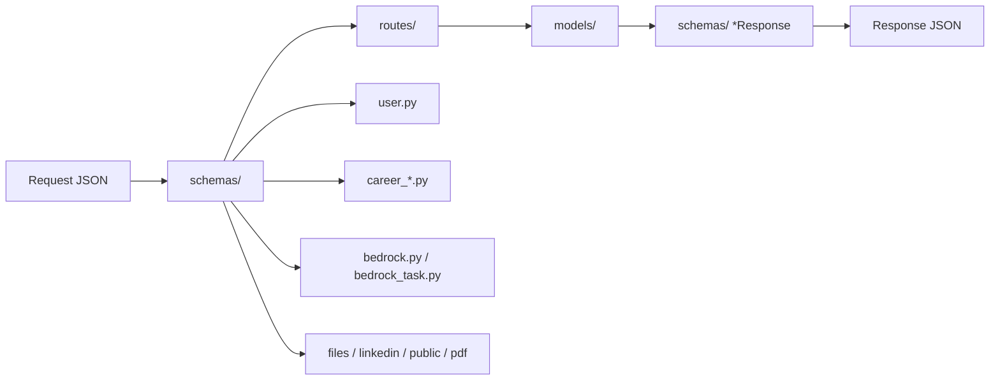

# Paquete `schemas/`

Modelos Pydantic v2 para validar requests y serializar responses. Convención CRUD de carrera: `*Base` (campos editables), `*Create`, `*Update` (todo opcional), `*Response` (añade `id`, `user_id`, timestamps).

`Config.from_attributes = True` en responses para construir desde ORM.

## Arquitectura

---

## Módulos

### `user.py` — Auth y perfil

`UserCreate`, `UserUpdate`, `UserResponse`, `LoginRequest`, `LoginResponse`, `TokenResponse`, `TokenRefreshResponse`, `LogoutResponse`. Email con `EmailStr`; password mín. 8 caracteres.

`__init__.py` reexporta el subconjunto de auth usado en tests.

### `career_identity.py`

Create/Update/Response de los 12 recursos de identidad: differentiators, identity, identity_reflections, competencies, certifications, target_roles, work_history, achievements, star_stories, career_reviews, role_gap_analysis, projects.

### `competencies.py`

Enums y schemas de competencia (tipo, nivel). Solapado con las clases de `career_identity.py`; se mantiene por compatibilidad de imports antiguos.

### `career_search.py`

14 recursos de búsqueda: fit scoring, market segments, narratives, search plans, networking, target companies, vacancies, CVs, cover letters, applications, interviews, etc.

### `career_digital.py`

Publications, LinkedIn/GitHub profile, portal home/about/contact.

### `career_support.py`

`TagCreate` / `TagUpdate` / `TagResponse`.

### `career_metrics.py`

Solo response: `SearchMetricsWeekResponse`, `SearchOverviewResponse`, `FunnelStage` y breakdowns. No hay Create/Update.

### `career_methodologies.py`

CRUD de `OperationalMethodology` (`title`, `section`, `content` Markdown, `agent_profile_ids`).

### `job_discovery.py`

`JobDiscoveryRunRequest/Response`, `ImportUrlRequest`, `SaveListingsRequest/Response`, `JobListingSchema`, estado de proveedores y listings saltados.

### `bedrock.py`

Contrato del harness: `BedrockChatRequest` (SSE), modelos, presupuesto, instrucciones, perfiles, tools custom, memoria, conversaciones, audit log.

### `bedrock_task.py`

CRUD de tareas del agente (`title`, status, notas).

### `pdf_template.py`

Plantillas HTML (`PdfOutputTemplate*`), estilos CSS (`PdfTemplateStyle*`), `PdfTemplateRenderRequest` (variables para preview).

### `file_upload.py`

`FileUploadResponse` (id, categoría, visibilidad, URL, MIME, tamaño).

### `linkedin.py`

`LinkedInStatusResponse`, `LinkedInConnectResponse` (`authorize_url`), `LinkedInPostResponse`.

### `public.py`

Formas ya “aplanadas” para el Portal: cards de proyecto, detalle, blog, CTAs, stats. Listas multilínea del admin llegan como `List[str]`.
