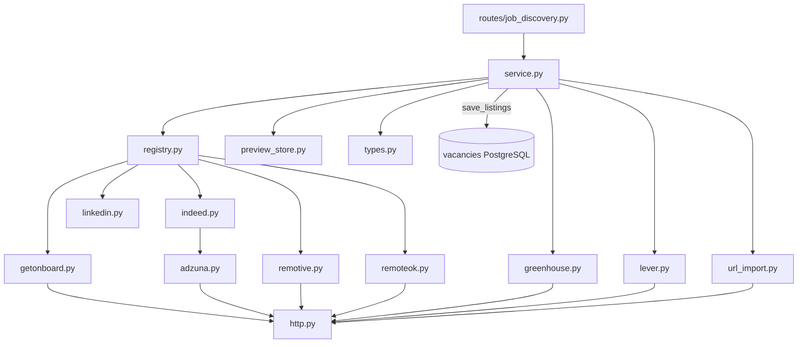

# Paquete `services/job_discovery/`

Búsqueda de vacantes multi-proveedor. Flujo **preview → autorización → save**: `/run` e `/import-url` no escriben `vacancies`; solo `save_listings` crea filas `pending_review` a partir de refs `L1`, `L2`…

**HTTP:** [docs/sections/job-discovery/README.md](../../../docs/sections/job-discovery/README.md)

## Arquitectura

---

## Orquestación

### `__init__.py`

Reexporta `run_discovery`, `save_listings`, `import_vacancy_url`, `listing_to_dict`, `providers`.

### `service.py` — Orquestador

| Función | Comportamiento |
|---------|----------------|
| `run_discovery` | Resuelve query (texto o `target_role_id`), lanza adaptadores en paralelo, opcionalmente boards Greenhouse/Lever de `target_companies`, guarda preview, filtra URLs ya salvadas |
| `save_listings` | Resuelve refs del preview → `Vacancy` (dedupe por URL) |
| `import_vacancy_url` | Reexport de `url_import.import_url` |
| `providers` | Lista estados (`enabled` + razón si está apagado) |
| `listing_to_dict` | DTO → JSON de API |

`DEFAULT_PROVIDERS`: getonboard, indeed, linkedin, remotive, remoteok.

### `registry.py`

`MARKET_ADAPTERS` (Indeed es nombre de producto; Adzuna es el backend interno, no aparece en UI). `adapters_by_id()`, `list_provider_statuses()`.

### `base.py`

Protocolo `JobBoardAdapter`: `id`, `label`, `listing_kind`, `is_enabled()`, `disabled_reason()`, `search(query)`.

### `types.py`

DTOs: `SearchQuery`, `JobListing`, `CompanyBoard`, `ProviderStatus`, `ProviderError`, `DiscoveryResult`.

### `http.py`

Cliente httpx compartido + `User-Agent` (`JOB_DISCOVERY_USER_AGENT`). `JobDiscoveryHttpError` con `status_code`.

### `preview_store.py`

Preview en memoria keyed por `user_id` + `session_key`. TTL con lock. `remember_preview`, `append_preview`, `resolve_refs` (L1…), `reset_for_tests`. No es persistente entre replicas: un solo worker uvicorn.

---

## Adaptadores de mercado

| Módulo | Provider id | Fuente |
|--------|-------------|--------|
| `getonboard.py` | `getonboard` | API pública Get on Board (LATAM tech) |
| `indeed.py` | `indeed` | Fachada: **nunca** llama Indeed.com |
| `adzuna.py` | (interno) | API oficial Adzuna; backend real de Indeed. Requiere `ADZUNA_APP_ID/KEY` |
| `linkedin.py` | `linkedin` | Solo URLs oficiales de búsqueda; **no scrape** ni inventa vacantes |
| `remotive.py` | `remotive` | API pública remote jobs |
| `remoteok.py` | `remoteok` | Feed JSON (User-Agent obligatorio) |

Cada adaptador parsea su payload a `JobListing` (`listings_from_*_payload` testeable sin red).

---

## Boards de empresa e import URL

### `greenhouse.py`

API pública Greenhouse por token de compañía. Lo usa `service.py` cuando `include_company_boards` y el `TargetCompany` tiene board Greenhouse.

### `lever.py`

API pública Lever por slug de sitio. Igual, disparado desde boards de `target_companies`.

### `url_import.py`

Import best-effort de una URL (LinkedIn, Indeed, OCC, …): `infer_source`, Open Graph / `<title>`, `listing_from_html`, `import_url` (GET HTML). El listing entra al preview; save sigue siendo un paso explícito.
