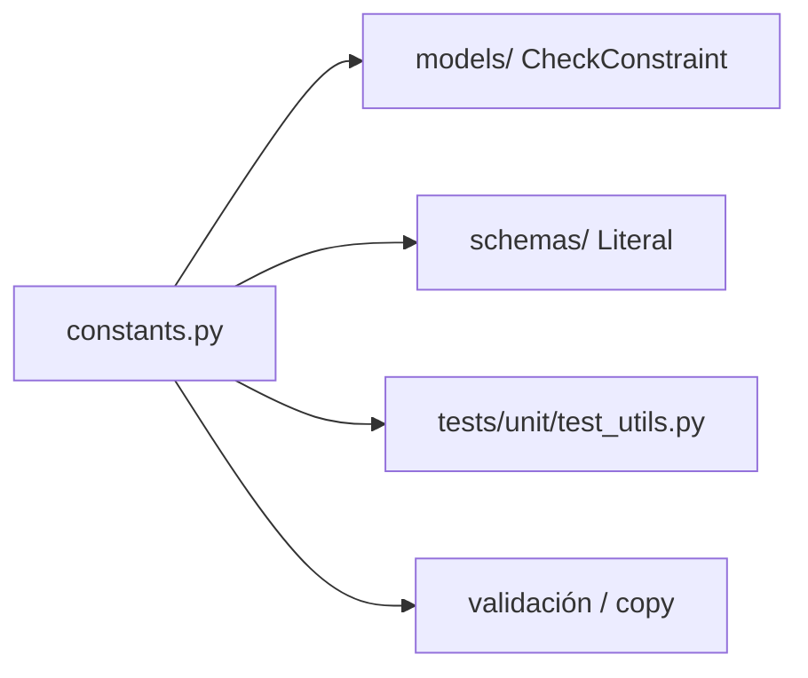

# Paquete `utils/`

Constantes de dominio compartidas por validación, tests y copy. No hay helpers de I/O aquí.

## Arquitectura

---

### `constants.py`

Listas canónicas usadas como referencia (los CheckConstraint de los modelos y los `Literal` de Pydantic deben alinearse con estos valores):

| Grupo | Valores |
|-------|---------|
| Competencias | tipos `técnica` / `transferible` / `negocio`; niveles Beginner→Expert |
| Empleo | full-time, part-time, contract, freelance, internship |
| Entrevistas | tipos (phone, video, technical, …) y rondas (screening → offer) |
| Networking | tipos de relación y estados de contacto |
| Estrategia | statuses de plan; preferencia remote/onsite/hybrid |
| Vacantes | saved, applied, rejected, pending, accepted, archived |
| Errores | códigos (`USER_NOT_FOUND`, …) y `ERROR_MESSAGES` en español |

### `__init__.py`

Marcador de paquete. Importar `from utils.constants import …`.
