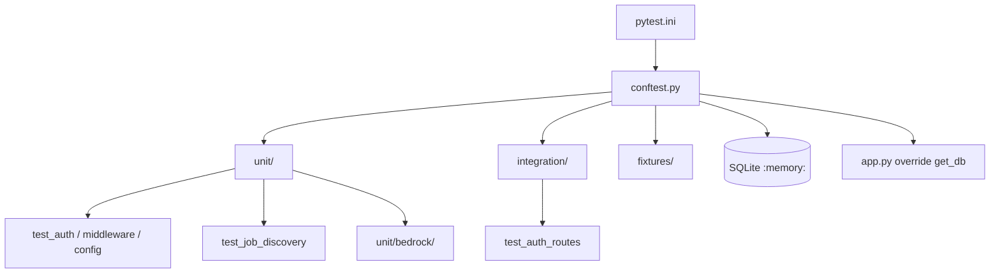

# Tests de la API REST

Pytest async (`asyncio_mode=auto`). Objetivo de cobertura: 80%. Guía de ejecución: [docs/TESTING.md](../docs/TESTING.md).

**Config:** `pytest.ini` en `api/`. `conftest.py` añade `src/` al `sys.path` (imports `from models import …`, igual que la app).

## Arquitectura

---

## `conftest.py` — Fixtures compartidas

| Fixture | Alcance | Función |
|---------|---------|---------|
| `event_loop` | session | Loop asyncio para tests async |
| `test_db` | función | SQLite aiosqlite en memoria + `Base.metadata.create_all` |
| Cliente HTTP | — | `httpx.AsyncClient` / `TestClient` con `get_db` override |
| Usuario | — | User de prueba + tokens via `AuthService` |

---

## Subcarpetas

| Carpeta | README |
|---------|--------|
| `unit/` | [unit/README.md](unit/README.md) — aislamiento, mocks, sin red |
| `unit/bedrock/` | [unit/bedrock/README.md](unit/bedrock/README.md) — harness Converse |
| `integration/` | [integration/README.md](integration/README.md) — rutas HTTP + BD de test |
| `fixtures/` | [fixtures/README.md](fixtures/README.md) — paquete reservado (fixtures viven en conftest) |

`__init__.py` en tests, unit e integration marca paquetes pytest.
