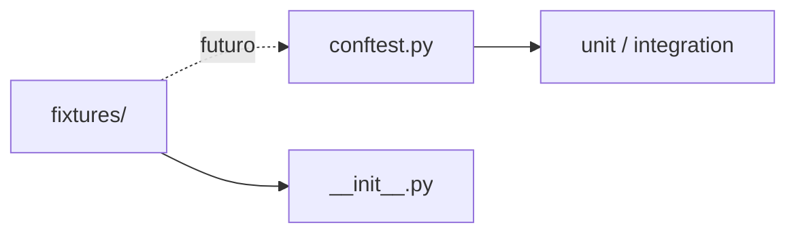

# `tests/fixtures/`

Paquete reservado para factories/datos de prueba reutilizables.

## Arquitectura

Hoy las fixtures viven en [`../conftest.py`](../conftest.py) (`test_db`, usuario, cliente HTTP). `__init__.py` solo marca el directorio como paquete.

Si se extraen builders (p. ej. `make_vacancy()`, JSON de Adzuna), van aquí y se importan desde conftest o tests.
