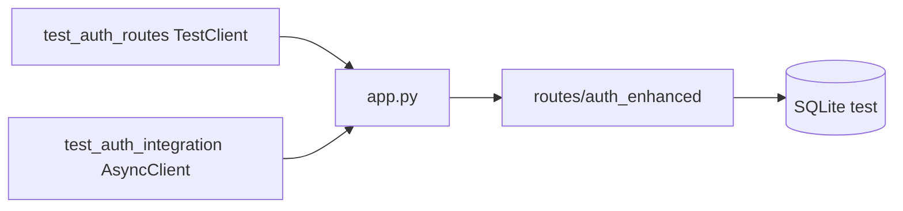

# Tests de integración (`tests/integration/`)

Ejercitan routers FastAPI con override de `get_db` (SQLite en memoria o sesión de fixture). Cubren el contrato HTTP, no mocks de handlers.

## Arquitectura

---

### `test_auth_routes.py`

`TestClient` contra `POST /auth/register`, `/login`, `/refresh`, `/logout`. Comprueba tokens, 401 con credenciales malas y que `/auth/me` exige Bearer.

### `test_auth_integration.py`

Misma superficie con `httpx.AsyncClient` (ASGITransport): flujo async register → login → refresh alineado con el resto de fixtures async de `conftest.py`.
