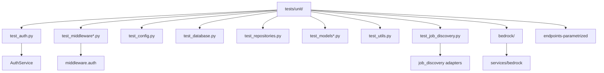

# Tests unitarios (`tests/unit/`)

Prueban módulos aislados (services, middleware, models, config). No requieren PostgreSQL ni AWS.

## Arquitectura

---

## Módulos

### `test_auth.py`

Hash bcrypt, verify, access/refresh JWT, rechazo de token mal firmado o de tipo incorrecto (`AuthService`).

### `test_middleware.py`

`get_current_user` / `get_optional_current_user`: 401 sin token, usuario inactivo, `sub` ausente; happy path con mock de sesión.

### `test_middleware_extended.py`

Casos extra de JWT y excepciones de auth (incluye fallback si `utils.exceptions` no existe).

### `test_config.py`

Validación de `Settings`: campos obligatorios (`DATABASE_URL`, `SECRET_KEY` ≥ 32, MinIO), defaults, `ValidationError`.

### `test_database.py`

Engine, `get_db` commit/rollback, `init_db` / `close_db` (SQLite o mocks).

### `test_repositories.py`

`UserRepository`: get_by_username/email, `user_exists`, CRUD básico sobre la sesión de test.

### `test_models.py` / `test_models_extended.py`

Constraints y campos de User, Identity, Competency y modelos de carrera/sistema. `test_models_extended` cubre más entidades (RefreshToken, FileUpload, AuditLog, etc.). Algunos nombres (`Evidence`, `JobStrategy`) reflejan el esquema v1; si el import falla, el archivo está desfasado respecto al ORM v2.

### `test_utils.py`

Listas de `utils.constants` (tipos de competencia, entrevistas, etc.).

### `test_job_discovery.py`

Parseo de payloads Adzuna/Getonboard/Greenhouse/Lever/Remotive/RemoteOK, URLs de LinkedIn (sin scrape), `IndeedAdapter.is_enabled` según credenciales Adzuna, preview_store refs. Mocks httpx; no pega a APIs reales.

### `endpoints-parametrized.test.py`

Tabla método×path de smoke. Las rutas listadas (`/api/v1/...`) no coinciden con los prefijos actuales (`/auth`, `/career`, `/health`); tratarlo como pendiente de alinear.

Bedrock: [bedrock/README.md](bedrock/README.md).
