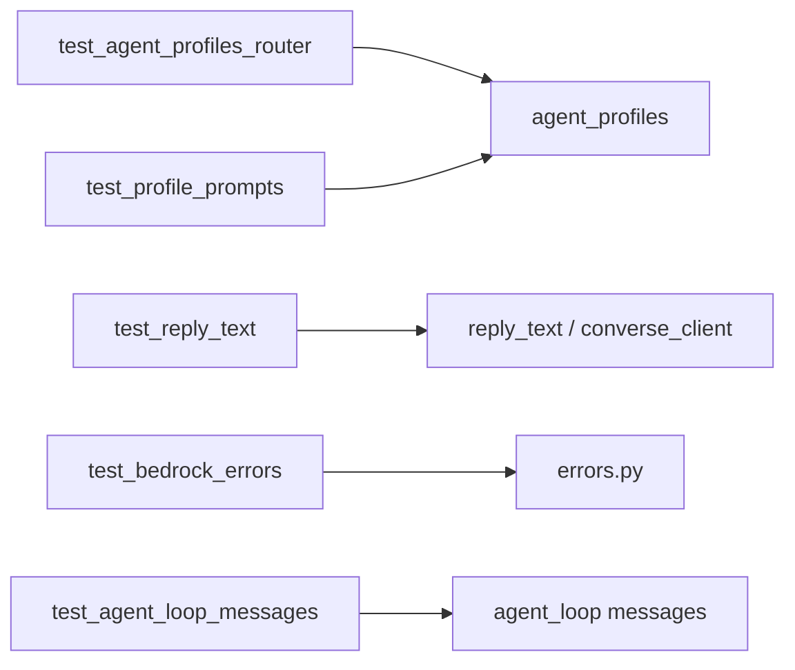

# Tests unitarios del harness Bedrock (`tests/unit/bedrock/`)

Cubren `services/bedrock/` sin invocar AWS. Documentación del paquete: [src/services/bedrock/README.md](../../../src/services/bedrock/README.md).

## Arquitectura

---

### `test_agent_profiles_router.py`

`resolve_agent_profile` por ruta/recurso (p. ej. `/linkedin` → perfil digital) y `converse_tool_specs` filtrado por perfil.

### `test_profile_prompts.py`

Todo perfil tiene `system_prompt_suffix` no vacío; `get_profile` round-trip por id.

### `test_reply_text.py`

`sanitize_assistant_reply` elimina `<thinking>` y deja la respuesta visible. `parse_converse_response` no mezcla `reasoningContent` en el texto.

### `test_bedrock_errors.py`

`format_bedrock_client_error`: AccessDenied (IAM), ValidationException (historial debe empezar en user), ResourceNotFound (modelo).

### `test_agent_loop_messages.py`

Regresión: las vueltas tool-use hacen `messages.extend` (no reemplazan). Si se reemplazaba, Nova rechazaba la conversación por no empezar en user.
