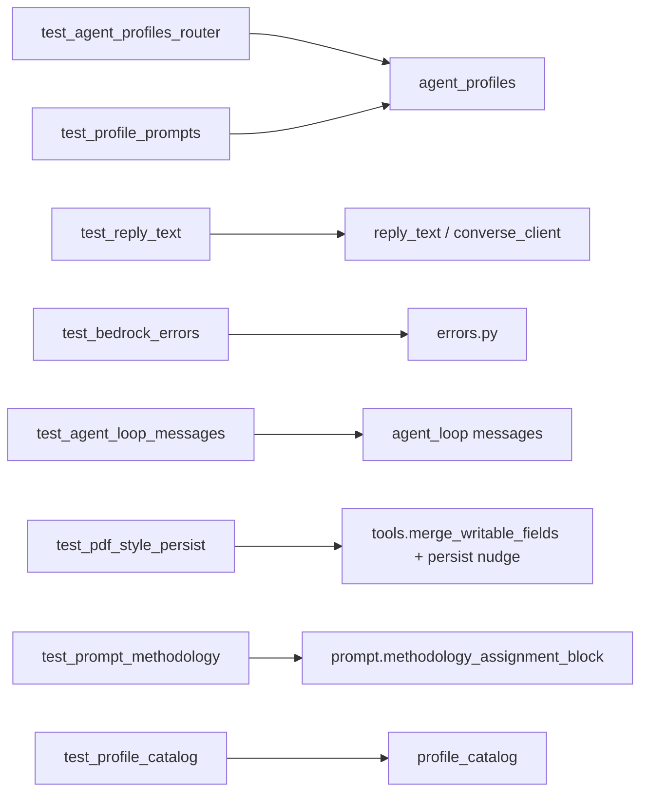

# Tests unitarios del harness Bedrock (`tests/unit/bedrock/`)

Cubren `services/bedrock/` sin invocar AWS. Documentación del paquete: [src/services/bedrock/README.md](../../../src/services/bedrock/README.md).

## Arquitectura

---

### `test_agent_profiles_router.py`

`resolve_agent_profile` por ruta/recurso, jerarquía L1/L2/L3, `agent_pdf_design` vs `agent_pdf_render`, L3 `agent_web_search` / `agent_github`, y `history_manager` con `agent_profile_id`.

### `test_profile_prompts.py`

Todo perfil tiene `system_prompt_suffix` no vacío; `get_profile` round-trip por id.

### `test_reply_text.py`

`sanitize_assistant_reply` elimina `<thinking>` y deja la respuesta visible. `parse_converse_response` no mezcla `reasoningContent` en el texto.

### `test_bedrock_errors.py`

`format_bedrock_client_error`: AccessDenied (IAM), ValidationException (historial debe empezar en user), ResourceNotFound (modelo).

### `test_pdf_style_persist.py`

`merge_writable_fields` acepta `style_guide` en el nivel superior (no solo en `fields`). `should_nudge_persist` reintenta persistir si un L2 (PDF o metodologías) redacta o anuncia un write en el chat sin `update`. Un "ok" no basta; "procede" o "Ahora actualizo opm-N" sí.

### `test_prompt_methodology.py`

Cada perfil recibe la regla «solo las metodologías asignadas a ti». El catálogo (`opm-N`) se inyecta en `compose_system_prompt` desde `agent_profile_ids`; no se hardcodea la sección. `search_knowledge_base` describe el filtro por caller. Las notas de memoria L1/L2 también entran al prompt.

### `test_profile_catalog.py`

Tools resueltas y campos de definición (tablas, `has_own_memory`) para el catálogo Admin.

### `test_agent_loop_messages.py`

Regresión: las vueltas tool-use hacen `messages.extend` (no reemplazan). Si se reemplazaba, Nova rechazaba la conversación por no empezar en user.
