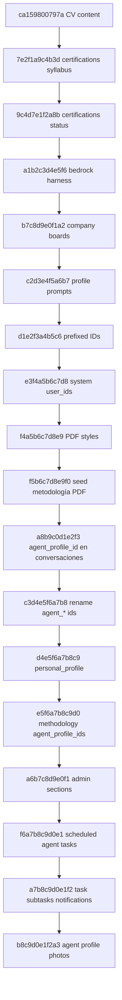

# Revisiones Alembic (`alembic/versions/`)

Cadena lineal (head actual: `b8c9d0e1f2a3`).

## Arquitectura



```
ca159800797a
    → 7e2f1a9c4b3d
    → 9c4d7e1f2a8b
    → a1b2c3d4e5f6
    → b7c8d9e0f1a2
    → c2d3e4f5a6b7
    → d1e2f3a4b5c6
    → e3f4a5b6c7d8
    → f4a5b6c7d8e9
    → f5b6c7d8e9f0
    → a8b9c0d1e2f3
    → c3d4e5f6a7b8
    → d4e5f6a7b8c9
    → e5f6a7b8c9d0
    → a6b7c8d9e0f1
    → f6a7b8c9d0e1
    → a7b8c9d0e1f2
    → b8c9d0e1f2a3
```

---

| Archivo | Revisión | Qué hace |
|---------|----------|----------|
| `ca159800797a_consolidate_cv_version_content.py` | raíz | Une 4 campos rígidos de CV en un Markdown `content` |
| `7e2f1a9c4b3d_add_syllabus_and_document_url_to_certifications.py` | | `syllabus` Markdown + `document_url` en certificaciones |
| `9c4d7e1f2a8b_add_status_to_certifications.py` | | Columna `status` en certificaciones |
| `a1b2c3d4e5f6_bedrock_local_harness.py` | | Harness local: settings extendidos, `session_type`, round logs, tablas PDF |
| `b7c8d9e0f1a2_job_discovery_target_company_boards.py` | | Campos de career board (Greenhouse/Lever) en `target_companies` |
| `c2d3e4f5a6b7_bedrock_agent_profile_prompts.py` | | Tabla `bedrock_agent_profile_prompts` (suffix por perfil) |
| `d1e2f3a4b5c6_prefixed_ids_and_notes.py` | | IDs string prefijados en tablas de negocio + campo `notes` |
| `e3f4a5b6c7d8_fix_system_table_user_ids.py` | | Ajusta `user_id` en tablas de sistema/telemetría tras el cambio de `users.id` |
| `f4a5b6c7d8e9_pdf_template_styles.py` | | `pdf_template_styles` + FK `style_id` en plantillas |
| `f5b6c7d8e9f0_seed_pdf_design_methodology.py` | | Seed de metodología operativa «Plantillas PDF y estilos CSS» |
| `a8b9c0d1e2f3_conversation_agent_profile.py` | | `agent_profile_id` en `bedrock_conversations` (historial por especialista) |
| `c3d4e5f6a7b8_rename_agent_profile_ids.py` | | Ids de agente a `agent_<name>` (L1/L2 label EN, L3 id previo) |
| `d4e5f6a7b8c9_personal_profile.py` | | Ficha singleton `personal_profile` (datos biográficos) |
| `e5f6a7b8c9d0_methodology_agent_profile_ids.py` | | `agent_profile_ids` en metodologías operativas |
| `a6b7c8d9e0f1_admin_sections_and_delegation.py` | | Overrides de secciones Admin + destinos de delegación |
| `f6a7b8c9d0e1_scheduled_agent_tasks.py` | | Asignación y `scheduled_at` en `bedrock_tasks` (ADR-015) |
| `a7b8c9d0e1f2_task_subtasks_notifications.py` | | Subtareas, orquestación y `user_notifications` (ADR-016) |
| `b8c9d0e1f2a3_agent_profile_photos.py` | head | Foto de agente del catálogo (URL del bucket) |

Cada archivo define `upgrade()` / `downgrade()`. No editar revisiones ya aplicadas en producción; crear una nueva.
