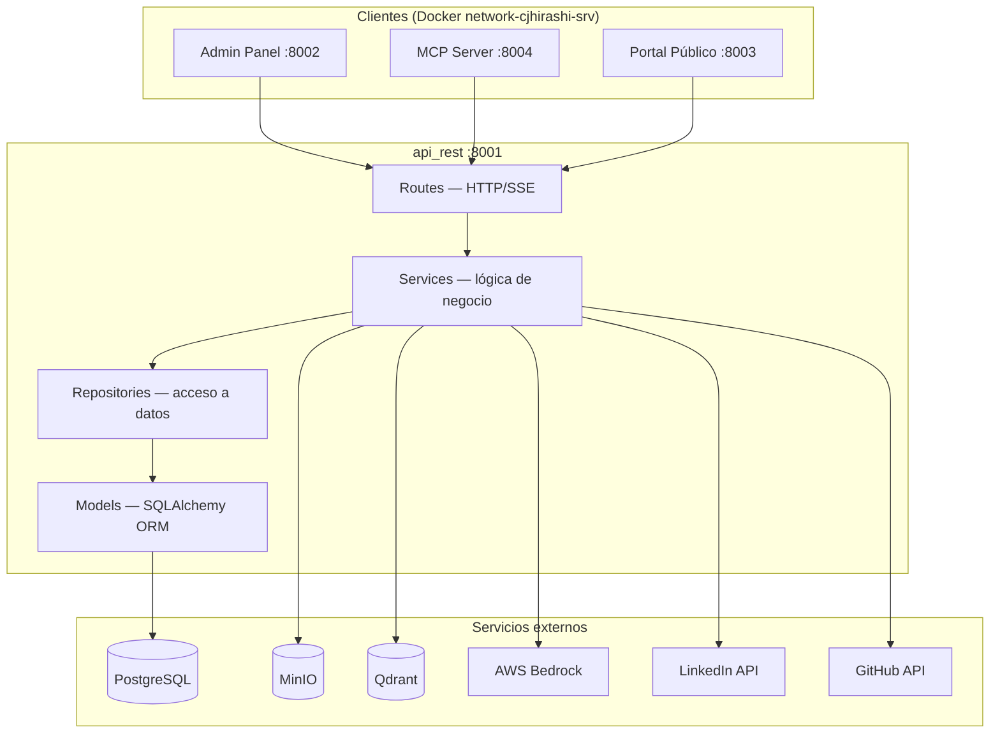
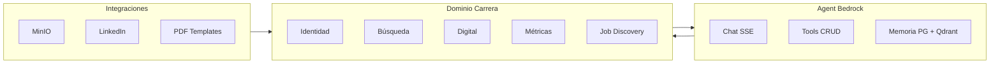
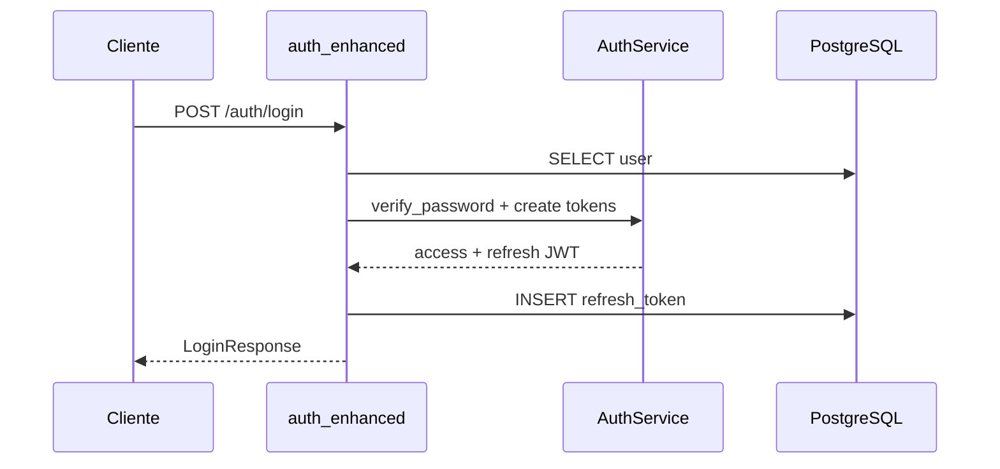
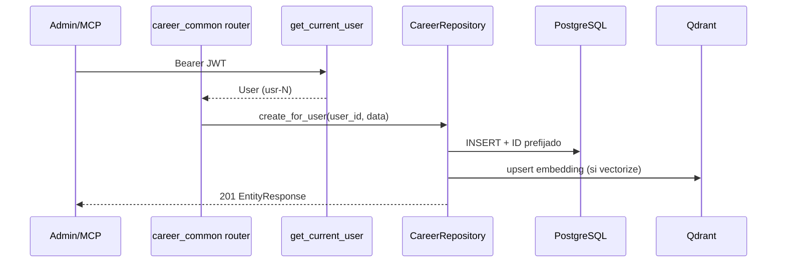
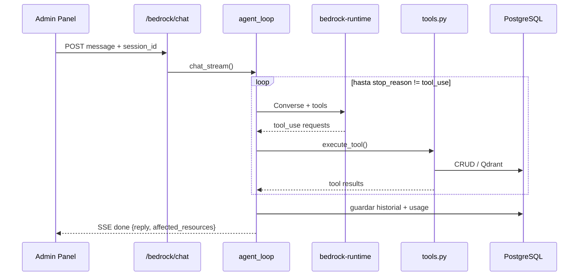

# API REST — Guía de arquitectura

**Ubicación:** `api/docs/ARCHITECTURE.md`

**Última actualización:** 2026-08-24

Arquitectura en capas de la API REST de cjhirashi-career: FastAPI + SQLAlchemy 2.0 async + PostgreSQL, con integraciones Bedrock, MinIO, Qdrant y LinkedIn.

---

## Tabla de contenidos

- [Visión general](#visión-general)
- [Arquitectura en capas](#arquitectura-en-capas)
- [Consumidores y red](#consumidores-y-red)
- [Componentes principales](#componentes-principales)
- [Dominios funcionales](#dominios-funcionales)
- [Flujos de datos](#flujos-de-datos)
- [Servicios externos](#servicios-externos)
- [Principios de diseño](#principios-de-diseño)
- [Manejo de errores](#manejo-de-errores)
- [Testing](#testing)
- [Escalabilidad](#escalabilidad)
- [Documentación relacionada](#documentación-relacionada)

---

## Visión general

La API es el **único escritor** de PostgreSQL en el ecosistema. Centraliza:

- Autenticación JWT (access + refresh)
- CRUD de 37 recursos de carrera profesional
- Agent Bedrock (Harness local Converse API)
- Job discovery multi-proveedor
- Archivos (MinIO), LinkedIn OAuth, plantillas PDF
- Endpoints públicos read-only para el Portal

**Stack:** FastAPI 0.104 · SQLAlchemy 2.0 async · asyncpg · Pydantic v2 · Alembic · boto3 (Bedrock) · Qdrant client

**Estado:** implementación avanzada — 14 routers registrados en `src/app.py`, ~50 modelos ORM, 8 migraciones Alembic.

---

## Arquitectura en capas



| Capa | Responsabilidad | Ejemplos |
|------|-----------------|----------|
| **Routes** | HTTP, validación Pydantic, auth deps, SSE | `routes/bedrock.py`, `routes/career_identity.py` |
| **Services** | Reglas de negocio, integraciones externas | `bedrock/agent_loop.py`, `job_discovery/`, `linkedin_service.py` |
| **Repositories** | Queries SQLAlchemy, aislamiento por user | `career_repository.py`, `user_repository.py` |
| **Models** | Esquema ORM, relaciones | `models/vacancy.py`, `models/bedrock_conversation.py` |

---

## Consumidores y red

```
Internet → Caddy/Cloudflare → Admin (8002) / Portal (8003) / MCP (8004)
                                    ↓              ↓              ↓
                              api_rest:8001 (solo red interna Docker)
```

| Cliente | Auth | Endpoints típicos |
|---------|------|-------------------|
| Admin Panel | JWT | `/auth`, `/career/*`, `/bedrock`, `/files`, `/linkedin` |
| Portal Público | Ninguna | `/public/*` |
| MCP Server | JWT | `/career/*`, `/bedrock` (según tools MCP) |

---

## Componentes principales

### `src/app.py`

- Lifespan: `init_db()`, MinIO bucket, schedulers LinkedIn y tareas de agentes
- CORS, exception handlers globales
- Registra 14 routers (ver [API.md](./API.md))
- Health check `/health`

### `src/config.py`

`pydantic_settings.BaseSettings` — JWT, PostgreSQL, Bedrock, MinIO, Qdrant, LinkedIn, CORS, portal público.

### `src/database.py`

Engine async, `AsyncSessionLocal`, `get_db()` dependency, `init_db()` / `close_db()`.

### `src/routes/`

| Archivo | Dominio |
|---------|---------|
| `auth_enhanced.py` | Autenticación JWT + refresh |
| `career_common.py` | Factory CRUD + `RESOURCE_REGISTRY` |
| `career_identity.py` | 12 recursos identidad |
| `career_search.py` | 14 recursos búsqueda + PDF CV |
| `career_digital.py` | 6 recursos presencia digital |
| `career_support.py` | Tags |
| `career_metrics.py` | Métricas agregadas |
| `career_methodologies.py` | Metodologías operativas |
| `job_discovery.py` | Búsqueda multi-proveedor |
| `bedrock.py` | Agent Bedrock (SSE) |
| `bedrock_tasks.py` | Tareas del agente |
| `pdf_templates.py` | Plantillas HTML (`pdf_template`) |
| `pdf_template_styles.py` | Estilos CSS (`pdf_style`) |
| `files.py` | Upload MinIO |
| `linkedin.py` | OAuth + posts |
| `public.py` | Portal read-only |

Documentación por sección: [sections/README.md](./sections/README.md)

### `src/services/`

| Paquete / módulo | Rol |
|------------------|-----|
| `auth_service.py` | Hash bcrypt, JWT access/refresh |
| `bedrock/` | Harness local: loop Converse, tools, memoria, presupuesto |
| `bedrock_service.py` | Fachada + CRUD tools del agente |
| `job_discovery/` | Proveedores Indeed, LinkedIn, Remotive, etc. |
| `storage_service.py` | MinIO upload/presigned URLs |
| `linkedin_service.py` | OAuth + publicación LinkedIn |
| `qdrant_service.py` | Indexación y búsqueda vectorial |
| `pdf_service.py` | Generación PDF |
| `id_generator.py` | IDs prefijados (`ach-17`, `usr-1`) |

### `src/repositories/`

- `career_repository.py` — CRUD genérico con aislamiento `user_id`, indexación Qdrant
- `user_repository.py` — queries de usuario

### `src/middleware/auth.py`

`get_current_user` — decodifica JWT, extrae `sub` (ID prefijado `usr-N`), carga `User`.

### `src/schemas/`

Pydantic v2 por dominio: `user`, `career_identity`, `career_search`, `career_digital`, `bedrock`, `job_discovery`, `public`, etc.

### `src/models/`

~50 modelos ORM. Import centralizado en `models/__init__.py`. Ver [DATABASE.md](./DATABASE.md).

---

## Dominios funcionales



---

## Flujos de datos

### Login con refresh token



### CRUD de carrera (factory)



### Chat Bedrock (SSE)



---

## Servicios externos

| Servicio | Uso en API | Config |
|----------|------------|--------|
| PostgreSQL | Persistencia única | `DATABASE_URL` |
| MinIO | Archivos, imágenes IA | `MINIO_*` |
| Qdrant | Knowledge base Bedrock | `QDRANT_*` |
| AWS Bedrock | Converse, Embeddings, Titan Image | `AWS_*`, `BEDROCK_*` |
| LinkedIn API | OAuth, posts | `LINKEDIN_*` |
| GitHub API | Repos públicos | Sin key (API pública) |

---

## Principios de diseño

**Single Responsibility:** cada router/service por dominio; `CareerRepository` solo acceso a datos de carrera.

**Open/Closed:** `build_crud_router()` extiende CRUD sin modificar el factory.

**Dependency Inversion:** routes dependen de `Depends(get_db)`, `Depends(get_current_user)`, servicios inyectables.

**DRY:** un repositorio y un registry (`RESOURCE_REGISTRY`) para ~37 recursos; Bedrock tools reutilizan el mismo CRUD que el Admin.

**Aislamiento multi-tenant:** `user_id` siempre del JWT, nunca del request body.

---

## Manejo de errores

| Nivel | Comportamiento |
|-------|----------------|
| Route | `HTTPException` (401, 404, 422, 502, 503) |
| Service | `BedrockError`, `ValueError` → convertidos en route |
| App global | `RequestValidationError` → 422 con detalle de campos |
| App global | `Exception` no capturada → 500 + log stacktrace |

Bedrock chat usa SSE event `type: error` además de códigos HTTP en fallos previos al stream.

---

## Testing

Estructura en `api/tests/`:

| Carpeta | Alcance |
|---------|---------|
| `unit/` | Services, middleware, bedrock, job_discovery |
| `integration/` | Auth routes, flujos HTTP |
| `conftest.py` | Fixtures async, DB test |

Ver [TESTING.md](./TESTING.md).

---

## Escalabilidad

**Implementado:**
- App stateless (JWT, sin sesión en memoria)
- Async end-to-end
- Connection pool (`pool_size=10`, `max_overflow=20`)
- Paginación en listados CRUD
- Presupuesto diario Bedrock por usuario

**No implementado:**
- Cache Redis
- Cola de mensajes (Celery/RQ)
- Réplicas read PostgreSQL
- Versionado API (`/v1`)

---

## Documentación relacionada

| Documento | Ubicación | Contenido |
|-----------|-----------|-----------|
| README API | [../README.md](../README.md) | Overview y mapa de secciones |
| Secciones | [sections/README.md](./sections/README.md) | README detallado por dominio |
| Endpoints | [API.md](./API.md) | Referencia rápida |
| Base de datos | [DATABASE.md](./DATABASE.md) | Esquema PostgreSQL |
| Seguridad | [SECURITY.md](./SECURITY.md) | JWT, CORS, OWASP |
| Bedrock IAM | [BEDROCK-HARNESS.md](./BEDROCK-HARNESS.md) | Permisos AWS |
| Setup | [SETUP.md](./SETUP.md) | Instalación y Docker |

---

**Relacionado:** [DATABASE.md](./DATABASE.md) · [SECURITY.md](./SECURITY.md) · [API.md](./API.md)
