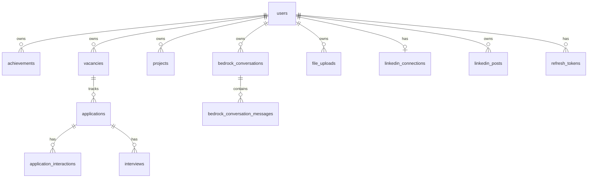

# API REST — Esquema de base de datos

**Ubicación:** `api/docs/DATABASE.md`

**Última actualización:** 2026-08-24

Esquema PostgreSQL de cjhirashi-career: gestión de carrera, Agent Bedrock, integraciones y analítica.


---

## Tabla de contenidos

- [Fuente de verdad del esquema](#fuente-de-verdad-del-esquema)
- [IDs prefijados](#ids-prefijados)
- [Diagrama por dominios](#diagrama-por-domínios)
- [Dominio: usuarios y auth](#dominio-usuarios-y-auth)
- [Dominio: carrera — identidad](#dominio-carrera--identidad)
- [Dominio: carrera — búsqueda](#dominio-carrera--búsqueda)
- [Dominio: carrera — presencia digital](#dominio-carrera--presencia-digital)
- [Dominio: soporte y metodologías](#dominio-soporte-y-metodologías)
- [Dominio: Agent Bedrock](#dominio-agent-bedrock)
- [Dominio: LinkedIn](#dominio-linkedin)
- [Dominio: archivos y analítica](#dominio-archivos-y-analítica)
- [Vistas SQL](#vistas-sql)
- [Migraciones Alembic](#migraciones-alembic)
- [Qdrant (externo)](#qdrant-externo)
- [Consultas útiles](#consultas-útiles)
- [Backups](#backups)

---

## Fuente de verdad del esquema

| Mecanismo | Rol actual |
|-----------|------------|
| **Modelos SQLAlchemy** (`src/models/*.py`) | Diseño canónico de tablas y columnas |
| **Alembic** (`alembic/versions/*.py`) | **Fuente de verdad para despliegues** — aplicar con `alembic upgrade head` |
| **`init_db()`** (`create_all`) | Fallback en startup; no altera tablas existentes |
| **`init.sql`** (legado) | Prototipo antiguo (`users` + `documents`); **no usar en instalaciones nuevas** |

**Recomendación:** usar solo Alembic en entornos nuevos. El archivo legado `api/init.sql` puede coexistir en volúmenes Docker antiguos pero no refleja el esquema actual.

Modelos importados vía cadena de routers → `models/__init__.py` registra todas las tablas en `Base.metadata`.

---

## IDs prefijados

Todas las tablas de carrera y usuarios usan **VARCHAR(20)** como PK con formato `{prefijo}-{n}`.

**Fuente:** `src/services/id_generator.py` — secuencias PostgreSQL `{prefijo}_id_seq` + listener `before_insert`.

| Prefijo | Tabla | Ejemplo |
|---------|-------|---------|
| `usr` | users | `usr-1` |
| `ach` | achievements | `ach-17` |
| `vac` | vacancies | `vac-5` |
| `cmp` | competencies | `cmp-42` |
| `cvv` | cv_versions | `cvv-3` |
| `pdt` | pdf_output_templates | `pdt-1` |
| `bco` | bedrock_conversations | `bco-12` |
| `lnp` | linkedin_posts | `lnp-3` |
| … | (ver `TABLE_PREFIXES` en código) | |

**FK `user_id`:** VARCHAR(20) referenciando `users(id)` con `ON DELETE CASCADE` en tablas de carrera y telemetría.

Migración relevante: `d1e2f3a4b5c6_prefixed_ids_and_notes.py`, `e3f4a5b6c7d8_fix_system_table_user_ids.py`.

---

## Diagrama por dominios



Todas las entidades de carrera cuelgan de `users` con aislamiento estricto por `user_id`.

---

## Dominio: usuarios y auth

Documentación API: [sections/auth/README.md](./sections/auth/README.md)

### `users`

| Columna | Tipo | Notas |
|---------|------|-------|
| `id` | VARCHAR(20) PK | Prefijo `usr-` |
| `username`, `email` | VARCHAR UNIQUE | Login |
| `password_hash` | VARCHAR | bcrypt |
| `full_name`, `phone`, `country`, `professional_title` | VARCHAR | Perfil |
| `photo_url` | VARCHAR | URL avatar |
| `is_active`, `is_verified` | BOOLEAN | Estado |
| `created_at`, `updated_at`, `last_login` | TIMESTAMPTZ | Auditoría |

**Modelo:** `src/models/user.py`

### `refresh_tokens`

Tokens de refresh JWT rotativos. FK → `users(id)`.

**Modelo:** `src/models/refresh_token.py`

### `user_sessions`

Sesiones por dispositivo (tracking). FK → `users(id)`.

**Modelo:** `src/models/user_session.py`

---

## Dominio: carrera — identidad

Documentación API: [sections/career-identity/README.md](./sections/career-identity/README.md)

| Tabla | Modelo | Prefijo |
|-------|--------|---------|
| `personal_profile` | `PersonalProfile` | `psp` |
| `differentiators` | `Differentiator` | `dif` |
| `identity` | `Identity` | `idn` |
| `identity_reflections` | `IdentityReflection` | `idr` |
| `competencies` | `Competency` | `cmp` |
| `certifications` | `Certification` | `crt` |
| `target_roles` | `TargetRole` | `trl` |
| `work_history` | `WorkHistory` | `wkh` |
| `achievements` | `Achievement` | `ach` |
| `star_stories` | `StarStory` | `sts` |
| `career_reviews` | `CareerReview` | `crv` |
| `role_gap_analysis` | `RoleGapAnalysis` | `rga` |
| `projects` | `Project` | `prj` |

Campos comunes: `user_id`, `notes` (texto libre añadido en migración prefijada), timestamps, columnas específicas por entidad.

---

## Dominio: carrera — búsqueda

Documentación API: [sections/career-search/README.md](./sections/career-search/README.md)

| Tabla | Modelo | Prefijo |
|-------|--------|---------|
| `fit_scoring_factors` | `FitScoringFactor` | `fsf` |
| `market_segments` | `MarketSegment` | `mks` |
| `role_narratives` | `RoleNarrative` | `rna` |
| `search_plans` | `SearchPlan` | `spl` |
| `networking_contacts` | `NetworkingContact` | `nwc` |
| `target_companies` | `TargetCompany` | `tco` |
| `vacancies` | `Vacancy` | `vac` |
| `cv_versions` | `CVVersion` | `cvv` |
| `cover_letter_versions` | `CoverLetterVersion` | `clv` |
| `applications` | `Application` | `apl` |
| `application_interactions` | `ApplicationInteraction` | `ain` |
| `interviews` | `Interview` | `ivw` |
| `contact_interactions` | `ContactInteraction` | `cni` |
| `networking_activities` | `NetworkingActivity` | `nwa` |

**Nota:** `cv_versions` tiene `vectorize=False` — no se indexa en Qdrant (contenido leído directo de PG).

**Job discovery** no persiste en tablas propias; el preview vive en memoria (`preview_store`) hasta `POST /save` crea filas en `vacancies`.

---

## Dominio: carrera — presencia digital

Documentación API: [sections/career-digital/README.md](./sections/career-digital/README.md)

| Tabla | Modelo | Prefijo |
|-------|--------|---------|
| `publications` | `Publication` | `pub` |
| `linkedin_profile` | `LinkedInProfile` | `lnr` |
| `github_profile` | `GitHubProfile` | `ghp` |
| `portal_home` | `PortalHome` | `phm` |
| `portal_about` | `PortalAbout` | `pab` |
| `portal_contact` | `PortalContact` | `pco` |

Alimentan endpoints `/public/*` filtrados por `PUBLIC_PORTAL_USER_ID`.

---

## Dominio: soporte y metodologías

| Tabla | Modelo | Prefijo | API |
|-------|--------|---------|-----|
| `tags` | `Tag` | `tag` | [career-support](./sections/career-support/README.md) |
| `operational_methodologies` | `OperationalMethodology` | `opm` | [career-methodologies](./sections/career-methodologies/README.md) |

Metodologías se indexan en Qdrant para `search_knowledge_base` del agente.

---

## Dominio: Agent Bedrock

Documentación API: [sections/bedrock/README.md](./sections/bedrock/README.md)

| Tabla | Modelo | Propósito |
|-------|--------|-----------|
| `bedrock_settings` | `BedrockSettings` | Modelo activo, presupuesto, límites runtime |
| `bedrock_conversations` | `BedrockConversation` | Sesiones de chat (`session_type` + `agent_profile_id` por especialista) |
| `bedrock_conversation_messages` | `BedrockConversationMessage` | Historial user/assistant |
| `bedrock_usage_logs` | `BedrockUsageLog` | Tokens y costo por turno |
| `bedrock_usage_round_logs` | `BedrockUsageRoundLog` | Tokens por ronda Converse dentro de un turno |
| `bedrock_agent_profile_prompts` | `BedrockAgentProfilePrompt` | Suffix de prompt por perfil (override PG) |
| `bedrock_custom_tools` | `BedrockCustomTool` | Servidores MCP remotos registrados |
| `bedrock_tasks` | `BedrockTask` | Tablero de tareas (usuario o agente; scheduler autónomo) |
| `pdf_output_templates` | `PdfOutputTemplate` | Plantillas HTML para PDF |

Migración harness local: `a1b2c3d4e5f6_bedrock_local_harness.py`

---

## Dominio: LinkedIn

Documentación API: [sections/linkedin/README.md](./sections/linkedin/README.md)

| Tabla | Modelo | Propósito |
|-------|--------|-----------|
| `linkedin_connections` | `LinkedInConnection` | Tokens OAuth, expiry |
| `linkedin_posts` | `LinkedInPost` | Cola publicados/programados |

---

## Dominio: archivos y analítica

| Tabla | Modelo | Propósito |
|-------|--------|-----------|
| `file_uploads` | `FileUpload` | Metadatos MinIO (path, mime, category, is_public) |
| `audit_logs` | `AuditLog` | Cambios del agente (old/new values JSON) |
| `events` | `Event` | Tracking de actividad (18 tipos) |
| `metrics` | `Metrics` | Métricas precomputadas por usuario |

**Nota:** la tabla legacy `documents` (JSONB CV/cartas del prototipo MCP Tools) **ya no tiene router activo** — el contenido de CV migró a `cv_versions` y plantillas PDF.

---

## Vistas SQL

| Vista | Uso |
|-------|-----|
| `search_metrics_view` | `GET /career/metrics/weekly` |

Definida en migraciones o scripts SQL; agrega métricas semanales de búsqueda.

---

## Migraciones Alembic

**Directorio:** `api/alembic/versions/`

| Revisión | Descripción |
|----------|-------------|
| `ca159800797a` | Consolidación contenido CV |
| `7e2f1a9c4b3d` | Syllabus y document_url en certifications |
| `9c4d7e1f2a8b` | Status en certifications |
| `a1b2c3d4e5f6` | Bedrock harness local (tablas + columnas) |
| `b7c8d9e0f1a2` | Job discovery + company boards |
| `c2d3e4f5a6b7` | Bedrock agent profile prompts |
| `d1e2f3a4b5c6` | IDs prefijados + campo notes |
| `e3f4a5b6c7d8` | Fix user_id en tablas telemetría |
| `c3d4e5f6a7b8` | Rename agent profile ids |
| `d4e5f6a7b8c9` | Ficha `personal_profile` (datos personales singleton) |
| `e5f6a7b8c9d0` | `agent_profile_ids` en `operational_methodologies` |

```bash
cd api/
alembic upgrade head          # aplicar todas
alembic current               # ver revisión activa
alembic revision --autogenerate -m "descripción"  # nueva migración
```

En Docker:

```bash
docker exec cjhirashi-career-api alembic upgrade head
```

---

## Qdrant (externo)

No es PostgreSQL — colección vectorial separada para:

- Registros de carrera indexados (`CareerRepository._index_for_search`)
- Metodologías operativas
- Memoria manual del agente (`POST /bedrock/memory/manual`)

Config: `QDRANT_HOST`, `QDRANT_PORT`, `QDRANT_COLLECTION` en `.env`.

Embeddings: Titan via `bedrock_service.embed_text()`.

---

## Consultas útiles

```sql
-- Usuario y conteo de vacantes
SELECT u.id, u.username, COUNT(v.id) AS vacancies
FROM users u
LEFT JOIN vacancies v ON v.user_id = u.id
GROUP BY u.id, u.username;

-- Gasto Bedrock hoy (UTC)
SELECT SUM(estimated_cost_usd) AS spent_usd
FROM bedrock_usage_logs
WHERE user_id = 'usr-1'
  AND created_at >= date_trunc('day', NOW() AT TIME ZONE 'UTC');

-- Conversaciones recientes
SELECT session_id, title, session_type, agent_profile_id, updated_at
FROM bedrock_conversations
WHERE user_id = 'usr-1'
ORDER BY updated_at DESC
LIMIT 10;

-- Secuencia de IDs (ej. achievements)
SELECT nextval('ach_id_seq');
```

---

## Backups

```bash
# Backup completo
docker exec postgres_db pg_dump -U career_admin career_db \
  > backup_$(date +%Y%m%d_%H%M%S).sql

# Restaurar
docker exec -i postgres_db psql -U career_admin career_db \
  < backup_20260824_120000.sql
```

Ajustar usuario/BD según `.env` del proyecto (`POSTGRES_USER`, `POSTGRES_DB`).

---

## Mapa modelo → documentación API

| Grupo de tablas | README sección |
|-----------------|----------------|
| users, refresh_tokens | [auth](./sections/auth/README.md) |
| identidad (12 tablas) | [career-identity](./sections/career-identity/README.md) |
| búsqueda (14 tablas) | [career-search](./sections/career-search/README.md) |
| digital (6 tablas) | [career-digital](./sections/career-digital/README.md) |
| tags | [career-support](./sections/career-support/README.md) |
| operational_methodologies | [career-methodologies](./sections/career-methodologies/README.md) |
| bedrock_* , pdf_output_templates | [bedrock](./sections/bedrock/README.md), [pdf-templates](./sections/pdf-templates/README.md) |
| bedrock_tasks | [bedrock-tasks](./sections/bedrock-tasks/README.md) |
| linkedin_* | [linkedin](./sections/linkedin/README.md) |
| file_uploads | [files](./sections/files/README.md) |
| portal + projects (lectura) | [public](./sections/public/README.md) |

---

**Relacionado:** [ARCHITECTURE.md](./ARCHITECTURE.md) · [API.md](./API.md) · [SETUP.md](./SETUP.md)
