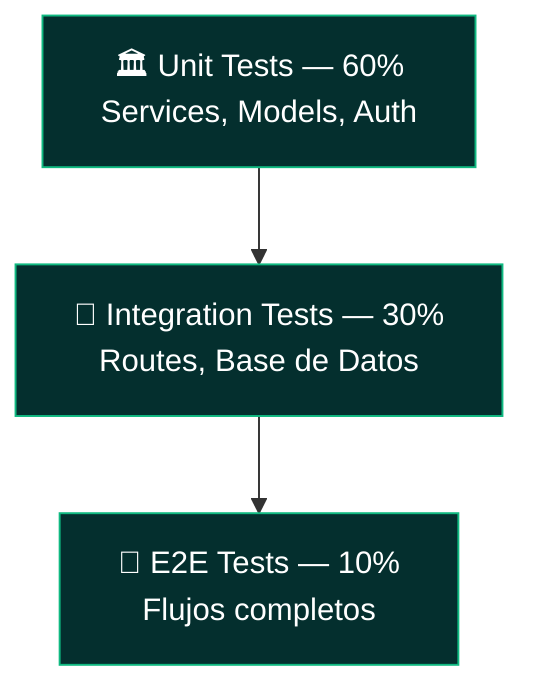

# API REST — cjhirashi-career — Guía de Testing

**TESTING GUIDE**


---

Estrategia de testing y guía de ejecución de pruebas para la API. **Estado actual: infraestructura de testing configurada (`pytest.ini`, `conftest.py`), sin archivos de prueba escritos todavía.**

---

## 📋 Tabla de Contenidos

- [Pirámide de Testing](#-pirámide-de-testing)
- [Estructura de Tests](#-estructura-de-tests)
- [Ejecutar Tests](#-ejecutar-tests)
- [Fixtures Disponibles](#-fixtures-disponibles)
- [Cómo Escribir Tests](#-cómo-escribir-tests)
- [Objetivos de Cobertura](#-objetivos-de-cobertura)
- [Debugging de Tests](#-debugging-de-tests)

---

## 🏛️ Pirámide de Testing



**Cobertura objetivo**: 80% (política de calidad del proyecto, ver `CLAUDE.md`)

## 📁 Estructura de Tests

```
tests/
├── conftest.py           — Fixtures compartidas (event_loop, async_db)
├── unit/                  — Lógica sin BD (sin archivos aún)
├── integration/           — Tests con BD real (sin archivos aún)
└── fixtures/               — Datos de prueba (sin archivos aún)
```

`pytest.ini` ya define markers (`unit`, `integration`, `slow`, `asyncio`) y modo `asyncio_mode = auto`, listos para usarse en cuanto se agreguen los primeros archivos `test_*.py`.

## ▶️ Ejecutar Tests

```bash
# Todos los tests
pytest

# Con reporte de cobertura
pytest --cov=src --cov-report=html
open htmlcov/index.html

# Un archivo específico
pytest tests/unit/services/test_auth_service.py

# Por marcador
pytest -m unit
pytest -m integration
```

## 🧩 Fixtures Disponibles

`tests/conftest.py` provee actualmente:

```python
@pytest.fixture(scope="session")
def event_loop():
    """Event loop compartido para tests async."""

@pytest.fixture
async def async_db():
    """Sesión de base de datos SQLite en memoria (aiosqlite) para tests aislados."""
```

> El fixture `async_db` usa SQLite en memoria, no PostgreSQL — válido para tests unitarios de lógica de negocio, pero **no reproduce comportamiento específico de PostgreSQL** (JSONB, triggers). Los tests de integración que dependan de esas características deben apuntar a una base PostgreSQL de prueba real.

## ✍️ Cómo Escribir Tests

### Test Unitario (sin base de datos)

```python
# tests/unit/utils/test_security.py
from utils.security import hash_password, verify_password

class TestPasswordHashing:
    def test_hash_password_verifies_correctly(self):
        plain = "password123"
        hashed = hash_password(plain)

        assert hashed != plain
        assert verify_password(plain, hashed)

    def test_different_hashes_for_same_password(self):
        plain = "password123"
        assert hash_password(plain) != hash_password(plain)
```

### Test de Integración (con cliente HTTP async)

```python
# tests/integration/routes/test_auth.py
import pytest
from httpx import AsyncClient, ASGITransport
from app import app

@pytest.mark.asyncio
async def test_login_invalid_credentials():
    transport = ASGITransport(app=app)
    async with AsyncClient(transport=transport, base_url="http://test") as client:
        response = await client.post(
            "/auth/login",
            json={"username": "no_existe", "password": "wrongpass"}
        )
    assert response.status_code == 401
```

**Patrón recomendado**: Arrange → Act → Assert, un comportamiento por test, nombres descriptivos (`test_login_with_invalid_credentials`, no `test_login_2`).

## 🎯 Objetivos de Cobertura

| Componente | Objetivo | Estado |
|-----------|----------|--------|
| Services (`auth_service.py`) | 90% | Sin tests |
| Repositories | 85% | Sin tests |
| Routes (`auth.py`, `documents.py`) | 80% | Sin tests |
| Models | 75% | Sin tests |
| Schemas | 70% | Sin tests |

## 🐛 Debugging de Tests

```bash
pytest -vv              # Output verboso
pytest -s               # Mostrar prints
pytest -x               # Detener en el primer fallo
pytest --lf             # Re-ejecutar solo los últimos fallidos
pytest --pdb            # Debugger interactivo al fallar
```

---

**Relacionado**: [ARCHITECTURE.md](./ARCHITECTURE.md) · [SETUP.md](./SETUP.md) · [TROUBLESHOOTING.md](./TROUBLESHOOTING.md)
