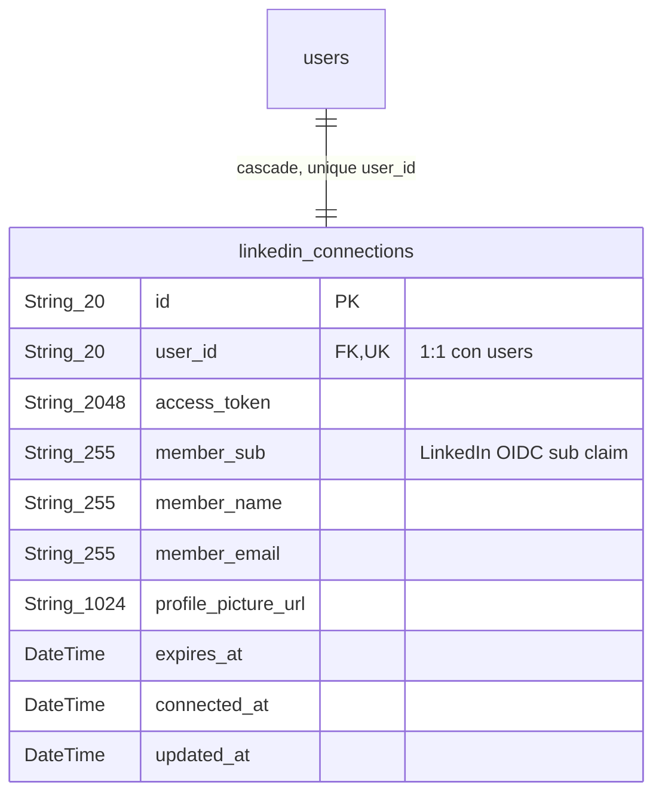
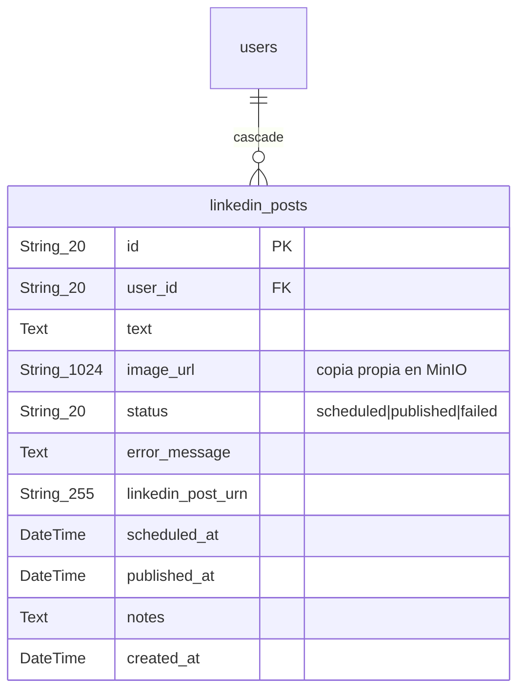
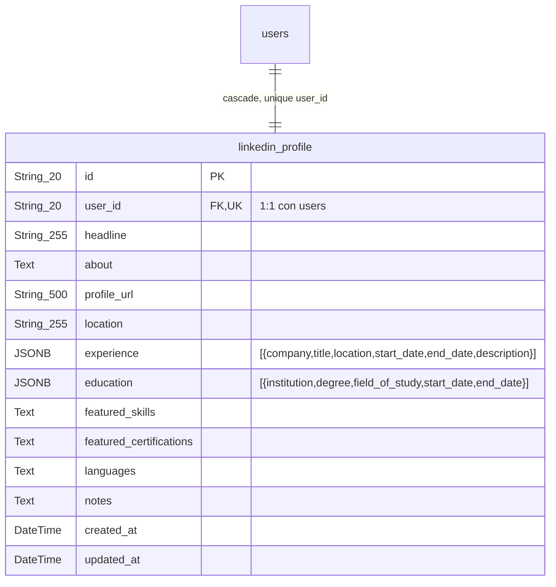
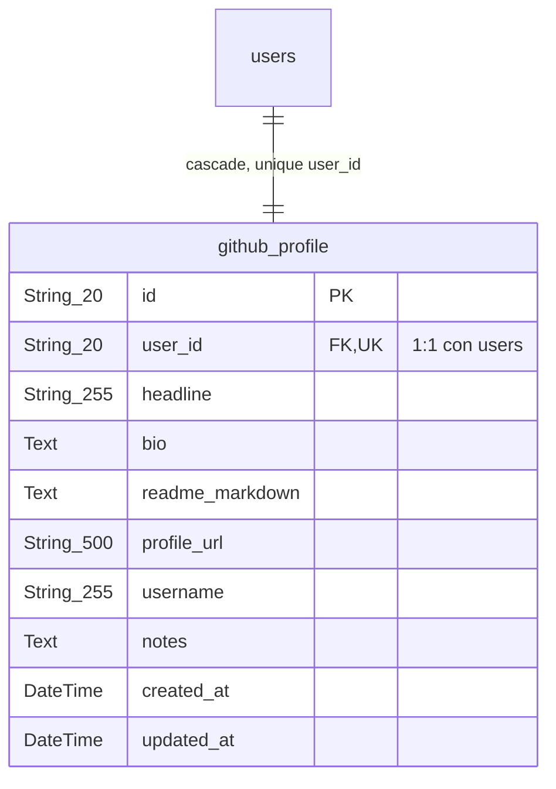

# Tablas de Integración

Adaptadores a plataformas externas: LinkedIn (OAuth + publicación de posts) y GitHub (perfil espejo). Estas tablas son reutilizables solo si la nueva instancia de la API requiere las mismas integraciones; de lo contrario se reemplazan por los adaptadores que correspondan al nuevo proyecto.

## Índice

### Grupo: LinkedIn

| Modelo | Tabla BD | Descripción |
|--------|----------|-------------|
| LinkedinConnection | linkedin_connections | Token OAuth "Share on LinkedIn" con datos del miembro |
| LinkedinPost | linkedin_posts | Cola e historial de posts programados o publicados en LinkedIn |
| LinkedinProfile | linkedin_profile | Staging del perfil LinkedIn (sin OAuth, edición manual) |

### Grupo: GitHub

| Modelo | Tabla BD | Descripción |
|--------|----------|-------------|
| GithubProfile | github_profile | Username, bio y README; repos se consultan en vivo vía API |

## Diagramas

## Grupo: LinkedIn

### linkedin_connections

Token OAuth "Share on LinkedIn" con datos del miembro autenticado. Singleton 1:1 con `users`.

**Atributos:**

- `id`: Identificador único del registro, generado por `id_generator` con prefijo `lnc` + sufijo aleatorio. Clave primaria.
- `user_id`: Referencia al usuario dueño de la conexión OAuth. Es `UNIQUE` porque solo puede existir una conexión activa de LinkedIn por usuario (singleton 1:1 con `users`); con `ON DELETE CASCADE`, el registro se elimina si se elimina el usuario.
- `access_token`: Token OAuth emitido por el producto self-serve "Share on LinkedIn" de LinkedIn. Es el credential que se usa para publicar posts en nombre del usuario. LinkedIn no emite refresh token en este producto (eso requiere aprobación de partner de Marketing Developer Platform), así que este token simplemente expira en `expires_at` y no hay renovación silenciosa.
- `member_sub`: El claim `sub` del token OIDC de LinkedIn, que identifica al miembro autenticado. Se usa para construir el URN de LinkedIn (`urn:li:person:{sub}`) requerido al publicar contenido vía su API.
- `member_name`: Nombre del miembro tal como lo reporta LinkedIn en el momento de la autorización OAuth. Es informativo, para mostrar en el Admin quién está conectado.
- `member_email`: Correo del miembro reportado por LinkedIn en el flujo OAuth. También informativo, opcional según los scopes concedidos.
- `profile_picture_url`: URL de la foto de perfil de LinkedIn del miembro, obtenida durante la autorización. Se usa para mostrar el avatar en la UI de la integración.
- `expires_at`: Fecha y hora en que expira el `access_token`. Cuando se cumple, el usuario debe volver a pasar por el flujo de conexión ("Connect") para reautorizar, ya que no existe renovación automática.
- `connected_at`: Marca de tiempo de cuándo se estableció esta conexión (primera autorización o reautorización). Se asigna automáticamente al crear el registro.
- `updated_at`: Marca de tiempo de la última modificación del registro, actualizada automáticamente en cada `UPDATE`.

### linkedin_posts

Cola e historial de posts en LinkedIn: texto, imagen propia en MinIO, estado (scheduled/published/failed) y URN del post publicado.

**Atributos:**

- `id`: Identificador único del registro, generado por `id_generator` con prefijo `lnp` + sufijo aleatorio. Clave primaria.
- `user_id`: Referencia al usuario dueño del post. Un usuario puede tener muchos posts (relación 1:N); con `ON DELETE CASCADE`, los posts se eliminan si se elimina el usuario.
- `text`: Contenido de texto del post que se publica (o se publicó) en LinkedIn. Campo obligatorio.
- `image_url`: URL de la copia propia de la imagen del post almacenada en MinIO (no la URL final de LinkedIn). Se conserva para poder mostrarla en el Admin o re-subirla a LinkedIn en el momento real de publicación, ya que la API de LinkedIn requiere subir el binario al publicar.
- `status`: Estado del post dentro del ciclo de vida de esta cola: `scheduled` (pendiente de publicar), `published` (ya publicado en LinkedIn) o `failed` (falló el intento de publicación). Es el campo que consulta el scheduler en segundo plano (`app.py`) para decidir qué posts publicar.
- `error_message`: Mensaje de error capturado si el intento de publicación falló (`status = failed`). Sirve para diagnosticar el fallo desde el Admin sin revisar logs.
- `linkedin_post_urn`: URN devuelto por LinkedIn tras publicar el post exitosamente (identificador del post en la plataforma). Queda nulo mientras el post no se ha publicado.
- `scheduled_at`: Fecha y hora en que el post debe publicarse. La API de LinkedIn no soporta programación nativa (todo post creado vía su API sale de inmediato), así que este campo es lo que el scheduler propio del sistema usa para decidir cuándo disparar la publicación real.
- `published_at`: Fecha y hora en que el post fue efectivamente publicado en LinkedIn. Queda nulo si aún no se ha publicado.
- `notes`: Notas internas de uso libre sobre el post, no visibles en LinkedIn ni parte del contenido publicado.
- `created_at`: Marca de tiempo de creación del registro (cuándo se dio de alta el post en la cola, no cuándo se publicó). Se asigna automáticamente.

### linkedin_profile

Staging del perfil LinkedIn para edición manual (sin OAuth): headline, about, experiencia, educación y habilidades en JSONB.

**Atributos:**

- `id`: Identificador único del registro, generado por `id_generator` con prefijo `lnr` + sufijo aleatorio. Clave primaria.
- `user_id`: Referencia al usuario dueño del perfil. Es `UNIQUE` porque solo existe un registro de staging de perfil LinkedIn por usuario (1:1 con `users`); con `ON DELETE CASCADE`, el registro se elimina si se elimina el usuario.
- `headline`: Titular/encabezado del perfil, equivalente al "headline" que LinkedIn muestra bajo el nombre. Es contenido preparado para copiar manualmente al perfil real, no se sincroniza vía OAuth.
- `about`: Texto de la sección "Acerca de" del perfil de LinkedIn, en formato libre.
- `profile_url`: URL pública del perfil de LinkedIn del usuario (`linkedin.com/in/...`), para enlazarlo desde el portafolio u otras vistas.
- `location`: Ubicación geográfica mostrada en el perfil (ciudad, país, etc.), tal como aparecería en LinkedIn.
- `experience`: Lista en JSONB de experiencia laboral a reflejar en LinkedIn, cada elemento con la forma `{company, title, location, start_date, end_date, description}`. Es contenido de staging, independiente de las tablas operativas de historial laboral (`work_history`), pensado para no duplicarse ni depender de ellas.
- `education`: Lista en JSONB de formación académica a reflejar en LinkedIn, cada elemento con la forma `{institution, degree, field_of_study, start_date, end_date}`. Igual que `experience`, es contenido de staging independiente de las tablas operativas de educación.
- `featured_skills`: Habilidades destacadas, una por línea, pensadas para renderizarse como lista Markdown al copiar el contenido al perfil real.
- `featured_certifications`: Certificaciones destacadas a mostrar en el perfil, en el mismo formato de texto libre línea por línea.
- `languages`: Idiomas a mostrar en el perfil, en formato de texto libre.
- `notes`: Notas internas de uso libre sobre el perfil, no destinadas a copiarse a LinkedIn.
- `created_at`: Marca de tiempo de creación del registro. Se asigna automáticamente.
- `updated_at`: Marca de tiempo de la última modificación del registro, actualizada automáticamente en cada `UPDATE`.

## Grupo: GitHub

### github_profile

Perfil espejo de GitHub: username, bio y README en Markdown. Los repositorios se consultan en vivo vía la API pública de GitHub, no se almacenan.

**Atributos:**

- `id`: Identificador único del registro, generado por `id_generator` con prefijo `ghp` + sufijo aleatorio. Clave primaria.
- `user_id`: Referencia al usuario dueño del perfil. Es `UNIQUE` porque solo existe un registro de perfil GitHub por usuario (1:1 con `users`); con `ON DELETE CASCADE`, el registro se elimina si se elimina el usuario.
- `headline`: Titular/encabezado breve del perfil de GitHub, análogo al `headline` de LinkedIn, usado para presentar al usuario en el portafolio.
- `bio`: Biografía o descripción del perfil de GitHub, en formato libre.
- `readme_markdown`: Contenido en Markdown del README de perfil (el README especial que GitHub muestra en la página de perfil de un usuario). Se usa para mostrarlo o replicarlo en el portafolio.
- `profile_url`: URL pública del perfil de GitHub del usuario (`github.com/...`).
- `username`: Nombre de usuario en GitHub. Es el dato clave que se usa para consultar en vivo los repositorios públicos vía la API REST de GitHub (sin necesidad de OAuth), en vez de almacenarlos localmente.
- `notes`: Notas internas de uso libre sobre el perfil, no destinadas a mostrarse públicamente.
- `created_at`: Marca de tiempo de creación del registro. Se asigna automáticamente.
- `updated_at`: Marca de tiempo de la última modificación del registro, actualizada automáticamente en cada `UPDATE`.
