# Tablas de Operativa

Core del dominio de negocio `cjhirashi-career`: gestión integral de la carrera profesional de Carlos Jiménez Hirashi. Estas tablas modelan identidad, búsqueda de empleo, aplicaciones, portafolio y contenido del portal público. Se rediseñan completamente al replicar esta API para otro dominio de negocio.

## Índice

### Grupo: Identidad y Perfil

| Modelo | Tabla BD | Descripción |
|--------|----------|-------------|
| PersonalProfile | personal_profile | Datos biográficos singleton (nombre legal, nacimiento, contacto, ubicación) |
| Identity | identity | Singleton de identidad profesional: tagline, bio, UVP |
| IdentityReflection | identity_reflections | Reflexiones IKIGAI por dimensión (pasión, profesión, vocación, misión) |
| Differentiator | differentiators | Pilares de diferenciación + evidencia |

### Grupo: Competencias

| Modelo | Tabla BD | Descripción |
|--------|----------|-------------|
| Competency | competencies | Competencias técnicas, transferibles y de negocio |
| Certification | certifications | Certificaciones con syllabus Markdown y status |

### Grupo: Estrategia de Búsqueda

| Modelo | Tabla BD | Descripción |
|--------|----------|-------------|
| TargetRole | target_roles | Roles objetivo de la búsqueda activa |
| WorkHistory | work_history | Historial laboral con métricas y aprendizajes |
| Achievement | achievements | Logros (reto / solución / impacto); uno puede destacarse en el home |
| StarStory | star_stories | Historias STAR de 60–90 segundos para entrevistas |
| CareerReview | career_reviews | Revisiones periódicas y decisiones de transición |
| RoleGapAnalysis | role_gap_analysis | Gaps identificados vs rol objetivo |
| FitScoringFactor | fit_scoring_factors | Factores ponderados de fit de vacante |
| MarketSegment | market_segments | Canales del mercado visible y oculto |
| RoleNarrative | role_narratives | Narrativas reutilizables por rol para entrevistas |
| SearchPlan | search_plans | Planes semanales de búsqueda con targets y seguimiento |

### Grupo: Portafolio y Publicaciones

| Modelo | Tabla BD | Descripción |
|--------|----------|-------------|
| Project | projects | Proyectos de portafolio (featured, portal) |
| Publication | publications | Posts/blog que alimentan el portal público |

### Grupo: Networking

| Modelo | Tabla BD | Descripción |
|--------|----------|-------------|
| NetworkingContact | networking_contacts | Red profesional: contactos con categoría y status |
| ContactInteraction | contact_interactions | Log de comunicación con un contacto de la red |
| NetworkingActivity | networking_activities | Actividades give/share/talk del plan de networking |
| TargetCompany | target_companies | Empresas objetivo con tier, boards Greenhouse/Lever |

### Grupo: Vacantes y Postulaciones

| Modelo | Tabla BD | Descripción |
|--------|----------|-------------|
| Vacancy | vacancies | Vacantes trackeadas (incluyendo las de job discovery) |
| CvVersion | cv_versions | CV versionado en Markdown por rol objetivo |
| CoverLetterVersion | cover_letter_versions | Cartas de presentación versionadas |
| Application | applications | Postulaciones a vacantes con CV y carta asociados |
| ApplicationInteraction | application_interactions | Log de comunicación durante una postulación |
| Interview | interviews | Entrevistas por postulación con resultado y feedback |

### Grupo: Portal Público

| Modelo | Tabla BD | Descripción |
|--------|----------|-------------|
| PortalHome | portal_home | Hero y stats del Home del portal público (singleton) |
| PortalAbout | portal_about | Contenido extra de Sobre mí del portal (singleton) |
| PortalContact | portal_contact | Contacto y footer del portal (singleton) |

### Grupo: Métricas

| Modelo | Tabla BD | Descripción |
|--------|----------|-------------|
| Metrics | metrics | Snapshot de métricas de perfil (singleton 1:1 con users) |

## Diagramas

## Grupo: Identidad y Perfil

### personal_profile

Datos biográficos del usuario: nombre legal, fecha de nacimiento, contacto y ubicación. Singleton 1:1 con `users`, distinto de `identity`.

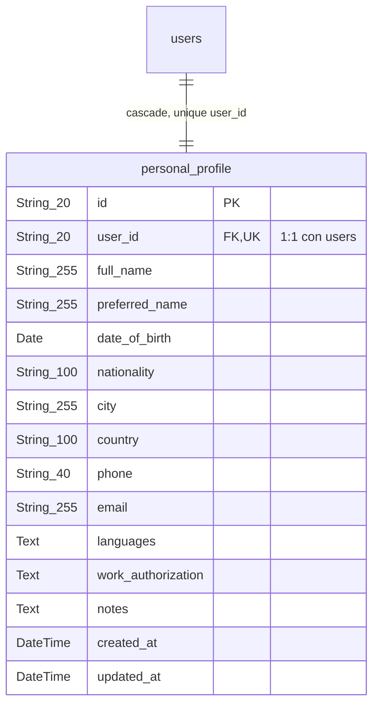
```mermaid
erDiagram
    personal_profile {
        String_20 id PK
        String_20 user_id FK, UK "1:1 con users"
        String_255 full_name
        String_255 preferred_name
        Date date_of_birth
        String_100 nationality
        String_255 city
        String_100 country
        String_40 phone
        String_255 email
        Text languages
        Text work_authorization
        Text notes
        DateTime created_at
        DateTime updated_at
    }
    users

    users ||--|| personal_profile : "cascade, unique user_id"
```

**Atributos:**

- `id`: Identificador único del registro, generado por `id_generator` con prefijo `psp-` + consecutivo (ej. `psp-1`). Clave primaria.
- `user_id`: Referencia al usuario dueño de esta ficha biográfica. Único (`UK`) porque es un singleton 1:1 con `users`: cada usuario tiene como máximo una fila. Con `ON DELETE CASCADE`, el registro se elimina si se elimina el usuario.
- `full_name`: Nombre legal completo tal como aparece en documentos oficiales. Campo obligatorio; distinto del nombre de marca/profesional que vive en otras tablas de presencia (portal).
- `preferred_name`: Nombre corto o de uso cotidiano, si difiere del nombre legal (ej. apodo o forma abreviada usada en comunicación informal).
- `date_of_birth`: Fecha de nacimiento, usada como dato de referencia biográfico (no se expone públicamente en el portal).
- `nationality`: Nacionalidad del usuario, relevante para procesos de aplicación que piden esta información o para autorización de trabajo en ciertos países.
- `city`: Ciudad de residencia actual.
- `country`: País de residencia actual.
- `phone`: Número de teléfono de contacto personal (distinto del que pueda exponerse en `portal_contact`).
- `email`: Correo electrónico personal de referencia (distinto del email de contacto público en `portal_contact`).
- `languages`: Texto libre con los idiomas que domina el usuario y su nivel (ej. "Español nativo, Inglés C1"), usado como insumo para CVs y aplicaciones.
- `work_authorization`: Texto libre describiendo el estatus de autorización de trabajo (visa, ciudadanía, permiso de residencia), relevante para filtrar vacantes o responder preguntas de reclutadores.
- `notes`: Campo libre para anotaciones internas sobre este registro, no destinado a mostrarse públicamente.
- `created_at`: Marca de tiempo de creación del registro, asignada automáticamente por el servidor de base de datos.
- `updated_at`: Marca de tiempo de la última modificación, actualizada automáticamente en cada `UPDATE`.

### identity

Singleton de identidad profesional: tagline, bio y propuesta de valor única (UVP). 1:1 con `users`.

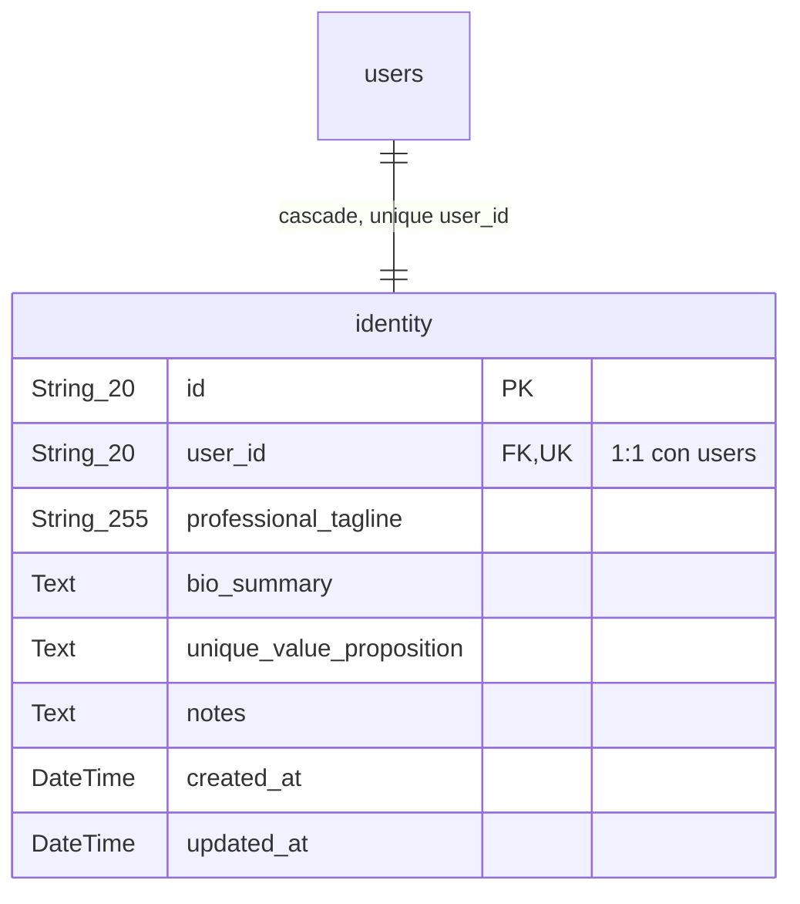
```mermaid
erDiagram
    identity {
        String_20 id PK
        String_20 user_id FK, UK "1:1 con users"
        String_255 professional_tagline
        Text bio_summary
        Text unique_value_proposition
        Text notes
        DateTime created_at
        DateTime updated_at
    }
    users

    users ||--|| identity : "cascade, unique user_id"
```

**Atributos:**

- `id`: Identificador único del registro, generado por `id_generator` con prefijo `idn-` + consecutivo. Clave primaria.
- `user_id`: Referencia al usuario dueño de esta identidad profesional. Único (`UK`) porque es singleton 1:1 con `users`. Con `ON DELETE CASCADE`, el registro se elimina si se elimina el usuario.
- `professional_tagline`: Frase corta que resume la identidad profesional (ej. un titular tipo "elevator pitch" de una línea), usada en encabezados de CV, portal y materiales de presentación.
- `bio_summary`: Resumen biográfico-profesional más extenso que el tagline, usado como bio estándar en CV, LinkedIn o el portal.
- `unique_value_proposition`: La propuesta de valor única (UVP): qué combinación de experiencia/competencias distingue al usuario frente a otros candidatos del mismo nicho; insumo central para narrativas de entrevista y cartas de presentación.
- `notes`: Campo libre para anotaciones internas sobre este registro.
- `created_at`: Marca de tiempo de creación del registro, asignada automáticamente por el servidor de base de datos.
- `updated_at`: Marca de tiempo de la última modificación, actualizada automáticamente en cada `UPDATE`.

### identity_reflections

Reflexiones IKIGAI por dimensión (pasión, profesión, vocación, misión). Única por combinación `user_id` + `dimension`.

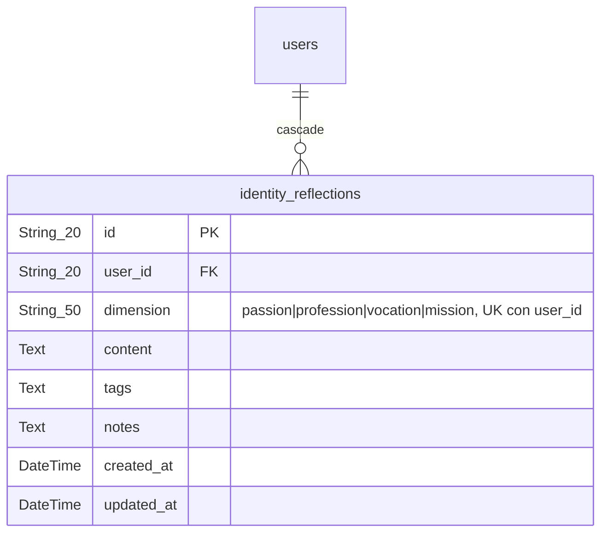
```mermaid
erDiagram
    identity_reflections {
        String_20 id PK
        String_20 user_id FK
        String_50 dimension "passion|profession|vocation|mission, UK con user_id"
        Text content
        Text tags
        Text notes
        DateTime created_at
        DateTime updated_at
    }
    users

    users ||--o{ identity_reflections : "cascade"
```

**Atributos:**

- `id`: Identificador único del registro, generado por `id_generator` con prefijo `idr-` + consecutivo. Clave primaria.
- `user_id`: Referencia al usuario dueño de la reflexión. Con `ON DELETE CASCADE`, las reflexiones se eliminan si se elimina el usuario. Forma parte de la restricción única junto con `dimension`.
- `dimension`: La dimensión IKIGAI a la que corresponde la reflexión: `passion` (pasión), `profession` (profesión), `vocation` (vocación) o `mission` (misión). Única por usuario (`UK` compuesta con `user_id`): solo puede existir una reflexión por dimensión y usuario.
- `content`: El texto de la reflexión propiamente dicha — la respuesta personal a la pregunta que plantea esa dimensión del marco IKIGAI.
- `tags`: Etiquetas de texto libre asociadas a la reflexión, útiles para categorizar o vincular la reflexión con otros conceptos del perfil.
- `notes`: Campo libre para anotaciones internas sobre este registro.
- `created_at`: Marca de tiempo de creación del registro, asignada automáticamente por el servidor de base de datos.
- `updated_at`: Marca de tiempo de la última modificación, actualizada automáticamente en cada `UPDATE`.

### differentiators

Pilares de diferenciación del profesional con evidencia de apoyo.

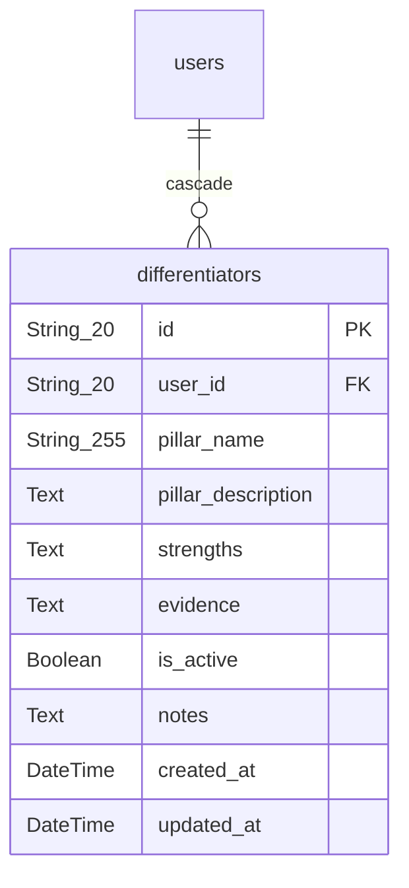
```mermaid
erDiagram
    differentiators {
        String_20 id PK
        String_20 user_id FK
        String_255 pillar_name
        Text pillar_description
        Text strengths
        Text evidence
        Boolean is_active
        Text notes
        DateTime created_at
        DateTime updated_at
    }
    users

    users ||--o{ differentiators : "cascade"
```

**Atributos:**

- `id`: Identificador único del registro, generado por `id_generator` con prefijo `dif-` + consecutivo. Clave primaria.
- `user_id`: Referencia al usuario dueño del diferenciador. Con `ON DELETE CASCADE`, el registro se elimina si se elimina el usuario.
- `pillar_name`: Nombre corto del pilar de diferenciación (ej. "Automatización con IA aplicada a operaciones"), el concepto central que distingue al profesional.
- `pillar_description`: Descripción más amplia de en qué consiste el pilar y por qué es relevante en el mercado objetivo.
- `strengths`: Fortalezas concretas que sostienen este pilar — las capacidades específicas que lo hacen creíble.
- `evidence`: Evidencia de respaldo del pilar: proyectos, logros o resultados concretos que lo demuestran (puede referenciar otras tablas de forma narrativa, sin ser una FK formal).
- `is_active`: Indica si este pilar sigue vigente en la narrativa actual del usuario. Por defecto `true`; se desactiva en vez de borrar para conservar histórico.
- `notes`: Campo libre para anotaciones internas sobre este registro.
- `created_at`: Marca de tiempo de creación del registro, asignada automáticamente por el servidor de base de datos.
- `updated_at`: Marca de tiempo de la última modificación, actualizada automáticamente en cada `UPDATE`.

## Grupo: Competencias

### competencies

Competencias técnicas, transferibles y de negocio con nivel de dominio, años de experiencia y alineación a diferenciadores.

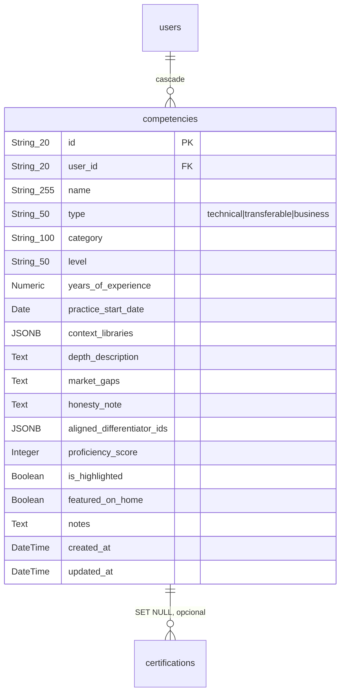
```mermaid
erDiagram
    competencies {
        String_20 id PK
        String_20 user_id FK
        String_255 name
        String_50 type "technical|transferable|business"
        String_100 category
        String_50 level
        Numeric years_of_experience
        Date practice_start_date
        JSONB context_libraries
        Text depth_description
        Text market_gaps
        Text honesty_note
        JSONB aligned_differentiator_ids
        Integer proficiency_score
        Boolean is_highlighted
        Boolean featured_on_home
        Text notes
        DateTime created_at
        DateTime updated_at
    }
    users
    certifications

    users ||--o{ competencies : "cascade"
    competencies ||--o{ certifications : "SET NULL, opcional"
```

**Atributos:**

- `id`: Identificador único del registro, generado por `id_generator` con prefijo `cmp-` + consecutivo. Clave primaria.
- `user_id`: Referencia al usuario dueño de la competencia. Con `ON DELETE CASCADE`, el registro se elimina si se elimina el usuario.
- `name`: Nombre de la competencia o habilidad (ej. "Python", "Gestión de stakeholders", "Negociación comercial").
- `type`: Clasificación de la competencia en una de tres categorías: `technical` (técnica), `transferable` (transferible/blanda) o `business` (de negocio). Indexado porque se filtra frecuentemente por tipo.
- `category`: Subcategoría o agrupación más específica dentro del `type` (ej. "Lenguajes de programación", "Liderazgo").
- `level`: Nivel de dominio autopercibido de la competencia (ej. básico/intermedio/avanzado/experto), en texto libre.
- `years_of_experience`: Años de experiencia práctica con esta competencia, con precisión decimal (ej. 2.5 años).
- `practice_start_date`: Fecha en que comenzó a practicarse o desarrollarse esta competencia, útil para calcular antigüedad real.
- `context_libraries`: Estructura JSON con librerías, frameworks o herramientas específicas asociadas al contexto de esta competencia (relevante sobre todo para competencias técnicas).
- `depth_description`: Descripción narrativa de qué tan profundo es el dominio de la competencia: en qué escenarios se ha aplicado y con qué complejidad.
- `market_gaps`: Notas sobre brechas de mercado relacionadas con esta competencia: dónde el usuario aún no cumple expectativas del mercado objetivo.
- `honesty_note`: Nota de autoevaluación honesta sobre los límites reales de esta competencia, para evitar sobrevender el nivel de dominio en CVs o entrevistas.
- `aligned_differentiator_ids`: Lista JSON de IDs de `differentiators` con los que esta competencia está alineada, permitiendo conectar competencias concretas con los pilares de diferenciación narrativa.
- `proficiency_score`: Puntuación numérica de dominio (escala interna), usada para cálculos agregados como `average_proficiency_score` en `metrics`.
- `is_highlighted`: Marca si la competencia debe destacarse en vistas internas. Actualmente sin uso cableado en la aplicación (ver `featured_on_home` para el destaque real del portal).
- `featured_on_home`: Controla si la competencia aparece en el teaser "Stack técnico" del Home del portal público; solo se muestran las categorías que tengan al menos una competencia marcada en `true`. Independiente de `is_highlighted`.
- `notes`: Campo libre para anotaciones internas sobre este registro.
- `created_at`: Marca de tiempo de creación del registro, asignada automáticamente por el servidor de base de datos.
- `updated_at`: Marca de tiempo de la última modificación, actualizada automáticamente en cada `UPDATE`.

### certifications

Certificaciones con syllabus en Markdown, URL del documento y status de progreso.

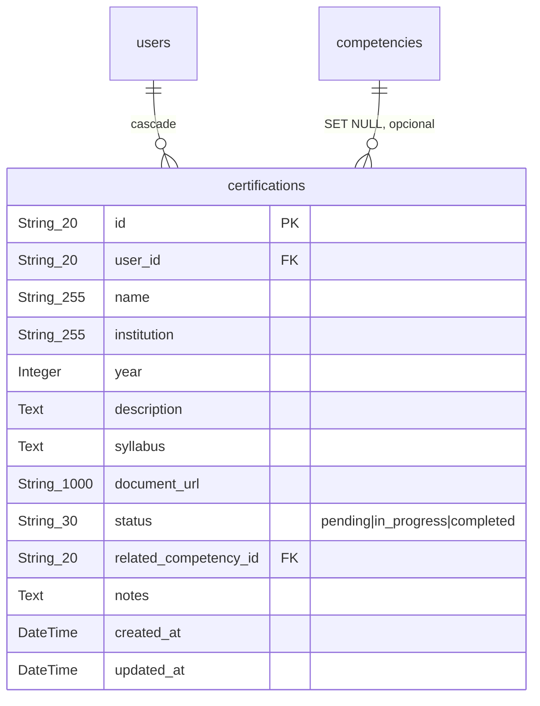
```mermaid
erDiagram
    certifications {
        String_20 id PK
        String_20 user_id FK
        String_255 name
        String_255 institution
        Integer year
        Text description
        Text syllabus
        String_1000 document_url
        String_30 status "pending|in_progress|completed"
        String_20 related_competency_id FK
        Text notes
        DateTime created_at
        DateTime updated_at
    }
    users
    competencies

    users ||--o{ certifications : "cascade"
    competencies ||--o{ certifications : "SET NULL, opcional"
```

**Atributos:**

- `id`: Identificador único del registro, generado por `id_generator` con prefijo `crt-` + consecutivo. Clave primaria.
- `user_id`: Referencia al usuario dueño de la certificación. Con `ON DELETE CASCADE`, el registro se elimina si se elimina el usuario.
- `name`: Nombre de la certificación (ej. "AWS Certified Solutions Architect").
- `institution`: Institución u organismo emisor de la certificación.
- `year`: Año en que se obtuvo (o se espera obtener) la certificación.
- `description`: Descripción general de la certificación: alcance, propósito y por qué es relevante para el perfil.
- `syllabus`: Contenido del temario en formato Markdown, útil para documentar en detalle qué cubre la certificación.
- `document_url`: URL al documento/diploma de la certificación (típicamente un archivo en el bucket de almacenamiento).
- `status`: Estado de progreso de la certificación: `pending` (pendiente), `in_progress` (en curso) o `completed` (completada). Restringido por `CheckConstraint` a esos tres valores; por defecto `pending`.
- `related_competency_id`: Referencia opcional a la competencia (`competencies`) que esta certificación respalda o refuerza. Con `ON DELETE SET NULL`: si se borra la competencia, la certificación no se pierde, solo queda sin vínculo.
- `notes`: Campo libre para anotaciones internas sobre este registro.
- `created_at`: Marca de tiempo de creación del registro, asignada automáticamente por el servidor de base de datos.
- `updated_at`: Marca de tiempo de la última modificación, actualizada automáticamente en cada `UPDATE`.

## Grupo: Estrategia de Búsqueda

### target_roles

Roles objetivo de la búsqueda activa con datos de mercado (salario, vacantes, accesibilidad).

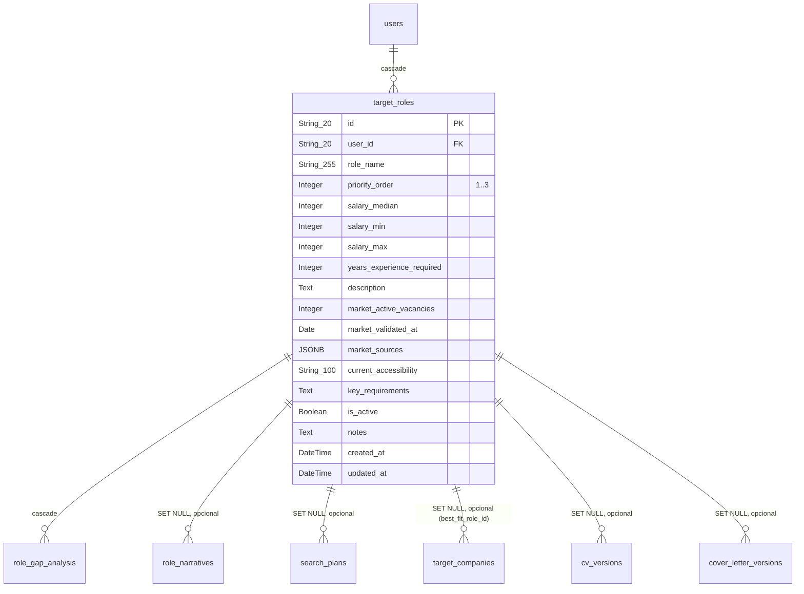
```mermaid
erDiagram
    target_roles {
        String_20 id PK
        String_20 user_id FK
        String_255 role_name
        Integer priority_order "1..3"
        Integer salary_median
        Integer salary_min
        Integer salary_max
        Integer years_experience_required
        Text description
        Integer market_active_vacancies
        Date market_validated_at
        JSONB market_sources
        String_100 current_accessibility
        Text key_requirements
        Boolean is_active
        Text notes
        DateTime created_at
        DateTime updated_at
    }
    users
    role_gap_analysis
    role_narratives
    search_plans
    target_companies
    cv_versions
    cover_letter_versions

    users ||--o{ target_roles : "cascade"
    target_roles ||--o{ role_gap_analysis : "cascade"
    target_roles ||--o{ role_narratives : "SET NULL, opcional"
    target_roles ||--o{ search_plans : "SET NULL, opcional"
    target_roles ||--o{ target_companies : "SET NULL, opcional (best_fit_role_id)"
    target_roles ||--o{ cv_versions : "SET NULL, opcional"
    target_roles ||--o{ cover_letter_versions : "SET NULL, opcional"
```

**Atributos:**

- `id`: Identificador único del registro, generado por `id_generator` con prefijo `trl-` + consecutivo. Clave primaria.
- `user_id`: Referencia al usuario dueño del rol objetivo. Con `ON DELETE CASCADE`, el registro se elimina si se elimina el usuario.
- `role_name`: Nombre del puesto objetivo (ej. "Head of Data & Automation").
- `priority_order`: Orden de prioridad entre roles objetivo, restringido por `CheckConstraint` a un valor entre 1 y 3 (la búsqueda activa se enfoca en máximo 3 roles a la vez).
- `salary_median`: Salario mediano de mercado estimado para este rol, usado como referencia de negociación.
- `salary_min`: Piso salarial de mercado estimado.
- `salary_max`: Techo salarial de mercado estimado.
- `years_experience_required`: Años de experiencia que típicamente exige el mercado para este rol.
- `description`: Descripción general del rol: responsabilidades y expectativas típicas.
- `market_active_vacancies`: Número de vacantes activas detectadas en el mercado para este rol al momento de la validación, usado como señal de demanda.
- `market_validated_at`: Fecha en que se validó por última vez la información de mercado de este rol (salarios, vacantes activas).
- `market_sources`: Estructura JSON con las fuentes consultadas para validar los datos de mercado (ej. portales de empleo, reportes salariales).
- `current_accessibility`: Texto que describe qué tan accesible es este rol actualmente para el usuario dado su perfil (ej. "alta", "media con gaps", etc.).
- `key_requirements`: Requisitos clave que el mercado pide para este rol, usados como insumo para el análisis de gaps (`role_gap_analysis`).
- `is_active`: Indica si este rol objetivo sigue vigente en la búsqueda activa. Por defecto `true`.
- `notes`: Campo libre para anotaciones internas sobre este registro.
- `created_at`: Marca de tiempo de creación del registro, asignada automáticamente por el servidor de base de datos.
- `updated_at`: Marca de tiempo de la última modificación, actualizada automáticamente en cada `UPDATE`.

### work_history

Historial laboral con métricas clave, narrativa y aprendizajes por posición.

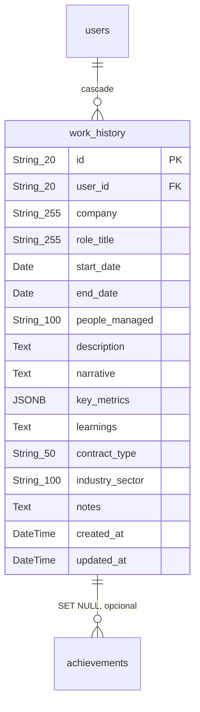
```mermaid
erDiagram
    work_history {
        String_20 id PK
        String_20 user_id FK
        String_255 company
        String_255 role_title
        Date start_date
        Date end_date
        String_100 people_managed
        Text description
        Text narrative
        JSONB key_metrics
        Text learnings
        String_50 contract_type
        String_100 industry_sector
        Text notes
        DateTime created_at
        DateTime updated_at
    }
    users
    achievements

    users ||--o{ work_history : "cascade"
    work_history ||--o{ achievements : "SET NULL, opcional"
```

**Atributos:**

- `id`: Identificador único del registro, generado por `id_generator` con prefijo `wkh-` + consecutivo. Clave primaria.
- `user_id`: Referencia al usuario dueño de esta posición laboral. Con `ON DELETE CASCADE`, el registro se elimina si se elimina el usuario.
- `company`: Nombre de la empresa donde se trabajó.
- `role_title`: Título del puesto ocupado en esa empresa.
- `start_date`: Fecha de inicio de la posición. Indexada porque el historial suele ordenarse u ordenarse por fecha.
- `end_date`: Fecha de fin de la posición (vacío si es el puesto actual).
- `people_managed`: Descripción del alcance de gestión de personas en esta posición (ej. tamaño de equipo), en texto libre en vez de un número estricto para permitir matices.
- `description`: Descripción general de responsabilidades en el puesto.
- `narrative`: Narrativa más elaborada de la experiencia en este puesto, útil como insumo para CV o entrevistas.
- `key_metrics`: Estructura JSON con métricas clave logradas en la posición (ej. crecimiento, ahorro, eficiencia).
- `learnings`: Aprendizajes obtenidos durante esta posición, relevantes para la narrativa de crecimiento profesional.
- `contract_type`: Tipo de contrato de esta posición (ej. tiempo completo, freelance, consultoría).
- `industry_sector`: Sector o industria de la empresa en esta posición.
- `notes`: Campo libre para anotaciones internas sobre este registro.
- `created_at`: Marca de tiempo de creación del registro, asignada automáticamente por el servidor de base de datos.
- `updated_at`: Marca de tiempo de la última modificación, actualizada automáticamente en cada `UPDATE`.

### achievements

Logros con estructura reto/solución/impacto. El campo `home` marca el logro destacado en el Home del portal (solo uno a la vez).

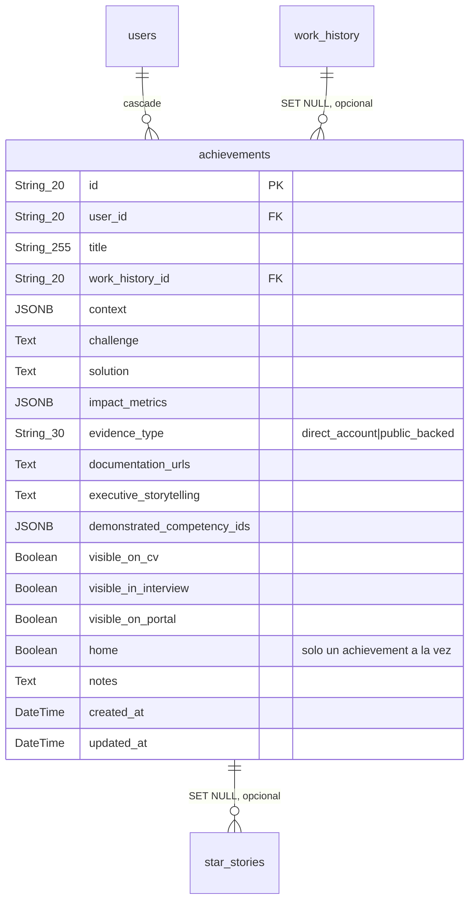
```mermaid
erDiagram
    achievements {
        String_20 id PK
        String_20 user_id FK
        String_255 title
        String_20 work_history_id FK
        JSONB context
        Text challenge
        Text solution
        JSONB impact_metrics
        String_30 evidence_type "direct_account|public_backed"
        Text documentation_urls
        Text executive_storytelling
        JSONB demonstrated_competency_ids
        Boolean visible_on_cv
        Boolean visible_in_interview
        Boolean visible_on_portal
        Boolean home "solo un achievement a la vez"
        Text notes
        DateTime created_at
        DateTime updated_at
    }
    users
    work_history
    star_stories

    users ||--o{ achievements : "cascade"
    work_history ||--o{ achievements : "SET NULL, opcional"
    achievements ||--o{ star_stories : "SET NULL, opcional"
```

**Atributos:**

- `id`: Identificador único del registro, generado por `id_generator` con prefijo `ach-` + consecutivo. Clave primaria.
- `user_id`: Referencia al usuario dueño del logro. Con `ON DELETE CASCADE`, el registro se elimina si se elimina el usuario.
- `title`: Título corto del logro (ej. "Reducción de 40% en tiempo de proceso X").
- `work_history_id`: Referencia opcional a la posición laboral (`work_history`) en la que se dio este logro. Con `ON DELETE SET NULL`: si se borra la posición, el logro se conserva sin vínculo.
- `context`: Estructura JSON con el contexto de negocio en el que ocurrió el logro (situación de partida, restricciones, stakeholders involucrados).
- `challenge`: Descripción del reto o problema que se enfrentaba, primer elemento de la estructura reto/solución/impacto.
- `solution`: Descripción de la solución implementada, segundo elemento de la estructura.
- `impact_metrics`: Estructura JSON con las métricas de impacto logradas (tercer elemento de la estructura reto/solución/impacto): cifras concretas de resultado.
- `evidence_type`: Tipo de respaldo del logro: `direct_account` (relato propio sin evidencia pública verificable) o `public_backed` (respaldado por evidencia pública, ej. publicación o reconocimiento). Restringido por `CheckConstraint`.
- `documentation_urls`: URLs a documentación de respaldo del logro (reportes, capturas, publicaciones).
- `executive_storytelling`: Versión ejecutiva/resumida del logro, redactada para audiencias de alto nivel (ej. reclutadores senior, C-level).
- `demonstrated_competency_ids`: Lista JSON de IDs de `competencies` que este logro demuestra en la práctica, conectando el logro con el catálogo de competencias.
- `visible_on_cv`: Controla si este logro se incluye al generar versiones de CV. Por defecto `true`.
- `visible_in_interview`: Controla si este logro está disponible como material de preparación para entrevistas. Por defecto `true`.
- `visible_on_portal`: Controla si este logro se muestra en el portal público. Por defecto `false` (opt-in explícito para contenido público).
- `home`: Marca el logro destacado en el bloque principal del Home del portal público. Solo un `achievement` puede tener `home=true` a la vez (regla de negocio aplicada en la capa de servicio, no en BD); reemplazó a `projects.is_anchor` como bloque "caso ancla" del Home (cambio del 27-08-2026).
- `notes`: Campo libre para anotaciones internas sobre este registro.
- `created_at`: Marca de tiempo de creación del registro, asignada automáticamente por el servidor de base de datos.
- `updated_at`: Marca de tiempo de la última modificación, actualizada automáticamente en cada `UPDATE`.

### star_stories

Historias STAR de 60–90 segundos para entrevistas, con contador de prácticas y estado activo.

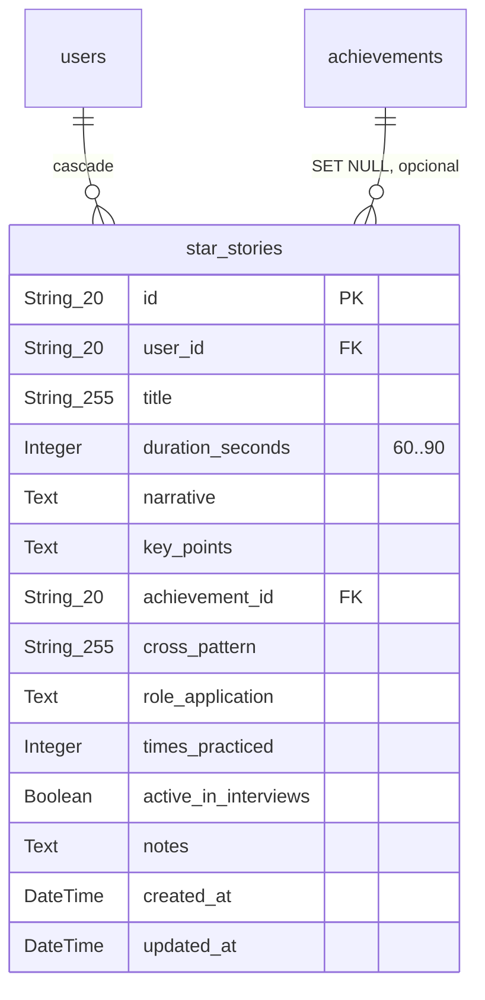
```mermaid
erDiagram
    star_stories {
        String_20 id PK
        String_20 user_id FK
        String_255 title
        Integer duration_seconds "60..90"
        Text narrative
        Text key_points
        String_20 achievement_id FK
        String_255 cross_pattern
        Text role_application
        Integer times_practiced
        Boolean active_in_interviews
        Text notes
        DateTime created_at
        DateTime updated_at
    }
    users
    achievements

    users ||--o{ star_stories : "cascade"
    achievements ||--o{ star_stories : "SET NULL, opcional"
```

**Atributos:**

- `id`: Identificador único del registro, generado por `id_generator` con prefijo `sts-` + consecutivo. Clave primaria.
- `user_id`: Referencia al usuario dueño de la historia STAR. Con `ON DELETE CASCADE`, el registro se elimina si se elimina el usuario.
- `title`: Título corto de la historia, para identificarla rápidamente en un listado.
- `duration_seconds`: Duración estimada al narrarla en voz alta, restringida por `CheckConstraint` a un rango de 60 a 90 segundos (formato ideal para respuestas de entrevista).
- `narrative`: El texto completo de la historia en formato STAR (Situación, Tarea, Acción, Resultado).
- `key_points`: Puntos clave a resaltar al contar la historia, como recordatorio rápido antes de una entrevista.
- `achievement_id`: Referencia opcional al logro (`achievements`) del que se deriva esta historia. Con `ON DELETE SET NULL`: si se borra el logro, la historia se conserva sin vínculo.
- `cross_pattern`: Patrón transversal que esta historia ilustra (ej. "liderazgo bajo presión", "resolución de conflictos"), útil para elegir qué historia usar según la pregunta de entrevista.
- `role_application`: Notas sobre para qué tipo de rol o pregunta aplica mejor esta historia.
- `times_practiced`: Contador de veces que se ha practicado esta historia, útil para priorizar cuáles necesitan más ensayo.
- `active_in_interviews`: Indica si la historia está activa en el repertorio actual usado en entrevistas. Por defecto `true`.
- `notes`: Campo libre para anotaciones internas sobre este registro.
- `created_at`: Marca de tiempo de creación del registro, asignada automáticamente por el servidor de base de datos.
- `updated_at`: Marca de tiempo de la última modificación, actualizada automáticamente en cada `UPDATE`.

### career_reviews

Revisiones periódicas con tipo (gap analysis, decisión de transición, trimestral), hallazgos y plan de acción.

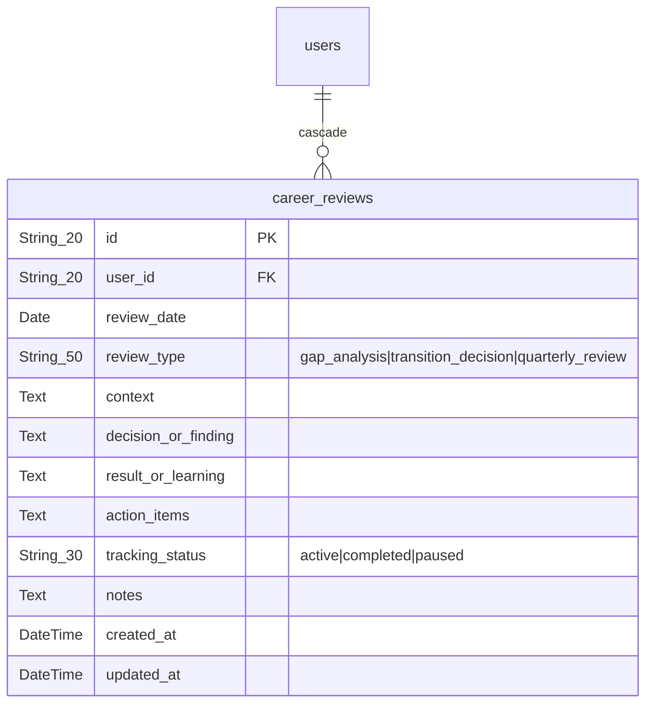
```mermaid
erDiagram
    career_reviews {
        String_20 id PK
        String_20 user_id FK
        Date review_date
        String_50 review_type "gap_analysis|transition_decision|quarterly_review"
        Text context
        Text decision_or_finding
        Text result_or_learning
        Text action_items
        String_30 tracking_status "active|completed|paused"
        Text notes
        DateTime created_at
        DateTime updated_at
    }
    users

    users ||--o{ career_reviews : "cascade"
```

**Atributos:**

- `id`: Identificador único del registro, generado por `id_generator` con prefijo `crv-` + consecutivo. Clave primaria.
- `user_id`: Referencia al usuario dueño de la revisión. Con `ON DELETE CASCADE`, el registro se elimina si se elimina el usuario.
- `review_date`: Fecha en que se realizó la revisión.
- `review_type`: Tipo de revisión: `gap_analysis` (análisis de brechas), `transition_decision` (decisión de transición de carrera) o `quarterly_review` (revisión trimestral). Restringido por `CheckConstraint`.
- `context`: Contexto en el que se realiza la revisión: qué la motivó, qué situación se estaba evaluando.
- `decision_or_finding`: La decisión tomada o el hallazgo principal de la revisión.
- `result_or_learning`: El resultado obtenido o el aprendizaje derivado de la decisión/hallazgo.
- `action_items`: Lista de acciones concretas a seguir como consecuencia de la revisión.
- `tracking_status`: Estado de seguimiento de la revisión: `active` (activa), `completed` (completada) o `paused` (pausada). Restringido por `CheckConstraint`; por defecto `active`.
- `notes`: Campo libre para anotaciones internas sobre este registro.
- `created_at`: Marca de tiempo de creación del registro, asignada automáticamente por el servidor de base de datos.
- `updated_at`: Marca de tiempo de la última modificación, actualizada automáticamente en cada `UPDATE`.

### role_gap_analysis

Gaps identificados entre el perfil actual y los requisitos del rol objetivo, con plan de cierre y viabilidad.

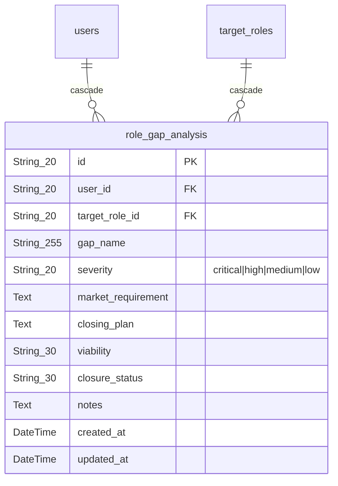
```mermaid
erDiagram
    role_gap_analysis {
        String_20 id PK
        String_20 user_id FK
        String_20 target_role_id FK
        String_255 gap_name
        String_20 severity "critical|high|medium|low"
        Text market_requirement
        Text closing_plan
        String_30 viability
        String_30 closure_status
        Text notes
        DateTime created_at
        DateTime updated_at
    }
    users
    target_roles

    users ||--o{ role_gap_analysis : "cascade"
    target_roles ||--o{ role_gap_analysis : "cascade"
```

**Atributos:**

- `id`: Identificador único del registro, generado por `id_generator` con prefijo `rga-` + consecutivo. Clave primaria.
- `user_id`: Referencia al usuario dueño del análisis. Con `ON DELETE CASCADE`, el registro se elimina si se elimina el usuario.
- `target_role_id`: Referencia obligatoria al rol objetivo (`target_roles`) contra el que se identifica esta brecha. Con `ON DELETE CASCADE`: si se borra el rol objetivo, sus análisis de gap asociados se eliminan también (a diferencia de otras FKs a `target_roles`, que usan `SET NULL`).
- `gap_name`: Nombre corto de la brecha identificada (ej. "Falta de experiencia en gestión de P&L").
- `severity`: Severidad de la brecha: `critical`, `high`, `medium` o `low`. Restringido por `CheckConstraint`.
- `market_requirement`: Descripción del requisito de mercado que expone esta brecha (qué exige el mercado que el usuario aún no cumple).
- `closing_plan`: Plan de acción propuesto para cerrar la brecha.
- `viability`: Viabilidad de cerrar la brecha: `viable`, `viable_with_caveats` (viable con condiciones) o `not_viable`. Restringido por `CheckConstraint`.
- `closure_status`: Estado de avance del cierre de la brecha: `not_started`, `in_progress`, `completed` o `paused`. Restringido por `CheckConstraint`; por defecto `not_started`.
- `notes`: Campo libre para anotaciones internas sobre este registro.
- `created_at`: Marca de tiempo de creación del registro, asignada automáticamente por el servidor de base de datos.
- `updated_at`: Marca de tiempo de la última modificación, actualizada automáticamente en cada `UPDATE`.

### fit_scoring_factors

Factores ponderados para calcular el porcentaje de fit de una vacante.

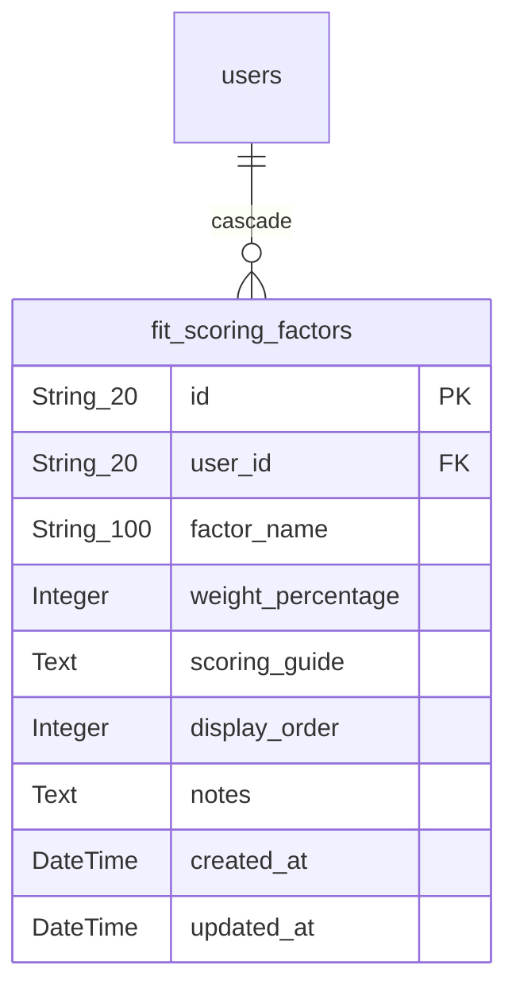
```mermaid
erDiagram
    fit_scoring_factors {
        String_20 id PK
        String_20 user_id FK
        String_100 factor_name
        Integer weight_percentage
        Text scoring_guide
        Integer display_order
        Text notes
        DateTime created_at
        DateTime updated_at
    }
    users

    users ||--o{ fit_scoring_factors : "cascade"
```

**Atributos:**

- `id`: Identificador único del registro, generado por `id_generator` con prefijo `fsf-` + consecutivo. Clave primaria.
- `user_id`: Referencia al usuario dueño del factor de scoring. Con `ON DELETE CASCADE`, el registro se elimina si se elimina el usuario.
- `factor_name`: Nombre del factor considerado al calcular el fit de una vacante (ej. "Alineación de salario", "Modalidad remota").
- `weight_percentage`: Peso porcentual que este factor tiene en el cálculo total del fit (la suma de todos los factores debería acercarse a 100%, aunque no se valida a nivel de BD).
- `scoring_guide`: Guía textual de cómo puntuar este factor (qué valores dan qué puntaje), usada como criterio consistente al evaluar vacantes.
- `display_order`: Orden de visualización del factor en listados/formularios.
- `notes`: Campo libre para anotaciones internas sobre este registro.
- `created_at`: Marca de tiempo de creación del registro, asignada automáticamente por el servidor de base de datos.
- `updated_at`: Marca de tiempo de la última modificación, actualizada automáticamente en cada `UPDATE`.

### market_segments

Canales del mercado visible y oculto con estadísticas de conversión y prioridad.

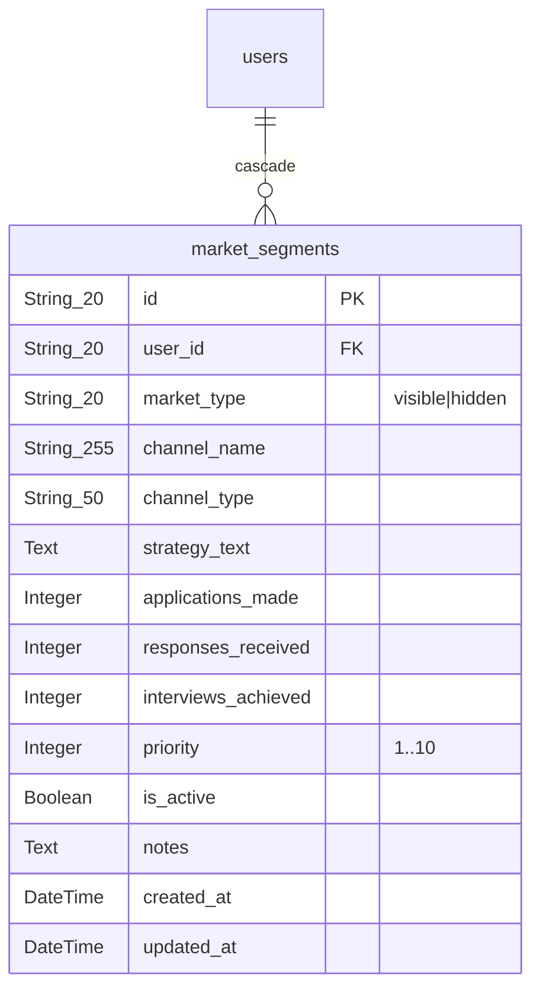
```mermaid
erDiagram
    market_segments {
        String_20 id PK
        String_20 user_id FK
        String_20 market_type "visible|hidden"
        String_255 channel_name
        String_50 channel_type
        Text strategy_text
        Integer applications_made
        Integer responses_received
        Integer interviews_achieved
        Integer priority "1..10"
        Boolean is_active
        Text notes
        DateTime created_at
        DateTime updated_at
    }
    users

    users ||--o{ market_segments : "cascade"
```

**Atributos:**

- `id`: Identificador único del registro, generado por `id_generator` con prefijo `mks-` + consecutivo. Clave primaria.
- `user_id`: Referencia al usuario dueño del segmento de mercado. Con `ON DELETE CASCADE`, el registro se elimina si se elimina el usuario.
- `market_type`: Tipo de mercado del canal: `visible` (mercado abierto, ej. portales de empleo) u `hidden` (mercado oculto, ej. referidos/networking). Restringido por `CheckConstraint`.
- `channel_name`: Nombre del canal de búsqueda (ej. "LinkedIn Jobs", "Referidos de excompañeros").
- `channel_type`: Tipo/categoría del canal (ej. "portal de empleo", "networking directo", "headhunter").
- `strategy_text`: Descripción de la estrategia a seguir en este canal.
- `applications_made`: Número de aplicaciones realizadas a través de este canal, usado para medir efectividad. Por defecto `0`.
- `responses_received`: Número de respuestas recibidas a partir de aplicaciones por este canal. Por defecto `0`.
- `interviews_achieved`: Número de entrevistas logradas a partir de este canal. Por defecto `0`.
- `priority`: Prioridad del canal, restringida por `CheckConstraint` a un valor entre 1 y 10 (mayor prioridad = más foco de esfuerzo).
- `is_active`: Indica si el canal sigue activo en la estrategia de búsqueda actual. Por defecto `true`.
- `notes`: Campo libre para anotaciones internas sobre este registro.
- `created_at`: Marca de tiempo de creación del registro, asignada automáticamente por el servidor de base de datos.
- `updated_at`: Marca de tiempo de la última modificación, actualizada automáticamente en cada `UPDATE`.

### role_narratives

Narrativas reutilizables por rol objetivo para usar en entrevistas y presentaciones.

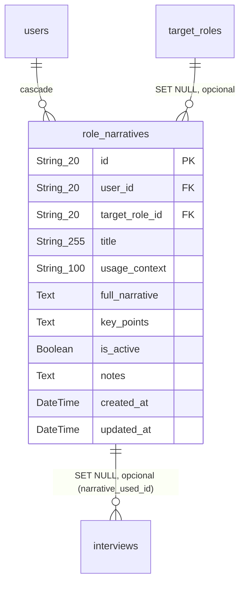
```mermaid
erDiagram
    role_narratives {
        String_20 id PK
        String_20 user_id FK
        String_20 target_role_id FK
        String_255 title
        String_100 usage_context
        Text full_narrative
        Text key_points
        Boolean is_active
        Text notes
        DateTime created_at
        DateTime updated_at
    }
    users
    target_roles
    interviews

    users ||--o{ role_narratives : "cascade"
    target_roles ||--o{ role_narratives : "SET NULL, opcional"
    role_narratives ||--o{ interviews : "SET NULL, opcional (narrative_used_id)"
```

**Atributos:**

- `id`: Identificador único del registro, generado por `id_generator` con prefijo `rna-` + consecutivo. Clave primaria.
- `user_id`: Referencia al usuario dueño de la narrativa. Con `ON DELETE CASCADE`, el registro se elimina si se elimina el usuario.
- `target_role_id`: Referencia opcional al rol objetivo (`target_roles`) para el que se preparó esta narrativa. Con `ON DELETE SET NULL`: si se borra el rol, la narrativa se conserva sin vínculo.
- `title`: Título de la narrativa (ej. "Elevator pitch para roles de Data Leadership").
- `usage_context`: Contexto de uso previsto para la narrativa (ej. "entrevista inicial", "carta de presentación", "networking event").
- `full_narrative`: El texto completo de la narrativa lista para usarse.
- `key_points`: Puntos clave a resaltar al usar esta narrativa, como guía rápida.
- `is_active`: Indica si la narrativa sigue vigente para uso actual. Por defecto `true`.
- `notes`: Campo libre para anotaciones internas sobre este registro.
- `created_at`: Marca de tiempo de creación del registro, asignada automáticamente por el servidor de base de datos.
- `updated_at`: Marca de tiempo de la última modificación, actualizada automáticamente en cada `UPDATE`.

### search_plans

Planes semanales de búsqueda con targets de CVs, entrevistas y ofertas, y seguimiento de progreso.

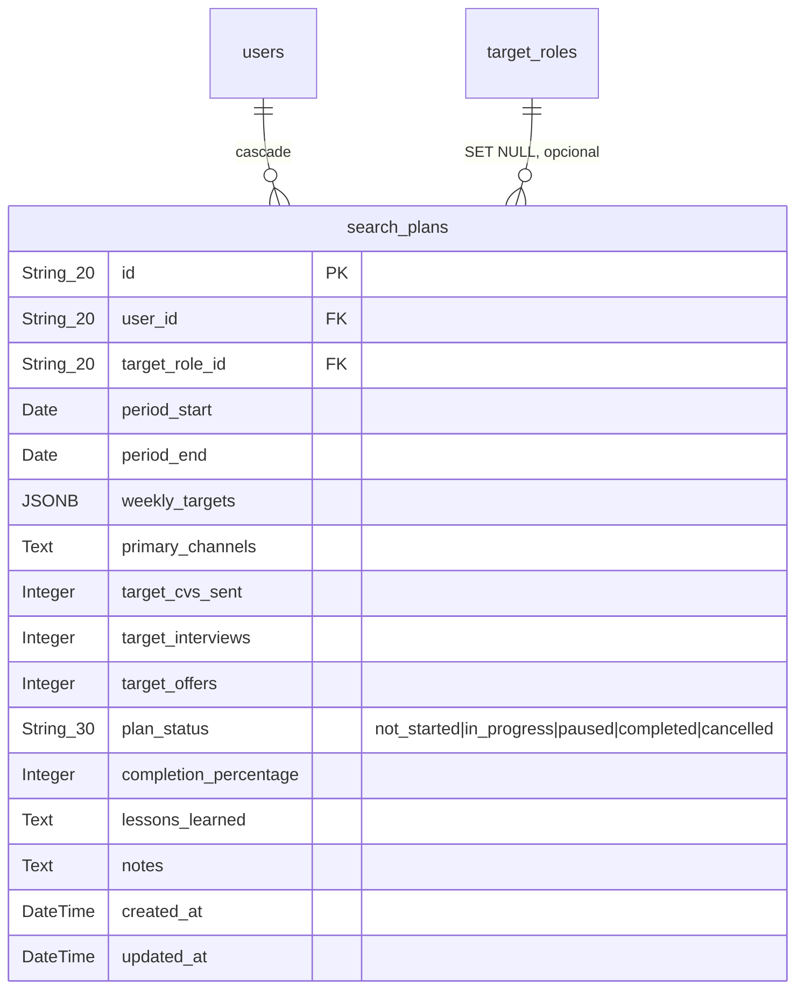
```mermaid
erDiagram
    search_plans {
        String_20 id PK
        String_20 user_id FK
        String_20 target_role_id FK
        Date period_start
        Date period_end
        JSONB weekly_targets
        Text primary_channels
        Integer target_cvs_sent
        Integer target_interviews
        Integer target_offers
        String_30 plan_status "not_started|in_progress|paused|completed|cancelled"
        Integer completion_percentage
        Text lessons_learned
        Text notes
        DateTime created_at
        DateTime updated_at
    }
    users
    target_roles

    users ||--o{ search_plans : "cascade"
    target_roles ||--o{ search_plans : "SET NULL, opcional"
```

**Atributos:**

- `id`: Identificador único del registro, generado por `id_generator` con prefijo `spl-` + consecutivo. Clave primaria.
- `user_id`: Referencia al usuario dueño del plan de búsqueda. Con `ON DELETE CASCADE`, el registro se elimina si se elimina el usuario.
- `target_role_id`: Referencia opcional al rol objetivo (`target_roles`) al que aplica este plan. Con `ON DELETE SET NULL`: si se borra el rol, el plan se conserva sin vínculo.
- `period_start`: Fecha de inicio del periodo que cubre el plan (típicamente semanal).
- `period_end`: Fecha de fin del periodo que cubre el plan.
- `weekly_targets`: Estructura JSON con los objetivos semanales desglosados (ej. número de aplicaciones, contactos de networking, entrevistas por semana).
- `primary_channels`: Canales principales de búsqueda priorizados para este periodo.
- `target_cvs_sent`: Meta de número de CVs a enviar durante el periodo.
- `target_interviews`: Meta de número de entrevistas a lograr durante el periodo.
- `target_offers`: Meta de número de ofertas a conseguir durante el periodo.
- `plan_status`: Estado del plan: `not_started`, `in_progress`, `paused`, `completed` o `cancelled`. Restringido por `CheckConstraint`; por defecto `not_started`.
- `completion_percentage`: Porcentaje de avance del plan respecto a sus metas. Por defecto `0`.
- `lessons_learned`: Aprendizajes obtenidos durante la ejecución del plan, útiles para ajustar el siguiente periodo.
- `notes`: Campo libre para anotaciones internas sobre este registro.
- `created_at`: Marca de tiempo de creación del registro, asignada automáticamente por el servidor de base de datos.
- `updated_at`: Marca de tiempo de la última modificación, actualizada automáticamente en cada `UPDATE`.

## Grupo: Portafolio y Publicaciones

### projects

Proyectos de portafolio con estructura completa: problema, solución, arquitectura, métricas, resultados y publicación.

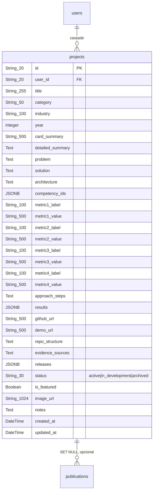
```mermaid
erDiagram
    projects {
        String_20 id PK
        String_20 user_id FK
        String_255 title
        String_50 category
        String_100 industry
        Integer year
        String_500 card_summary
        Text detailed_summary
        Text problem
        Text solution
        Text architecture
        JSONB competency_ids
        String_100 metric1_label
        String_500 metric1_value
        String_100 metric2_label
        String_500 metric2_value
        String_100 metric3_label
        String_500 metric3_value
        String_100 metric4_label
        String_500 metric4_value
        Text approach_steps
        JSONB results
        String_500 github_url
        String_500 demo_url
        Text repo_structure
        Text evidence_sources
        JSONB releases
        String_30 status "active|in_development|archived"
        Boolean is_featured
        String_1024 image_url
        Text notes
        DateTime created_at
        DateTime updated_at
    }
    users
    publications

    users ||--o{ projects : "cascade"
    projects ||--o{ publications : "SET NULL, opcional"
```

**Atributos:**

- `id`: Identificador único del registro, generado por `id_generator` con prefijo `prj-` + consecutivo. Clave primaria.
- `user_id`: Referencia al usuario dueño del proyecto. Con `ON DELETE CASCADE`, el registro se elimina si se elimina el usuario.
- `title`: Título del proyecto tal como se muestra en CV/portal.
- `category`: Categoría del proyecto (ej. "Automatización", "Data", "IA aplicada"), usada para filtrar/agrupar en el portal.
- `industry`: Industria o sector al que pertenece el proyecto.
- `year`: Año en que se realizó el proyecto.
- `card_summary`: Resumen breve pensado para mostrarse en una tarjeta/preview del portal (longitud acotada).
- `detailed_summary`: Resumen más extenso del proyecto para la vista de detalle.
- `problem`: Descripción del problema de negocio que el proyecto buscaba resolver.
- `solution`: Descripción de la solución implementada.
- `architecture`: Descripción de la arquitectura técnica del proyecto.
- `competency_ids`: Lista JSON de IDs de `competencies` demostradas por el proyecto; la resolución "encontrar o crear" competencias se hace en `CareerRepository._resolve_competency_ids`, no en este modelo.
- `metric1_label` / `metric1_value`: Primer par etiqueta/valor de hasta 4 métricas del proyecto (slots fijos en vez de un JSON, para que el formulario del admin sea 2 campos simples por métrica en lugar de JSON escrito a mano). Ninguna métrica es obligatoria; un slot sin usar se deja vacío.
- `metric2_label` / `metric2_value`: Segundo par etiqueta/valor de métrica, mismo patrón que el anterior.
- `metric3_label` / `metric3_value`: Tercer par etiqueta/valor de métrica, mismo patrón que el anterior.
- `metric4_label` / `metric4_value`: Cuarto par etiqueta/valor de métrica, mismo patrón que el anterior.
- `approach_steps`: Pasos del enfoque/metodología seguida en el proyecto.
- `results`: Estructura JSON con los resultados obtenidos, más flexible que los 4 slots fijos de métricas (para resultados que no encajan en el formato etiqueta/valor).
- `github_url`: URL al repositorio del proyecto en GitHub, si aplica.
- `demo_url`: URL a una demo pública o video del proyecto, si aplica.
- `repo_structure`: Descripción de la estructura del repositorio/código, útil para explicar la organización técnica del proyecto.
- `evidence_sources`: Fuentes de evidencia adicionales que respaldan el proyecto (reportes, capturas, testimonios).
- `releases`: Estructura JSON con el historial de versiones/releases del proyecto, si aplica.
- `status`: Estado del proyecto: `active`, `in_development` o `archived`. Restringido por `CheckConstraint`; por defecto `active`.
- `is_featured`: Marca si el proyecto se destaca como featured en el portal público (ej. listado de proyectos destacados). Por defecto `false`.
- `image_url`: URL de la imagen de portada del proyecto, usada en tarjetas y vista de detalle del portal.
- `notes`: Campo libre para anotaciones internas sobre este registro.
- `created_at`: Marca de tiempo de creación del registro, asignada automáticamente por el servidor de base de datos.
- `updated_at`: Marca de tiempo de la última modificación, actualizada automáticamente en cada `UPDATE`.

### publications

Posts y artículos de blog que alimentan el portal público, con métricas de engagement.

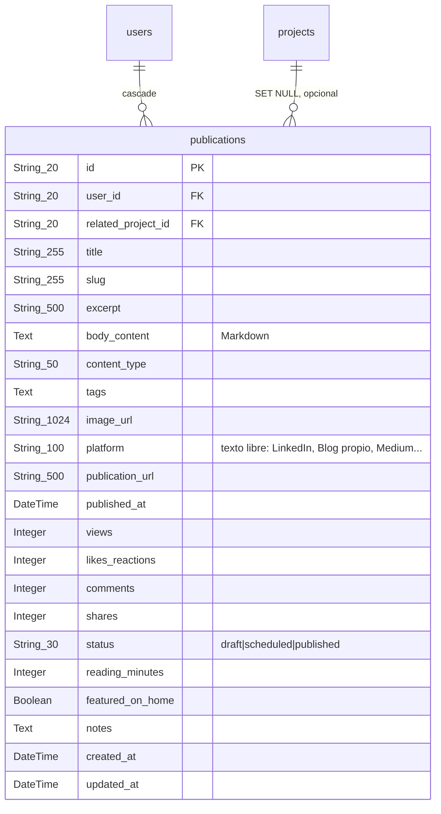
```mermaid
erDiagram
    publications {
        String_20 id PK
        String_20 user_id FK
        String_20 related_project_id FK
        String_255 title
        String_255 slug
        String_500 excerpt
        Text body_content "Markdown"
        String_50 content_type
        Text tags
        String_1024 image_url
        String_100 platform "texto libre: LinkedIn, Blog propio, Medium..."
        String_500 publication_url
        DateTime published_at
        Integer views
        Integer likes_reactions
        Integer comments
        Integer shares
        String_30 status "draft|scheduled|published"
        Integer reading_minutes
        Boolean featured_on_home
        Text notes
        DateTime created_at
        DateTime updated_at
    }
    users
    projects

    users ||--o{ publications : "cascade"
    projects ||--o{ publications : "SET NULL, opcional"
```

**Atributos:**

- `id`: Identificador único del registro, generado por `id_generator` con prefijo `pub-` + consecutivo. Clave primaria.
- `user_id`: Referencia al usuario dueño de la publicación. Con `ON DELETE CASCADE`, el registro se elimina si se elimina el usuario.
- `related_project_id`: Referencia opcional al proyecto (`projects`) relacionado con esta publicación (ej. un post que documenta un proyecto de portafolio). Con `ON DELETE SET NULL`: si se borra el proyecto, la publicación se conserva sin vínculo.
- `title`: Título del post/artículo.
- `slug`: Slug de URL amigable del post, usado en las rutas del portal público (ej. `/blog/mi-post`).
- `excerpt`: Extracto o resumen corto del post, usado en tarjetas de listado.
- `body_content`: Contenido completo del post en formato Markdown.
- `content_type`: Tipo de contenido (ej. "artículo", "reflexión", "tutorial").
- `tags`: Etiquetas asociadas al post, en texto libre.
- `image_url`: URL de la imagen de portada del post.
- `platform`: Plataforma donde se publicó, en texto libre (ej. "LinkedIn", "Blog propio", "Medium"). Reemplaza la antigua FK a la tabla `digital_platforms` (eliminada): esta tabla nació de fusionar `content_pieces` + `digital_platforms` + esta tabla en una sola, con `platform` como texto libre en vez de relación formal.
- `publication_url`: URL de la publicación en la plataforma externa, si aplica.
- `published_at`: Fecha y hora de publicación efectiva.
- `views`: Número de vistas/lecturas registradas para esta publicación, usado como métrica de engagement.
- `likes_reactions`: Número de likes o reacciones recibidas.
- `comments`: Número de comentarios recibidos.
- `shares`: Número de veces que se compartió la publicación.
- `status`: Estado de la publicación: `draft` (borrador), `scheduled` (programada) o `published` (publicada). Restringido por `CheckConstraint`; por defecto `draft`.
- `reading_minutes`: Tiempo estimado de lectura en minutos.
- `featured_on_home`: Marca si esta publicación se destaca en el Home del portal público (alimenta la sección de blog destacado del Home).
- `notes`: Campo libre para anotaciones internas sobre este registro.
- `created_at`: Marca de tiempo de creación del registro, asignada automáticamente por el servidor de base de datos.
- `updated_at`: Marca de tiempo de la última modificación, actualizada automáticamente en cada `UPDATE`.

## Grupo: Networking

### networking_contacts

Red profesional con categoría de rol, status de contacto y origen de la relación.

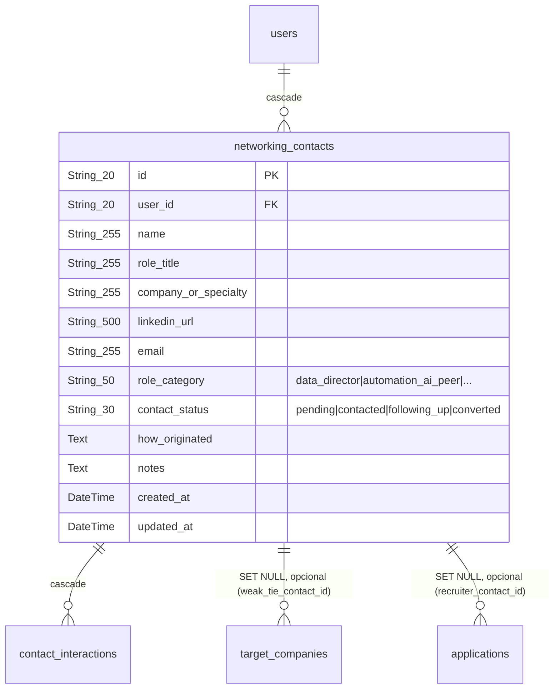
```mermaid
erDiagram
    networking_contacts {
        String_20 id PK
        String_20 user_id FK
        String_255 name
        String_255 role_title
        String_255 company_or_specialty
        String_500 linkedin_url
        String_255 email
        String_50 role_category "data_director|automation_ai_peer|..."
        String_30 contact_status "pending|contacted|following_up|converted"
        Text how_originated
        Text notes
        DateTime created_at
        DateTime updated_at
    }
    users
    contact_interactions
    target_companies
    applications

    users ||--o{ networking_contacts : "cascade"
    networking_contacts ||--o{ contact_interactions : "cascade"
    networking_contacts ||--o{ target_companies : "SET NULL, opcional (weak_tie_contact_id)"
    networking_contacts ||--o{ applications : "SET NULL, opcional (recruiter_contact_id)"
```

**Atributos:**

- `id`: Identificador único del registro, generado por `id_generator` con prefijo `nwc-` + consecutivo. Clave primaria.
- `user_id`: Referencia al usuario dueño del contacto. Con `ON DELETE CASCADE`, el registro se elimina si se elimina el usuario.
- `name`: Nombre del contacto profesional.
- `role_title`: Cargo o título profesional del contacto.
- `company_or_specialty`: Empresa donde trabaja el contacto, o su especialidad si es un contacto independiente (ej. reclutador freelance).
- `linkedin_url`: URL al perfil de LinkedIn del contacto.
- `email`: Correo electrónico de contacto.
- `role_category`: Categoría de rol del contacto dentro de la estrategia de networking: `data_director`, `automation_ai_peer`, `manager_team_lead`, `specialized_recruiter` o `target_company_lead`. Restringido por `CheckConstraint`; indexado porque se filtra frecuentemente por categoría.
- `contact_status`: Estado de la relación con el contacto: `pending` (pendiente de contactar), `contacted` (contactado), `following_up` (en seguimiento) o `converted` (convertido en oportunidad). Restringido por `CheckConstraint`; por defecto `pending`.
- `how_originated`: Cómo se originó el contacto (ej. "evento de networking", "referido por X", "conexión directa en LinkedIn").
- `notes`: Campo libre para anotaciones internas sobre este registro.
- `created_at`: Marca de tiempo de creación del registro, asignada automáticamente por el servidor de base de datos.
- `updated_at`: Marca de tiempo de la última modificación, actualizada automáticamente en cada `UPDATE`.

### contact_interactions

Log de comunicación con un contacto de la red, con referencia opcional a una vacante relacionada.

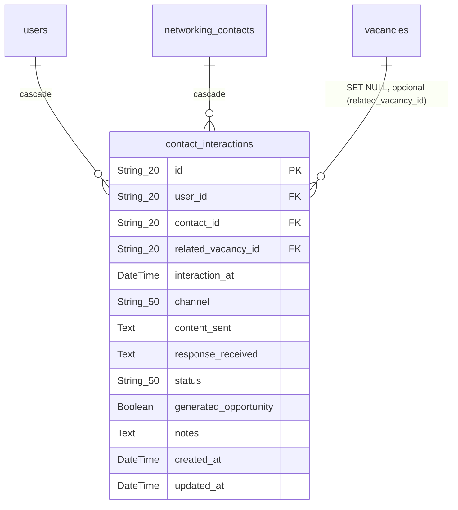
```mermaid
erDiagram
    contact_interactions {
        String_20 id PK
        String_20 user_id FK
        String_20 contact_id FK
        String_20 related_vacancy_id FK
        DateTime interaction_at
        String_50 channel
        Text content_sent
        Text response_received
        String_50 status
        Boolean generated_opportunity
        Text notes
        DateTime created_at
        DateTime updated_at
    }
    users
    networking_contacts
    vacancies

    users ||--o{ contact_interactions : "cascade"
    networking_contacts ||--o{ contact_interactions : "cascade"
    vacancies ||--o{ contact_interactions : "SET NULL, opcional (related_vacancy_id)"
```

**Atributos:**

- `id`: Identificador único del registro, generado por `id_generator` con prefijo `cni-` + consecutivo. Clave primaria.
- `user_id`: Referencia al usuario dueño del registro de interacción. Con `ON DELETE CASCADE`, el registro se elimina si se elimina el usuario.
- `contact_id`: Referencia obligatoria al contacto (`networking_contacts`) con el que se dio esta interacción. Con `ON DELETE CASCADE`: si se borra el contacto, sus interacciones se eliminan también.
- `related_vacancy_id`: Referencia opcional a una vacante (`vacancies`) relacionada con esta interacción, cuando el contacto ayudó o participó en el proceso de una vacante específica. Con `ON DELETE SET NULL`: si se borra la vacante, la interacción se conserva sin vínculo.
- `interaction_at`: Fecha y hora en que ocurrió la interacción.
- `channel`: Canal por el que se dio la comunicación (ej. "email", "LinkedIn", "llamada", "en persona").
- `content_sent`: Contenido del mensaje o comunicación enviada al contacto.
- `response_received`: Respuesta recibida del contacto, si la hubo.
- `status`: Estado de esta interacción (ej. "esperando respuesta", "cerrada").
- `generated_opportunity`: Indica si esta interacción derivó en una oportunidad concreta (ej. una referencia o vacante). Por defecto `false`.
- `notes`: Campo libre para anotaciones internas sobre este registro.
- `created_at`: Marca de tiempo de creación del registro, asignada automáticamente por el servidor de base de datos.
- `updated_at`: Marca de tiempo de la última modificación, actualizada automáticamente en cada `UPDATE`.

### networking_activities

Actividades del plan de networking (give value 70%, share learning 20%, talk about you 10%) con frecuencia y contador de completadas.

```mermaid
erDiagram
    networking_activities {
        String_20 id PK
        String_20 user_id FK
        String_30 category "give_value_70|share_learning_20|talk_about_you_10"
        String_255 activity_type
        Text concrete_action
        Text example
        String_100 frequency_description
        Integer times_completed
        Boolean is_active
        Text notes
        DateTime created_at
        DateTime updated_at
    }
    users

    users ||--o{ networking_activities : "cascade"
```

**Atributos:**

- `id`: Identificador único del registro, generado por `id_generator` con prefijo `nwa-` + consecutivo. Clave primaria.
- `user_id`: Referencia al usuario dueño de la actividad. Con `ON DELETE CASCADE`, el registro se elimina si se elimina el usuario.
- `category`: Categoría de la actividad dentro del marco 70/20/10 de networking: `give_value_70` (dar valor, 70% del esfuerzo), `share_learning_20` (compartir aprendizaje, 20%) o `talk_about_you_10` (hablar de uno mismo, 10%). Restringido por `CheckConstraint`.
- `activity_type`: Tipo específico de actividad dentro de la categoría (ej. "Comentar en publicaciones de la industria", "Compartir un caso de estudio propio").
- `concrete_action`: Descripción de la acción concreta a realizar para esta actividad.
- `example`: Ejemplo ilustrativo de cómo ejecutar esta actividad en la práctica.
- `frequency_description`: Frecuencia recomendada de esta actividad (ej. "2 veces por semana").
- `times_completed`: Contador de veces que se ha realizado esta actividad. Por defecto `0`.
- `is_active`: Indica si la actividad sigue vigente en el plan de networking actual. Por defecto `true`.
- `notes`: Campo libre para anotaciones internas sobre este registro.
- `created_at`: Marca de tiempo de creación del registro, asignada automáticamente por el servidor de base de datos.
- `updated_at`: Marca de tiempo de la última modificación, actualizada automáticamente en cada `UPDATE`.

### target_companies

Empresas objetivo con tier, contacto de referencia y soporte de boards Greenhouse/Lever.

```mermaid
erDiagram
    target_companies {
        String_20 id PK
        String_20 user_id FK
        String_255 company_name
        Integer tier
        String_20 best_fit_role_id FK
        String_50 company_size
        String_100 salary_estimate
        String_100 work_modality
        String_100 target_market
        String_20 weak_tie_contact_id FK
        String_10 priority
        String_30 status
        Text notes
        String_30 career_board_provider "greenhouse|lever"
        String_100 career_board_token
        DateTime created_at
        DateTime updated_at
    }
    users
    target_roles
    networking_contacts

    users ||--o{ target_companies : "cascade"
    target_roles ||--o{ target_companies : "SET NULL, opcional (best_fit_role_id)"
    networking_contacts ||--o{ target_companies : "SET NULL, opcional (weak_tie_contact_id)"
```

**Atributos:**

- `id`: Identificador único del registro, generado por `id_generator` con prefijo `tco-` + consecutivo. Clave primaria.
- `user_id`: Referencia al usuario dueño de la empresa objetivo. Con `ON DELETE CASCADE`, el registro se elimina si se elimina el usuario.
- `company_name`: Nombre de la empresa objetivo.
- `tier`: Nivel de prioridad de la empresa (numérico), usado para clasificar qué tan atractiva es como destino de aplicación. Indexado porque se filtra/ordena por tier.
- `best_fit_role_id`: Referencia opcional al rol objetivo (`target_roles`) que mejor encaja con esta empresa. Con `ON DELETE SET NULL`: si se borra el rol, la empresa se conserva sin vínculo.
- `company_size`: Tamaño de la empresa (ej. "startup", "mediana", "corporativo").
- `salary_estimate`: Estimación salarial para esta empresa, en texto libre.
- `work_modality`: Modalidad de trabajo que ofrece la empresa (ej. "remoto", "híbrido", "presencial").
- `target_market`: Mercado o segmento objetivo de la empresa, relevante para evaluar alineación de industria.
- `weak_tie_contact_id`: Referencia opcional a un contacto de networking (`networking_contacts`) que representa un "weak tie" (conexión débil) hacia esta empresa. Con `ON DELETE SET NULL`: si se borra el contacto, la empresa se conserva sin vínculo.
- `priority`: Prioridad de esta empresa en texto corto (ej. "alta", "media", "baja").
- `status`: Estado de seguimiento de esta empresa objetivo (texto libre, ej. "en investigación", "contactada").
- `notes`: Campo libre para anotaciones internas sobre este registro.
- `career_board_provider`: Proveedor del board de carreras de la empresa, si usa uno soportado para scraping/integración: `greenhouse` o `lever`.
- `career_board_token`: Token o identificador de la empresa dentro del board de carreras del proveedor (ej. slug de Greenhouse/Lever), usado para consultar sus vacantes automáticamente.
- `created_at`: Marca de tiempo de creación del registro, asignada automáticamente por el servidor de base de datos.
- `updated_at`: Marca de tiempo de la última modificación, actualizada automáticamente en cada `UPDATE`.

## Grupo: Vacantes y Postulaciones

### vacancies

Vacantes trackeadas con URL única, porcentaje de fit, evaluación y categoría de seguimiento.

```mermaid
erDiagram
    vacancies {
        String_20 id PK
        String_20 user_id FK
        Integer order_number
        String_255 company
        String_255 exact_role
        String_500 vacancy_url UK
        String_50 source
        Date found_date
        Integer fit_percentage "0..100"
        String_50 track_category
        String_100 recommended_cv_version
        Text analysis_notes
        String_30 evaluation "apply|do_not_apply|pending_review"
        Boolean is_active
        DateTime created_at
        DateTime updated_at
    }
    users
    contact_interactions
    cover_letter_versions
    applications

    users ||--o{ vacancies : "cascade"
    vacancies ||--o{ contact_interactions : "SET NULL, opcional (related_vacancy_id)"
    vacancies ||--o{ cover_letter_versions : "SET NULL, opcional (target_vacancy_id)"
    vacancies ||--o{ applications : "cascade"
```

**Atributos:**

- `id`: Identificador único del registro, generado por `id_generator` con prefijo `vac-` + consecutivo. Clave primaria.
- `user_id`: Referencia al usuario dueño de la vacante trackeada. Con `ON DELETE CASCADE`, el registro se elimina si se elimina el usuario.
- `order_number`: Número de orden manual para ordenar vacantes en listados (ej. prioridad de revisión).
- `company`: Nombre de la empresa que publica la vacante.
- `exact_role`: Título exacto del puesto tal como aparece en la publicación de la vacante.
- `vacancy_url`: URL única de la publicación de la vacante. Restricción `UNIQUE`: evita registrar la misma vacante dos veces (incluye las detectadas por job discovery automático).
- `source`: Fuente donde se encontró la vacante (ej. "LinkedIn", "Greenhouse", "referido").
- `found_date`: Fecha en que se encontró/registró la vacante.
- `fit_percentage`: Porcentaje de encaje (fit) calculado para esta vacante, restringido por `CheckConstraint` a un rango de 0 a 100. Indexado porque se ordena/filtra frecuentemente por fit.
- `track_category`: Categoría de seguimiento de la vacante (ej. "alta prioridad", "explorar", "descartada").
- `recommended_cv_version`: Referencia textual (no FK) a qué versión de CV se recomienda usar para esta vacante.
- `analysis_notes`: Notas del análisis de la vacante: por qué encaja o no, puntos de atención.
- `evaluation`: Evaluación final sobre si aplicar: `apply` (aplicar), `do_not_apply` (no aplicar) o `pending_review` (pendiente de revisión). Restringido por `CheckConstraint`; por defecto `pending_review`. Indexado por ser un filtro común.
- `is_active`: Indica si la vacante sigue activa/vigente para seguimiento. Por defecto `true`.
- `created_at`: Marca de tiempo de creación del registro, asignada automáticamente por el servidor de base de datos.
- `updated_at`: Marca de tiempo de la última modificación, actualizada automáticamente en cada `UPDATE`.

### cv_versions

CV versionado en Markdown por rol objetivo con lista de vacantes objetivo y referencia a archivo.

```mermaid
erDiagram
    cv_versions {
        String_20 id PK
        String_20 user_id FK
        String_20 target_role_id FK
        String_255 title
        Integer length_pages
        String_30 status "draft|approved|final"
        Text content "Markdown"
        JSONB target_vacancy_ids
        String_20 file_upload_id "sin FK real, ver nota"
        Text notes
        DateTime created_at
        DateTime updated_at
    }
    users
    target_roles
    applications

    users ||--o{ cv_versions : "cascade"
    target_roles ||--o{ cv_versions : "SET NULL, opcional"
    cv_versions ||--o{ applications : "SET NULL, opcional"
```

**Atributos:**

- `id`: Identificador único del registro, generado por `id_generator` con prefijo `cvv-` + consecutivo. Clave primaria.
- `user_id`: Referencia al usuario dueño de la versión de CV. Con `ON DELETE CASCADE`, el registro se elimina si se elimina el usuario.
- `target_role_id`: Referencia opcional al rol objetivo (`target_roles`) para el que se preparó este CV. Con `ON DELETE SET NULL`: si se borra el rol, el CV se conserva sin vínculo.
- `title`: Título/nombre de esta versión del CV (ej. "CV — Head of Data v3").
- `length_pages`: Número de páginas del CV generado.
- `status`: Estado de la versión: `draft` (borrador), `approved` (aprobado) o `final` (final). Restringido por `CheckConstraint`; por defecto `draft`.
- `content`: Contenido completo del CV en formato Markdown, en texto libre. Reemplazó a los antiguos campos rígidos `executive_summary`/`key_competencies`/`key_experience`/`featured_achievement` (migración del 21-08-2026) para permitir reestructurar el contenido libremente en vez de ajustarse a 4 slots fijos.
- `target_vacancy_ids`: Lista JSON de IDs de `vacancies` para las que se piensa usar esta versión de CV.
- `file_upload_id`: Identificador (sin `ForeignKey` real de SQLAlchemy) hacia el archivo generado/subido de este CV. Nota de discrepancia conocida en el esquema base: en la base de datos real apunta a la tabla legada singular `file_upload` (de `init.sql`), no a la tabla `file_uploads` usada por el modelo `FileUpload` activo; se dejó sin FK declarada aquí para no acoplarse a la tabla equivocada.
- `notes`: Campo libre para anotaciones internas sobre este registro.
- `created_at`: Marca de tiempo de creación del registro, asignada automáticamente por el servidor de base de datos.
- `updated_at`: Marca de tiempo de la última modificación, actualizada automáticamente en cada `UPDATE`.

### cover_letter_versions

Cartas de presentación versionadas por rol y vacante objetivo.

```mermaid
erDiagram
    cover_letter_versions {
        String_20 id PK
        String_20 user_id FK
        String_20 target_role_id FK
        String_20 target_vacancy_id FK
        String_255 title
        String_30 status "draft|approved|final"
        Text body_content
        String_20 file_upload_id "sin FK real, ver nota"
        Text notes
        DateTime created_at
        DateTime updated_at
    }
    users
    target_roles
    vacancies
    applications

    users ||--o{ cover_letter_versions : "cascade"
    target_roles ||--o{ cover_letter_versions : "SET NULL, opcional"
    vacancies ||--o{ cover_letter_versions : "SET NULL, opcional (target_vacancy_id)"
    cover_letter_versions ||--o{ applications : "SET NULL, opcional"
```

**Atributos:**

- `id`: Identificador único del registro, generado por `id_generator` con prefijo `clv-` + consecutivo. Clave primaria.
- `user_id`: Referencia al usuario dueño de la carta de presentación. Con `ON DELETE CASCADE`, el registro se elimina si se elimina el usuario.
- `target_role_id`: Referencia opcional al rol objetivo (`target_roles`) para el que se preparó esta carta. Con `ON DELETE SET NULL`: si se borra el rol, la carta se conserva sin vínculo.
- `target_vacancy_id`: Referencia opcional a la vacante (`vacancies`) específica para la que se escribió esta carta. Con `ON DELETE SET NULL`: si se borra la vacante, la carta se conserva sin vínculo.
- `title`: Título/nombre de esta versión de carta (ej. "Carta — Empresa X, rol Y").
- `status`: Estado de la versión: `draft`, `approved` o `final`. Restringido por `CheckConstraint`; por defecto `draft`.
- `body_content`: Contenido completo de la carta de presentación.
- `file_upload_id`: Identificador (sin `ForeignKey` real de SQLAlchemy) hacia el archivo generado/subido de esta carta. Misma discrepancia de esquema documentada en `cv_versions.file_upload_id` (apunta a la tabla legada `file_upload`, no a `file_uploads`).
- `notes`: Campo libre para anotaciones internas sobre este registro.
- `created_at`: Marca de tiempo de creación del registro, asignada automáticamente por el servidor de base de datos.
- `updated_at`: Marca de tiempo de la última modificación, actualizada automáticamente en cada `UPDATE`.

### applications

Postulaciones a vacantes con CV, carta, contacto de reclutador, estado actual y resultado final.

```mermaid
erDiagram
    applications {
        String_20 id PK
        String_20 user_id FK
        String_20 vacancy_id FK
        String_20 cv_version_id FK
        String_20 cover_letter_version_id FK
        String_20 recruiter_contact_id FK
        DateTime applied_at
        String_30 current_status "applied|in_process|offer|rejected|archived"
        String_30 final_result "offer_accepted|offer_rejected|rejected|negotiating"
        Text notes
        DateTime created_at
        DateTime updated_at
    }
    users
    vacancies
    cv_versions
    cover_letter_versions
    networking_contacts
    application_interactions
    interviews

    users ||--o{ applications : "cascade"
    vacancies ||--o{ applications : "cascade"
    cv_versions ||--o{ applications : "SET NULL, opcional"
    cover_letter_versions ||--o{ applications : "SET NULL, opcional"
    networking_contacts ||--o{ applications : "SET NULL, opcional (recruiter_contact_id)"
    applications ||--o{ application_interactions : "cascade"
    applications ||--o{ interviews : "cascade"
```

**Atributos:**

- `id`: Identificador único del registro, generado por `id_generator` con prefijo `apl-` + consecutivo. Clave primaria.
- `user_id`: Referencia al usuario dueño de la postulación. Con `ON DELETE CASCADE`, el registro se elimina si se elimina el usuario.
- `vacancy_id`: Referencia obligatoria a la vacante (`vacancies`) a la que se postuló. Con `ON DELETE CASCADE`: si se borra la vacante, sus postulaciones se eliminan también.
- `cv_version_id`: Referencia opcional a la versión de CV (`cv_versions`) usada en esta postulación. Con `ON DELETE SET NULL`: si se borra el CV, la postulación se conserva sin vínculo.
- `cover_letter_version_id`: Referencia opcional a la versión de carta de presentación (`cover_letter_versions`) usada en esta postulación. Con `ON DELETE SET NULL`: si se borra la carta, la postulación se conserva sin vínculo.
- `recruiter_contact_id`: Referencia opcional al contacto de networking (`networking_contacts`) que actúa como reclutador de esta postulación. Con `ON DELETE SET NULL`: si se borra el contacto, la postulación se conserva sin vínculo.
- `applied_at`: Fecha y hora en que se envió la postulación.
- `current_status`: Estado actual de la postulación: `applied` (postulada), `in_process` (en proceso), `offer` (oferta recibida), `rejected` (rechazada) o `archived` (archivada). Restringido por `CheckConstraint`; por defecto `applied`. Indexado por ser un filtro frecuente.
- `final_result`: Resultado final de la postulación una vez cerrada: `offer_accepted`, `offer_rejected`, `rejected` o `negotiating`. Restringido por `CheckConstraint`.
- `notes`: Campo libre para anotaciones internas sobre este registro.
- `created_at`: Marca de tiempo de creación del registro, asignada automáticamente por el servidor de base de datos.
- `updated_at`: Marca de tiempo de la última modificación, actualizada automáticamente en cada `UPDATE`.

### application_interactions

Log de comunicación durante el proceso de una postulación (llamadas, emails, mensajes).

```mermaid
erDiagram
    application_interactions {
        String_20 id PK
        String_20 user_id FK
        String_20 application_id FK
        DateTime interaction_at
        String_50 channel
        Text content_sent
        Text response_received
        String_50 status
        Text notes
        DateTime created_at
        DateTime updated_at
    }
    users
    applications

    users ||--o{ application_interactions : "cascade"
    applications ||--o{ application_interactions : "cascade"
```

**Atributos:**

- `id`: Identificador único del registro, generado por `id_generator` con prefijo `ain-` + consecutivo. Clave primaria.
- `user_id`: Referencia al usuario dueño del registro de interacción. Con `ON DELETE CASCADE`, el registro se elimina si se elimina el usuario.
- `application_id`: Referencia obligatoria a la postulación (`applications`) durante la que ocurrió esta interacción. Con `ON DELETE CASCADE`: si se borra la postulación, sus interacciones se eliminan también.
- `interaction_at`: Fecha y hora en que ocurrió la interacción.
- `channel`: Canal por el que se dio la comunicación (ej. "email", "llamada", "mensaje").
- `content_sent`: Contenido enviado durante la interacción.
- `response_received`: Respuesta recibida, si la hubo.
- `status`: Estado de esta interacción (texto libre).
- `notes`: Campo libre para anotaciones internas sobre este registro.
- `created_at`: Marca de tiempo de creación del registro, asignada automáticamente por el servidor de base de datos.
- `updated_at`: Marca de tiempo de la última modificación, actualizada automáticamente en cada `UPDATE`.

### interviews

Entrevistas por postulación con tipo, preguntas/respuestas, feedback e impresión general.

```mermaid
erDiagram
    interviews {
        String_20 id PK
        String_20 user_id FK
        String_20 application_id FK
        String_20 narrative_used_id FK
        String_50 interview_type
        DateTime scheduled_at
        Text interviewers
        Text questions_asked
        Text answers_given
        Text feedback_received
        String_20 overall_impression "very_positive|positive|neutral|negative"
        String_30 interview_result "pending|advanced|rejected|under_consideration"
        Text notes
        DateTime created_at
        DateTime updated_at
    }
    users
    applications
    role_narratives

    users ||--o{ interviews : "cascade"
    applications ||--o{ interviews : "cascade"
    role_narratives ||--o{ interviews : "SET NULL, opcional (narrative_used_id)"
```

**Atributos:**

- `id`: Identificador único del registro, generado por `id_generator` con prefijo `ivw-` + consecutivo. Clave primaria.
- `user_id`: Referencia al usuario dueño de la entrevista. Con `ON DELETE CASCADE`, el registro se elimina si se elimina el usuario.
- `application_id`: Referencia obligatoria a la postulación (`applications`) a la que pertenece esta ronda de entrevista. Con `ON DELETE CASCADE`: si se borra la postulación, sus entrevistas se eliminan también.
- `narrative_used_id`: Referencia opcional a la narrativa (`role_narratives`) usada como base de discurso en esta entrevista. Con `ON DELETE SET NULL`: si se borra la narrativa, la entrevista se conserva sin vínculo.
- `interview_type`: Tipo de entrevista (ej. "técnica", "cultural fit", "con hiring manager", "final con C-level").
- `scheduled_at`: Fecha y hora programada de la entrevista.
- `interviewers`: Nombres/roles de las personas que entrevistaron.
- `questions_asked`: Preguntas realizadas durante la entrevista, registradas para preparación futura.
- `answers_given`: Respuestas dadas durante la entrevista.
- `feedback_received`: Retroalimentación recibida después de la entrevista, si la hubo.
- `overall_impression`: Impresión general propia sobre cómo fue la entrevista: `very_positive`, `positive`, `neutral` o `negative`. Restringido por `CheckConstraint`.
- `interview_result`: Resultado de la entrevista: `pending` (pendiente), `advanced` (se avanzó a la siguiente etapa), `rejected` (rechazado) o `under_consideration` (en consideración). Restringido por `CheckConstraint`.
- `notes`: Campo libre para anotaciones internas sobre este registro.
- `created_at`: Marca de tiempo de creación del registro, asignada automáticamente por el servidor de base de datos.
- `updated_at`: Marca de tiempo de la última modificación, actualizada automáticamente en cada `UPDATE`.

## Grupo: Portal Público

### portal_home

Hero y stats del Home del portal público. Singleton 1:1 con `users`.

```mermaid
erDiagram
    portal_home {
        String_20 id PK
        String_20 user_id FK, UK "1:1 con users"
        String_1024 hero_photo_url
        String_255 hero_title
        String_500 hero_subtitle
        Text hero_intro
        String_100 cta1_label
        String_1024 cta1_url
        String_100 cta2_label
        String_1024 cta2_url
        String_100 stat1_label
        String_50 stat1_value
        String_100 stat2_label
        String_50 stat2_value
        String_100 stat3_label
        String_50 stat3_value
        String_100 stat4_label
        String_50 stat4_value
        Text notes
        DateTime created_at
        DateTime updated_at
    }
    users

    users ||--|| portal_home : "cascade, unique user_id"
```

**Atributos:**

- `id`: Identificador único del registro, generado por `id_generator` con prefijo `phm-` + consecutivo. Clave primaria.
- `user_id`: Referencia al usuario dueño de esta configuración del Home. Único (`UK`) porque es singleton 1:1 con `users`. Con `ON DELETE CASCADE`, el registro se elimina si se elimina el usuario.
- `hero_photo_url`: URL de la foto principal mostrada en el hero del Home.
- `hero_title`: Título principal del hero (el titular más visible de la página).
- `hero_subtitle`: Subtítulo del hero, complementa al título principal.
- `hero_intro`: Texto introductorio más extenso mostrado en el hero.
- `cta1_label`: Etiqueta del primer botón de llamada a la acción (CTA), renderizado como botón primario. Slot fijo en vez de una lista JSON para que el formulario del admin sea 2 campos simples por botón.
- `cta1_url`: URL de destino del primer CTA.
- `cta2_label`: Etiqueta del segundo botón de llamada a la acción, renderizado como botón secundario.
- `cta2_url`: URL de destino del segundo CTA.
- `stat1_label`: Etiqueta de la primera estadística destacada del hero (ej. "Años de experiencia"). Slots fijos (hasta 4) en vez de JSON, mismo razonamiento que los CTAs.
- `stat1_value`: Valor de la primera estadística (ej. "10+").
- `stat2_label`: Etiqueta de la segunda estadística destacada.
- `stat2_value`: Valor de la segunda estadística.
- `stat3_label`: Etiqueta de la tercera estadística destacada.
- `stat3_value`: Valor de la tercera estadística.
- `stat4_label`: Etiqueta de la cuarta estadística destacada.
- `stat4_value`: Valor de la cuarta estadística.
- `notes`: Campo libre para anotaciones internas sobre este registro. Nota: el bloque de proyecto/logro destacado y publicaciones destacadas del Home NO se duplican aquí — el portal lee `projects.is_featured`, `publications.featured_on_home` y la fila con `achievements.home = true` directamente.
- `created_at`: Marca de tiempo de creación del registro, asignada automáticamente por el servidor de base de datos.
- `updated_at`: Marca de tiempo de la última modificación, actualizada automáticamente en cada `UPDATE`.

### portal_about

Contenido extra de la página Sobre mí del portal (la bio principal vive en `identity`). Singleton 1:1 con `users`.

```mermaid
erDiagram
    portal_about {
        String_20 id PK
        String_20 user_id FK, UK "1:1 con users"
        String_1024 photo_url
        String_255 name
        Text notes
        DateTime created_at
        DateTime updated_at
    }
    users

    users ||--|| portal_about : "cascade, unique user_id"
```

**Atributos:**

- `id`: Identificador único del registro, generado por `id_generator` con prefijo `pab-` + consecutivo. Clave primaria.
- `user_id`: Referencia al usuario dueño de esta configuración de "Sobre mí". Único (`UK`) porque es singleton 1:1 con `users`. Con `ON DELETE CASCADE`, el registro se elimina si se elimina el usuario.
- `photo_url`: URL de la foto mostrada en la página "Sobre mí" del portal.
- `name`: Nombre a mostrar en esa página (puede diferir del nombre legal de `personal_profile` si se usa una forma de marca).
- `notes`: Campo libre para anotaciones internas sobre este registro. Nota: esta tabla es deliberadamente escueta — la bio/tagline ya vive en `identity`, y la experiencia/competencias/certificaciones ya viven en `work_history`/`competencies`/`certifications`; aquí solo se guarda lo que falta (la foto y el nombre mostrado).
- `created_at`: Marca de tiempo de creación del registro, asignada automáticamente por el servidor de base de datos.
- `updated_at`: Marca de tiempo de la última modificación, actualizada automáticamente en cada `UPDATE`.

### portal_contact

Contacto y footer del portal: email, WhatsApp, disponibilidad y enlaces sociales. Singleton 1:1 con `users`.

```mermaid
erDiagram
    portal_contact {
        String_20 id PK
        String_20 user_id FK, UK "1:1 con users"
        String_255 contact_email
        String_50 whatsapp
        String_255 location
        String_50 availability_status
        String_100 preferred_contact_method
        JSONB footer_links "[{label,url}]"
        Text notes
        DateTime created_at
        DateTime updated_at
    }
    users

    users ||--|| portal_contact : "cascade, unique user_id"
```

**Atributos:**

- `id`: Identificador único del registro, generado por `id_generator` con prefijo `pco-` + consecutivo. Clave primaria.
- `user_id`: Referencia al usuario dueño de esta configuración de contacto. Único (`UK`) porque es singleton 1:1 con `users`. Con `ON DELETE CASCADE`, el registro se elimina si se elimina el usuario.
- `contact_email`: Correo electrónico de contacto público mostrado en el portal.
- `whatsapp`: Número de WhatsApp de contacto público.
- `location`: Ubicación mostrada públicamente (puede ser más general que la ciudad/país exactos de `personal_profile`).
- `availability_status`: Estado de disponibilidad mostrado públicamente (ej. "Disponible para nuevos retos", "No disponible actualmente").
- `preferred_contact_method`: Método de contacto preferido indicado a visitantes del portal (ej. "email", "WhatsApp", "formulario").
- `footer_links`: Estructura JSON de enlaces adicionales del pie de página del portal, en formato `[{label, url}, ...]`. Cubre cualquier enlace que no sea LinkedIn/GitHub (esos se leen directamente de `linkedin_profile`/`github_profile`), como descarga de CV, X/Twitter o un segundo correo.
- `notes`: Campo libre para anotaciones internas sobre este registro.
- `created_at`: Marca de tiempo de creación del registro, asignada automáticamente por el servidor de base de datos.
- `updated_at`: Marca de tiempo de la última modificación, actualizada automáticamente en cada `UPDATE`.

## Grupo: Métricas

### metrics

Snapshot de métricas de perfil calculadas: completitud, actividad, aplicaciones, networking y puntuaciones globales. Singleton 1:1 con `users`.

```mermaid
erDiagram
    metrics {
        Integer id PK
        String_20 user_id FK, UK "1:1 con users"
        Float profile_completion_percentage
        Float identity_completion
        Integer competencies_count
        Integer evidence_count
        Integer total_events
        Integer events_last_30_days
        Integer events_last_90_days
        DateTime last_activity_date
        Integer job_applications_count
        Integer interviews_count
        Integer offers_received
        Integer interviews_completed
        Integer networking_contacts_count
        Integer active_contacts
        Integer projects_count
        Integer positions_count
        Integer achievements_count
        Integer certifications_count
        Integer technical_skills_count
        Integer transferable_skills_count
        Integer business_skills_count
        Float average_proficiency_score
        Integer logins_count
        Integer logins_last_30_days
        Float average_session_duration
        Integer profile_views
        Integer files_uploaded
        Integer files_downloaded
        Float overall_profile_score
        Float career_readiness_score
        Float market_competitiveness_score
        Float profile_views_trend
        Float engagement_trend
        JSON extra_metadata
        DateTime created_at
        DateTime updated_at
        DateTime computed_at
    }
    users

    users ||--|| metrics : "cascade, unique user_id"
```

**Atributos:**

- `id`: Identificador autoincremental entero (no usa el esquema de prefijos `id_generator` de las demás tablas de este dominio). Clave primaria.
- `user_id`: Referencia al usuario dueño de este snapshot de métricas. Único (`UK`) porque es singleton 1:1 con `users`. Con `ON DELETE CASCADE`, el registro se elimina si se elimina el usuario.
- `profile_completion_percentage`: Porcentaje de completitud general del perfil, calculado periódicamente a partir de cuántas secciones/campos clave están llenos.
- `identity_completion`: Porcentaje de completitud específico de la sección de identidad profesional.
- `competencies_count`: Número total de competencias registradas.
- `evidence_count`: Número total de piezas de evidencia (logros, proyectos, certificaciones, etc.) registradas.
- `total_events`: Número total de eventos de actividad registrados en el sistema para este usuario.
- `events_last_30_days`: Número de eventos de actividad en los últimos 30 días.
- `events_last_90_days`: Número de eventos de actividad en los últimos 90 días.
- `last_activity_date`: Fecha de la última actividad registrada.
- `job_applications_count`: Número total de postulaciones realizadas.
- `interviews_count`: Número total de entrevistas registradas.
- `offers_received`: Número total de ofertas de trabajo recibidas.
- `interviews_completed`: Número de entrevistas que llegaron a completarse.
- `networking_contacts_count`: Número total de contactos de networking registrados.
- `active_contacts`: Número de contactos de networking considerados activos (en seguimiento reciente).
- `projects_count`: Número total de proyectos de portafolio registrados.
- `positions_count`: Número total de posiciones laborales registradas en `work_history`.
- `achievements_count`: Número total de logros registrados.
- `certifications_count`: Número total de certificaciones registradas.
- `technical_skills_count`: Número de competencias clasificadas como técnicas.
- `transferable_skills_count`: Número de competencias clasificadas como transferibles.
- `business_skills_count`: Número de competencias clasificadas como de negocio.
- `average_proficiency_score`: Promedio del `proficiency_score` de todas las competencias registradas.
- `logins_count`: Número total histórico de inicios de sesión.
- `logins_last_30_days`: Número de inicios de sesión en los últimos 30 días.
- `average_session_duration`: Duración promedio de sesión, en minutos.
- `profile_views`: Número de veces que el perfil/portal ha sido visto.
- `files_uploaded`: Número total de archivos subidos por el usuario.
- `files_downloaded`: Número total de archivos descargados.
- `overall_profile_score`: Puntuación global del perfil en una escala de 0 a 100, agregando varias señales de completitud y calidad.
- `career_readiness_score`: Puntuación de qué tan listo está el perfil para una búsqueda de empleo activa, escala de 0 a 100.
- `market_competitiveness_score`: Puntuación de qué tan competitivo es el perfil frente al mercado objetivo, escala de 0 a 100.
- `profile_views_trend`: Porcentaje de cambio en vistas del perfil respecto al periodo anterior.
- `engagement_trend`: Porcentaje de cambio en engagement respecto al periodo anterior.
- `extra_metadata`: Estructura JSON abierta para datos adicionales de contexto no cubiertos por las columnas fijas anteriores.
- `created_at`: Marca de tiempo de creación del registro, asignada automáticamente por el servidor de base de datos.
- `updated_at`: Marca de tiempo de la última modificación, actualizada automáticamente en cada `UPDATE`.
- `computed_at`: Marca de tiempo de cuándo se calculó por última vez este snapshot de métricas (distinto de `updated_at`, que refleja cualquier escritura en la fila). Esta tabla es de solo lectura desde la API: se recalcula periódicamente a partir de `events` y otras tablas de evidencia, no se edita manualmente.
