# Tablas de Sistema

Núcleo reutilizable que viaja sin cambios en cualquier réplica de esta API: autenticación y sesiones, archivos, auditoría, notificaciones, motor de agentes IA, navegación del panel de administración y motor de generación de documentos. Ninguna de estas tablas está atada al dominio de negocio concreto.

## Índice

### Grupo: Auth/Sesiones

| Modelo | Tabla BD | Descripción |
|--------|----------|-------------|
| User | users | Cuenta de usuario: credenciales, perfil básico, flags de acceso |
| UserRole | user_roles | Roles nombrados asignables a un usuario (RBAC genérico, complementa `is_superuser`) |
| RefreshToken | refresh_tokens | Refresh JWT persistido y revocable |
| UserSession | user_sessions | Sesiones de login con tracking de dispositivo y actividad |

### Grupo: Archivos

| Modelo | Tabla BD | Descripción |
|--------|----------|-------------|
| FileUpload | file_uploads | Metadatos de archivos en MinIO (categoría, visibilidad, MIME) |

### Grupo: Auditoría y Notificaciones

| Modelo | Tabla BD | Descripción |
|--------|----------|-------------|
| AuditLog | audit_logs | Bitácora de create/update/delete/login (también restore del agente) |
| Event | events | Eventos de actividad de usuario |
| ErrorReport | error_reports | Registro centralizado de fallas del sistema (ADR-018), dedupe por fingerprint |
| UserNotification | user_notifications | Avisos in-app (ADR-016): tarea/subtarea desbloqueada esperando turno del usuario |

### Grupo: Navegación Admin

| Modelo | Tabla BD | Descripción |
|--------|----------|-------------|
| AdminSectionGroup | admin_section_groups | Grupo del sidebar izquierdo del Admin; nunca tiene vistas propias |
| AdminSectionL1 | admin_sections_l1 | Sección de primer nivel bajo un grupo |
| AdminSectionL2 | admin_sections_l2 | Subsección de una L1 |
| AdminSectionL3 | admin_sections_l3 | Subsección de una L2, hoja del árbol |
| AdminView | admin_views | Pestaña/vista de una sección L1/L2/L3; dueño de agente responsable e instrucciones |

### Grupo: Motor de Agentes

| Modelo | Tabla BD | Descripción |
|--------|----------|-------------|
| AgentSystemSettings | agent_system_settings | Fila única de configuración global del motor de agentes (modelo, presupuesto, prompts) |
| AgentSystemProfilePrompt | agent_system_profile_prompts | Suffix editable de system prompt por perfil de agente |
| AgentSystemProfilePhoto | agent_system_profile_photos | Foto por perfil de agente (bucket MinIO) |
| AgentSystemDelegation | agent_system_delegation | Override de destinos de delegación por perfil |
| AgentSystemCustomTool | agent_system_custom_tools | Servidores MCP remotos registrados |
| AgentSystemConversation | agent_system_conversations | Historial de conversación por session_type + agent_profile_id |
| AgentSystemConversationMessage | agent_system_conversation_messages | Mensajes individuales de una conversación del agente |
| AgentSystemUsageLog | agent_system_usage_logs | Costo/tokens por turno del agente |
| AgentSystemUsageRoundLog | agent_system_usage_round_logs | Costo granular por round (Converse, tool, imagen) |
| AgentSystemTask | agent_system_tasks | Tareas/plan del agente con soporte de subtareas y scheduler |

### Grupo: Motor de PDF

| Modelo | Tabla BD | Descripción |
|--------|----------|-------------|
| PdfOutputTemplate | pdf_output_templates | Plantillas HTML para generación de PDF |
| PdfTemplateStyle | pdf_template_styles | CSS reutilizable referenciado por plantillas PDF |

### Grupo: Transversales

| Modelo | Tabla BD | Descripción |
|--------|----------|-------------|
| Tag | tags | Etiquetas transversales aplicables a cualquier entidad |
| OperationalMethodology | operational_methodologies | Protocolos Markdown destinados a perfiles de agente específicos |

## Diagramas

## Grupo: Auth/Sesiones

### users

Cuenta de usuario con credenciales, perfil básico y flags de acceso. Es el ancla de casi todas las demás tablas vía `user_id` + `ON DELETE CASCADE`.

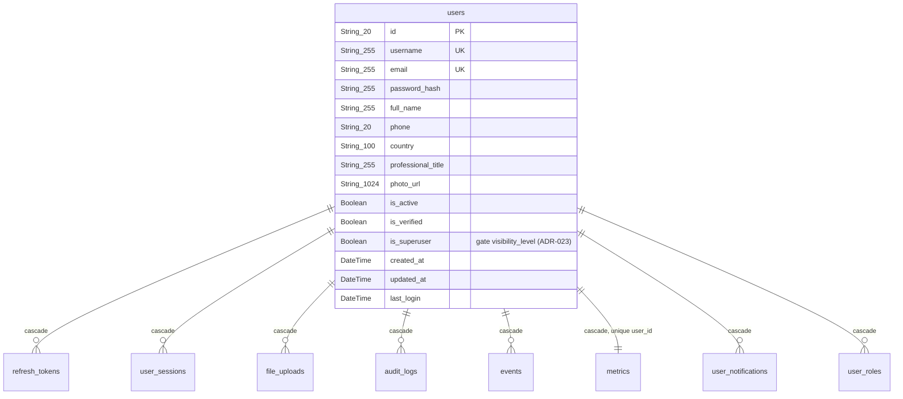
```mermaid
erDiagram
    users {
        String_20 id PK
        String_255 username UK
        String_255 email UK
        String_255 password_hash
        String_255 full_name
        String_20 phone
        String_100 country
        String_255 professional_title
        String_1024 photo_url
        Boolean is_active
        Boolean is_verified
        Boolean is_superuser "gate visibility_level (ADR-023)"
        DateTime created_at
        DateTime updated_at
        DateTime last_login
    }
    refresh_tokens
    user_sessions
    file_uploads
    audit_logs
    events
    metrics
    user_notifications
    user_roles

    users ||--o{ refresh_tokens : "cascade"
    users ||--o{ user_sessions : "cascade"
    users ||--o{ file_uploads : "cascade"
    users ||--o{ audit_logs : "cascade"
    users ||--o{ events : "cascade"
    users ||--|| metrics : "cascade, unique user_id"
    users ||--o{ user_notifications : "cascade"
    users ||--o{ user_roles : "cascade"
```

**Atributos:**

- `id`: Identificador único de la cuenta de usuario, generado por `id_generator` con prefijo `usr` (ej. `usr-1`). Clave primaria y ancla de casi todas las demás tablas del sistema vía `user_id`.
- `username`: Nombre de usuario único usado para autenticación. Indexado y con restricción `UNIQUE` para permitir login por username además de por email.
- `email`: Correo electrónico único de la cuenta. Indexado y `UNIQUE`; segundo canal de identificación/login y de comunicación con el usuario.
- `password_hash`: Hash de la contraseña (nunca la contraseña en texto plano). Se compara contra el hash en cada intento de login.
- `full_name`: Nombre completo del usuario para mostrar en perfil, PDFs y pantallas del Admin. Opcional.
- `phone`: Teléfono de contacto del usuario, en formato libre. Opcional, usado en perfil público/documentos.
- `country`: País de residencia o referencia del usuario. Opcional, informativo para perfil.
- `professional_title`: Título profesional que se muestra junto al nombre (ej. "Full Stack Developer"). Opcional.
- `photo_url`: URL de la foto de perfil del usuario, normalmente almacenada en el bucket MinIO. Opcional.
- `is_active`: Indica si la cuenta puede autenticarse y operar. `false` equivale a una cuenta suspendida/deshabilitada sin borrarla.
- `is_verified`: Indica si el usuario completó el proceso de verificación (ej. de email). No bloquea el login por sí solo, es informativo/de proceso.
- `is_superuser`: Gate genérico y binario introducido en ADR-023 (corrección) que determina qué `visibility_level` puede ver/mutar el usuario (usado en `section_catalog._is_admin_subtree`). Es un interruptor simple superuser/no-superuser, distinto de `user_roles`, que permite modelar varios roles nombrados por usuario. Backfill `true` para las cuentas existentes al migrar; las cuentas nuevas nacen en `false`.
- `created_at`: Fecha y hora de creación del registro. Se asigna automáticamente por `server_default=func.now()` y nunca se actualiza después.
- `updated_at`: Fecha y hora de la última modificación del registro. Se refresca automáticamente en cada `UPDATE` vía `onupdate=func.now()`.
- `last_login`: Fecha y hora del último inicio de sesión exitoso. Se usa para métricas de actividad y detección de cuentas inactivas.

### user_roles

Roles nombrados asignables a un usuario (RBAC genérico y reutilizable en cualquier réplica de la API). Complementa, sin duplicar, el gate binario `is_superuser` de `users` (ADR-023): mientras `is_superuser` es un interruptor simple superuser/no-superuser, `user_roles` permite modelar varios roles con nombre por usuario (ej. `editor`, `revisor`, `soporte`) para autorización más fina cuando el dominio lo requiera. Tabla de diseño propuesta, aún no implementada en `src/models/`.

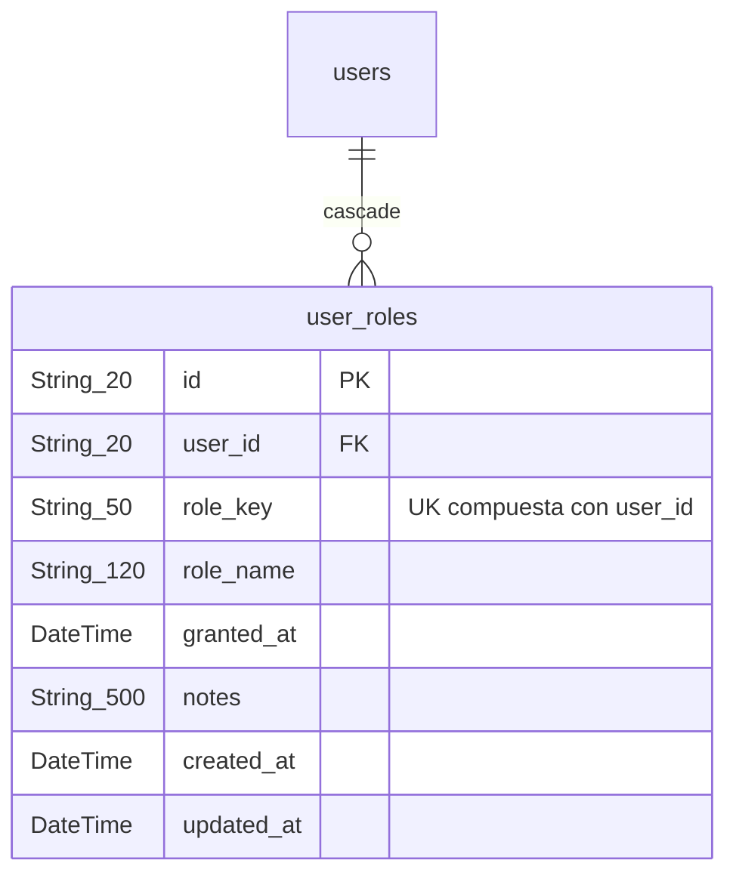
```mermaid
erDiagram
    user_roles {
        String_20 id PK
        String_20 user_id FK
        String_50 role_key "UK compuesta con user_id"
        String_120 role_name
        DateTime granted_at
        String_500 notes
        DateTime created_at
        DateTime updated_at
    }
    users

    users ||--o{ user_roles : "cascade"
```

**Atributos:**

- `id`: Identificador único de la asignación de rol, generado por `id_generator` con prefijo propuesto `rol` (ej. `rol-1`). Clave primaria.
- `user_id`: Referencia al usuario que tiene asignado el rol. Con `ON DELETE CASCADE`, todas sus asignaciones de rol se eliminan si se elimina el usuario.
- `role_key`: Clave corta y estable del rol (ej. `editor`, `revisor`, `soporte`), pensada para lógica de autorización en código. Forma una `UNIQUE` compuesta con `user_id` para que un mismo usuario no tenga el mismo rol duplicado, permitiendo a la vez varios roles distintos por usuario.
- `role_name`: Nombre legible del rol para mostrar en el Admin (ej. "Editor de contenido"). Desacopla la etiqueta visible de la clave usada en código, para poder renombrar sin romper la lógica de autorización.
- `granted_at`: Fecha y hora en que se otorgó el rol al usuario. Permite auditar desde cuándo tiene ese permiso, independientemente de `created_at` del registro.
- `notes`: Texto libre para dejar contexto sobre por qué se otorgó el rol o cualquier condición asociada. Opcional.
- `created_at`: Fecha y hora de creación del registro de asignación. Se asigna automáticamente por `server_default=func.now()`.
- `updated_at`: Fecha y hora de la última modificación del registro (ej. cambio de `role_name` o `notes`). Se refresca automáticamente en cada `UPDATE`.

### refresh_tokens

Refresh JWT persistido con soporte de revocación y uso único.

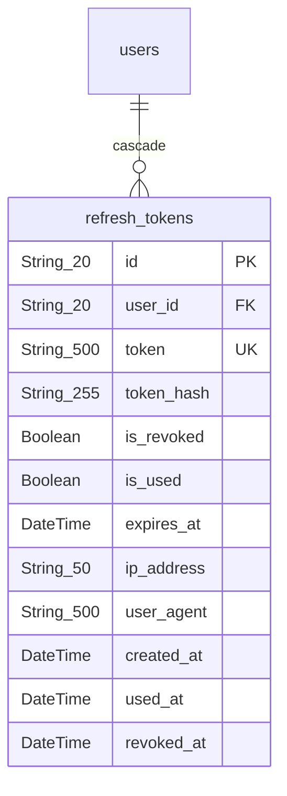
```mermaid
erDiagram
    refresh_tokens {
        String_20 id PK
        String_20 user_id FK
        String_500 token UK
        String_255 token_hash
        Boolean is_revoked
        Boolean is_used
        DateTime expires_at
        String_50 ip_address
        String_500 user_agent
        DateTime created_at
        DateTime used_at
        DateTime revoked_at
    }
    users

    users ||--o{ refresh_tokens : "cascade"
```

**Atributos:**

- `id`: Identificador único del refresh token, generado por `id_generator` con prefijo `rtk`. Clave primaria.
- `user_id`: Referencia al usuario dueño del token. Con `ON DELETE CASCADE`, todos sus refresh tokens se eliminan si se elimina el usuario.
- `token`: Valor del refresh token entregado al cliente. Único e indexado para poder localizarlo rápido en cada intento de refresh.
- `token_hash`: Versión hasheada del token, usada para comparación segura sin exponer el valor original en comparaciones directas.
- `is_revoked`: Marca si el token fue invalidado manualmente (ej. logout, cambio de contraseña, detección de abuso) antes de su expiración natural.
- `is_used`: Marca si el token ya fue canjeado por un nuevo access token. Soporta la estrategia de uso único: un refresh token usado no debería volver a aceptarse.
- `expires_at`: Fecha y hora de expiración del token. Tras esa fecha, el token deja de ser válido aunque no esté revocado.
- `ip_address`: Dirección IP desde la que se emitió el token, para trazabilidad y detección de anomalías.
- `user_agent`: Cadena de user agent del cliente que solicitó el token, complementa `ip_address` en la trazabilidad de sesión.
- `created_at`: Fecha y hora de emisión del token.
- `used_at`: Fecha y hora en que el token fue canjeado por un nuevo access token. `NULL` si todavía no se ha usado.
- `revoked_at`: Fecha y hora en que el token fue revocado manualmente. `NULL` si sigue vigente o expiró de forma natural.

### user_sessions

Sesiones de login con tracking completo de dispositivo, ubicación y métricas de uso.

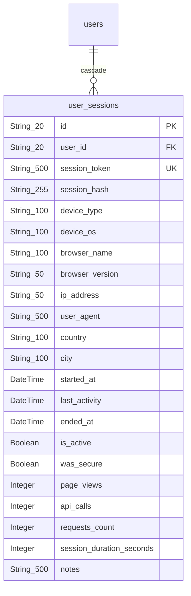
```mermaid
erDiagram
    user_sessions {
        String_20 id PK
        String_20 user_id FK
        String_500 session_token UK
        String_255 session_hash
        String_100 device_type
        String_100 device_os
        String_100 browser_name
        String_50 browser_version
        String_50 ip_address
        String_500 user_agent
        String_100 country
        String_100 city
        DateTime started_at
        DateTime last_activity
        DateTime ended_at
        Boolean is_active
        Boolean was_secure
        Integer page_views
        Integer api_calls
        Integer requests_count
        Integer session_duration_seconds
        String_500 notes
    }
    users

    users ||--o{ user_sessions : "cascade"
```

**Atributos:**

- `id`: Identificador único de la sesión, generado por `id_generator` con prefijo `uss`. Clave primaria.
- `user_id`: Referencia al usuario dueño de la sesión. Con `ON DELETE CASCADE`, todas sus sesiones se eliminan si se elimina el usuario.
- `session_token`: Token que identifica la sesión activa del usuario en el cliente. Único e indexado para localizarla en cada request.
- `session_hash`: Versión hasheada del token de sesión, usada para comparación segura.
- `device_type`: Tipo de dispositivo desde el que se abrió la sesión (`mobile`, `desktop`, `tablet`). Informativo para analítica de uso.
- `device_os`: Sistema operativo del dispositivo (iOS, Android, Windows, macOS, Linux). Informativo.
- `browser_name`: Nombre del navegador usado (Chrome, Firefox, Safari, etc.).
- `browser_version`: Versión del navegador, complementa `browser_name` para diagnóstico de compatibilidad.
- `ip_address`: Dirección IP desde la que se abrió la sesión. Indexada para búsquedas de seguridad/auditoría.
- `user_agent`: Cadena completa de user agent del cliente, respaldo detallado de `device_type`/`browser_name`.
- `country`: País detectado por geolocalización de IP al iniciar la sesión. Opcional.
- `city`: Ciudad detectada por geolocalización de IP. Opcional, complementa `country`.
- `started_at`: Fecha y hora en que inició la sesión. Indexada para ordenar/filtrar sesiones recientes.
- `last_activity`: Fecha y hora de la última actividad registrada en la sesión. Se actualiza automáticamente con cada interacción relevante.
- `ended_at`: Fecha y hora en que la sesión terminó (logout explícito o expiración). `NULL` mientras sigue activa.
- `is_active`: Indica si la sesión sigue vigente. Se usa para listar sesiones activas y para cerrarlas remotamente.
- `was_secure`: Indica si la sesión se estableció sobre HTTPS. Bandera de seguridad para auditoría.
- `page_views`: Contador de páginas vistas durante la sesión, usado en métricas de uso.
- `api_calls`: Contador de llamadas a la API realizadas durante la sesión.
- `requests_count`: Contador general de requests de la sesión, complementa `api_calls` para métricas más amplias.
- `session_duration_seconds`: Duración total de la sesión en segundos, calculada al finalizar (`ended_at`).
- `notes`: Texto libre para anotaciones sobre la sesión (ej. motivo de cierre forzado). Opcional.

## Grupo: Archivos

### file_uploads

Metadatos de archivos almacenados en MinIO: categoría, visibilidad, MIME, URLs de descarga y preview.

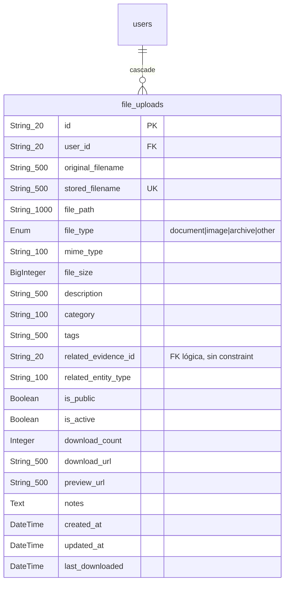
```mermaid
erDiagram
    file_uploads {
        String_20 id PK
        String_20 user_id FK
        String_500 original_filename
        String_500 stored_filename UK
        String_1000 file_path
        Enum file_type "document|image|archive|other"
        String_100 mime_type
        BigInteger file_size
        String_500 description
        String_100 category
        String_500 tags
        String_20 related_evidence_id "FK lógica, sin constraint"
        String_100 related_entity_type
        Boolean is_public
        Boolean is_active
        Integer download_count
        String_500 download_url
        String_500 preview_url
        Text notes
        DateTime created_at
        DateTime updated_at
        DateTime last_downloaded
    }
    users

    users ||--o{ file_uploads : "cascade"
```

**Atributos:**

- `id`: Identificador único del archivo subido, generado por `id_generator` con prefijo `flu`. Clave primaria.
- `user_id`: Referencia al usuario dueño del archivo. Con `ON DELETE CASCADE`, sus archivos se eliminan si se elimina el usuario.
- `original_filename`: Nombre original del archivo tal como lo subió el usuario, para mostrarlo en la UI.
- `stored_filename`: Nombre único con el que se almacena físicamente el archivo en MinIO, evita colisiones entre archivos con el mismo `original_filename`. Único e indexado.
- `file_path`: Ruta/clave completa del objeto dentro del bucket MinIO donde vive el archivo.
- `file_type`: Categoría técnica del archivo (`document`, `image`, `archive`, `other`), usada para elegir el visor/ícono adecuado.
- `mime_type`: Tipo MIME real del archivo (ej. `application/pdf`), usado para servirlo con las cabeceras correctas.
- `file_size`: Tamaño del archivo en bytes. `BigInteger` para soportar archivos grandes sin overflow.
- `description`: Descripción libre del contenido del archivo, opcional.
- `category`: Categoría de negocio del archivo (ej. evidencia, CV, certificado), usada para filtrar en el Admin.
- `tags`: Etiquetas de texto libre asociadas al archivo, complementa la tabla `tags` para búsquedas rápidas.
- `related_evidence_id`: Referencia lógica (sin FK real) a una entidad de evidencia relacionada, para casos donde el archivo respalda un dato de otra tabla.
- `related_entity_type`: Tipo de entidad relacionada (`evidence`, `interview`, `project`, etc.), complementa `related_evidence_id` para saber a qué tabla apunta.
- `is_public`: Indica si el archivo puede exponerse públicamente (ej. en el portal) sin autenticación.
- `is_active`: Indica si el archivo sigue vigente/visible o fue dado de baja lógica sin borrarlo físicamente.
- `download_count`: Contador de veces que el archivo fue descargado, usado en métricas de uso.
- `download_url`: URL directa de descarga del archivo (normalmente firmada/temporal hacia MinIO).
- `preview_url`: URL de una vista previa del archivo (ej. thumbnail), cuando aplica.
- `notes`: Texto libre para anotaciones internas sobre el archivo.
- `created_at`: Fecha y hora de subida del archivo.
- `updated_at`: Fecha y hora de la última modificación de sus metadatos.
- `last_downloaded`: Fecha y hora de la última descarga registrada. `NULL` si nunca se ha descargado.

## Grupo: Auditoría y Notificaciones

### audit_logs

Bitácora de create/update/delete/login, incluyendo valores anteriores y nuevos en JSON.

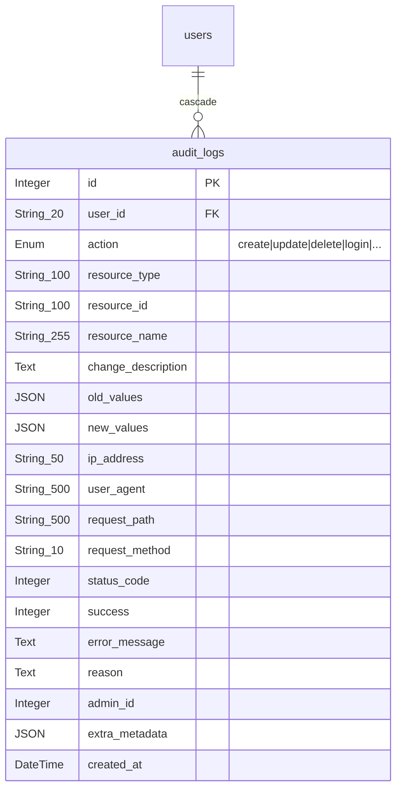
```mermaid
erDiagram
    audit_logs {
        Integer id PK
        String_20 user_id FK
        Enum action "create|update|delete|login|..."
        String_100 resource_type
        String_100 resource_id
        String_255 resource_name
        Text change_description
        JSON old_values
        JSON new_values
        String_50 ip_address
        String_500 user_agent
        String_500 request_path
        String_10 request_method
        Integer status_code
        Integer success
        Text error_message
        Text reason
        Integer admin_id
        JSON extra_metadata
        DateTime created_at
    }
    users

    users ||--o{ audit_logs : "cascade"
```

**Atributos:**

- `id`: Identificador autoincremental de la entrada de bitácora. Clave primaria numérica (no usa el generador de IDs prefijados porque es un log de alto volumen).
- `user_id`: Referencia al usuario que ejecutó (o a nombre de quien se ejecutó) la acción auditada. Con `ON DELETE CASCADE`, sus registros de auditoría se eliminan si se elimina el usuario.
- `action`: Tipo de acción auditada (`create`, `update`, `delete`, `login`, `logout`, `export`, `import`, `share`, `download`, `grant_permission`, `revoke_permission`). Define qué pasó.
- `resource_type`: Tipo de recurso afectado por la acción (ej. `User`, `Competency`, `Evidence`). Permite filtrar la bitácora por entidad.
- `resource_id`: Identificador del recurso afectado, para poder ubicar la fila exacta que cambió.
- `resource_name`: Nombre legible del recurso afectado en el momento de la acción, útil si el recurso luego se renombra o elimina.
- `change_description`: Descripción en texto libre de qué cambió, complementa a `old_values`/`new_values` con contexto legible por humanos.
- `old_values`: Snapshot en JSON de los valores previos a la acción (para `update`/`delete`), permite reconstruir el estado anterior.
- `new_values`: Snapshot en JSON de los valores nuevos tras la acción (para `create`/`update`).
- `ip_address`: Dirección IP desde la que se ejecutó la acción, para trazabilidad de seguridad.
- `user_agent`: Cadena de user agent del cliente que ejecutó la acción.
- `request_path`: Ruta HTTP de la request que originó la acción auditada.
- `request_method`: Método HTTP de la request (`GET`, `POST`, `PUT`, `DELETE`, etc.).
- `status_code`: Código de estado HTTP (o de operación) resultante de la acción.
- `success`: Bandera numérica (`1`=éxito, `0`=fallo) que indica si la acción se completó correctamente.
- `error_message`: Mensaje de error capturado si la acción falló. `NULL` en acciones exitosas.
- `reason`: Motivo declarado de la acción, cuando aplica (ej. justificación de un borrado administrativo).
- `admin_id`: Identificador del administrador que disparó la acción en nombre de otro usuario, cuando no fue el propio usuario quien la ejecutó.
- `extra_metadata`: JSON libre para contexto adicional que no encaja en las columnas anteriores.
- `created_at`: Fecha y hora en que se registró la entrada de auditoría. Indexada para consultas cronológicas.

### events

Eventos de actividad de usuario con contexto de entidad afectada.

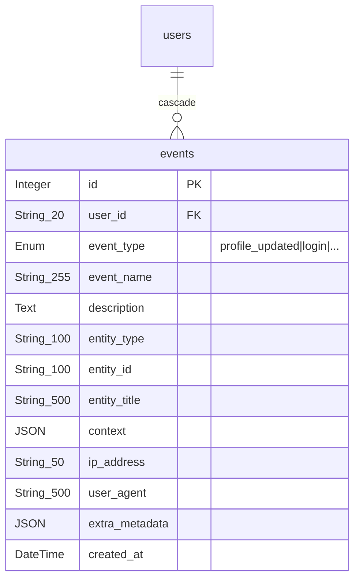
```mermaid
erDiagram
    events {
        Integer id PK
        String_20 user_id FK
        Enum event_type "profile_updated|login|..."
        String_255 event_name
        Text description
        String_100 entity_type
        String_100 entity_id
        String_500 entity_title
        JSON context
        String_50 ip_address
        String_500 user_agent
        JSON extra_metadata
        DateTime created_at
    }
    users

    users ||--o{ events : "cascade"
```

**Atributos:**

- `id`: Identificador autoincremental del evento. Clave primaria numérica (log de alto volumen, sin prefijo).
- `user_id`: Referencia al usuario que generó el evento de actividad. Con `ON DELETE CASCADE`, sus eventos se eliminan si se elimina el usuario.
- `event_type`: Tipo de evento de actividad (ej. `profile_updated`, `competency_added`, `vacancy_applied`, `login`, `search_performed`, etc.). Clasifica el evento para analítica de comportamiento.
- `event_name`: Nombre legible/descriptivo del evento, complementa `event_type` para mostrar en timelines.
- `description`: Descripción libre adicional del evento, opcional.
- `entity_type`: Tipo de entidad relacionada con el evento (ej. `competency`, `evidence`, `vacancy`), cuando el evento afecta a un recurso concreto.
- `entity_id`: Identificador de la entidad relacionada, complementa `entity_type` para ubicar el recurso exacto.
- `entity_title`: Título/nombre legible de la entidad relacionada en el momento del evento.
- `context`: JSON con datos adicionales de contexto propios de ese tipo de evento (payload flexible).
- `ip_address`: Dirección IP desde la que se generó el evento.
- `user_agent`: Cadena de user agent del cliente que generó el evento.
- `extra_metadata`: JSON libre para metadatos adicionales no cubiertos por `context`.
- `created_at`: Fecha y hora en que ocurrió el evento. Indexada para reconstruir la línea de tiempo de actividad del usuario.

### error_reports

Registro centralizado de fallas del sistema (ADR-018). Dedupe por `fingerprint` con contador de ocurrencias; sin FK a `users` porque las fallas no siempre son atribuibles a un usuario.

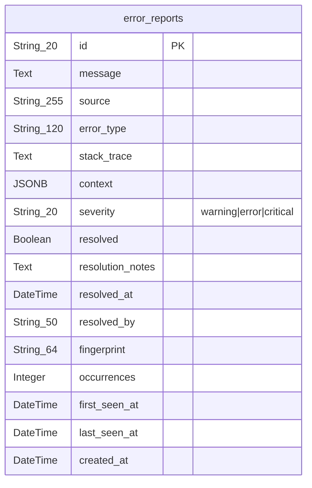
```mermaid
erDiagram
    error_reports {
        String_20 id PK
        Text message
        String_255 source
        String_120 error_type
        Text stack_trace
        JSONB context
        String_20 severity "warning|error|critical"
        Boolean resolved
        Text resolution_notes
        DateTime resolved_at
        String_50 resolved_by
        String_64 fingerprint
        Integer occurrences
        DateTime first_seen_at
        DateTime last_seen_at
        DateTime created_at
    }
```

**Atributos:**

- `id`: Identificador único del reporte de falla, generado por `id_generator` con prefijo `err` (ADR-018). Clave primaria.
- `message`: Mensaje principal de la falla, el texto que describe qué salió mal.
- `source`: Origen de la falla dentro del sistema (ej. handler global de la API, scheduler, loop del motor de agentes, MCP server, SPA de Admin/Portfolio). Indexado para filtrar por componente.
- `error_type`: Tipo/clase del error (ej. nombre de excepción), cuando se puede determinar.
- `stack_trace`: Traza completa de la excepción, cuando está disponible, para depuración técnica.
- `context`: JSON (`JSONB`) con datos adicionales de contexto capturados en el momento de la falla (ej. payload de la request, usuario involucrado).
- `severity`: Nivel de gravedad del reporte (`warning`, `error`, `critical`). Determina prioridad de revisión.
- `resolved`: Estado de revisión del reporte (el atributo central de ADR-018). Arranca en `false` (pendiente de revisión) y pasa a `true` cuando alguien corrige la causa raíz. Indexado, junto con `severity` y `last_seen_at`, para listar pendientes ordenados por urgencia.
- `resolution_notes`: Notas de quien resolvió el reporte, explicando la causa raíz y la corrección aplicada.
- `resolved_at`: Fecha y hora en que se marcó como resuelto. `NULL` mientras sigue pendiente.
- `resolved_by`: Identificador de quién resolvió el reporte (usuario o agente).
- `fingerprint`: Huella de deduplicación calculada a partir de las características del error. Reportes repetidos con el mismo `fingerprint` no crean filas nuevas mientras siguen pendientes; en su lugar se incrementa `occurrences`.
- `occurrences`: Contador de cuántas veces se ha detectado la misma falla (mismo `fingerprint`) mientras sigue sin resolver.
- `first_seen_at`: Fecha y hora de la primera vez que se detectó esta falla (por `fingerprint`).
- `last_seen_at`: Fecha y hora de la detección más reciente de esta misma falla. Se actualiza en cada nueva ocurrencia deduplicada.
- `created_at`: Fecha y hora de creación de la fila del reporte.

### user_notifications

Avisos in-app generados por el scheduler cuando una tarea/subtarea desbloquea el turno del usuario (ADR-016).

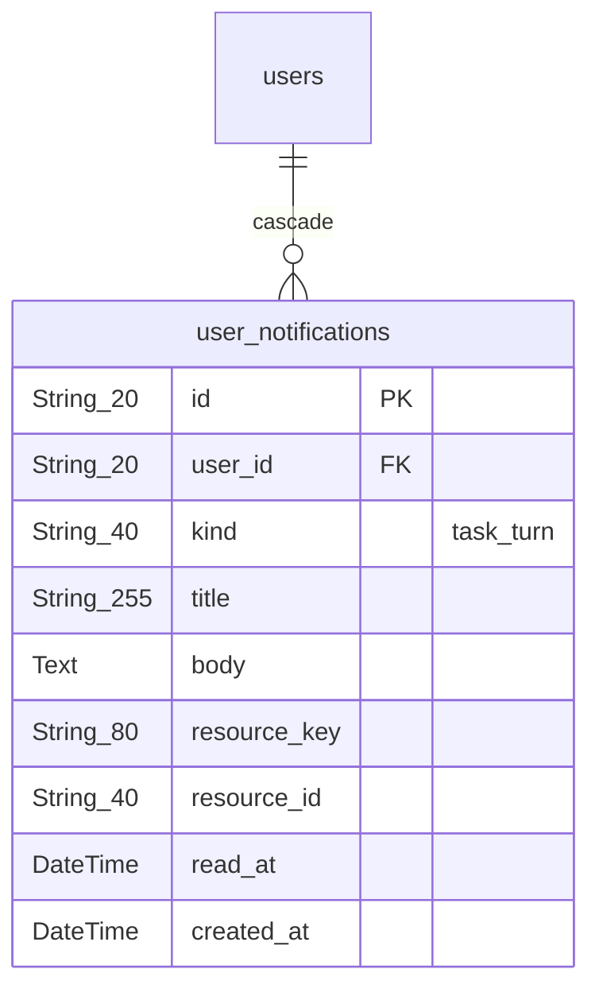
```mermaid
erDiagram
    user_notifications {
        String_20 id PK
        String_20 user_id FK
        String_40 kind "task_turn"
        String_255 title
        Text body
        String_80 resource_key
        String_40 resource_id
        DateTime read_at
        DateTime created_at
    }
    users

    users ||--o{ user_notifications : "cascade"
```

**Atributos:**

- `id`: Identificador único del aviso, generado por `id_generator` con prefijo `ntf` (ADR-016). Clave primaria.
- `user_id`: Referencia al usuario destinatario del aviso. Con `ON DELETE CASCADE`, sus avisos se eliminan si se elimina el usuario.
- `kind`: Tipo de aviso. Hoy el único valor es `task_turn` (una tarea o subtarea asignada al usuario quedó desbloqueada y espera que la ejecute), pero el campo queda abierto a más tipos futuros.
- `title`: Título corto del aviso, mostrado en la campana de notificaciones del Admin.
- `body`: Texto ampliado del aviso, con más contexto que el título. Opcional.
- `resource_key`: Clave del tipo de recurso relacionado con el aviso (ej. `agent_system_tasks`), para poder navegar directo a él.
- `resource_id`: Identificador del recurso relacionado (ej. el `id` de la tarea que se desbloqueó). Indexado.
- `read_at`: Fecha y hora en que el usuario marcó el aviso como leído. `NULL` mientras sigue sin leer.
- `created_at`: Fecha y hora en que el scheduler generó el aviso, sin necesidad de sesión SPA activa.

## Grupo: Navegación Admin

### admin_section_groups

Grupos del sidebar izquierdo del panel de administración. Nunca tienen vistas propias; agrupan secciones L1.

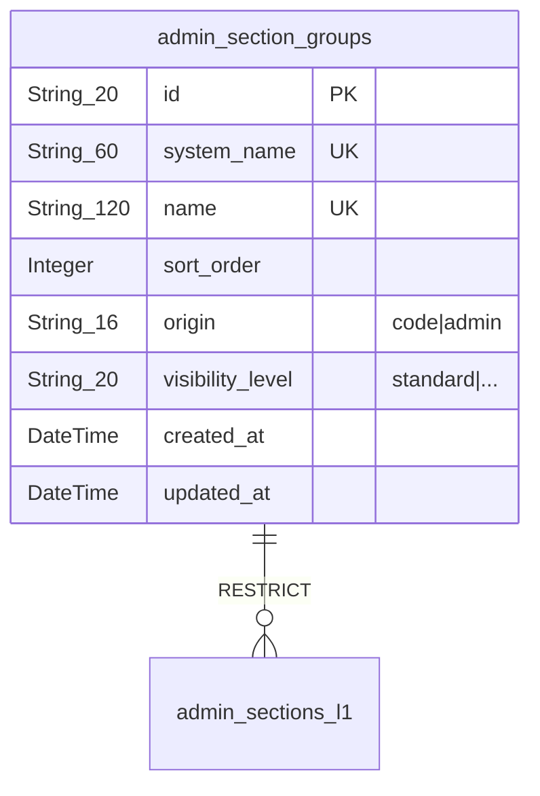
```mermaid
erDiagram
    admin_section_groups {
        String_20 id PK
        String_60 system_name UK
        String_120 name UK
        Integer sort_order
        String_16 origin "code|admin"
        String_20 visibility_level "standard|..."
        DateTime created_at
        DateTime updated_at
    }
    admin_sections_l1

    admin_section_groups ||--o{ admin_sections_l1 : "RESTRICT"
```

**Atributos:**

- `id`: Identificador único del grupo, generado por `id_generator` con prefijo `grp` (ADR-022). Clave primaria.
- `system_name`: Nombre de sistema del grupo, clave estable usada internamente (ej. para el grupo protegido `admin`). Único.
- `name`: Nombre visible del grupo en el sidebar izquierdo del Admin. Único.
- `sort_order`: Posición del grupo dentro del sidebar respecto a los demás grupos. Determina el orden visual.
- `origin`: Marca si el grupo fue sembrado por la migración inicial (`code`) o creado por el operador desde el Admin (`admin`, valor por defecto). Es puramente informativo desde ADR-023 (corrección): el seeder ya no poda ni resincroniza grupos, la base de datos es la fuente de verdad.
- `visibility_level`: Gate genérico de visibilidad (ADR-023, corrección) que determina qué usuarios pueden ver el grupo según su `is_superuser`. `standard` para la mayoría; el grupo protegido `admin` (que contiene la propia gestión de secciones) usa un nivel restringido a superusuarios.
- `created_at`: Fecha y hora de creación del grupo.
- `updated_at`: Fecha y hora de la última modificación del grupo (nombre, orden, etc.).

### admin_sections_l1

Secciones de primer nivel bajo un grupo; re-key del antiguo `sec-N` (ADR-023).

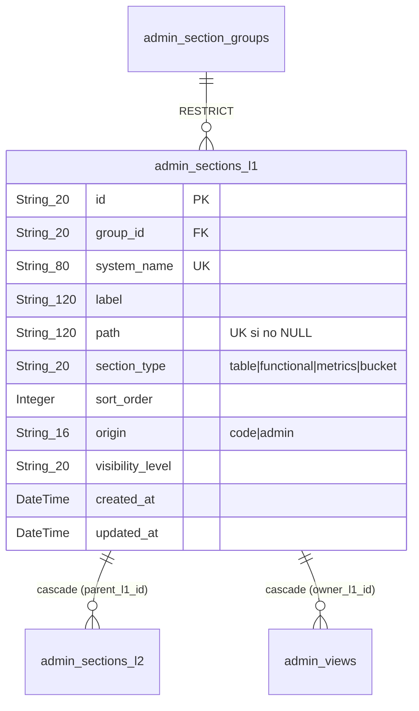
```mermaid
erDiagram
    admin_sections_l1 {
        String_20 id PK
        String_20 group_id FK
        String_80 system_name UK
        String_120 label
        String_120 path "UK si no NULL"
        String_20 section_type "table|functional|metrics|bucket"
        Integer sort_order
        String_16 origin "code|admin"
        String_20 visibility_level
        DateTime created_at
        DateTime updated_at
    }
    admin_section_groups
    admin_sections_l2
    admin_views

    admin_section_groups ||--o{ admin_sections_l1 : "RESTRICT"
    admin_sections_l1 ||--o{ admin_sections_l2 : "cascade (parent_l1_id)"
    admin_sections_l1 ||--o{ admin_views : "cascade (owner_l1_id)"
```

**Atributos:**

- `id`: Identificador único de la sección L1, generado por `id_generator` con prefijo `s1`. Clave primaria; re-key del antiguo `sec-N` de ADR-021, mismo entero.
- `group_id`: Referencia al grupo del sidebar al que pertenece esta sección. `ON DELETE RESTRICT`: no se puede borrar un grupo mientras tenga secciones L1, para evitar huérfanos accidentales.
- `system_name`: Nombre de sistema estable de la sección (clave técnica interna). Único.
- `label`: Etiqueta visible de la sección en el sidebar y en el título de la página.
- `path`: Ruta de navegación de la sección dentro del Admin, cuando la sección tiene una URL propia. `NULL` si es solo un nodo de agrupación; único cuando no es `NULL`.
- `section_type`: Tipo funcional de la sección (`table`, `functional`, `metrics`, `bucket`), determina qué tipo de layout/plantilla aplica.
- `sort_order`: Posición de la sección dentro de su grupo. Junto con el anidamiento, define el orden del sidebar.
- `origin`: Marca si la sección fue sembrada por código/migración (`code`, valor por defecto) o creada por el operador desde el Admin (`admin`).
- `visibility_level`: Gate genérico de visibilidad (ADR-023, corrección) que determina qué usuarios pueden ver esta sección según `is_superuser`.
- `created_at`: Fecha y hora de creación de la sección.
- `updated_at`: Fecha y hora de la última modificación de la sección.

### admin_sections_l2

Subsecciones de una L1; pueden tener a su vez subsecciones L3 y vistas.

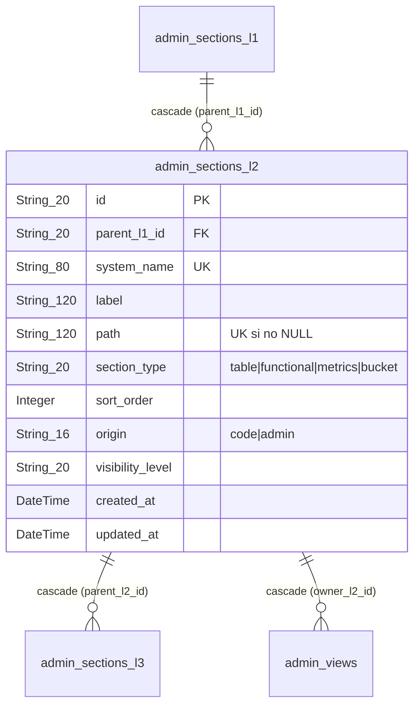
```mermaid
erDiagram
    admin_sections_l2 {
        String_20 id PK
        String_20 parent_l1_id FK
        String_80 system_name UK
        String_120 label
        String_120 path "UK si no NULL"
        String_20 section_type "table|functional|metrics|bucket"
        Integer sort_order
        String_16 origin "code|admin"
        String_20 visibility_level
        DateTime created_at
        DateTime updated_at
    }
    admin_sections_l1
    admin_sections_l3
    admin_views

    admin_sections_l1 ||--o{ admin_sections_l2 : "cascade (parent_l1_id)"
    admin_sections_l2 ||--o{ admin_sections_l3 : "cascade (parent_l2_id)"
    admin_sections_l2 ||--o{ admin_views : "cascade (owner_l2_id)"
```

**Atributos:**

- `id`: Identificador único de la sección L2, generado por `id_generator` con prefijo `s2`. Clave primaria.
- `parent_l1_id`: Referencia a la sección L1 bajo la que cuelga esta subsección. `ON DELETE CASCADE`: si se borra la L1, sus L2 se borran con ella.
- `system_name`: Nombre de sistema estable de la subsección. Único.
- `label`: Etiqueta visible de la subsección en el árbol del sidebar.
- `path`: Ruta de navegación propia de la subsección, cuando la tiene. `NULL` si es solo un nodo de agrupación; único cuando no es `NULL`.
- `section_type`: Tipo funcional de la subsección (`table`, `functional`, `metrics`, `bucket`).
- `sort_order`: Posición de la subsección dentro de su L1 padre.
- `origin`: Marca si la subsección fue sembrada por código (`code`, valor por defecto) o creada por el operador (`admin`).
- `visibility_level`: Gate genérico de visibilidad (ADR-023, corrección) para esta subsección.
- `created_at`: Fecha y hora de creación de la subsección.
- `updated_at`: Fecha y hora de la última modificación de la subsección.

### admin_sections_l3

Subsecciones hoja de una L2; tercer y último nivel de anidamiento.

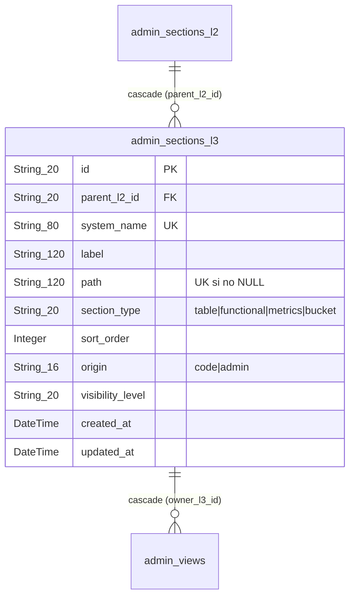
```mermaid
erDiagram
    admin_sections_l3 {
        String_20 id PK
        String_20 parent_l2_id FK
        String_80 system_name UK
        String_120 label
        String_120 path "UK si no NULL"
        String_20 section_type "table|functional|metrics|bucket"
        Integer sort_order
        String_16 origin "code|admin"
        String_20 visibility_level
        DateTime created_at
        DateTime updated_at
    }
    admin_sections_l2
    admin_views

    admin_sections_l2 ||--o{ admin_sections_l3 : "cascade (parent_l2_id)"
    admin_sections_l3 ||--o{ admin_views : "cascade (owner_l3_id)"
```

**Atributos:**

- `id`: Identificador único de la sección L3, generado por `id_generator` con prefijo `s3`. Clave primaria.
- `parent_l2_id`: Referencia a la sección L2 bajo la que cuelga esta subsección hoja. `ON DELETE CASCADE`: si se borra la L2, sus L3 se borran con ella.
- `system_name`: Nombre de sistema estable de la subsección hoja. Único.
- `label`: Etiqueta visible de la subsección en el árbol del sidebar.
- `path`: Ruta de navegación propia de la subsección hoja, cuando la tiene. `NULL` si es solo un nodo de agrupación; único cuando no es `NULL`.
- `section_type`: Tipo funcional de la subsección (`table`, `functional`, `metrics`, `bucket`).
- `sort_order`: Posición de la subsección dentro de su L2 padre.
- `origin`: Marca si la subsección fue sembrada por código (`code`, valor por defecto) o creada por el operador (`admin`).
- `visibility_level`: Gate genérico de visibilidad (ADR-023, corrección) para esta subsección.
- `created_at`: Fecha y hora de creación de la subsección.
- `updated_at`: Fecha y hora de la última modificación de la subsección.

### admin_views

Pestaña/vista de una sección L1/L2/L3. Dueño de `responsible_agent_profile_id` (referencia blanda a perfil L2) e `instructions` por vista.

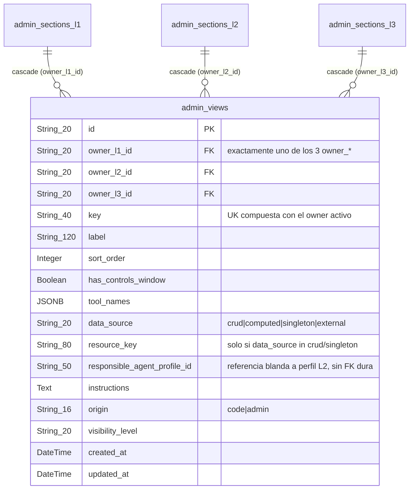
```mermaid
erDiagram
    admin_views {
        String_20 id PK
        String_20 owner_l1_id FK "exactamente uno de los 3 owner_*"
        String_20 owner_l2_id FK
        String_20 owner_l3_id FK
        String_40 key "UK compuesta con el owner activo"
        String_120 label
        Integer sort_order
        Boolean has_controls_window
        JSONB tool_names
        String_20 data_source "crud|computed|singleton|external"
        String_80 resource_key "solo si data_source in crud/singleton"
        String_50 responsible_agent_profile_id "referencia blanda a perfil L2, sin FK dura"
        Text instructions
        String_16 origin "code|admin"
        String_20 visibility_level
        DateTime created_at
        DateTime updated_at
    }
    admin_sections_l1
    admin_sections_l2
    admin_sections_l3

    admin_sections_l1 ||--o{ admin_views : "cascade (owner_l1_id)"
    admin_sections_l2 ||--o{ admin_views : "cascade (owner_l2_id)"
    admin_sections_l3 ||--o{ admin_views : "cascade (owner_l3_id)"
```

**Atributos:**

- `id`: Identificador único de la vista, generado por `id_generator` con prefijo `vw`. Clave primaria.
- `owner_l1_id`: Referencia a la sección L1 dueña de esta vista, cuando aplica. Exactamente uno de `owner_l1_id`/`owner_l2_id`/`owner_l3_id` debe estar presente (CHECK `ck_admin_views_single_owner`). `ON DELETE CASCADE`.
- `owner_l2_id`: Referencia a la sección L2 dueña de esta vista, cuando aplica. `ON DELETE CASCADE`.
- `owner_l3_id`: Referencia a la sección L3 dueña de esta vista, cuando aplica. `ON DELETE CASCADE`.
- `key`: Clave corta de la vista dentro de su sección dueña (ej. `list`, `kanban`, `main`). Forma una `UNIQUE` compuesta con el owner activo, para que no se repita dentro de la misma sección.
- `label`: Etiqueta visible de la pestaña/vista en la UI del Admin.
- `sort_order`: Posición de la vista entre las demás pestañas de la misma sección.
- `has_controls_window`: Indica si la vista tiene un panel de controles especiales en el sidebar derecho, además de chat e instrucciones.
- `tool_names`: Lista (JSON, variante `JSONB` en PostgreSQL) de nombres de herramientas del agente relevantes para esta vista. Se usa para acotar o documentar qué tools puede invocar el agente en este contexto.
- `data_source`: Origen de los datos que muestra la vista (`crud`, `computed`, `singleton`, `external`), determina cómo se renderiza y de dónde se leen los datos.
- `resource_key`: Clave del recurso CRUD/singleton que alimenta la vista. Solo tiene sentido si `data_source` es `crud` o `singleton` (CHECK `ck_admin_views_resource_key_scope`).
- `responsible_agent_profile_id`: Referencia blanda (sin FK dura) al `system_name` de un perfil de agente **L2** del catálogo en código, dueño del chat contextual de esta vista. `NULL` apaga el chat contextual en la vista.
- `instructions`: Texto mostrado en el panel de instrucciones del sidebar derecho de la vista. `NULL` o vacío apaga ese panel.
- `origin`: Marca si la vista fue sembrada por código (`code`, valor por defecto) o creada por el operador (`admin`). Las vistas siguen naciendo en código en este lote.
- `visibility_level`: Gate genérico de visibilidad (ADR-023, corrección); columna añadida por consistencia del mecanismo aunque el gate de superusuario aún no aplica a ninguna vista de este lote.
- `created_at`: Fecha y hora de creación de la vista.
- `updated_at`: Fecha y hora de la última modificación de la vista (ej. cambio de agente responsable o instrucciones).

## Grupo: Motor de Agentes

### agent_system_settings

Fila única de configuración global del motor de agentes: modelo activo, presupuesto diario, prompts, ventana de historial.

> Nota de nombrado (ADR-025): `agent_system_settings` (configuración del sistema de agentes como unidad) es distinto del perfil de agente `agent_settings` (identidad de un agente concreto, "Incidencias y Bitácora", ADR-022). El prefijo de tres partes `agent_system_` es, por construcción, disjunto de cualquier `system_name` de dos partes del catálogo de perfiles (`agent_<rol>`), así que no hace falta una excepción de nombrado como la que introducía ADR-024 con `engine_settings`.

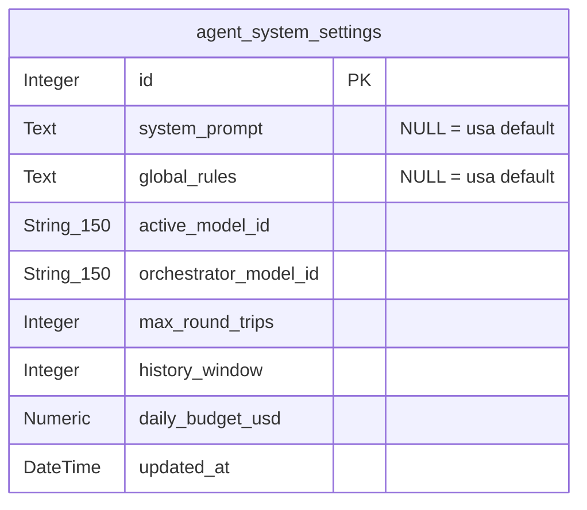
```mermaid
erDiagram
    agent_system_settings {
        Integer id PK
        Text system_prompt "NULL = usa default"
        Text global_rules "NULL = usa default"
        String_150 active_model_id
        String_150 orchestrator_model_id
        Integer max_round_trips
        Integer history_window
        Numeric daily_budget_usd
        DateTime updated_at
    }
```

**Atributos:**

- `id`: Identificador autoincremental de la fila. Es una tabla de fila única (el motor de agentes es un asistente mono-operador para Carlos, no multi-tenant), así que `id` no aporta significado de negocio más allá de ser la clave primaria.
- `system_prompt`: Override del system prompt global del agente. `NULL` significa "usar el default embebido en código" (`services/bedrock_service.py::_default_system_prompt`); resetear a default es simplemente limpiar esta columna.
- `global_rules`: Override de las reglas globales que aplican a todos los agentes sin importar nivel/perfil (grounding + asignación de metodología). `NULL` significa "usar el default en código" (`services/bedrock/prompt.py::default_global_rules`), mismo patrón que `system_prompt`.
- `active_model_id`: ID del modelo Bedrock activo para los agentes especialistas (ADR-008). Aquí "Bedrock" nombra correctamente al proveedor de inferencia LLM (ADR-024), no al motor de agentes.
- `orchestrator_model_id`: ID del modelo Bedrock usado específicamente por el agente orquestador (L1), puede diferir del de los especialistas.
- `max_round_trips`: Número máximo de idas y vueltas (tool-use) permitidas por turno antes de forzar una respuesta final, para evitar loops costosos o infinitos.
- `history_window`: Cantidad de mensajes previos de la conversación que se envían como contexto en cada turno.
- `daily_budget_usd`: Presupuesto diario en dólares para el consumo de Bedrock (el proveedor de inferencia). Sirve como techo de gasto y para alertas de costo.
- `updated_at`: Fecha y hora de la última modificación de la configuración global.

### agent_system_profile_prompts

Suffix editable de system prompt por perfil de agente. `profile_id` referencia blanda al catálogo en código `agent_profiles.py`.

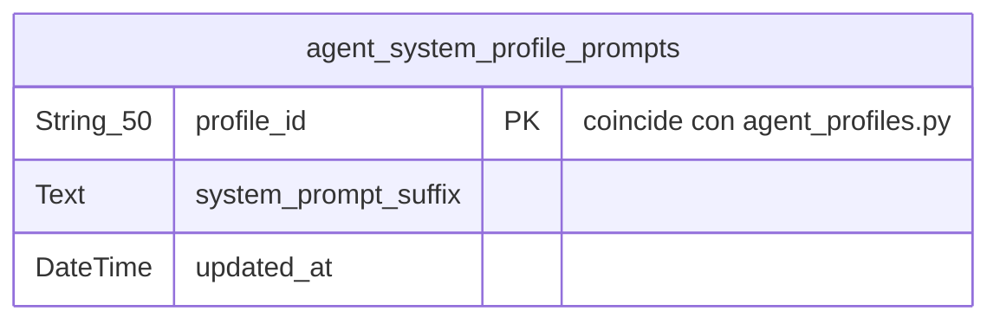
```mermaid
erDiagram
    agent_system_profile_prompts {
        String_50 profile_id PK "coincide con agent_profiles.py"
        Text system_prompt_suffix
        DateTime updated_at
    }
```

**Atributos:**

- `profile_id`: Clave primaria del override, coincide con el `profile_id` canónico del catálogo de agentes en código (`agent_profiles.py`). No usa `id`/`user_id` estándar porque es una fila de configuración por perfil, no un registro de negocio del usuario.
- `system_prompt_suffix`: Texto adicional que se concatena al system prompt base del perfil de agente, editable desde el Admin sin tocar código.
- `updated_at`: Fecha y hora de la última modificación del suffix para este perfil.

### agent_system_profile_photos

Foto por perfil de agente almacenada en el bucket MinIO.

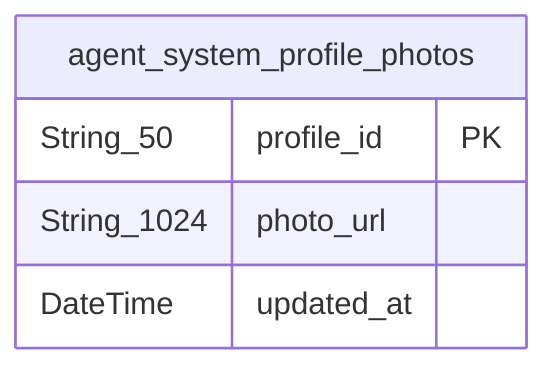
```mermaid
erDiagram
    agent_system_profile_photos {
        String_50 profile_id PK
        String_1024 photo_url
        DateTime updated_at
    }
```

**Atributos:**

- `profile_id`: Clave primaria de la foto, coincide con el `profile_id` del catálogo de agentes en código. Independiente del override de prompt: quitar el `system_prompt_suffix` no borra la foto.
- `photo_url`: URL de la foto del perfil de agente, almacenada en el bucket MinIO. Se muestra junto al nombre del agente en el catálogo y en el selector de responsable.
- `updated_at`: Fecha y hora de la última vez que se cambió la foto de este perfil.

### agent_system_delegation

Override de destinos de delegación por perfil. `target_ids` lista los `agent_*` a los que puede delegar.

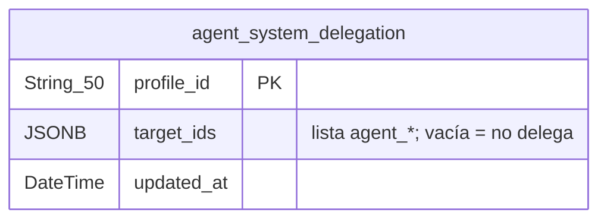
```mermaid
erDiagram
    agent_system_delegation {
        String_50 profile_id PK
        JSONB target_ids "lista agent_*; vacía = no delega"
        DateTime updated_at
    }
```

**Atributos:**

- `profile_id`: Clave primaria del override de delegación, coincide con el `profile_id` del catálogo de agentes en código. La presencia de una fila para un perfil ya constituye un override sobre los destinos de delegación permitidos por defecto según su nivel.
- `target_ids`: Lista (JSONB) de `agent_*` a los que este perfil puede delegar. Una lista vacía significa explícitamente "no delega a nadie", distinto de no tener fila (que usa el comportamiento por defecto del nivel).
- `updated_at`: Fecha y hora de la última modificación de los destinos de delegación de este perfil.

### agent_system_custom_tools

Servidores MCP remotos registrados como herramientas adicionales del motor de agentes.

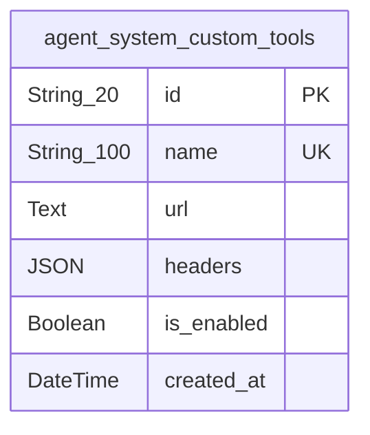
```mermaid
erDiagram
    agent_system_custom_tools {
        String_20 id PK
        String_100 name UK
        Text url
        JSON headers
        Boolean is_enabled
        DateTime created_at
    }
```

**Atributos:**

- `id`: Identificador único del servidor MCP remoto registrado, generado por `id_generator` con prefijo `bct`. Clave primaria.
- `name`: Nombre identificador del servidor MCP remoto. Único, se usa para referenciarlo en la configuración de tools del agente.
- `url`: URL del servidor MCP remoto al que se conecta el agente para invocar sus tools.
- `headers`: Cabeceras HTTP adicionales (JSON) que se envían en cada request al servidor MCP remoto, ej. tokens de autenticación.
- `is_enabled`: Indica si el servidor MCP remoto está activo y disponible para el agente. Permite deshabilitarlo temporalmente sin borrar el registro.
- `created_at`: Fecha y hora de registro del servidor MCP remoto.

### agent_system_conversations

Historial de conversación por `session_type` + `agent_profile_id`. Cada conversación agrupa sus mensajes.

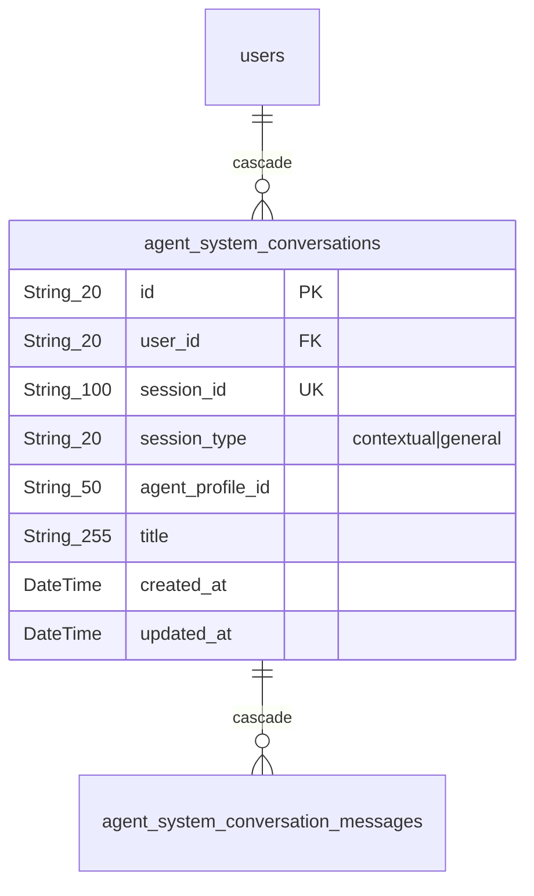
```mermaid
erDiagram
    agent_system_conversations {
        String_20 id PK
        String_20 user_id FK
        String_100 session_id UK
        String_20 session_type "contextual|general"
        String_50 agent_profile_id
        String_255 title
        DateTime created_at
        DateTime updated_at
    }
    users
    agent_system_conversation_messages

    users ||--o{ agent_system_conversations : "cascade"
    agent_system_conversations ||--o{ agent_system_conversation_messages : "cascade"
```

**Atributos:**

- `id`: Identificador único de la conversación, generado por `id_generator` con prefijo `bco`. Clave primaria.
- `user_id`: Referencia al usuario dueño de la conversación. Con `ON DELETE CASCADE`, todas sus conversaciones (y en cadena sus mensajes) se eliminan si se elimina el usuario.
- `session_id`: Identificador de sesión compartido entre cliente y servidor (UUID), único e indexado. Es la clave con la que el front-end retoma el historial correcto.
- `session_type`: Distingue el tipo de sesión de chat: `contextual` (sidebar derecho de una vista concreta del Admin) o `general` (`/agent/chat`, el orquestador). Indexado; por defecto `contextual`.
- `agent_profile_id`: Perfil de agente especialista dueño de esta conversación (identity, search, orchestrator, etc.). Cada agente mantiene su propio historial aislado; `NULL` identifica conversaciones previas a la introducción de este aislamiento. Indexado.
- `title`: Título de la conversación mostrado en la lista de historial. Por defecto `"Nueva conversación"`, editable o autogenerado a partir del primer mensaje.
- `created_at`: Fecha y hora de creación de la conversación.
- `updated_at`: Fecha y hora del último mensaje o cambio en la conversación. Indexada para ordenar el historial por actividad reciente.

Existe además un índice compuesto `ix_agent_system_conversations_user_type_profile` sobre (`user_id`, `session_type`, `agent_profile_id`) para acelerar la búsqueda de la conversación activa de un usuario en un contexto/agente dado.

### agent_system_conversation_messages

Mensajes individuales (user/assistant) de una conversación del agente.

```mermaid
erDiagram
    agent_system_conversation_messages {
        String_20 id PK
        String_20 conversation_id FK
        String_20 role "user|assistant"
        Text content
        DateTime created_at
    }
    agent_system_conversations

    agent_system_conversations ||--o{ agent_system_conversation_messages : "cascade"
```

**Atributos:**

- `id`: Identificador único del mensaje, generado por `id_generator` con prefijo `bcm`. Clave primaria.
- `conversation_id`: Referencia a la conversación a la que pertenece el mensaje. Con `ON DELETE CASCADE`, los mensajes se eliminan si se elimina la conversación. Indexado.
- `role`: Rol del emisor del mensaje, `user` o `assistant`. Determina cómo se renderiza en la UI y cómo se reconstruye el historial enviado al modelo.
- `content`: Contenido textual completo del mensaje.
- `created_at`: Fecha y hora de creación del mensaje. Junto con `conversation_id`, define el orden cronológico de la conversación (la relación ORM se carga ordenada por este campo).

### agent_system_usage_logs

Costo y tokens por turno completo del agente, con soporte de cache read/write (ADR-019).

```mermaid
erDiagram
    agent_system_usage_logs {
        Integer id PK
        String_20 user_id FK
        String_64 session_id
        String_150 model_id
        Integer input_tokens
        Integer output_tokens
        Integer cache_read_tokens
        Integer cache_write_tokens
        Numeric estimated_cost_usd
        DateTime created_at
    }
    users

    users ||--o{ agent_system_usage_logs : "cascade"
```

**Atributos:**

- `id`: Identificador autoincremental de la entrada de costo. Clave primaria numérica (log de alto volumen, escrito best-effort en cada turno sin bloquear la respuesta del chat si falla).
- `user_id`: Referencia al usuario cuyo turno de chat generó el costo. Con `ON DELETE CASCADE`, sus logs se eliminan si se elimina el usuario.
- `session_id`: Identificador de la sesión de chat en la que ocurrió el turno. Indexado para agrupar costos por conversación.
- `model_id`: ID del modelo Bedrock usado en el turno. Indexado, alimenta desgloses de costo por modelo.
- `input_tokens`: Cantidad de tokens de entrada consumidos en el turno completo (puede sumar varias idas y vueltas de tool-use). Default `0`.
- `output_tokens`: Cantidad de tokens de salida generados por el modelo en el turno. Default `0`.
- `cache_read_tokens`: Tokens leídos de un prefijo ya cacheado (ADR-019), facturados a 0.10x el costo normal. Default `0`.
- `cache_write_tokens`: Tokens escritos al crear o extender el prefijo cacheado, facturados a 1.25x el costo normal. Default `0`.
- `estimated_cost_usd`: Costo estimado en USD del turno, calculado a partir de los tokens anteriores y el precio del modelo. `Numeric(12, 6)` para precisión de fracciones de centavo.
- `created_at`: Fecha y hora de registro del turno. Indexada; alimenta el panel "Costo del asistente IA" del dashboard de métricas del Admin.

### agent_system_usage_round_logs

Costo granular por round (Converse, tool, imagen) con identificación de herramienta y perfil de agente.

```mermaid
erDiagram
    agent_system_usage_round_logs {
        Integer id PK
        String_20 user_id FK
        String_100 session_id
        String_150 model_id
        String_30 round_type "converse|tool|image"
        String_100 tool_name
        String_50 agent_profile_id
        Integer input_tokens
        Integer output_tokens
        Integer cache_read_tokens
        Integer cache_write_tokens
        Numeric estimated_cost_usd
        Text notes
        DateTime created_at
    }
    users

    users ||--o{ agent_system_usage_round_logs : "cascade"
```

**Atributos:**

- `id`: Identificador autoincremental de la entrada de costo granular. Clave primaria numérica, log de alto volumen (un turno puede generar varias filas: orquestador + delegaciones).
- `user_id`: Referencia al usuario cuyo turno generó el round. Con `ON DELETE CASCADE`, sus registros se eliminan si se elimina el usuario.
- `session_id`: Identificador de la sesión de chat a la que pertenece este round. Indexado.
- `model_id`: ID del modelo Bedrock invocado en este round específico. Puede ser `NULL` en rounds que no invocan modelo directamente. Indexado.
- `round_type`: Tipo de llamada facturable: `converse` (turno de conversación con el modelo), `tool` (ejecución de una herramienta) o `image` (generación/procesamiento de imagen). Default `converse`, indexado.
- `tool_name`: Nombre de la herramienta invocada, cuando `round_type` es `tool`. `NULL` en los demás casos.
- `agent_profile_id`: Perfil de agente responsable de este round, relevante cuando el orquestador delega a un especialista y cada delegación se factura por separado.
- `input_tokens`: Tokens de entrada consumidos en este round puntual. Default `0`.
- `output_tokens`: Tokens de salida generados en este round puntual. Default `0`.
- `cache_read_tokens`: Tokens leídos de un prefijo ya cacheado (0.10x el costo normal) en este round. Default `0`.
- `cache_write_tokens`: Tokens escritos al crear/extender el prefijo cacheado (1.25x el costo normal) en este round. Default `0`.
- `estimated_cost_usd`: Costo estimado en USD de este round específico. `Numeric(12, 6)` para precisión de fracciones de centavo.
- `notes`: Texto libre opcional con contexto adicional sobre el round (ej. motivo de un costo atípico).
- `created_at`: Fecha y hora de registro del round. Indexada para reconstruir la secuencia de costos de un turno completo.

### agent_system_tasks

Tareas y plan del agente con soporte de subtareas (`parent_id` self-reference), scheduler (`scheduled_at`) y notificación al usuario (`execute_on_turn`).

```mermaid
erDiagram
    agent_system_tasks {
        String_20 id PK
        String_20 user_id FK
        String_255 title
        Text description
        String_20 status "pending|in_progress|done|cancelled|failed"
        Text notes
        String_20 assignee_type "user|agent"
        String_50 agent_profile_id
        DateTime scheduled_at
        DateTime due_at
        String_20 priority "low|medium|high"
        String_20 parent_id FK "self-reference"
        Integer sort_order
        Boolean is_blocking
        Boolean execute_on_turn
        DateTime turn_notified_at
        Text execution_result
        DateTime executed_at
        Text error_message
        DateTime created_at
        DateTime updated_at
    }
    users

    users ||--o{ agent_system_tasks : "cascade"
    agent_system_tasks ||--o{ agent_system_tasks : "cascade, self-reference parent_id"
```

**Atributos:**

- `id`: Identificador único de la tarea, generado por `id_generator` con prefijo `btk`. Clave primaria.
- `user_id`: Referencia al usuario dueño de la tarea. Con `ON DELETE CASCADE`, sus tareas se eliminan si se elimina el usuario.
- `title`: Título corto de la tarea, mostrado en el tablero.
- `description`: Descripción ampliada de la tarea. Opcional.
- `status`: Estado de la tarea (`pending`, `in_progress`, `done`, `cancelled`, `failed`). `done`/`cancelled` son estados terminales (`TASK_TERMINAL_STATUSES`). Default `pending`, indexado.
- `notes`: Notas libres adicionales sobre la tarea, distintas del resultado de ejecución.
- `assignee_type`: A quién corresponde ejecutar la tarea: `user` (recordatorio/trabajo manual, el scheduler no la ejecuta, solo notifica cuando le toca el turno) o `agent` (el `task_scheduler` invoca al motor de agentes automáticamente). Default `user`, indexado.
- `agent_profile_id`: Perfil de agente responsable de ejecutar la tarea, cuando `assignee_type` es `agent`.
- `scheduled_at`: Fecha y hora programada para que el scheduler dispare la ejecución (tareas de agente) o para recordar la tarea (tareas de usuario). Indexado.
- `due_at`: Fecha límite de la tarea, informativa, distinta de `scheduled_at` (que es cuándo se ejecuta/recuerda).
- `priority`: Prioridad de la tarea (`low`, `medium`, `high`). Default `medium`.
- `parent_id`: Auto-referencia a otra fila de `agent_system_tasks` cuando esta tarea es subtarea de un plan/orquestador. `ON DELETE CASCADE`: borrar la tarea padre borra sus subtareas. Una tarea "padre con subtareas" actúa como orquestador y no se ejecuta ella misma como agente.
- `sort_order`: Orden de ejecución de las subtareas dentro de su padre (ADR-016). Junto con `is_blocking`, define el avance secuencial del plan.
- `is_blocking`: Indica si esta subtarea debe completarse antes de avanzar a la siguiente en `sort_order`. Default `true`.
- `execute_on_turn`: Marca si, al desbloquearse el turno de esta tarea, debe generarse una notificación al usuario (`user_notifications`, ADR-016) en vez de ejecutarse silenciosamente. Default `false`.
- `turn_notified_at`: Fecha y hora en que se generó la notificación de turno para esta tarea. `NULL` si aún no se ha notificado.
- `execution_result`: Resultado textual de la ejecución de la tarea por el agente, cuando aplica.
- `executed_at`: Fecha y hora en que la tarea fue efectivamente ejecutada. `NULL` mientras sigue pendiente.
- `error_message`: Mensaje de error si la ejecución de la tarea falló (`status = failed`).
- `created_at`: Fecha y hora de creación de la tarea.
- `updated_at`: Fecha y hora de la última modificación de la tarea (cambio de estado, resultado, etc.).

Existen dos índices compuestos: `ix_agent_system_tasks_scheduler` sobre (`assignee_type`, `status`, `scheduled_at`) para que el scheduler encuentre eficientemente las tareas de agente pendientes de ejecutar, e `ix_agent_system_tasks_parent_sort` sobre (`parent_id`, `sort_order`) para recorrer las subtareas de un plan en orden.

## Grupo: Motor de PDF

### pdf_output_templates

Plantillas HTML para generación de PDF vía WeasyPrint. Referencia opcional a un estilo CSS reutilizable.

```mermaid
erDiagram
    pdf_output_templates {
        String_20 id PK
        String_20 user_id FK
        String_120 slug
        String_50 document_type
        String_255 title
        Text description
        Text html_template
        String_20 style_id FK
        Text variables
        JSONB variables_schema
        Text preview_notes
        Boolean is_active
        Boolean is_default
        Integer version
        DateTime created_at
        DateTime updated_at
    }
    users
    pdf_template_styles

    users ||--o{ pdf_output_templates : "cascade"
    pdf_template_styles ||--o{ pdf_output_templates : "SET NULL, opcional (style_id)"
```

**Atributos:**

- `id`: Identificador único de la plantilla, generado por `id_generator` con prefijo `pdt`. Clave primaria.
- `user_id`: Referencia al usuario dueño de la plantilla. Con `ON DELETE CASCADE`, sus plantillas se eliminan si se elimina el usuario.
- `slug`: Identificador corto y legible de la plantilla, usado para referenciarla desde código/servicios. Indexado.
- `document_type`: Tipo de documento que genera la plantilla (ej. `cv`, `cover_letter`), usado para elegir la plantilla activa correspondiente. Indexado.
- `title`: Nombre visible de la plantilla en el Admin.
- `description`: Descripción libre del propósito o estilo de la plantilla. Opcional.
- `html_template`: Contenido HTML completo de la plantilla, con placeholders para las variables que WeasyPrint renderiza al generar el PDF.
- `style_id`: Referencia opcional a un `pdf_template_styles` reutilizable. `ON DELETE SET NULL`: si se borra el estilo referenciado, la plantilla queda sin estilo asociado en vez de eliminarse.
- `variables`: Texto libre (posiblemente documentación o listado) de las variables que espera la plantilla. Opcional.
- `variables_schema`: Esquema JSON (`JSONB`) que define formalmente las variables esperadas por la plantilla, para validación o generación de formularios.
- `preview_notes`: Notas sobre cómo se ve/comporta la plantilla al previsualizarla, uso interno del agente `agent_pdf_design`.
- `is_active`: Indica si la plantilla está disponible para usarse en generación de documentos. Default `true`, indexado.
- `is_default`: Marca si esta es la plantilla por defecto para su `document_type`. Default `false`, indexado.
- `version`: Número de versión de la plantilla, se incrementa en cambios significativos de su contenido. Default `1`.
- `created_at`: Fecha y hora de creación de la plantilla.
- `updated_at`: Fecha y hora de la última modificación de la plantilla.

### pdf_template_styles

CSS reutilizable referenciado por plantillas PDF a través de `style_id`.

```mermaid
erDiagram
    pdf_template_styles {
        String_20 id PK
        String_20 user_id FK
        String_120 slug
        String_255 title
        Text description
        Text css_content
        Text style_guide
        Boolean is_active
        DateTime created_at
        DateTime updated_at
    }
    users
    pdf_output_templates

    users ||--o{ pdf_template_styles : "cascade"
    pdf_template_styles ||--o{ pdf_output_templates : "SET NULL, opcional (style_id)"
```

**Atributos:**

- `id`: Identificador único del estilo, generado por `id_generator` con prefijo `pds`. Clave primaria.
- `user_id`: Referencia al usuario dueño del estilo. Con `ON DELETE CASCADE`, sus estilos se eliminan si se elimina el usuario.
- `slug`: Identificador corto y legible del estilo, usado para referenciarlo desde código/servicios. Indexado.
- `title`: Nombre visible del estilo en el Admin.
- `description`: Descripción libre del propósito o apariencia del estilo. Opcional.
- `css_content`: Contenido CSS completo del estilo, aplicado a las plantillas HTML que lo referencian vía `style_id`.
- `style_guide`: Notas o guía de estilo en texto libre que documentan las decisiones visuales del CSS (paleta, tipografía, etc.). Opcional.
- `is_active`: Indica si el estilo está disponible para asociarse a plantillas. Default `true`, indexado.
- `created_at`: Fecha y hora de creación del estilo.
- `updated_at`: Fecha y hora de la última modificación del estilo.

## Grupo: Transversales

### tags

Etiquetas transversales aplicables a cualquier entidad del sistema. Únicas por combinación `user_id` + `tag_name`.

```mermaid
erDiagram
    tags {
        String_20 id PK
        String_20 user_id FK
        String_100 tag_name "UK con user_id"
        String_100 entity_type
        String_7 color_hex
        Boolean is_active
        Text notes
        DateTime created_at
        DateTime updated_at
    }
    users

    users ||--o{ tags : "cascade"
```

**Atributos:**

- `id`: Identificador único de la etiqueta, generado por `id_generator` con prefijo `tag`. Clave primaria.
- `user_id`: Referencia al usuario dueño de la etiqueta. Con `ON DELETE CASCADE`, sus etiquetas se eliminan si se elimina el usuario.
- `tag_name`: Nombre de la etiqueta (ej. "Urgente", "Backend"). Forma una `UNIQUE` compuesta con `user_id` (`UniqueConstraint`) para que un mismo usuario no repita el mismo nombre de etiqueta.
- `entity_type`: Tipo de entidad al que está pensada aplicarse la etiqueta (ej. `evidence`, `vacancy`), cuando se quiere acotar su uso. `NULL` si es de propósito general.
- `color_hex`: Color de la etiqueta en formato hexadecimal (`#RRGGBB`), usado para su representación visual en la UI. Opcional.
- `is_active`: Indica si la etiqueta sigue disponible para usarse o fue dada de baja lógica. Default `true`.
- `notes`: Texto libre para anotaciones internas sobre el propósito de la etiqueta. Opcional.
- `created_at`: Fecha y hora de creación de la etiqueta.
- `updated_at`: Fecha y hora de la última modificación de la etiqueta.

### operational_methodologies

Protocolos en Markdown destinados a perfiles de agente específicos (`agent_profile_ids`). Vacío/null significa que aplica a todos los agentes.

```mermaid
erDiagram
    operational_methodologies {
        String_20 id PK
        String_20 user_id FK
        String_255 title
        String_150 section
        String_150 subsection
        Text description
        Text content "Markdown, requerido"
        JSONB agent_profile_ids "vacío/null = todos los agentes"
        Text notes
        DateTime created_at
        DateTime updated_at
    }
    users

    users ||--o{ operational_methodologies : "cascade"
```

**Atributos:**

- `id`: Identificador único del protocolo, generado por `id_generator` con prefijo `opm`. Clave primaria.
- `user_id`: Referencia al usuario dueño del protocolo. Con `ON DELETE CASCADE`, sus protocolos se eliminan si se elimina el usuario.
- `title`: Título del protocolo/metodología (ej. "Investigación Operativa", "Metodología Operativa de la Bóveda").
- `section`: Agrupación de más alto nivel a la que pertenece el protocolo. Texto libre en vez de enum porque pueden surgir nuevas agrupaciones sin requerir migración. Indexado.
- `subsection`: Subdivisión dentro de `section`, mismo criterio de texto libre. Opcional.
- `description`: Resumen breve del propósito del protocolo. Opcional.
- `content`: Contenido completo del protocolo en formato Markdown, siguiendo la misma convención que otros campos de texto largo de la aplicación. Campo requerido, es el cuerpo real de la metodología.
- `agent_profile_ids`: Lista (JSONB) de IDs canónicos `agent_*` a los que aplica este protocolo. Vacío o `NULL` significa que aplica a todos los agentes; una lista concreta lo restringe solo a esos perfiles.
- `notes`: Texto libre para anotaciones internas adicionales sobre el protocolo. Opcional.
- `created_at`: Fecha y hora de creación del protocolo.
- `updated_at`: Fecha y hora de la última modificación del protocolo.

No se expone en el portal público; es de uso exclusivo del panel de administración y del propio motor de agentes (documenta cómo trabajar a través de las tablas del dominio operativo y cómo se relacionan entre sí).
