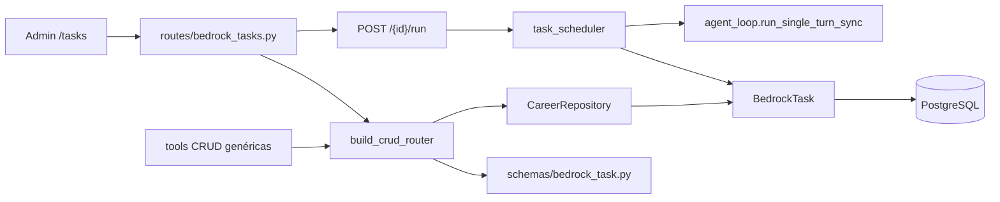

# Tareas — `/agent-tasks`

Tablero de trabajo de Carlos: tareas propias o asignadas a un agente del catálogo. Las de agente se ejecutan a `scheduled_at` aunque el Admin esté cerrado ([ADR-015](../../../../docs/09-DECISIONS/015-scheduled-agent-tasks.md)).

**Prefijo:** `/agent-tasks`  
**Tag OpenAPI:** `Agent - Tasks`  
**Auth:** JWT requerido (CRUD y `POST /{id}/run`). El scheduler no usa JWT: corre in-process con el `user_id` de la fila.

## Arquitectura



---

## Archivos fuente

| Capa | Archivo |
|------|---------|
| Rutas | `src/routes/bedrock_tasks.py` |
| Schemas | `src/schemas/bedrock_task.py` |
| Modelo | `src/models/bedrock_task.py` |
| Scheduler | `src/services/task_scheduler.py` |

---

## Endpoints

| Método | Path | Descripción |
|--------|------|-------------|
| `GET` | `/agent-tasks` | Listar tareas |
| `GET` | `/agent-tasks/count` | Contar |
| `GET` | `/agent-tasks/{id}` | Obtener una |
| `POST` | `/agent-tasks` | Crear |
| `PUT` | `/agent-tasks/{id}` | Actualizar |
| `DELETE` | `/agent-tasks/{id}` | Eliminar |
| `POST` | `/agent-tasks/{id}/run` | Reclamar y ejecutar ahora (agente, pending/failed) |

Resource key: `agent-tasks` → modelo `BedrockTask`.

---

## Campos

| Campo | Descripción |
|-------|-------------|
| `title` | Título |
| `description` | Detalle (el agente lo usa como instrucción si es suya) |
| `status` | pending / in_progress / done / cancelled / failed |
| `assignee_type` | `user` (manual) o `agent` (scheduler) |
| `agent_profile_id` | Obligatorio si `assignee_type=agent` |
| `scheduled_at` | Inicio / hora de ejecución (UTC) |
| `due_at` | Fecha límite (Gantt) |
| `priority` | low / medium / high |
| `execution_result` | Última respuesta del harness |
| `executed_at` | Cuándo corrió el agente |
| `error_message` | Si `failed` |

El scheduler (lifespan de la API, poll 30 s, `--workers 1`) toma filas `assignee_type=agent`, `status=pending`, `scheduled_at <= now`.

---

## Uso en Admin Panel

Ruta **`/tasks`** (sidebar principal). `/agent/tasks` redirige ahí. Vistas: lista, kanban, calendario, Gantt.

---

## Ejemplo

```bash
curl -s -X POST http://localhost:8001/agent-tasks \
  -H "Authorization: Bearer $TOKEN" \
  -H "Content-Type: application/json" \
  -d '{
    "title": "Buscar vacantes DevOps",
    "assignee_type": "agent",
    "agent_profile_id": "agent_vacancy_search",
    "scheduled_at": "2026-08-27T15:00:00Z",
    "priority": "high"
  }'
```

Ver también: [bedrock](../bedrock/README.md) · [ADR-015](../../../../docs/09-DECISIONS/015-scheduled-agent-tasks.md)
