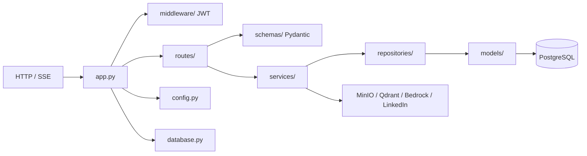

# Paquete `src/`

Código de la API REST FastAPI. Único escritor de PostgreSQL del ecosistema cjhirashi-career.

**Documentación HTTP:** [docs/sections/](../docs/sections/README.md) · **Arquitectura:** [docs/ARCHITECTURE.md](../docs/ARCHITECTURE.md)

## Arquitectura

---

## Módulos raíz

### `app.py` — Aplicación FastAPI

Punto de entrada de uvicorn (`uvicorn app:app`).

| Responsabilidad | Detalle |
|-----------------|---------|
| Lifecycle | `lifespan`: `init_db()`, `storage_service.ensure_bucket()`, loops `linkedin_scheduler` y `task_scheduler` |
| CORS | Orígenes de Admin (8002) y Portal (8003) |
| Errores | `RequestValidationError` → 422; excepción no capturada → 500 |
| Routers | 15 routers de dominio (auth, career, bedrock, files, linkedin, public, …) |
| Sistema | `GET /health`, `GET /` |

### `config.py` — Settings

`Settings` (pydantic-settings) leído de `.env`. Singleton `settings`.

Agrupa: `DATABASE_URL`, JWT (`SECRET_KEY`, expiración), CORS, MinIO, Bedrock (región, modelos, presupuesto), Qdrant, LinkedIn OAuth, Adzuna, PDF generator, rate limit y paginación.

### `database.py` — SQLAlchemy async

| Export | Uso |
|--------|-----|
| `engine` | Pool asyncpg (`pool_pre_ping`, size 10) |
| `AsyncSessionLocal` | Factory de sesiones |
| `Base` | Declarative base de todos los modelos |
| `get_db()` | Dependency FastAPI: commit/rollback por request |
| `init_db()` / `close_db()` | Crear tablas y cerrar pool al arrancar/apagar |

### `dependencies.py` — Inyección FastAPI

Re-exporta `get_current_user` y construye `get_user_repository(db)` para routers que no quieren importar repositorios a mano.

---

## Subpaquetes

| Paquete | README | Contenido |
|---------|--------|-----------|
| `routes/` | [routes/README.md](routes/README.md) | Endpoints HTTP/SSE |
| `services/` | [services/README.md](services/README.md) | Lógica de negocio e integraciones |
| `models/` | [models/README.md](models/README.md) | ORM SQLAlchemy |
| `schemas/` | [schemas/README.md](schemas/README.md) | Pydantic request/response |
| `repositories/` | [repositories/README.md](repositories/README.md) | Acceso a datos + aislamiento por usuario |
| `middleware/` | [middleware/README.md](middleware/README.md) | JWT Bearer |
| `utils/` | [utils/README.md](utils/README.md) | Constantes de dominio |

Tests: [../tests/README.md](../tests/README.md) · Migraciones: [../alembic/README.md](../alembic/README.md)
