# Paquete `models/`

ORM SQLAlchemy 2.0. Todas las clases heredan de `database.Base`. IDs de negocio son `String(20)` prefijados (`register_id_listener`). Filas de carrera llevan `user_id` con `ON DELETE CASCADE`.

`__init__.py` reexporta todos los modelos para Alembic (`import models`) y tests.

## Arquitectura

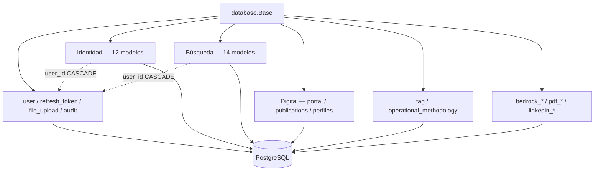
```mermaid
flowchart TB
    Base[database.Base] --> Core[user / refresh_token / file_upload / audit]
    Base --> Identity[Identidad — 12 modelos]
    Base --> Search[Búsqueda — 14 modelos]
    Base --> Digital[Digital — portal / publications / perfiles]
    Base --> Support[tag / operational_methodology]
    Base --> Agent[bedrock_* / pdf_* / linkedin_*]
    Core --> PG[(PostgreSQL)]
    Identity --> PG
    Search --> PG
    Digital --> PG
    Support --> PG
    Agent --> PG
    Identity -.->|user_id CASCADE| Core
    Search -.->|user_id CASCADE| Core
```

> Cada tabla tiene además su propio diagrama `erDiagram` individual (columnas, tipos, PK/FK/UK y relaciones) junto a la fila que la describe. Las tablas relacionadas se referencian solo por nombre (caja vacía sin columnas) para no duplicar el schema de las tablas vecinas.

---

## Núcleo y seguridad

| Módulo | Tabla / clase | Función |
|--------|---------------|---------|
| `user.py` | `User` | Cuenta: username, email, hash, perfil, `is_active` |
| `refresh_token.py` | `RefreshToken` | Refresh JWT persistido / revocable |
| `user_session.py` | `UserSession` | Sesiones de login (tracking) |
| `file_upload.py` | `FileUpload`, `FileType` | Metadatos MinIO (categoría, visibilidad, MIME) |
| `audit_log.py` | `AuditLog`, `AuditAction` | Bitácora create/update/delete (también restore del agente) |
| `event.py` | `Event`, `EventType` | Eventos de actividad de usuario |
| `metrics.py` | `Metrics` | Snapshot de métricas de perfil |
| `user_notification.py` | `UserNotification` | Avisos in-app (ADR-016): tarea/subtarea desbloqueada esperando turno del usuario |
| `error_report.py` | `ErrorReport` | Registro centralizado de fallas del sistema (ADR-018), dedupe por `fingerprint` |

#### `users`

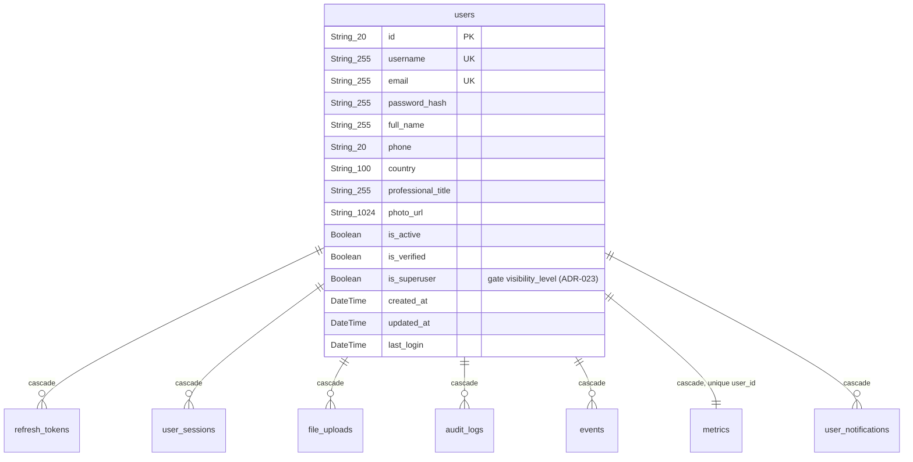
```mermaid
erDiagram
    users {
        String_20 id PK
        String_255 username UK
        String_255 email UK
        String_255 password_hash
        String_255 full_name
        String_20 phone
        String_100 country
        String_255 professional_title
        String_1024 photo_url
        Boolean is_active
        Boolean is_verified
        Boolean is_superuser "gate visibility_level (ADR-023)"
        DateTime created_at
        DateTime updated_at
        DateTime last_login
    }
    refresh_tokens
    user_sessions
    file_uploads
    audit_logs
    events
    metrics
    user_notifications

    users ||--o{ refresh_tokens : "cascade"
    users ||--o{ user_sessions : "cascade"
    users ||--o{ file_uploads : "cascade"
    users ||--o{ audit_logs : "cascade"
    users ||--o{ events : "cascade"
    users ||--|| metrics : "cascade, unique user_id"
    users ||--o{ user_notifications : "cascade"
```

#### `refresh_tokens`

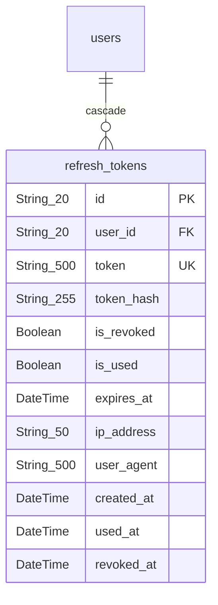
```mermaid
erDiagram
    refresh_tokens {
        String_20 id PK
        String_20 user_id FK
        String_500 token UK
        String_255 token_hash
        Boolean is_revoked
        Boolean is_used
        DateTime expires_at
        String_50 ip_address
        String_500 user_agent
        DateTime created_at
        DateTime used_at
        DateTime revoked_at
    }
    users

    users ||--o{ refresh_tokens : "cascade"
```

#### `user_sessions`

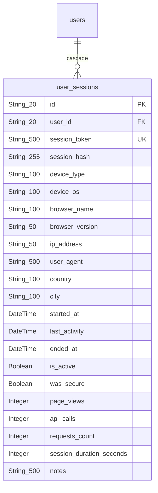
```mermaid
erDiagram
    user_sessions {
        String_20 id PK
        String_20 user_id FK
        String_500 session_token UK
        String_255 session_hash
        String_100 device_type
        String_100 device_os
        String_100 browser_name
        String_50 browser_version
        String_50 ip_address
        String_500 user_agent
        String_100 country
        String_100 city
        DateTime started_at
        DateTime last_activity
        DateTime ended_at
        Boolean is_active
        Boolean was_secure
        Integer page_views
        Integer api_calls
        Integer requests_count
        Integer session_duration_seconds
        String_500 notes
    }
    users

    users ||--o{ user_sessions : "cascade"
```

#### `file_uploads`

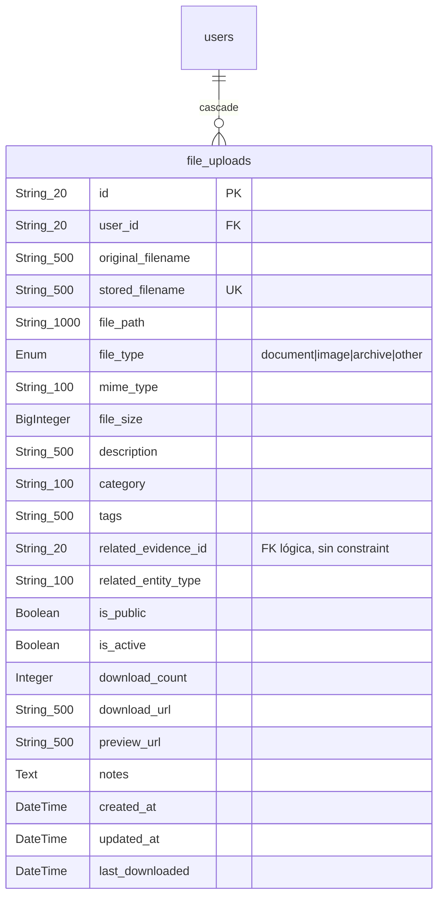
```mermaid
erDiagram
    file_uploads {
        String_20 id PK
        String_20 user_id FK
        String_500 original_filename
        String_500 stored_filename UK
        String_1000 file_path
        Enum file_type "document|image|archive|other"
        String_100 mime_type
        BigInteger file_size
        String_500 description
        String_100 category
        String_500 tags
        String_20 related_evidence_id "FK lógica, sin constraint"
        String_100 related_entity_type
        Boolean is_public
        Boolean is_active
        Integer download_count
        String_500 download_url
        String_500 preview_url
        Text notes
        DateTime created_at
        DateTime updated_at
        DateTime last_downloaded
    }
    users

    users ||--o{ file_uploads : "cascade"
```

#### `audit_logs`

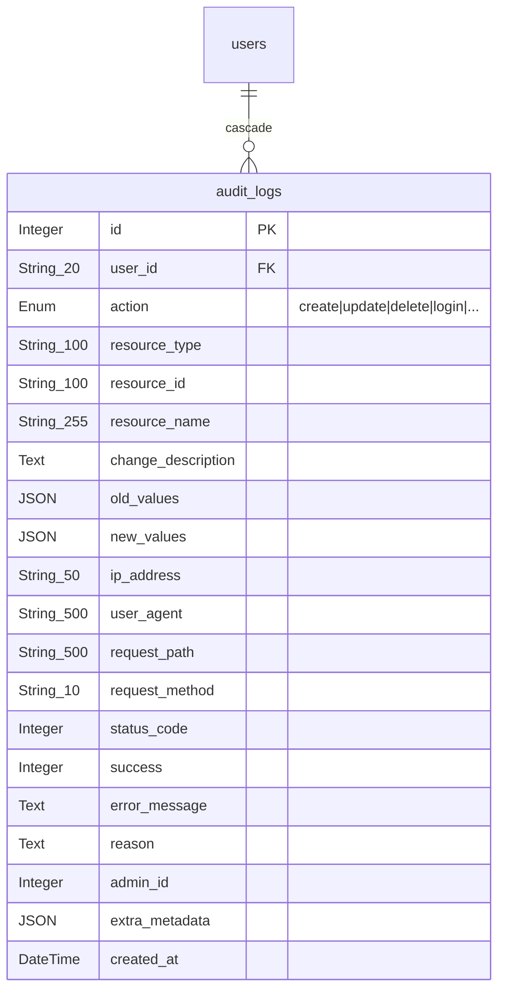
```mermaid
erDiagram
    audit_logs {
        Integer id PK
        String_20 user_id FK
        Enum action "create|update|delete|login|..."
        String_100 resource_type
        String_100 resource_id
        String_255 resource_name
        Text change_description
        JSON old_values
        JSON new_values
        String_50 ip_address
        String_500 user_agent
        String_500 request_path
        String_10 request_method
        Integer status_code
        Integer success
        Text error_message
        Text reason
        Integer admin_id
        JSON extra_metadata
        DateTime created_at
    }
    users

    users ||--o{ audit_logs : "cascade"
```

#### `events`

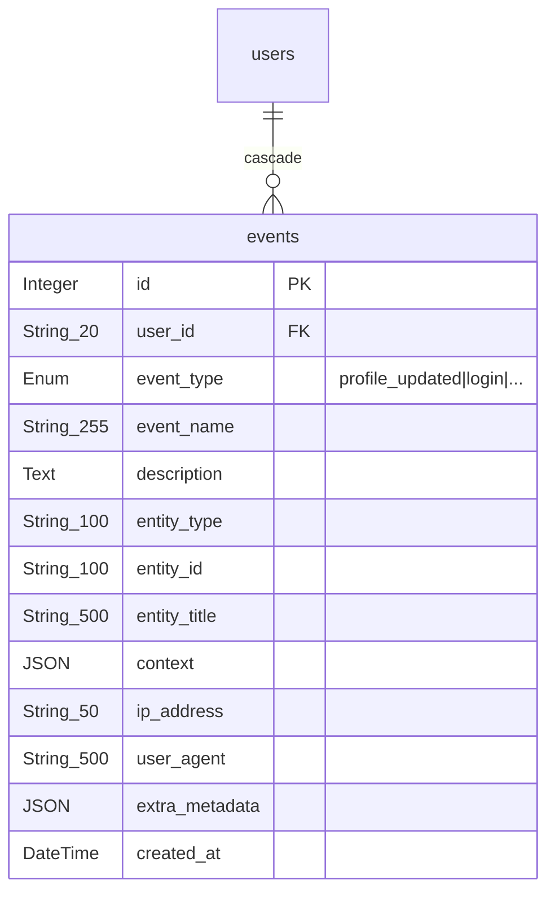
```mermaid
erDiagram
    events {
        Integer id PK
        String_20 user_id FK
        Enum event_type "profile_updated|login|..."
        String_255 event_name
        Text description
        String_100 entity_type
        String_100 entity_id
        String_500 entity_title
        JSON context
        String_50 ip_address
        String_500 user_agent
        JSON extra_metadata
        DateTime created_at
    }
    users

    users ||--o{ events : "cascade"
```

#### `metrics`

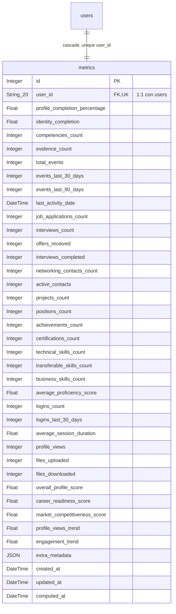
```mermaid
erDiagram
    metrics {
        Integer id PK
        String_20 user_id FK, UK "1:1 con users"
        Float profile_completion_percentage
        Float identity_completion
        Integer competencies_count
        Integer evidence_count
        Integer total_events
        Integer events_last_30_days
        Integer events_last_90_days
        DateTime last_activity_date
        Integer job_applications_count
        Integer interviews_count
        Integer offers_received
        Integer interviews_completed
        Integer networking_contacts_count
        Integer active_contacts
        Integer projects_count
        Integer positions_count
        Integer achievements_count
        Integer certifications_count
        Integer technical_skills_count
        Integer transferable_skills_count
        Integer business_skills_count
        Float average_proficiency_score
        Integer logins_count
        Integer logins_last_30_days
        Float average_session_duration
        Integer profile_views
        Integer files_uploaded
        Integer files_downloaded
        Float overall_profile_score
        Float career_readiness_score
        Float market_competitiveness_score
        Float profile_views_trend
        Float engagement_trend
        JSON extra_metadata
        DateTime created_at
        DateTime updated_at
        DateTime computed_at
    }
    users

    users ||--|| metrics : "cascade, unique user_id"
```

#### `user_notifications`

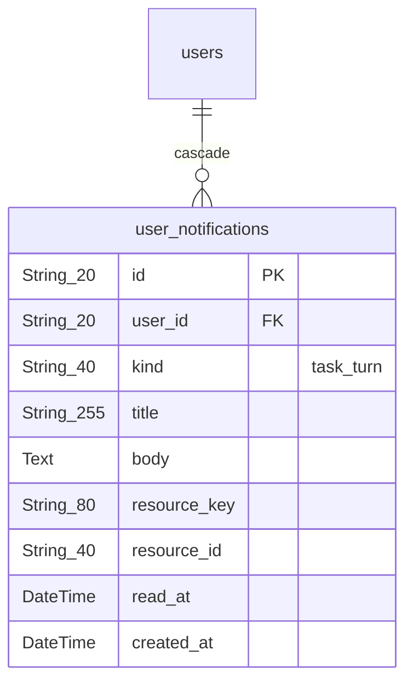
```mermaid
erDiagram
    user_notifications {
        String_20 id PK
        String_20 user_id FK
        String_40 kind "task_turn"
        String_255 title
        Text body
        String_80 resource_key
        String_40 resource_id
        DateTime read_at
        DateTime created_at
    }
    users

    users ||--o{ user_notifications : "cascade"
```

#### `error_reports`

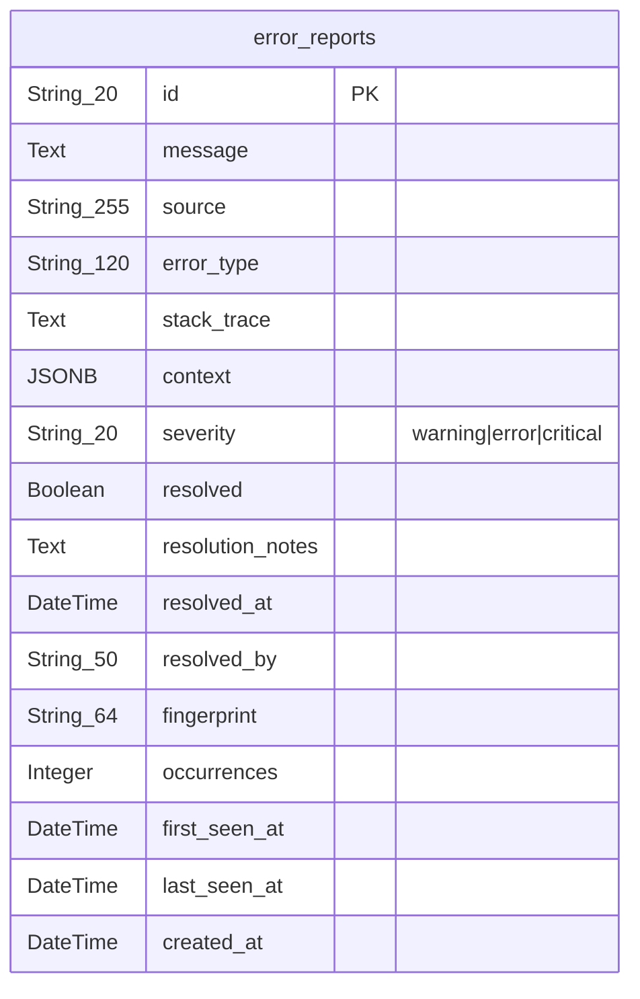
```mermaid
erDiagram
    error_reports {
        String_20 id PK
        Text message
        String_255 source
        String_120 error_type
        Text stack_trace
        JSONB context
        String_20 severity "warning|error|critical"
        Boolean resolved
        Text resolution_notes
        DateTime resolved_at
        String_50 resolved_by
        String_64 fingerprint
        Integer occurrences
        DateTime first_seen_at
        DateTime last_seen_at
        DateTime created_at
    }
```

`error_reports` no declara FK a `users` (fallas de sistema, no siempre atribuibles a un usuario).

---

## Carrera — Identidad

| Módulo | Contenido |
|--------|-----------|
| `personal_profile.py` | Datos biográficos (nombre legal, nacimiento, contacto, ubicación) — singleton 1:1 con User, distinto de `identity` |
| `differentiator.py` | Pilares de diferenciación + evidencia |
| `identity.py` | Singleton: tagline, bio, UVP (1:1 con User) |
| `identity_reflection.py` | Reflexiones IKIGAI (pasión, profesión, vocación, misión) |
| `competencies.py` | Competencias técnicas / transferibles / negocio |
| `certification.py` | Certificaciones (syllabus Markdown, `document_url`, status) |
| `target_role.py` | Roles objetivo de la búsqueda |
| `work_history.py` | Historial laboral |
| `achievement.py` | Logros (reto / solución / impacto) |
| `star_story.py` | Historias STAR 60–90 s |
| `career_review.py` | Revisiones periódicas / transiciones |
| `role_gap_analysis.py` | Gaps vs rol objetivo |
| `project.py` | Proyectos de portafolio (featured, portal) |

#### `personal_profile`

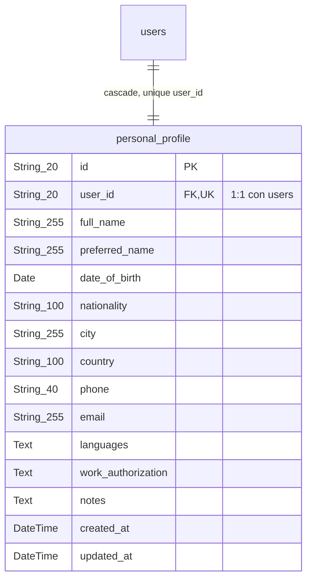
```mermaid
erDiagram
    personal_profile {
        String_20 id PK
        String_20 user_id FK, UK "1:1 con users"
        String_255 full_name
        String_255 preferred_name
        Date date_of_birth
        String_100 nationality
        String_255 city
        String_100 country
        String_40 phone
        String_255 email
        Text languages
        Text work_authorization
        Text notes
        DateTime created_at
        DateTime updated_at
    }
    users

    users ||--|| personal_profile : "cascade, unique user_id"
```

#### `differentiators`

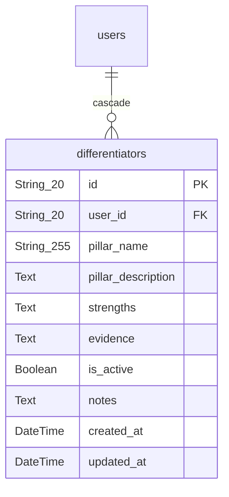
```mermaid
erDiagram
    differentiators {
        String_20 id PK
        String_20 user_id FK
        String_255 pillar_name
        Text pillar_description
        Text strengths
        Text evidence
        Boolean is_active
        Text notes
        DateTime created_at
        DateTime updated_at
    }
    users

    users ||--o{ differentiators : "cascade"
```

#### `identity`

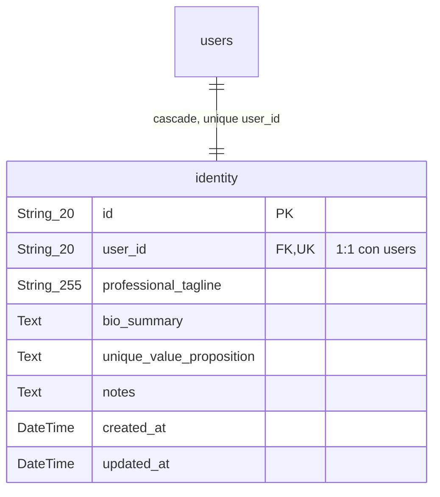
```mermaid
erDiagram
    identity {
        String_20 id PK
        String_20 user_id FK, UK "1:1 con users"
        String_255 professional_tagline
        Text bio_summary
        Text unique_value_proposition
        Text notes
        DateTime created_at
        DateTime updated_at
    }
    users

    users ||--|| identity : "cascade, unique user_id"
```

#### `identity_reflections`

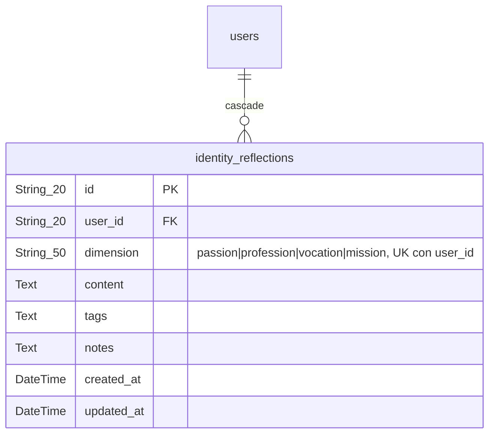
```mermaid
erDiagram
    identity_reflections {
        String_20 id PK
        String_20 user_id FK
        String_50 dimension "passion|profession|vocation|mission, UK con user_id"
        Text content
        Text tags
        Text notes
        DateTime created_at
        DateTime updated_at
    }
    users

    users ||--o{ identity_reflections : "cascade"
```

#### `competencies`

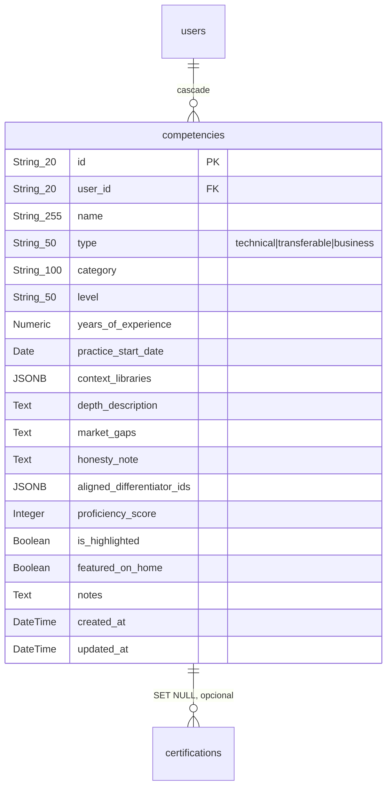
```mermaid
erDiagram
    competencies {
        String_20 id PK
        String_20 user_id FK
        String_255 name
        String_50 type "technical|transferable|business"
        String_100 category
        String_50 level
        Numeric years_of_experience
        Date practice_start_date
        JSONB context_libraries
        Text depth_description
        Text market_gaps
        Text honesty_note
        JSONB aligned_differentiator_ids
        Integer proficiency_score
        Boolean is_highlighted
        Boolean featured_on_home
        Text notes
        DateTime created_at
        DateTime updated_at
    }
    users
    certifications

    users ||--o{ competencies : "cascade"
    competencies ||--o{ certifications : "SET NULL, opcional"
```

#### `certifications`

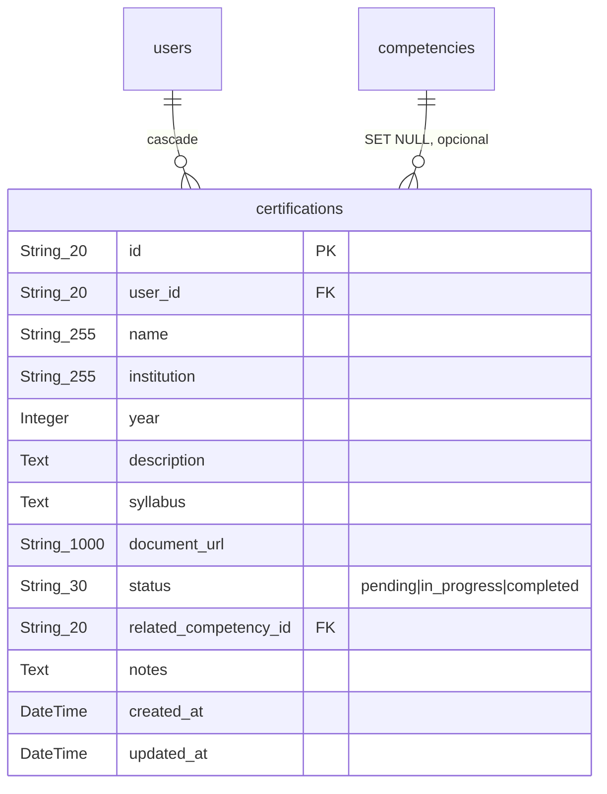
```mermaid
erDiagram
    certifications {
        String_20 id PK
        String_20 user_id FK
        String_255 name
        String_255 institution
        Integer year
        Text description
        Text syllabus
        String_1000 document_url
        String_30 status "pending|in_progress|completed"
        String_20 related_competency_id FK
        Text notes
        DateTime created_at
        DateTime updated_at
    }
    users
    competencies

    users ||--o{ certifications : "cascade"
    competencies ||--o{ certifications : "SET NULL, opcional"
```

#### `target_roles`

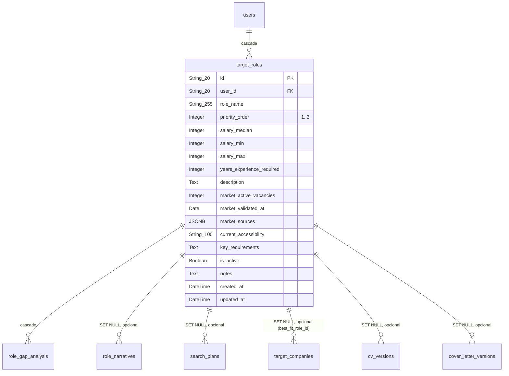
```mermaid
erDiagram
    target_roles {
        String_20 id PK
        String_20 user_id FK
        String_255 role_name
        Integer priority_order "1..3"
        Integer salary_median
        Integer salary_min
        Integer salary_max
        Integer years_experience_required
        Text description
        Integer market_active_vacancies
        Date market_validated_at
        JSONB market_sources
        String_100 current_accessibility
        Text key_requirements
        Boolean is_active
        Text notes
        DateTime created_at
        DateTime updated_at
    }
    users
    role_gap_analysis
    role_narratives
    search_plans
    target_companies
    cv_versions
    cover_letter_versions

    users ||--o{ target_roles : "cascade"
    target_roles ||--o{ role_gap_analysis : "cascade"
    target_roles ||--o{ role_narratives : "SET NULL, opcional"
    target_roles ||--o{ search_plans : "SET NULL, opcional"
    target_roles ||--o{ target_companies : "SET NULL, opcional (best_fit_role_id)"
    target_roles ||--o{ cv_versions : "SET NULL, opcional"
    target_roles ||--o{ cover_letter_versions : "SET NULL, opcional"
```

#### `work_history`

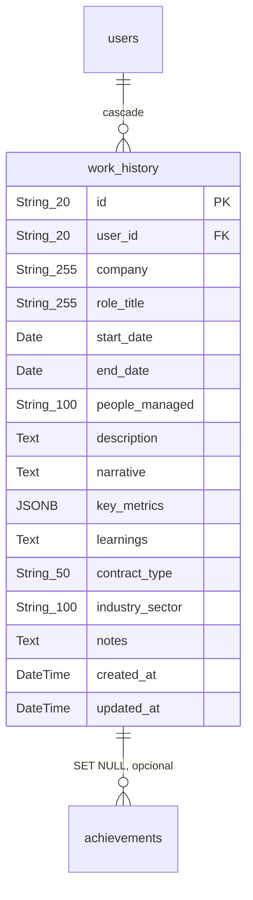
```mermaid
erDiagram
    work_history {
        String_20 id PK
        String_20 user_id FK
        String_255 company
        String_255 role_title
        Date start_date
        Date end_date
        String_100 people_managed
        Text description
        Text narrative
        JSONB key_metrics
        Text learnings
        String_50 contract_type
        String_100 industry_sector
        Text notes
        DateTime created_at
        DateTime updated_at
    }
    users
    achievements

    users ||--o{ work_history : "cascade"
    work_history ||--o{ achievements : "SET NULL, opcional"
```

#### `achievements`

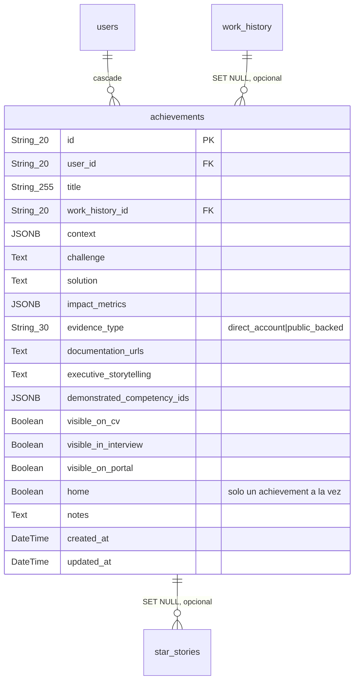
```mermaid
erDiagram
    achievements {
        String_20 id PK
        String_20 user_id FK
        String_255 title
        String_20 work_history_id FK
        JSONB context
        Text challenge
        Text solution
        JSONB impact_metrics
        String_30 evidence_type "direct_account|public_backed"
        Text documentation_urls
        Text executive_storytelling
        JSONB demonstrated_competency_ids
        Boolean visible_on_cv
        Boolean visible_in_interview
        Boolean visible_on_portal
        Boolean home "solo un achievement a la vez"
        Text notes
        DateTime created_at
        DateTime updated_at
    }
    users
    work_history
    star_stories

    users ||--o{ achievements : "cascade"
    work_history ||--o{ achievements : "SET NULL, opcional"
    achievements ||--o{ star_stories : "SET NULL, opcional"
```

#### `star_stories`

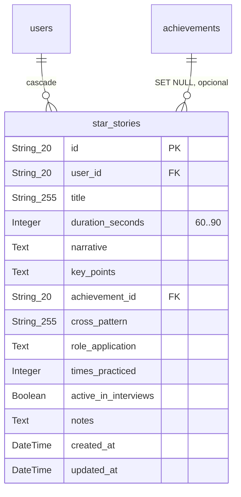
```mermaid
erDiagram
    star_stories {
        String_20 id PK
        String_20 user_id FK
        String_255 title
        Integer duration_seconds "60..90"
        Text narrative
        Text key_points
        String_20 achievement_id FK
        String_255 cross_pattern
        Text role_application
        Integer times_practiced
        Boolean active_in_interviews
        Text notes
        DateTime created_at
        DateTime updated_at
    }
    users
    achievements

    users ||--o{ star_stories : "cascade"
    achievements ||--o{ star_stories : "SET NULL, opcional"
```

#### `career_reviews`

```mermaid
erDiagram
    career_reviews {
        String_20 id PK
        String_20 user_id FK
        Date review_date
        String_50 review_type "gap_analysis|transition_decision|quarterly_review"
        Text context
        Text decision_or_finding
        Text result_or_learning
        Text action_items
        String_30 tracking_status "active|completed|paused"
        Text notes
        DateTime created_at
        DateTime updated_at
    }
    users

    users ||--o{ career_reviews : "cascade"
```

#### `role_gap_analysis`

```mermaid
erDiagram
    role_gap_analysis {
        String_20 id PK
        String_20 user_id FK
        String_20 target_role_id FK
        String_255 gap_name
        String_20 severity "critical|high|medium|low"
        Text market_requirement
        Text closing_plan
        String_30 viability
        String_30 closure_status
        Text notes
        DateTime created_at
        DateTime updated_at
    }
    users
    target_roles

    users ||--o{ role_gap_analysis : "cascade"
    target_roles ||--o{ role_gap_analysis : "cascade"
```

#### `projects`

```mermaid
erDiagram
    projects {
        String_20 id PK
        String_20 user_id FK
        String_255 title
        String_50 category
        String_100 industry
        Integer year
        String_500 card_summary
        Text detailed_summary
        Text problem
        Text solution
        Text architecture
        JSONB competency_ids
        String_100 metric1_label
        String_500 metric1_value
        String_100 metric2_label
        String_500 metric2_value
        String_100 metric3_label
        String_500 metric3_value
        String_100 metric4_label
        String_500 metric4_value
        Text approach_steps
        JSONB results
        String_500 github_url
        String_500 demo_url
        Text repo_structure
        Text evidence_sources
        JSONB releases
        String_30 status "active|in_development|archived"
        Boolean is_featured
        String_1024 image_url
        Text notes
        DateTime created_at
        DateTime updated_at
    }
    users
    publications

    users ||--o{ projects : "cascade"
    projects ||--o{ publications : "SET NULL, opcional"
```

---

## Carrera — Búsqueda

| Módulo | Contenido |
|--------|-----------|
| `fit_scoring_factor.py` | Factores ponderados de fit de vacante |
| `market_segment.py` | Canales mercado visible/oculto |
| `role_narrative.py` | Narrativas reutilizables por rol |
| `search_plan.py` | Planes semanales de búsqueda |
| `networking_contact.py` | Red profesional |
| `contact_interaction.py` | Log de comunicación con un contacto |
| `networking_activity.py` | Actividades give/share/talk |
| `target_company.py` | Empresas objetivo + boards Greenhouse/Lever |
| `vacancy.py` | Vacantes trackeadas (incluye las de job discovery) |
| `cv_version.py` | CV versionado (Markdown `content`) |
| `cover_letter_version.py` | Cartas versionadas |
| `application.py` | Postulaciones a una vacante |
| `application_interaction.py` | Log de comunicación de la postulación |
| `interview.py` | Entrevistas por postulación |

#### `fit_scoring_factors`

```mermaid
erDiagram
    fit_scoring_factors {
        String_20 id PK
        String_20 user_id FK
        String_100 factor_name
        Integer weight_percentage
        Text scoring_guide
        Integer display_order
        Text notes
        DateTime created_at
        DateTime updated_at
    }
    users

    users ||--o{ fit_scoring_factors : "cascade"
```

#### `market_segments`

```mermaid
erDiagram
    market_segments {
        String_20 id PK
        String_20 user_id FK
        String_20 market_type "visible|hidden"
        String_255 channel_name
        String_50 channel_type
        Text strategy_text
        Integer applications_made
        Integer responses_received
        Integer interviews_achieved
        Integer priority "1..10"
        Boolean is_active
        Text notes
        DateTime created_at
        DateTime updated_at
    }
    users

    users ||--o{ market_segments : "cascade"
```

#### `role_narratives`

```mermaid
erDiagram
    role_narratives {
        String_20 id PK
        String_20 user_id FK
        String_20 target_role_id FK
        String_255 title
        String_100 usage_context
        Text full_narrative
        Text key_points
        Boolean is_active
        Text notes
        DateTime created_at
        DateTime updated_at
    }
    users
    target_roles
    interviews

    users ||--o{ role_narratives : "cascade"
    target_roles ||--o{ role_narratives : "SET NULL, opcional"
    role_narratives ||--o{ interviews : "SET NULL, opcional (narrative_used_id)"
```

#### `search_plans`

```mermaid
erDiagram
    search_plans {
        String_20 id PK
        String_20 user_id FK
        String_20 target_role_id FK
        Date period_start
        Date period_end
        JSONB weekly_targets
        Text primary_channels
        Integer target_cvs_sent
        Integer target_interviews
        Integer target_offers
        String_30 plan_status "not_started|in_progress|paused|completed|cancelled"
        Integer completion_percentage
        Text lessons_learned
        Text notes
        DateTime created_at
        DateTime updated_at
    }
    users
    target_roles

    users ||--o{ search_plans : "cascade"
    target_roles ||--o{ search_plans : "SET NULL, opcional"
```

#### `networking_contacts`

```mermaid
erDiagram
    networking_contacts {
        String_20 id PK
        String_20 user_id FK
        String_255 name
        String_255 role_title
        String_255 company_or_specialty
        String_500 linkedin_url
        String_255 email
        String_50 role_category "data_director|automation_ai_peer|..."
        String_30 contact_status "pending|contacted|following_up|converted"
        Text how_originated
        Text notes
        DateTime created_at
        DateTime updated_at
    }
    users
    contact_interactions
    target_companies
    applications

    users ||--o{ networking_contacts : "cascade"
    networking_contacts ||--o{ contact_interactions : "cascade"
    networking_contacts ||--o{ target_companies : "SET NULL, opcional (weak_tie_contact_id)"
    networking_contacts ||--o{ applications : "SET NULL, opcional (recruiter_contact_id)"
```

#### `contact_interactions`

```mermaid
erDiagram
    contact_interactions {
        String_20 id PK
        String_20 user_id FK
        String_20 contact_id FK
        String_20 related_vacancy_id FK
        DateTime interaction_at
        String_50 channel
        Text content_sent
        Text response_received
        String_50 status
        Boolean generated_opportunity
        Text notes
        DateTime created_at
        DateTime updated_at
    }
    users
    networking_contacts
    vacancies

    users ||--o{ contact_interactions : "cascade"
    networking_contacts ||--o{ contact_interactions : "cascade"
    vacancies ||--o{ contact_interactions : "SET NULL, opcional (related_vacancy_id)"
```

#### `networking_activities`

```mermaid
erDiagram
    networking_activities {
        String_20 id PK
        String_20 user_id FK
        String_30 category "give_value_70|share_learning_20|talk_about_you_10"
        String_255 activity_type
        Text concrete_action
        Text example
        String_100 frequency_description
        Integer times_completed
        Boolean is_active
        Text notes
        DateTime created_at
        DateTime updated_at
    }
    users

    users ||--o{ networking_activities : "cascade"
```

#### `target_companies`

```mermaid
erDiagram
    target_companies {
        String_20 id PK
        String_20 user_id FK
        String_255 company_name
        Integer tier
        String_20 best_fit_role_id FK
        String_50 company_size
        String_100 salary_estimate
        String_100 work_modality
        String_100 target_market
        String_20 weak_tie_contact_id FK
        String_10 priority
        String_30 status
        Text notes
        String_30 career_board_provider "greenhouse|lever"
        String_100 career_board_token
        DateTime created_at
        DateTime updated_at
    }
    users
    target_roles
    networking_contacts

    users ||--o{ target_companies : "cascade"
    target_roles ||--o{ target_companies : "SET NULL, opcional (best_fit_role_id)"
    networking_contacts ||--o{ target_companies : "SET NULL, opcional (weak_tie_contact_id)"
```

#### `vacancies`

```mermaid
erDiagram
    vacancies {
        String_20 id PK
        String_20 user_id FK
        Integer order_number
        String_255 company
        String_255 exact_role
        String_500 vacancy_url UK
        String_50 source
        Date found_date
        Integer fit_percentage "0..100"
        String_50 track_category
        String_100 recommended_cv_version
        Text analysis_notes
        String_30 evaluation "apply|do_not_apply|pending_review"
        Boolean is_active
        DateTime created_at
        DateTime updated_at
    }
    users
    contact_interactions
    cover_letter_versions
    applications

    users ||--o{ vacancies : "cascade"
    vacancies ||--o{ contact_interactions : "SET NULL, opcional (related_vacancy_id)"
    vacancies ||--o{ cover_letter_versions : "SET NULL, opcional (target_vacancy_id)"
    vacancies ||--o{ applications : "cascade"
```

#### `cv_versions`

```mermaid
erDiagram
    cv_versions {
        String_20 id PK
        String_20 user_id FK
        String_20 target_role_id FK
        String_255 title
        Integer length_pages
        String_30 status "draft|approved|final"
        Text content "Markdown"
        JSONB target_vacancy_ids
        String_20 file_upload_id "sin FK real, ver nota"
        Text notes
        DateTime created_at
        DateTime updated_at
    }
    users
    target_roles
    applications

    users ||--o{ cv_versions : "cascade"
    target_roles ||--o{ cv_versions : "SET NULL, opcional"
    cv_versions ||--o{ applications : "SET NULL, opcional"
```

`cv_versions.file_upload_id` no es una `ForeignKey` de SQLAlchemy (discrepancia conocida con la tabla legado `file_upload`, ver docstring del modelo).

#### `cover_letter_versions`

```mermaid
erDiagram
    cover_letter_versions {
        String_20 id PK
        String_20 user_id FK
        String_20 target_role_id FK
        String_20 target_vacancy_id FK
        String_255 title
        String_30 status "draft|approved|final"
        Text body_content
        String_20 file_upload_id "sin FK real, ver nota"
        Text notes
        DateTime created_at
        DateTime updated_at
    }
    users
    target_roles
    vacancies
    applications

    users ||--o{ cover_letter_versions : "cascade"
    target_roles ||--o{ cover_letter_versions : "SET NULL, opcional"
    vacancies ||--o{ cover_letter_versions : "SET NULL, opcional (target_vacancy_id)"
    cover_letter_versions ||--o{ applications : "SET NULL, opcional"
```

`cover_letter_versions.file_upload_id` no es una `ForeignKey` de SQLAlchemy (misma discrepancia que `cv_versions`).

#### `applications`

```mermaid
erDiagram
    applications {
        String_20 id PK
        String_20 user_id FK
        String_20 vacancy_id FK
        String_20 cv_version_id FK
        String_20 cover_letter_version_id FK
        String_20 recruiter_contact_id FK
        DateTime applied_at
        String_30 current_status "applied|in_process|offer|rejected|archived"
        String_30 final_result "offer_accepted|offer_rejected|rejected|negotiating"
        Text notes
        DateTime created_at
        DateTime updated_at
    }
    users
    vacancies
    cv_versions
    cover_letter_versions
    networking_contacts
    application_interactions
    interviews

    users ||--o{ applications : "cascade"
    vacancies ||--o{ applications : "cascade"
    cv_versions ||--o{ applications : "SET NULL, opcional"
    cover_letter_versions ||--o{ applications : "SET NULL, opcional"
    networking_contacts ||--o{ applications : "SET NULL, opcional (recruiter_contact_id)"
    applications ||--o{ application_interactions : "cascade"
    applications ||--o{ interviews : "cascade"
```

#### `application_interactions`

```mermaid
erDiagram
    application_interactions {
        String_20 id PK
        String_20 user_id FK
        String_20 application_id FK
        DateTime interaction_at
        String_50 channel
        Text content_sent
        Text response_received
        String_50 status
        Text notes
        DateTime created_at
        DateTime updated_at
    }
    users
    applications

    users ||--o{ application_interactions : "cascade"
    applications ||--o{ application_interactions : "cascade"
```

#### `interviews`

```mermaid
erDiagram
    interviews {
        String_20 id PK
        String_20 user_id FK
        String_20 application_id FK
        String_20 narrative_used_id FK
        String_50 interview_type
        DateTime scheduled_at
        Text interviewers
        Text questions_asked
        Text answers_given
        Text feedback_received
        String_20 overall_impression "very_positive|positive|neutral|negative"
        String_30 interview_result "pending|advanced|rejected|under_consideration"
        Text notes
        DateTime created_at
        DateTime updated_at
    }
    users
    applications
    role_narratives

    users ||--o{ interviews : "cascade"
    applications ||--o{ interviews : "cascade"
    role_narratives ||--o{ interviews : "SET NULL, opcional (narrative_used_id)"
```

---

## Carrera — Digital, soporte, metodologías

| Módulo | Contenido |
|--------|-----------|
| `publication.py` | Posts/blog (alimenta `/public` blog) |
| `linkedin_profile.py` | Staging del perfil LinkedIn (no OAuth) |
| `github_profile.py` | Username + copy; repos se piden en vivo |
| `portal_home.py` | Hero y stats del Home público |
| `portal_about.py` | Copy extra de Sobre mí (bio vive en `identity`) |
| `portal_contact.py` | Contacto + footer (links sociales salen de perfiles) |
| `tag.py` | Etiquetas transversales |
| `operational_methodology.py` | Protocolos Markdown + `agent_profile_ids` (agentes destinatarios) |

#### `publications`

```mermaid
erDiagram
    publications {
        String_20 id PK
        String_20 user_id FK
        String_20 related_project_id FK
        String_255 title
        String_255 slug
        String_500 excerpt
        Text body_content "Markdown"
        String_50 content_type
        Text tags
        String_1024 image_url
        String_100 platform "texto libre: LinkedIn, Blog propio, Medium..."
        String_500 publication_url
        DateTime published_at
        Integer views
        Integer likes_reactions
        Integer comments
        Integer shares
        String_30 status "draft|scheduled|published"
        Integer reading_minutes
        Boolean featured_on_home
        Text notes
        DateTime created_at
        DateTime updated_at
    }
    users
    projects

    users ||--o{ publications : "cascade"
    projects ||--o{ publications : "SET NULL, opcional"
```

#### `linkedin_profile`

```mermaid
erDiagram
    linkedin_profile {
        String_20 id PK
        String_20 user_id FK, UK "1:1 con users"
        String_255 headline
        Text about
        String_500 profile_url
        String_255 location
        JSONB experience "[{company,title,location,start_date,end_date,description}]"
        JSONB education "[{institution,degree,field_of_study,start_date,end_date}]"
        Text featured_skills
        Text featured_certifications
        Text languages
        Text notes
        DateTime created_at
        DateTime updated_at
    }
    users

    users ||--|| linkedin_profile : "cascade, unique user_id"
```

#### `github_profile`

```mermaid
erDiagram
    github_profile {
        String_20 id PK
        String_20 user_id FK, UK "1:1 con users"
        String_255 headline
        Text bio
        Text readme_markdown
        String_500 profile_url
        String_255 username
        Text notes
        DateTime created_at
        DateTime updated_at
    }
    users

    users ||--|| github_profile : "cascade, unique user_id"
```

#### `portal_home`

```mermaid
erDiagram
    portal_home {
        String_20 id PK
        String_20 user_id FK, UK "1:1 con users"
        String_1024 hero_photo_url
        String_255 hero_title
        String_500 hero_subtitle
        Text hero_intro
        String_100 cta1_label
        String_1024 cta1_url
        String_100 cta2_label
        String_1024 cta2_url
        String_100 stat1_label
        String_50 stat1_value
        String_100 stat2_label
        String_50 stat2_value
        String_100 stat3_label
        String_50 stat3_value
        String_100 stat4_label
        String_50 stat4_value
        Text notes
        DateTime created_at
        DateTime updated_at
    }
    users

    users ||--|| portal_home : "cascade, unique user_id"
```

#### `portal_about`

```mermaid
erDiagram
    portal_about {
        String_20 id PK
        String_20 user_id FK, UK "1:1 con users"
        String_1024 photo_url
        String_255 name
        Text notes
        DateTime created_at
        DateTime updated_at
    }
    users

    users ||--|| portal_about : "cascade, unique user_id"
```

#### `portal_contact`

```mermaid
erDiagram
    portal_contact {
        String_20 id PK
        String_20 user_id FK, UK "1:1 con users"
        String_255 contact_email
        String_50 whatsapp
        String_255 location
        String_50 availability_status
        String_100 preferred_contact_method
        JSONB footer_links "[{label,url}]"
        Text notes
        DateTime created_at
        DateTime updated_at
    }
    users

    users ||--|| portal_contact : "cascade, unique user_id"
```

#### `tags`

```mermaid
erDiagram
    tags {
        String_20 id PK
        String_20 user_id FK
        String_100 tag_name "UK con user_id"
        String_100 entity_type
        String_7 color_hex
        Boolean is_active
        Text notes
        DateTime created_at
        DateTime updated_at
    }
    users

    users ||--o{ tags : "cascade"
```

#### `operational_methodologies`

```mermaid
erDiagram
    operational_methodologies {
        String_20 id PK
        String_20 user_id FK
        String_255 title
        String_150 section
        String_150 subsection
        Text description
        Text content "Markdown, requerido"
        JSONB agent_profile_ids "vacío/null = todos los agentes"
        Text notes
        DateTime created_at
        DateTime updated_at
    }
    users

    users ||--o{ operational_methodologies : "cascade"
```

---

## Bedrock y PDF

| Módulo | Contenido |
|--------|-----------|
| `bedrock_settings.py` | Fila única: modelo, presupuesto, prompt override, límites |
| `bedrock_agent_profile_prompt.py` | Suffix editable por perfil de agente |
| `bedrock_agent_profile_photo.py` | Foto por perfil de agente (bucket MinIO) |
| `bedrock_agent_delegation.py` | Override de destinos de delegación por perfil |
| `bedrock_custom_tool.py` | Servidores MCP remotos registrados |
| `bedrock_conversation.py` | `BedrockConversation` + `BedrockConversationMessage` (historial por `session_type` + `agent_profile_id`) |
| `bedrock_usage_log.py` | Costo/tokens por turno |
| `bedrock_usage_round_log.py` | Costo granular (Converse, tool, imagen) |
| `bedrock_task.py` | Tareas/plan del agente (`/agent-tasks`) |
| `pdf_output_template.py` | Plantillas HTML → PDF |
| `pdf_template_style.py` | CSS reutilizable (`style_id`) |

#### `bedrock_settings`

```mermaid
erDiagram
    bedrock_settings {
        Integer id PK
        Text system_prompt "NULL = usa default"
        Text global_rules "NULL = usa default"
        String_150 active_model_id
        String_150 orchestrator_model_id
        Integer max_round_trips
        Integer history_window
        Numeric daily_budget_usd
        DateTime updated_at
    }
```

Fila única, sin `user_id` (configuración global de un asistente single-tenant, ver CLAUDE.md).

#### `bedrock_agent_profile_prompts`

```mermaid
erDiagram
    bedrock_agent_profile_prompts {
        String_50 profile_id PK "coincide con agent_profiles.py"
        Text system_prompt_suffix
        DateTime updated_at
    }
```

Sin `user_id` (configuración global). `profile_id` no lleva FK dura — referencia blanda al catálogo en código `agent_profiles.py`.

#### `bedrock_agent_profile_photos`

```mermaid
erDiagram
    bedrock_agent_profile_photos {
        String_50 profile_id PK
        String_1024 photo_url
        DateTime updated_at
    }
```

Sin `user_id` (configuración global). Independiente del override de prompt.

#### `bedrock_agent_delegation`

```mermaid
erDiagram
    bedrock_agent_delegation {
        String_50 profile_id PK
        JSONB target_ids "lista agent_*; vacía = no delega"
        DateTime updated_at
    }
```

Sin `user_id` (configuración global).

#### `bedrock_custom_tools`

```mermaid
erDiagram
    bedrock_custom_tools {
        String_20 id PK
        String_100 name UK
        Text url
        JSON headers
        Boolean is_enabled
        DateTime created_at
    }
```

Sin `user_id` (configuración global).

#### `bedrock_conversations`

```mermaid
erDiagram
    bedrock_conversations {
        String_20 id PK
        String_20 user_id FK
        String_100 session_id UK
        String_20 session_type "contextual|general"
        String_50 agent_profile_id
        String_255 title
        DateTime created_at
        DateTime updated_at
    }
    users
    bedrock_conversation_messages

    users ||--o{ bedrock_conversations : "cascade"
    bedrock_conversations ||--o{ bedrock_conversation_messages : "cascade"
```

#### `bedrock_conversation_messages`

```mermaid
erDiagram
    bedrock_conversation_messages {
        String_20 id PK
        String_20 conversation_id FK
        String_20 role "user|assistant"
        Text content
        DateTime created_at
    }
    bedrock_conversations

    bedrock_conversations ||--o{ bedrock_conversation_messages : "cascade"
```

#### `bedrock_usage_logs`

```mermaid
erDiagram
    bedrock_usage_logs {
        Integer id PK
        String_20 user_id FK
        String_64 session_id
        String_150 model_id
        Integer input_tokens
        Integer output_tokens
        Integer cache_read_tokens
        Integer cache_write_tokens
        Numeric estimated_cost_usd
        DateTime created_at
    }
    users

    users ||--o{ bedrock_usage_logs : "cascade"
```

#### `bedrock_usage_round_logs`

```mermaid
erDiagram
    bedrock_usage_round_logs {
        Integer id PK
        String_20 user_id FK
        String_100 session_id
        String_150 model_id
        String_30 round_type "converse|tool|image"
        String_100 tool_name
        String_50 agent_profile_id
        Integer input_tokens
        Integer output_tokens
        Integer cache_read_tokens
        Integer cache_write_tokens
        Numeric estimated_cost_usd
        Text notes
        DateTime created_at
    }
    users

    users ||--o{ bedrock_usage_round_logs : "cascade"
```

#### `bedrock_tasks`

```mermaid
erDiagram
    bedrock_tasks {
        String_20 id PK
        String_20 user_id FK
        String_255 title
        Text description
        String_20 status "pending|in_progress|done|cancelled|failed"
        Text notes
        String_20 assignee_type "user|agent"
        String_50 agent_profile_id
        DateTime scheduled_at
        DateTime due_at
        String_20 priority "low|medium|high"
        String_20 parent_id FK "self-reference"
        Integer sort_order
        Boolean is_blocking
        Boolean execute_on_turn
        DateTime turn_notified_at
        Text execution_result
        DateTime executed_at
        Text error_message
        DateTime created_at
        DateTime updated_at
    }
    users

    users ||--o{ bedrock_tasks : "cascade"
    bedrock_tasks ||--o{ bedrock_tasks : "cascade, self-reference parent_id"
```

#### `pdf_output_templates`

```mermaid
erDiagram
    pdf_output_templates {
        String_20 id PK
        String_20 user_id FK
        String_120 slug
        String_50 document_type
        String_255 title
        Text description
        Text html_template
        String_20 style_id FK
        Text variables
        JSONB variables_schema
        Text preview_notes
        Boolean is_active
        Boolean is_default
        Integer version
        DateTime created_at
        DateTime updated_at
    }
    users
    pdf_template_styles

    users ||--o{ pdf_output_templates : "cascade"
    pdf_template_styles ||--o{ pdf_output_templates : "SET NULL, opcional (style_id)"
```

#### `pdf_template_styles`

```mermaid
erDiagram
    pdf_template_styles {
        String_20 id PK
        String_20 user_id FK
        String_120 slug
        String_255 title
        Text description
        Text css_content
        Text style_guide
        Boolean is_active
        DateTime created_at
        DateTime updated_at
    }
    users
    pdf_output_templates

    users ||--o{ pdf_template_styles : "cascade"
    pdf_template_styles ||--o{ pdf_output_templates : "SET NULL, opcional (style_id)"
```

---

## Secciones del Admin (ADR-023)

Árbol **grupo → L1 → L2 → L3** que reemplaza el registro en código de "Secciones del Admin" (ADR-021). Cada sección L1/L2/L3 puede tener 0–10 `admin_views` y, a la vez, subsecciones; una vista con `owner_l1_id`/`owner_l2_id`/`owner_l3_id` cuelga de exactamente un nivel (`CheckConstraint` de propietario único). Estructura sembrada por `services/admin_sections_seed.py::sync_structure()`; solo `responsible_agent_profile_id` e `instructions` de `admin_views` son editables desde el Admin.

| Módulo | Tabla / clase | Función |
|--------|---------------|---------|
| `admin_section_group.py` | `AdminSectionGroup` (`grp-N`) | Grupo del sidebar izquierdo; nunca tiene vistas propias |
| `admin_section_l1.py` | `AdminSectionL1` (`s1-N`) | Sección de primer nivel bajo un grupo; re-key del antiguo `sec-N` |
| `admin_section_l2.py` | `AdminSectionL2` (`s2-N`) | Subsección de una L1 (`parent_l1_id`, `ON DELETE CASCADE`) |
| `admin_section_l3.py` | `AdminSectionL3` (`s3-N`) | Subsección de una L2 (`parent_l2_id`, `ON DELETE CASCADE`), hoja del árbol |
| `admin_view.py` | `AdminView` (`vw-N`) | Pestaña/vista de una sección L1/L2/L3; dueño de `responsible_agent_profile_id` + `instructions` |

#### `admin_section_groups`

```mermaid
erDiagram
    admin_section_groups {
        String_20 id PK
        String_60 system_name UK
        String_120 name UK
        Integer sort_order
        String_16 origin "code|admin"
        String_20 visibility_level "standard|..."
        DateTime created_at
        DateTime updated_at
    }
    admin_sections_l1

    admin_section_groups ||--o{ admin_sections_l1 : "RESTRICT"
```

#### `admin_sections_l1`

```mermaid
erDiagram
    admin_sections_l1 {
        String_20 id PK
        String_20 group_id FK
        String_80 system_name UK
        String_120 label
        String_120 path "UK si no NULL"
        String_20 section_type "table|functional|metrics|bucket"
        Integer sort_order
        String_16 origin "code|admin"
        String_20 visibility_level
        DateTime created_at
        DateTime updated_at
    }
    admin_section_groups
    admin_sections_l2
    admin_views

    admin_section_groups ||--o{ admin_sections_l1 : "RESTRICT"
    admin_sections_l1 ||--o{ admin_sections_l2 : "cascade (parent_l1_id)"
    admin_sections_l1 ||--o{ admin_views : "cascade (owner_l1_id)"
```

#### `admin_sections_l2`

```mermaid
erDiagram
    admin_sections_l2 {
        String_20 id PK
        String_20 parent_l1_id FK
        String_80 system_name UK
        String_120 label
        String_120 path "UK si no NULL"
        String_20 section_type "table|functional|metrics|bucket"
        Integer sort_order
        String_16 origin "code|admin"
        String_20 visibility_level
        DateTime created_at
        DateTime updated_at
    }
    admin_sections_l1
    admin_sections_l3
    admin_views

    admin_sections_l1 ||--o{ admin_sections_l2 : "cascade (parent_l1_id)"
    admin_sections_l2 ||--o{ admin_sections_l3 : "cascade (parent_l2_id)"
    admin_sections_l2 ||--o{ admin_views : "cascade (owner_l2_id)"
```

#### `admin_sections_l3`

```mermaid
erDiagram
    admin_sections_l3 {
        String_20 id PK
        String_20 parent_l2_id FK
        String_80 system_name UK
        String_120 label
        String_120 path "UK si no NULL"
        String_20 section_type "table|functional|metrics|bucket"
        Integer sort_order
        String_16 origin "code|admin"
        String_20 visibility_level
        DateTime created_at
        DateTime updated_at
    }
    admin_sections_l2
    admin_views

    admin_sections_l2 ||--o{ admin_sections_l3 : "cascade (parent_l2_id)"
    admin_sections_l3 ||--o{ admin_views : "cascade (owner_l3_id)"
```

#### `admin_views`

```mermaid
erDiagram
    admin_views {
        String_20 id PK
        String_20 owner_l1_id FK "exactamente uno de los 3 owner_*"
        String_20 owner_l2_id FK
        String_20 owner_l3_id FK
        String_40 key "UK compuesta con el owner activo"
        String_120 label
        Integer sort_order
        Boolean has_controls_window
        JSONB tool_names
        String_20 data_source "crud|computed|singleton|external"
        String_80 resource_key "solo si data_source in crud/singleton"
        String_50 responsible_agent_profile_id "referencia blanda a perfil L2, sin FK dura"
        Text instructions
        String_16 origin "code|admin"
        String_20 visibility_level
        DateTime created_at
        DateTime updated_at
    }
    admin_sections_l1
    admin_sections_l2
    admin_sections_l3

    admin_sections_l1 ||--o{ admin_views : "cascade (owner_l1_id)"
    admin_sections_l2 ||--o{ admin_views : "cascade (owner_l2_id)"
    admin_sections_l3 ||--o{ admin_views : "cascade (owner_l3_id)"
```

`admin_views.responsible_agent_profile_id` referencia el `profile_id` canónico de `agent_profiles.py` (mismo dominio que `bedrock_agent_profile_prompts.profile_id`), pero **sin FK dura** — no existe tabla de perfiles Bedrock en la base de datos.

---

## LinkedIn integración

| Módulo | Contenido |
|--------|-----------|
| `linkedin_connection.py` | Token OAuth "Share on LinkedIn" |
| `linkedin_post.py` | Cola + historial de posts (`scheduled` / publicado) |

#### `linkedin_connections`

```mermaid
erDiagram
    linkedin_connections {
        String_20 id PK
        String_20 user_id FK, UK "1:1 con users"
        String_2048 access_token
        String_255 member_sub "LinkedIn OIDC sub claim"
        String_255 member_name
        String_255 member_email
        String_1024 profile_picture_url
        DateTime expires_at
        DateTime connected_at
        DateTime updated_at
    }
    users

    users ||--|| linkedin_connections : "cascade, unique user_id"
```

#### `linkedin_posts`

```mermaid
erDiagram
    linkedin_posts {
        String_20 id PK
        String_20 user_id FK
        Text text
        String_1024 image_url "copia propia en MinIO"
        String_20 status "scheduled|published|failed"
        Text error_message
        String_255 linkedin_post_urn
        DateTime scheduled_at
        DateTime published_at
        Text notes
        DateTime created_at
    }
    users

    users ||--o{ linkedin_posts : "cascade"
```

Esquema SQL: [docs/DATABASE.md](../../docs/DATABASE.md).
