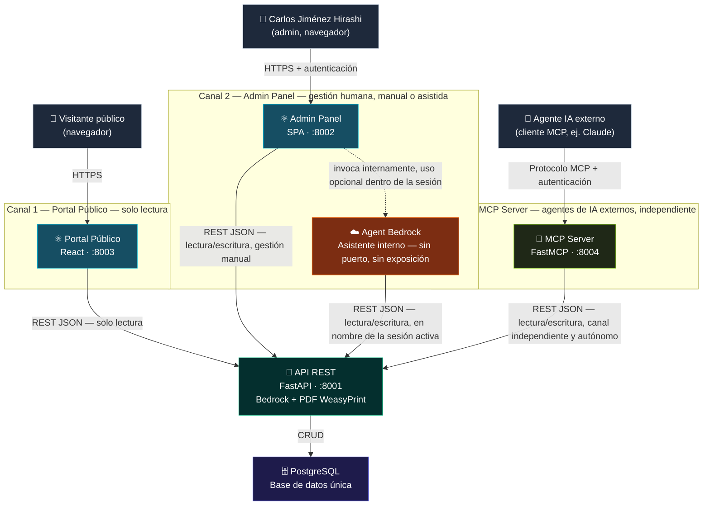
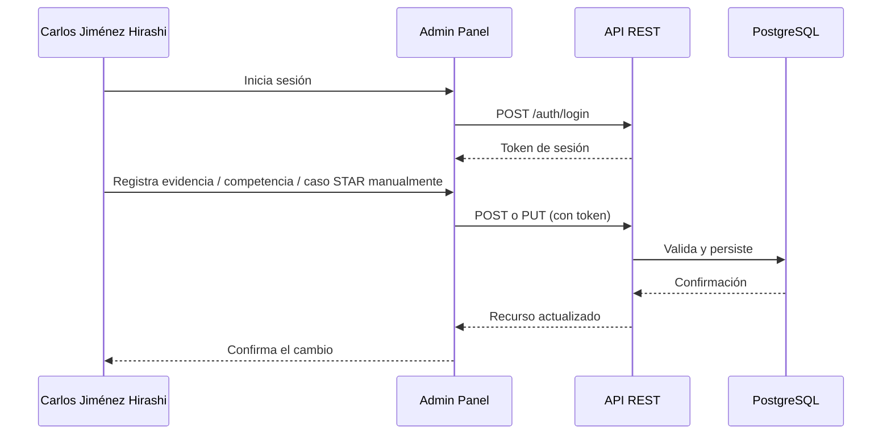
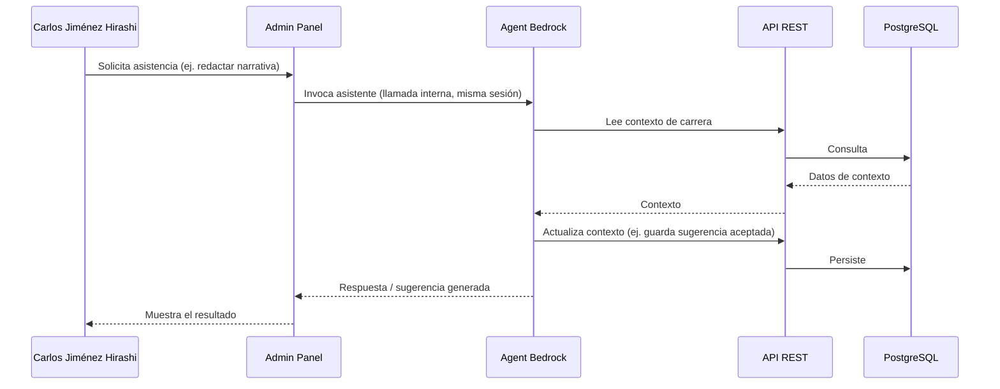
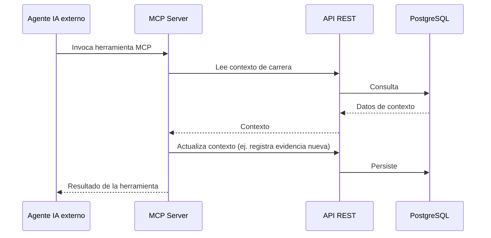
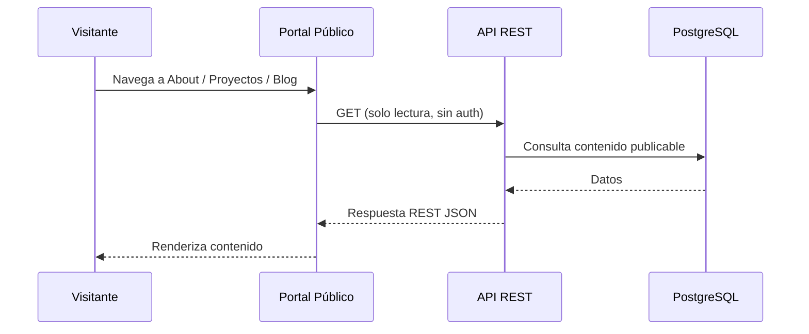

# Introducción y Contexto - cjhirashi-career

**INTRODUCCIÓN ARQUITECTÓNICA**

---

**Última actualización**: 2026-08-16
**Resumen rápido**: 2 canales de entrada hacia la misma API central — Portal Público (8003, lectura) y Admin Panel (8002, gestión humana manual o asistida por Bedrock) · Stack: React · FastAPI · PostgreSQL · WeasyPrint

---

> ⚠️ **Estado (2026-09-04): el MCP Server (Canal 3 / Componente 5️⃣) se retiró** — ver
> [ADR-023](./09-DECISIONS/023-retirar-mcp-server.md). Este documento todavía lo describe
> como uno de los tres canales; ese texto es **diseño previo** y su reescritura sin el
> Canal 3 está pendiente. Donde leas "tres canales" / "MCP Server", hoy son **dos
> canales** (Portal Público, Admin Panel), más Agent Bedrock como capacidad interna.

---

## 📋 Tabla de Contenidos

- [Visión General del Sistema](#-visión-general-del-sistema)
- [Diagrama del Sistema](#-diagrama-del-sistema)
- [Componentes](#-componentes)
- [Tabla Resumen de Módulos](#-tabla-resumen-de-módulos)
- [Flujos de Datos Principales](#-flujos-de-datos-principales)
- [Stack Tecnológico](#-stack-tecnológico)
- [Principios de Diseño](#-principios-de-diseño)
- [Modelo de Seguridad](#-modelo-de-seguridad)
- [Preguntas de Validación Abiertas](#-preguntas-de-validación-abiertas)

---

## 🎯 Visión General del Sistema

**cjhirashi-career** es la plataforma personal e integrada de **Carlos Jiménez Hirashi**, y reemplaza el alcance anterior de este proyecto (un servidor de generación de documentos vía MCP). El sistema combina un sitio de portafolio público, una herramienta interna de gestión de carrera y un canal para agentes de inteligencia artificial, todos convergiendo sobre una única fuente de datos central.

El sistema puede **operarse de tres formas completamente independientes**, cada una con su propio punto de entrada, que convergen únicamente en la misma API REST y la misma base de datos — ningún canal depende de otro ni pasa a través de otro:

1. **Portal Público** (puerto 8003): cualquier visitante (reclutadores, colegas, público general) consulta el perfil profesional de Carlos Jiménez Hirashi — About, Proyectos, Blog, Contacto — en modo exclusivamente de lectura, sin autenticarse.

2. **Admin Panel** (puerto 8002): Carlos Jiménez Hirashi, como único usuario autenticado, gestiona su carrera profesional (identidad, competencias, evidencia, vacantes, contactos, entrevistas) de **dos maneras posibles dentro del mismo canal**: de forma manual, operando directamente los formularios del panel, o pidiendo asistencia a **Agent Bedrock**, un asistente de IA embebido y estrictamente interno al Admin Panel. Agent Bedrock **no tiene existencia fuera de una sesión autenticada del Admin Panel** — no se expone a Internet, no tiene puerto propio y no es una vía de acceso alternativa al sistema, sino una capacidad más dentro del panel de administración.

3. **MCP Server** (puerto 8004): un agente de IA externo (por ejemplo, Claude u otro cliente compatible con el protocolo MCP) opera el sistema de gestión de carrera de forma **totalmente autónoma e independiente del Admin Panel**. El MCP Server no es una herramienta invocada por el Admin Panel ni depende de él en ningún punto — es una **puerta de entrada alterna y autosuficiente** hacia la misma API REST, pensada para que un agente externo pueda leer y escribir el contexto de carrera sin que Carlos Jiménez Hirashi esté necesariamente usando el panel en ese momento.

Esta independencia entre canales es el punto arquitectónico central de este documento: **el Admin Panel y el MCP Server no forman una cadena** (uno no invoca al otro), sino dos superficies distintas que exponen la misma capacidad de gestión de carrera a audiencias distintas — una persona humana autenticada, y un agente de IA autónomo. Agent Bedrock, en cambio, sí es estrictamente subordinado — solo existe como capacidad interna del Admin Panel, nunca como canal propio.

La razón de ser de esta arquitectura sigue siendo que **el trabajo de gestión de carrera — hecho manualmente, asistido por Bedrock, o realizado por un agente externo vía MCP — alimenta directamente el contenido que se muestra en público**: cualquiera de las tres vías de escritura converge en la misma base de datos, y es de ahí que el Portal Público lee el contenido publicable.

Este documento es la introducción arquitectónica (sección 1 de la documentación Arc42 del proyecto) y describe el **diseño objetivo** acordado por el Arquitecto de Soluciones para este nuevo alcance. El proyecto se encuentra en fase de rediseño: la implementación previa (servidor MCP + frontend + API + PDF embebido) queda como base técnica reutilizable, pero la topología, los módulos y las rutas de comunicación descritos aquí son el nuevo mapa a construir, no el estado actual del código. Donde exista una decisión sin resolver, se marca explícitamente en la sección [Preguntas de Validación Abiertas](#-preguntas-de-validación-abiertas) en lugar de asumirse.

## 🔌 Diagrama del Sistema

**Lectura del diagrama — tres canales, no una jerarquía**: los tres subgrafos (Canal 1, Canal 2, Canal 3) son entradas paralelas e independientes al sistema. La única línea punteada del diagrama (Admin → Bedrock) representa una invocación **interna, opcional, dentro de la misma sesión autenticada** — no una llamada de red hacia un componente externo. El MCP Server, en cambio, tiene su propia flecha sólida de un actor externo (Agente IA) directamente hacia él, sin pasar por el Admin Panel en ningún punto.

**Conexiones explícitamente prohibidas por diseño** (no aparecen en el diagrama a propósito):
- MCP Server → Admin Panel, o viceversa: **no existe**. Son canales independientes; ninguno invoca al otro.
- MCP Server → Agent Bedrock, o viceversa: **no existe**. Agent Bedrock es exclusivo del Admin Panel.
- Agent Bedrock → cualquier componente que no sea la API REST: **no existe**. Es un asistente interno, sin salida propia distinta de la API.
- Portal Público → Admin Panel, Agent Bedrock o MCP Server: **no existen**. El Portal Público solo conoce a la API REST, en modo lectura.
- Cualquier componente → PostgreSQL, salvo la API REST: **no existe**. La API REST es el único escritor y lector de la base de datos.

**Nota de estado actual**: la implementación previa de este proyecto (ver commits `feat: Implement REST API with JWT authentication and PostgreSQL` y anteriores) contaba con Frontend, API REST, MCP Server y PostgreSQL, con un alcance de "generador de documentos" y sin Portal Público, Admin Panel ni Agent Bedrock. Es interesante notar que ese diseño previo ya trataba al MCP Server como un canal de entrada externo e independiente para agentes de IA — el rediseño actual retoma y confirma ese mismo principio para el nuevo alcance, en vez de subordinar el MCP Server al Admin Panel. Ninguno de los 7 módulos existe hoy con el alcance de carrera profesional ni con los puertos aquí definidos — este documento describe el diseño objetivo a construir, reutilizando como base técnica los contenedores API REST, PostgreSQL y el motor de generación de PDF ya existentes.

## 🧩 Componentes

### 1️⃣ Portal Público

**Propósito**: sitio web público — la evolución de cjhirashi.com — donde cualquier visitante conoce el perfil profesional de Carlos Jiménez Hirashi sin necesidad de autenticarse.

**Responsabilidades**:
- Mostrar las secciones About, Proyectos, Blog y Contacto
- Consumir en modo **solo lectura** los datos publicables persistidos en la base de datos, sin importar por cuál de los otros dos canales (Admin Panel o MCP Server) hayan sido escritos
- No requiere autenticación de usuario; sí implementa controles de acceso a nivel de red (CORS, límites de tasa) por estar expuesto a Internet
- **No** tiene acceso al Admin Panel, a Agent Bedrock ni al MCP Server — su única salida es la API REST, en modo lectura

**Tecnología**: React + TypeScript (versión y bundler específicos a confirmar — ver [Preguntas de Validación Abiertas](#-preguntas-de-validación-abiertas))

**Interfaces**:
- Entrada: navegación del visitante público (puerto 8003)
- Salida: peticiones REST JSON de solo lectura hacia la API REST

### 2️⃣ Admin Panel

**Propósito**: panel privado, de un único usuario (Carlos Jiménez Hirashi), para gestionar activamente su carrera profesional — de forma manual o con asistencia interna de Agent Bedrock. Es uno de los **dos canales de escritura** del sistema, junto con el MCP Server, pero completamente independiente de este último.

**Responsabilidades**:
- Gestionar Identidad Profesional, Inventario de Competencias, Evidencia (proyectos, cargos, logros, casos STAR), Estrategias de Búsqueda de Empleo, Base de Vacantes, Networking y Preparación para Entrevistas — de forma manual, con el usuario operando directamente los formularios
- Ofrecer, dentro de la misma sesión autenticada, la opción de invocar a Agent Bedrock como asistencia para cualquiera de esas tareas — esta invocación es interna y opcional, no un canal de acceso distinto
- Solicitar generación de documentos (CV, Cover Letter, plantillas HTML) a la API REST — WeasyPrint corre in-process en la API
- No tiene ninguna relación con el MCP Server: ambos son canales de escritura paralelos, no uno subordinado al otro

**Tecnología**: SPA + TypeScript (framework específico a confirmar — ver [Preguntas de Validación Abiertas](#-preguntas-de-validación-abiertas))

**Interfaces**:
- Entrada: navegación autenticada de Carlos Jiménez Hirashi (puerto 8002)
- Salida: peticiones REST JSON de lectura/escritura hacia la API REST (CRUD, PDF y chat Bedrock)

### 3️⃣ API REST

**Propósito**: punto central de CRUD y orquestación — la única puerta de entrada a la base de datos, y el único lugar donde convergen los tres canales independientes del sistema.

**Responsabilidades**:
- Autenticar al usuario administrador (Carlos Jiménez Hirashi) para las operaciones del Admin Panel
- Exponer endpoints de solo lectura, sin autenticación, para el contenido público consumido por el Portal Público
- CRUD completo sobre todas las entidades de carrera profesional (identidad, competencias, evidencia, vacantes, contactos, entrevistas)
- Atender lectura/escritura tanto del Admin Panel (gestión manual), de Agent Bedrock (gestión asistida, en nombre de la sesión activa del Admin Panel) y del MCP Server (canal independiente para agentes externos) — los tres con permisos equivalentes de CRUD
- Ser el único componente con acceso de lectura/escritura a PostgreSQL
- Renderizar PDF in-process (WeasyPrint): plantillas HTML (`/pdf-templates/{id}/render`) y export de CV markdown

**Tecnología**: FastAPI + SQLAlchemy 2.0 (async) + asyncpg + PyJWT + passlib/bcrypt (base técnica heredada de la implementación previa de este proyecto)

**Interfaces**:
- Entrada: peticiones REST JSON del Portal Público (lectura), del Admin Panel (lectura/escritura), de Agent Bedrock (lectura/escritura) y del MCP Server (lectura/escritura, canal independiente)
- Salida: respuestas REST JSON; consultas a PostgreSQL

### 4️⃣ Agent Bedrock (asistente interno del Admin Panel)

**Propósito**: asistente de IA gestionado sobre AWS Bedrock, embebido exclusivamente dentro del Admin Panel para apoyar tareas de gestión de carrera (por ejemplo, redactar narrativas o sugerir competencias a partir de evidencia registrada). **No es un canal de acceso al sistema** — es una capacidad interna, disponible únicamente dentro de una sesión ya autenticada del Admin Panel.

**Responsabilidades**:
- Recibir solicitudes de asistencia únicamente desde el Admin Panel, nunca desde otro origen
- Ejecutar el razonamiento del agente sobre el modelo gestionado por AWS Bedrock
- Consultar y actualizar el contexto de carrera necesario en la API REST, en nombre de la sesión activa del Admin Panel
- Retornar la respuesta o sugerencia al Admin Panel

**Tecnología**: AWS Bedrock (servicio gestionado, sin contenedor ni puerto local propio, sin exposición a Internet)

**Interfaces**:
- Entrada: invocaciones internas, exclusivas y opcionales del Admin Panel
- Salida: respuesta al Admin Panel; lectura/escritura sobre la API REST

**Nota**: al ser un servicio gestionado por AWS, este componente introduce una dependencia externa a la nube de AWS y credenciales asociadas — ver [Modelo de Seguridad](#-modelo-de-seguridad). Aunque la llamada final a AWS sale de la red del proyecto, Agent Bedrock **no expone ningún puerto ni endpoint propio** dentro de la arquitectura: es invocado como una función del Admin Panel, no como un servicio de red independiente alcanzable por terceros.

### 5️⃣ MCP Server (canal independiente para agentes de IA externos)

**Propósito**: interfaz completa y autónoma del protocolo Model Context Protocol (MCP) que permite a un agente de IA externo (por ejemplo, Claude u otro cliente MCP) operar el sistema de gestión de carrera **sin pasar por el Admin Panel en ningún momento**. Es el sucesor directo del MCP Server que en la versión anterior de este proyecto era el componente central del sistema, y retoma ese mismo rol de canal externo autosuficiente.

**Responsabilidades**:
- Definir herramientas MCP que cubren el mismo alcance de gestión de carrera que el Admin Panel expone a un humano (identidad, competencias, evidencia, vacantes, contactos, entrevistas)
- Recibir solicitudes directamente de un agente de IA externo, de forma completamente independiente de si Carlos Jiménez Hirashi está usando el Admin Panel en ese momento
- Consultar y actualizar el contexto de carrera en la API REST
- Retornar el resultado al agente externo que originó la llamada

**Tecnología**: FastMCP

**Interfaces**:
- Entrada: llamadas a herramientas MCP de un agente de IA externo (puerto 8004, expuesto al host, con autenticación propia)
- Salida: respuesta al agente externo; lectura/escritura sobre la API REST

**Diferencia clave frente a Agent Bedrock**: ambos tienen permisos de lectura/escritura equivalentes sobre la API REST, pero su naturaleza es opuesta. Agent Bedrock es una capacidad interna del Admin Panel, sin exposición ni identidad propia frente al exterior. El MCP Server es, en sí mismo, un canal de acceso completo al sistema, expuesto e independiente, con su propia audiencia (agentes de IA externos) que no requiere que exista una sesión de Admin Panel activa.

### 6️⃣ PostgreSQL

**Propósito**: centro de verdad único para todos los datos del sistema, sin importar por cuál de los tres canales hayan sido escritos.

**Responsabilidades**:
- Almacenar identidad profesional, competencias, evidencia, vacantes, contactos y preparación de entrevistas
- Almacenar el contenido publicable consumido por el Portal Público (About, Proyectos, Blog)
- Almacenar usuarios y credenciales de autenticación
- Garantizar integridad transaccional, independientemente de si la escritura provino del Admin Panel, de Agent Bedrock o del MCP Server

**Tecnología**: PostgreSQL 15, con volumen Docker persistente

**Interfaces**:
- Entrada: conexiones exclusivamente desde la API REST (lectura/escritura)
- Salida: resultados de consultas SQL, entregados únicamente a la API REST

## 📊 Tabla Resumen de Módulos

| Módulo | Canal | Acceso | Puerto | Depende de |
|--------|-------|--------|--------|-----------|
| Portal Público | Canal 1 — lectura pública | Externo, público, controles de acceso de red (sin login) | 8003 | API REST (lectura) |
| Admin Panel | Canal 2 — gestión humana | Externo, privado, con autenticación | 8002 | API REST (CRUD, PDF, Bedrock) |
| Agent Bedrock | Interno al Canal 2 — no es un canal propio | Interno, sin puerto, sin exposición | — | API REST (lectura/escritura) |
| MCP Server | Canal 3 — agentes de IA externos, **independiente del Canal 2** | Externo, con autenticación propia | 8004 | API REST (lectura/escritura) |
| API REST | Punto de convergencia de los 3 canales | Interno | 8001 | PostgreSQL · WeasyPrint (PDF in-process) · AWS Bedrock |
| PostgreSQL | Persistencia central de los 3 canales | Interno | — | Ninguno |

**Aclaración importante**: Admin Panel (Canal 2) y MCP Server (Canal 3) son **dos canales de escritura independientes**, no uno una herramienta del otro. Ambos llegan a la misma API REST, pero ninguno pasa por el otro ni depende de que el otro esté activo. Agent Bedrock, a diferencia de estos dos, no es un canal — es una capacidad interna exclusiva del Canal 2.

## 📈 Flujos de Datos Principales

### Flujo 1: Usuario con gestión manual (Admin → API → BD)

**Pasos:**
1. Carlos Jiménez Hirashi se autentica en el Admin Panel
2. Opera directamente los formularios del panel, sin invocar ninguna asistencia de IA
3. El Admin Panel envía la operación a la API REST usando el token de sesión
4. La API REST valida y persiste el cambio en PostgreSQL

### Flujo 2: Usuario con asistencia de Bedrock (Admin → Bedrock → API → BD)

**Pasos:**
1. Carlos Jiménez Hirashi, ya autenticado en el Admin Panel, solicita asistencia de IA
2. El Admin Panel invoca a Agent Bedrock de forma interna — esta invocación ocurre dentro de la misma sesión, no es una llamada a un servicio externo alcanzable por terceros
3. Agent Bedrock lee y, si corresponde, escribe el contexto de carrera en la API REST, en nombre de esa sesión
4. El resultado se retorna al Admin Panel y se muestra a Carlos Jiménez Hirashi

### Flujo 3: Agente externo opera el sistema (MCP Server → API → BD)

**Pasos:**
1. Un agente de IA externo (por ejemplo, Claude u otro cliente MCP) se conecta directamente al MCP Server — **sin que el Admin Panel intervenga ni esté necesariamente activo**
2. El MCP Server ejecuta la herramienta solicitada, leyendo el contexto de carrera necesario desde la API REST
3. Si la tarea lo requiere, el MCP Server también escribe actualizaciones en la API REST
4. El resultado se retorna directamente al agente externo — Carlos Jiménez Hirashi no participa en este flujo en tiempo real

### Flujo 4: Portal público — lectura (Portal → API → BD)

**Pasos:**
1. El visitante navega a una sección pública sin necesidad de autenticarse
2. El Portal Público solicita el contenido correspondiente a la API REST, en modo exclusivamente de lectura
3. La API REST consulta PostgreSQL y retorna únicamente los datos marcados como publicables, sin importar si fueron escritos manualmente, con asistencia de Bedrock, o por un agente externo vía MCP Server
4. El Portal Público renderiza el contenido al visitante

**Diferencia clave entre el Flujo 2 y el Flujo 3**: estructuralmente ambos flujos pasan por un agente antes de llegar a la API REST, pero su naturaleza es opuesta. El Flujo 2 ocurre **dentro** de una sesión ya autenticada del Admin Panel — Agent Bedrock es invocado únicamente por Carlos Jiménez Hirashi, y nunca tiene una vía de entrada propia. El Flujo 3 es un **canal alterno y autónomo**: un agente externo se conecta directamente al MCP Server sin que el Admin Panel intervenga en absoluto, y sin que Carlos Jiménez Hirashi necesite estar presente. No hay ningún punto en el que uno de estos dos flujos dependa del otro.

## 🔧 Stack Tecnológico

| Capa | Tecnología | Versión | Propósito |
|-------|-----------|---------|---------|
| Portal Público | React + TypeScript | A confirmar | UI pública de portafolio (Canal 1) |
| Admin Panel | SPA + TypeScript | A confirmar | UI privada de gestión de carrera (Canal 2) |
| Agent Bedrock | AWS Bedrock | Servicio gestionado | Asistente interno del Admin Panel, lectura/escritura sobre la API |
| API REST | FastAPI | Heredado del proyecto previo | Autenticación, CRUD, punto de convergencia de los 3 canales |
| ORM | SQLAlchemy (async) + asyncpg | 2.0 | Acceso a PostgreSQL |
| Autenticación | PyJWT + passlib/bcrypt | Heredado del proyecto previo | Tokens de sesión, hashing de contraseñas |
| MCP Server | FastMCP | Heredado del proyecto previo | Canal independiente para agentes de IA externos (Canal 3), lectura/escritura sobre la API |
| Generación de PDF | WeasyPrint + Jinja2 | Heredado del proyecto previo | Render de CV / Cover Letter a PDF, exclusivo del Admin Panel |
| Base de Datos | PostgreSQL | 15 (alpine) | Persistencia centralizada de los 3 canales |
| Orquestación | Docker Compose | — | Definición y arranque de los 7 módulos |
| Red | `network-cjhirashi-srv` | — | Red Docker externa compartida |

## 🎨 Principios de Diseño

Este proyecto aún no cuenta con Architecture Decision Records (ADRs) formales para este nuevo alcance — las decisiones siguientes quedan documentadas aquí hasta que se redacten los ADRs correspondientes en `docs/09-DECISIONS/`.

### Tres Canales Independientes, Una Sola API
- Portal Público, Admin Panel y MCP Server son tres puntos de entrada distintos, cada uno con su propia audiencia (visitante público, humano autenticado, agente de IA externo)
- Ninguno de los tres canales invoca a otro ni depende de que otro esté activo — todos convergen únicamente en la API REST
- Esta independencia es deliberada: permite, por ejemplo, que un agente externo opere el sistema vía MCP Server sin que Carlos Jiménez Hirashi tenga el Admin Panel abierto en ese momento

### Agent Bedrock No Es un Canal, Es una Capacidad
- A diferencia del MCP Server, Agent Bedrock no tiene existencia fuera del Admin Panel: no se expone, no tiene puerto propio y no puede ser invocado por nadie más que la sesión autenticada que lo solicita
- Esta asimetría es intencional: la asistencia de IA dentro del panel humano es una función más del panel, mientras que el acceso de agentes de IA externos requiere su propio canal (MCP Server), con su propia superficie de exposición y autenticación

### Fuente Única de Verdad para el Contenido Público
- El trabajo de curación de carrera — sin importar si se hizo manualmente en el Admin Panel, con asistencia de Bedrock, o mediante un agente externo vía MCP Server — es la fuente de la que se nutre el contenido mostrado en el Portal Público
- No existe una copia paralela de contenido para el sitio público: todo pasa por PostgreSQL, vía la API REST, y se distingue por su condición de publicable o no

### Datos Centralizados
- Ningún módulo mantiene estado propio de negocio
- Todo dato relevante se consulta o persiste en PostgreSQL, siempre a través de la API REST
- La API REST es el único escritor y lector de la base de datos, y el único punto donde los tres canales realmente confluyen

### Acceso Restringido por Diseño
- Portal Público (8003), Admin Panel (8002) y MCP Server (8004): acceso externo, cada uno con su propio mecanismo de control de acceso, y cada uno alcanzable de forma independiente de los otros dos
- API REST (8001) y PostgreSQL: solo accesibles dentro de la red Docker interna. Agent Bedrock no es un servicio de red propio.
- El PDF se genera en la API (WeasyPrint in-process); el Admin Panel y Bedrock lo invocan por los endpoints de la API, no hay contenedor 8080.

### Autenticación Diferenciada por Canal
- Portal Público: sin login de usuario, pero con controles de acceso de red (CORS, límites de tasa) por estar expuesto públicamente
- Admin Panel: requiere autenticación completa de un único usuario administrador (Carlos Jiménez Hirashi)
- MCP Server: al ser un canal externo e independiente, requiere su propio mecanismo de autenticación (token/API key), distinto y no dependiente de la autenticación del Admin Panel — pendiente de definir en detalle

## 🔐 Modelo de Seguridad

### Autenticación
- Portal Público: sin autenticación de usuario, acceso público de solo lectura, protegido por controles de red (CORS, límites de tasa)
- Admin Panel: requiere autenticación; el proyecto previo usaba JWT (`pyjwt`, `HS256`) emitido por la API REST — se hereda como punto de partida, pendiente de confirmar si se mantiene igual para este nuevo alcance de usuario único
- Agent Bedrock: **no requiere autenticación de red propia** — al ser una capacidad interna sin exposición, hereda por completo el contexto de autenticación ya establecido por la sesión del Admin Panel que lo invoca
- MCP Server: al ser un **canal externo e independiente**, con su propio puerto expuesto (8004), requiere un mecanismo de autenticación propio para sus herramientas — no puede depender de que exista una sesión de Admin Panel activa, porque conceptualmente puede operar sin ella; el mecanismo concreto (token estático, API key rotable, OAuth) está pendiente de definir

### Autorización
- El sistema está diseñado para un único usuario administrador (Carlos Jiménez Hirashi) — no se contempla, por ahora, un modelo multiusuario ni roles diferenciados (RBAC)
- El Portal Público no tiene ningún nivel de autorización porque no expone operaciones de escritura
- Agent Bedrock opera con los mismos permisos que la sesión del Admin Panel que lo invoca — no tiene un alcance de autorización propio distinto
- El MCP Server opera con permisos de lectura/escritura plenos sobre la API REST, de forma independiente a cualquier sesión humana — dado que puede escribir datos de carrera sin supervisión en tiempo real de Carlos Jiménez Hirashi, su alcance de autorización es el punto de mayor sensibilidad del sistema y queda marcado como pregunta abierta

### Protección de Datos
- CORS restringido a los orígenes conocidos del Portal Público y el Admin Panel; el MCP Server, al servir a clientes de agentes de IA (no navegadores), requiere un modelo de protección distinto, probablemente basado en autenticación por token en cada llamada en lugar de CORS
- El PDF se genera detrás de JWT en la API REST; no hay un servicio de render sin autenticación
- **Agent Bedrock introduce una superficie de seguridad adicional fuera de la red del proyecto**: requiere credenciales de AWS con permisos acotados al servicio de Bedrock, gestionadas fuera del control directo de este proyecto — su manejo (rotación, alcance del rol IAM) queda pendiente de definir
- **Pendiente**: cifrado en tránsito (HTTPS/TLS), rotación de claves de firma, el mecanismo concreto de autenticación del Admin Panel, y el mecanismo de autenticación y los límites de autorización del MCP Server dado que opera sin supervisión humana en tiempo real

## ❓ Preguntas de Validación Abiertas

**Resueltas en esta revisión** (se dejan referenciadas para trazabilidad, ya no son abiertas): la independencia total entre Admin Panel y MCP Server (dejaron de tratarse como una relación de invocación), y la naturaleza estrictamente interna y no expuesta de Agent Bedrock.

Antes de profundizar en las siguientes capas de documentación Arc42 (interfaces detalladas, modelo de datos, flujos específicos), el Arquitecto de Soluciones debe validar:

1. **Autorización del MCP Server sin supervisión humana**: dado que un agente externo puede leer y escribir datos de carrera de forma completamente autónoma vía MCP Server, ¿debe existir algún control adicional (confirmación humana para ciertas operaciones, límites de tasa, un registro de auditoría) antes de que un cambio hecho por un agente externo se considere definitivo?
2. **Mecanismo de autenticación del MCP Server**: ¿token estático, API key rotable, OAuth, u otro? Debe funcionar de forma completamente autónoma, sin depender de una sesión de Admin Panel.
3. **Identidad de los agentes externos permitidos**: ¿cualquier cliente MCP con credenciales válidas puede operar el sistema completo, o se necesita una lista de agentes autorizados (allowlist) dado el nivel de acceso que se les concede?
4. **Stack específico del Admin Panel**: ¿usa el mismo framework que el Portal Público (React) u otro framework distinto? Esto determina si ambos frontends pueden compartir componentes o librerías.
5. **Mecanismo de autenticación del Admin Panel**: ¿se mantiene JWT heredado del proyecto previo, o se evalúa un mecanismo distinto dado que ahora el sistema es de un único usuario administrador?
6. **Alcance del PDF**: resuelto — WeasyPrint in-process en la API (plantillas HTML y export markdown de CV). Admin y Bedrock lo invocan vía API.
7. **Sincronización entre lo curado y lo publicado**: ¿el Portal Público lee en tiempo real de la API REST en cada visita, o existe una capa de cache o un paso de publicación explícito entre que un cambio se persiste (por cualquiera de los tres canales) y que aparece en el sitio público?
8. **Gestión de credenciales de AWS Bedrock**: ¿dónde y cómo se almacenan y rotan las credenciales que permiten a Agent Bedrock invocar el servicio gestionado?

Una vez validado este documento, las siguientes secciones Arc42 profundizarán en:
1. Metas arquitectónicas y atributos de calidad priorizados
2. Responsabilidades detalladas por módulo e interfaces (endpoints, esquemas JSON)
3. Modelo de datos (entidades de carrera profesional y su relación con el contenido publicable)
4. Decisiones arquitectónicas formalizadas como ADRs, incluyendo el mecanismo de autenticación del MCP Server y los controles de autorización para agentes externos autónomos

---

**Relacionado**: [README.md](../README.md) · [CLAUDE.md](../CLAUDE.md)
**Contacto**: Carlos Jiménez Hirashi (cjhirashi@gmail.com)
